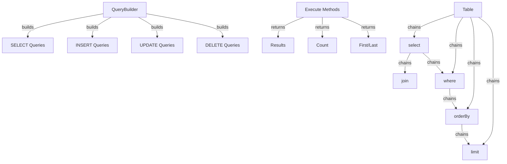

XOOPS क्वेरी बिल्डर SQL क्वेरीज़ के निर्माण के लिए एक आधुनिक, धाराप्रवाह इंटरफ़ेस प्रदान करता है। यह SQL इंजेक्शन को रोकने में मदद करता है, पठनीयता में सुधार करता है, और कई डेटाबेस सिस्टम के लिए डेटाबेस एब्स्ट्रैक्शन प्रदान करता है।

## क्वेरी बिल्डर आर्किटेक्चर



## QueryBuilder कक्षा

धाराप्रवाह इंटरफ़ेस के साथ मुख्य क्वेरी बिल्डर वर्ग।

### कक्षा अवलोकन

```php
namespace Xoops\Database;

class QueryBuilder
{
    protected string $table = '';
    protected string $type = 'SELECT';
    protected array $selects = [];
    protected array $joins = [];
    protected array $wheres = [];
    protected array $orders = [];
    protected int $limit = 0;
    protected int $offset = 0;
    protected array $bindings = [];
}
```

### स्थैतिक विधियाँ

#### टेबल

किसी तालिका के लिए एक नया क्वेरी बिल्डर बनाता है।

```php
public static function table(string $table): QueryBuilder
```

**पैरामीटर:**

| पैरामीटर | प्रकार | विवरण |
|----|------|----|
| `$table` | स्ट्रिंग | तालिका का नाम (उपसर्ग के साथ या बिना) |

**रिटर्न:** `QueryBuilder` - क्वेरी बिल्डर उदाहरण

**उदाहरण:**
```php
$query = QueryBuilder::table('users');
$query = QueryBuilder::table('xoops_users'); // With prefix
```

## SELECT प्रश्न

### चुनें

चयन करने के लिए कॉलम निर्दिष्ट करता है।

```php
public function select(...$columns): self
```

**पैरामीटर:**

| पैरामीटर | प्रकार | विवरण |
|----|------|----|
| `...$columns` | सारणी | स्तम्भ नाम या भाव |

**रिटर्न:** `self` - मेथड चेनिंग के लिए

**उदाहरण:**
```php
// Simple select
QueryBuilder::table('users')
    ->select('id', 'username', 'email')
    ->get();

// Select with aliases
QueryBuilder::table('users')
    ->select('id as user_id', 'username as name')
    ->get();

// Select all columns
QueryBuilder::table('users')
    ->select('*')
    ->get();

// Select with expressions
QueryBuilder::table('orders')
    ->select('id', 'COUNT(*) as total_items')
    ->groupBy('id')
    ->get();
```

### कहाँ

WHERE शर्त जोड़ता है।

```php
public function where(string $column, string $operator = '=', mixed $value = null): self
```

**पैरामीटर:**

| पैरामीटर | प्रकार | विवरण |
|----|------|----|
| `$column` | स्ट्रिंग | कॉलम का नाम |
| `$operator` | स्ट्रिंग | तुलना ऑपरेटर |
| `$value` | मिश्रित | तुलना करने के लिए मूल्य |

**रिटर्न:** `self` - मेथड चेनिंग के लिए

**संचालक:**

| ऑपरेटर | विवरण | उदाहरण |
|---|---|---|
| `=` | बराबर | `->where('status', '=', 'active')` |
| `!=` या `<>` | बराबर नहीं | `->where('status', '!=', 'deleted')` |
| `>` | से भी बड़ा | `->where('price', '>', 100)` |
| `<` | से कम | `->where('price', '<', 100)` |
| `>=` | बड़ा या बराबर | `->where('age', '>=', 18)` |
| `<=` | कम या बराबर | `->where('age', '<=', 65)` |
| `LIKE` | पैटर्न मिलान | `->where('name', 'LIKE', '%john%')` |
| `IN` | सूची में | `->where('status', 'IN', ['active', 'pending'])` |
| `NOT IN` | सूची में नहीं | `->where('id', 'NOT IN', [1, 2, 3])` |
| `BETWEEN` | रेंज | `->where('age', 'BETWEEN', [18, 65])` |
| `IS NULL` | शून्य है | `->where('deleted_at', 'IS NULL')` |
| `IS NOT NULL` | शून्य नहीं | `->where('deleted_at', 'IS NOT NULL')` |

**उदाहरण:**
```php
// Single condition
QueryBuilder::table('users')
    ->select('*')
    ->where('status', '=', 'active')
    ->get();

// Multiple conditions (AND)
QueryBuilder::table('users')
    ->select('*')
    ->where('status', '=', 'active')
    ->where('age', '>=', 18)
    ->get();

// IN operator
QueryBuilder::table('products')
    ->select('*')
    ->where('category_id', 'IN', [1, 2, 3])
    ->get();

// LIKE operator
QueryBuilder::table('users')
    ->select('*')
    ->where('email', 'LIKE', '%@example.com')
    ->get();

// NULL check
QueryBuilder::table('users')
    ->select('*')
    ->where('deleted_at', 'IS NULL')
    ->get();
```

### याकहाँ

एक OR शर्त जोड़ता है.

```php
public function orWhere(string $column, string $operator = '=', mixed $value = null): self
```

**उदाहरण:**
```php
QueryBuilder::table('users')
    ->select('*')
    ->where('status', '=', 'active')
    ->orWhere('premium', '=', 1)
    ->get();
    // SELECT * FROM users WHERE status = 'active' OR premium = 1
```

### व्हेयरइन / व्हेयरनॉटइन

IN/NOT IN के लिए सुविधाजनक तरीके।

```php
public function whereIn(string $column, array $values): self
public function whereNotIn(string $column, array $values): self
```

**उदाहरण:**
```php
QueryBuilder::table('posts')
    ->select('*')
    ->whereIn('status', ['published', 'scheduled'])
    ->get();

QueryBuilder::table('comments')
    ->select('*')
    ->whereNotIn('spam_score', [8, 9, 10])
    ->get();
```

###whereNull /whereNotNull

NULL चेक के लिए सुविधाजनक तरीके।

```php
public function whereNull(string $column): self
public function whereNotNull(string $column): self
```

**उदाहरण:**
```php
QueryBuilder::table('users')
    ->select('*')
    ->whereNotNull('verified_at')
    ->get();
```

### कहाँ बीच में

जाँचता है कि मान दो मानों के बीच है या नहीं।

```php
public function whereBetween(string $column, array $values): self
```

**उदाहरण:**
```php
QueryBuilder::table('products')
    ->select('*')
    ->whereBetween('price', [10, 100])
    ->get();

QueryBuilder::table('orders')
    ->select('*')
    ->whereBetween('created_at', ['2024-01-01', '2024-12-31'])
    ->get();
```

### शामिल हों

एक INNER JOIN जोड़ता है।

```php
public function join(
    string $table,
    string $first,
    string $operator = '=',
    string $second = null
): self
```

**उदाहरण:**
```php
QueryBuilder::table('posts')
    ->select('posts.*', 'users.username', 'categories.name')
    ->join('users', 'posts.user_id', '=', 'users.id')
    ->join('categories', 'posts.category_id', '=', 'categories.id')
    ->where('posts.published', '=', 1)
    ->get();
```

### बाएँ जुड़ें / दाएँ जुड़ें

वैकल्पिक जुड़ाव प्रकार.

```php
public function leftJoin(
    string $table,
    string $first,
    string $operator = '=',
    string $second = null
): self

public function rightJoin(
    string $table,
    string $first,
    string $operator = '=',
    string $second = null
): self
```

**उदाहरण:**
```php
QueryBuilder::table('users')
    ->select('users.*', 'COUNT(posts.id) as post_count')
    ->leftJoin('posts', 'users.id', '=', 'posts.user_id')
    ->groupBy('users.id')
    ->get();
```

### समूह द्वारा

परिणाम column(s) द्वारा समूहित करें।

```php
public function groupBy(...$columns): self
```

**उदाहरण:**
```php
QueryBuilder::table('orders')
    ->select('user_id', 'COUNT(*) as order_count', 'SUM(total) as total_spent')
    ->groupBy('user_id')
    ->get();

QueryBuilder::table('sales')
    ->select('department', 'region', 'SUM(amount) as total')
    ->groupBy('department', 'region')
    ->get();
```

### होना

HAVING शर्त जोड़ता है।

```php
public function having(string $column, string $operator = '=', mixed $value = null): self
```

**उदाहरण:**
```php
QueryBuilder::table('orders')
    ->select('user_id', 'COUNT(*) as order_count')
    ->groupBy('user_id')
    ->having('order_count', '>', 5)
    ->get();
```

### orderBy

आदेश परिणाम.

```php
public function orderBy(string $column, string $direction = 'ASC'): self
```

**पैरामीटर:**

| पैरामीटर | प्रकार | विवरण |
|----|------|----|
| `$column` | स्ट्रिंग | द्वारा ऑर्डर करने के लिए कॉलम |
| `$direction` | स्ट्रिंग | `ASC` या `DESC` |

**उदाहरण:**
```php
// Single order
QueryBuilder::table('users')
    ->select('*')
    ->orderBy('created_at', 'DESC')
    ->get();

// Multiple orders
QueryBuilder::table('posts')
    ->select('*')
    ->orderBy('category_id', 'ASC')
    ->orderBy('created_at', 'DESC')
    ->get();

// Random order
QueryBuilder::table('quotes')
    ->select('*')
    ->orderBy('RAND()')
    ->get();
```

### सीमा / ऑफसेट

सीमाएँ और ऑफसेट परिणाम।

```php
public function limit(int $limit): self
public function offset(int $offset): self
```

**उदाहरण:**
```php
// Simple limit
QueryBuilder::table('posts')
    ->select('*')
    ->limit(10)
    ->get();

// Pagination
$page = 2;
$perPage = 20;
$offset = ($page - 1) * $perPage;

QueryBuilder::table('posts')
    ->select('*')
    ->limit($perPage)
    ->offset($offset)
    ->get();
```

## निष्पादन के तरीके

### प्राप्त करें

क्वेरी निष्पादित करता है और सभी परिणाम लौटाता है।

```php
public function get(): array
```

**रिटर्न:** `array` - परिणाम पंक्तियों की श्रृंखला

**उदाहरण:**
```php
$users = QueryBuilder::table('users')
    ->select('id', 'username', 'email')
    ->where('status', '=', 'active')
    ->orderBy('username')
    ->get();

foreach ($users as $user) {
    echo $user['username'] . ' (' . $user['email'] . ')' . "\n";
}
```

### पहला

पहला परिणाम मिलता है.

```php
public function first(): ?array
```

**रिटर्न:** `?array` - पहली पंक्ति या शून्य

**उदाहरण:**
```php
$user = QueryBuilder::table('users')
    ->select('*')
    ->where('id', '=', 123)
    ->first();

if ($user) {
    echo 'Found: ' . $user['username'];
}
```

### आखिरी

अंतिम परिणाम मिलता है.

```php
public function last(): ?array
```

**उदाहरण:**
```php
$latestPost = QueryBuilder::table('posts')
    ->select('*')
    ->orderBy('created_at', 'DESC')
    ->last();
```

### गिनती

परिणामों की गिनती प्राप्त करता है.

```php
public function count(): int
```

**रिटर्न:** `int` - पंक्तियों की संख्या

**उदाहरण:**
```php
$activeUsers = QueryBuilder::table('users')
    ->where('status', '=', 'active')
    ->count();

echo "Active users: $activeUsers";
```

### मौजूद है

जाँचता है कि क्या क्वेरी कोई परिणाम देती है।

```php
public function exists(): bool
```**रिटर्न:** `bool` - यदि परिणाम मौजूद हैं तो सही है

**उदाहरण:**
```php
if (QueryBuilder::table('users')->where('email', '=', 'test@example.com')->exists()) {
    echo 'User already exists';
}
```

### समुच्चय

समग्र मान प्राप्त करता है.

```php
public function aggregate(string $function, string $column): mixed
```

**उदाहरण:**
```php
$maxPrice = QueryBuilder::table('products')
    ->aggregate('MAX', 'price');

$avgAge = QueryBuilder::table('users')
    ->aggregate('AVG', 'age');

$totalSales = QueryBuilder::table('orders')
    ->aggregate('SUM', 'total');
```

## INSERT प्रश्न

### डालें

एक पंक्ति सम्मिलित करता है.

```php
public function insert(array $values): bool
```

**उदाहरण:**
```php
QueryBuilder::table('users')->insert([
    'username' => 'john',
    'email' => 'john@example.com',
    'password' => password_hash('secret', PASSWORD_BCRYPT),
    'created_at' => date('Y-m-d H:i:s')
]);
```

### इन्सर्टमेनी

अनेक पंक्तियाँ सम्मिलित करता है.

```php
public function insertMany(array $rows): bool
```

**उदाहरण:**
```php
QueryBuilder::table('log_entries')->insertMany([
    ['action' => 'login', 'user_id' => 1, 'timestamp' => time()],
    ['action' => 'logout', 'user_id' => 2, 'timestamp' => time()],
    ['action' => 'update', 'user_id' => 3, 'timestamp' => time()]
]);
```

## UPDATE प्रश्न

### अद्यतन

पंक्तियों को अद्यतन करता है.

```php
public function update(array $values): int
```

**रिटर्न:** `int` - प्रभावित पंक्तियों की संख्या

**उदाहरण:**
```php
// Update single user
QueryBuilder::table('users')
    ->where('id', '=', 123)
    ->update([
        'email' => 'newemail@example.com',
        'updated_at' => date('Y-m-d H:i:s')
    ]);

// Update multiple rows
QueryBuilder::table('posts')
    ->where('status', '=', 'draft')
    ->where('created_at', '<', date('Y-m-d', strtotime('-30 days')))
    ->update([
        'status' => 'archived'
    ]);
```

### वृद्धि/कमी

किसी कॉलम को बढ़ाना या घटाना।

```php
public function increment(string $column, int $amount = 1): int
public function decrement(string $column, int $amount = 1): int
```

**उदाहरण:**
```php
// Increment view count
QueryBuilder::table('posts')
    ->where('id', '=', 123)
    ->increment('views');

// Decrement stock
QueryBuilder::table('products')
    ->where('id', '=', 456)
    ->decrement('stock', 5);
```

## DELETE प्रश्न

### हटाएं

पंक्तियाँ हटाता है.

```php
public function delete(): int
```

**रिटर्न:** `int` - हटाई गई पंक्तियों की संख्या

**उदाहरण:**
```php
// Delete single record
QueryBuilder::table('comments')
    ->where('id', '=', 789)
    ->delete();

// Delete multiple records
QueryBuilder::table('log_entries')
    ->where('created_at', '<', date('Y-m-d', strtotime('-30 days')))
    ->delete();
```

### काट-छाँट करना

तालिका से सभी पंक्तियाँ हटा देता है.

```php
public function truncate(): bool
```

**उदाहरण:**
```php
// Clear all sessions
QueryBuilder::table('sessions')->truncate();
```

## उन्नत सुविधाएँ

### कच्ची अभिव्यक्तियाँ

```php
QueryBuilder::table('products')
    ->select('id', 'name', QueryBuilder::raw('price * quantity as total'))
    ->get();
```

### उपश्रेणियाँ

```php
$recentPostIds = QueryBuilder::table('posts')
    ->select('id')
    ->where('created_at', '>', date('Y-m-d', strtotime('-7 days')))
    ->toSql();

$comments = QueryBuilder::table('comments')
    ->select('*')
    ->whereIn('post_id', $recentPostIds)
    ->get();
```

### SQL प्राप्त करना

```php
public function toSql(): string
```

**उदाहरण:**
```php
$sql = QueryBuilder::table('users')
    ->select('id', 'username')
    ->where('status', '=', 'active')
    ->toSql();

echo $sql;
// SELECT id, username FROM xoops_users WHERE status = ?
```

## संपूर्ण उदाहरण

### जॉइन के साथ कॉम्प्लेक्स सेलेक्ट

```php
<?php
/**
 * Get posts with author and category info
 */

$posts = QueryBuilder::table('posts')
    ->select(
        'posts.id',
        'posts.title',
        'posts.content',
        'posts.created_at',
        'users.username as author',
        'categories.name as category'
    )
    ->join('users', 'posts.user_id', '=', 'users.id')
    ->join('categories', 'posts.category_id', '=', 'categories.id')
    ->where('posts.published', '=', 1)
    ->orderBy('posts.created_at', 'DESC')
    ->limit(10)
    ->get();

foreach ($posts as $post) {
    echo '<article>';
    echo '<h2>' . htmlspecialchars($post['title']) . '</h2>';
    echo '<p class="meta">By ' . htmlspecialchars($post['author']) . ' in ' . htmlspecialchars($post['category']) . '</p>';
    echo '<p>' . htmlspecialchars($post['content']) . '</p>';
    echo '</article>';
}
```

### QueryBuilder के साथ पृष्ठांकन

```php
<?php
/**
 * Paginated results
 */

$page = isset($_GET['page']) ? (int)$_GET['page'] : 1;
$perPage = 20;
$offset = ($page - 1) * $perPage;

// Get total count
$total = QueryBuilder::table('articles')
    ->where('status', '=', 'published')
    ->count();

// Get page results
$articles = QueryBuilder::table('articles')
    ->select('*')
    ->where('status', '=', 'published')
    ->orderBy('created_at', 'DESC')
    ->limit($perPage)
    ->offset($offset)
    ->get();

// Calculate pagination
$pages = ceil($total / $perPage);

// Display results
foreach ($articles as $article) {
    echo '<div class="article">' . htmlspecialchars($article['title']) . '</div>';
}

// Display pagination links
if ($pages > 1) {
    echo '<nav class="pagination">';
    for ($i = 1; $i <= $pages; $i++) {
        if ($i == $page) {
            echo '<span class="current">' . $i . '</span>';
        } else {
            echo '<a href="?page=' . $i . '">' . $i . '</a>';
        }
    }
    echo '</nav>';
}
```

### समुच्चय के साथ डेटा विश्लेषण

```php
<?php
/**
 * Sales analysis
 */

// Total sales by region
$regionSales = QueryBuilder::table('orders')
    ->select('region', QueryBuilder::raw('SUM(total) as total_sales'), QueryBuilder::raw('COUNT(*) as order_count'))
    ->groupBy('region')
    ->orderBy('total_sales', 'DESC')
    ->get();

foreach ($regionSales as $region) {
    echo $region['region'] . ': $' . number_format($region['total_sales'], 2) . ' (' . $region['order_count'] . ' orders)' . "\n";
}

// Average order value
$avgOrderValue = QueryBuilder::table('orders')
    ->aggregate('AVG', 'total');

echo 'Average order value: $' . number_format($avgOrderValue, 2);
```

## सर्वोत्तम प्रथाएँ

1. **पैरामीटरयुक्त क्वेरीज़ का उपयोग करें** - QueryBuilder स्वचालित रूप से पैरामीटर बाइंडिंग को संभालता है
2. **श्रृंखला विधियां** - पठनीय कोड के लिए धाराप्रवाह इंटरफ़ेस का लाभ उठाएं
3. **SQL आउटपुट का परीक्षण करें** - उत्पन्न प्रश्नों को सत्यापित करने के लिए `toSql()` का उपयोग करें
4. **अनुक्रमणिका का उपयोग करें** - सुनिश्चित करें कि बार-बार पूछे जाने वाले कॉलम अनुक्रमित हैं
5. **परिणाम सीमित करें** - बड़े डेटासेट के लिए हमेशा `limit()` का उपयोग करें
6. **एग्रीगेट्स का उपयोग करें** - डेटाबेस को PHP के बजाय गिनती/योग करने दें
7. **एस्केप आउटपुट** - हमेशा `htmlspecialchars()` के साथ प्रदर्शित डेटा से बचें
8. **सूचकांक प्रदर्शन** - धीमी क्वेरी की निगरानी करें और तदनुसार अनुकूलन करें

## संबंधित दस्तावेज़ीकरण

- XoopsDatabase - डेटाबेस परत और कनेक्शन
- Criteria - विरासत Criteria-आधारित क्वेरी प्रणाली
- ../Core/XoopsObject - डेटा ऑब्जेक्ट दृढ़ता
- ../मॉड्यूल/मॉड्यूल-सिस्टम - मॉड्यूल डेटाबेस संचालन

---

*यह भी देखें: [XOOPS डेटाबेस API](https://github.com/XOOPS/XoopsCore27/tree/master/htdocs/class)*