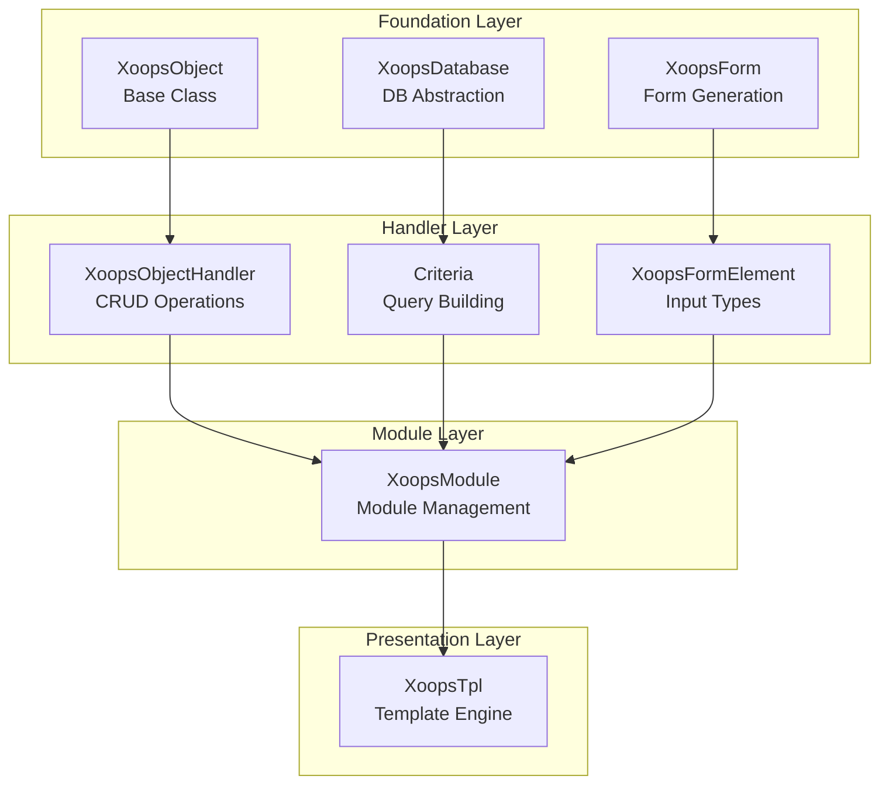
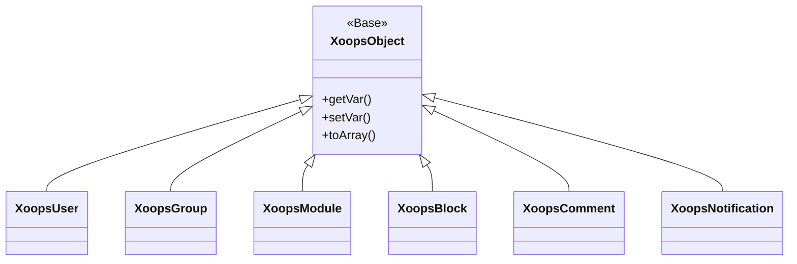
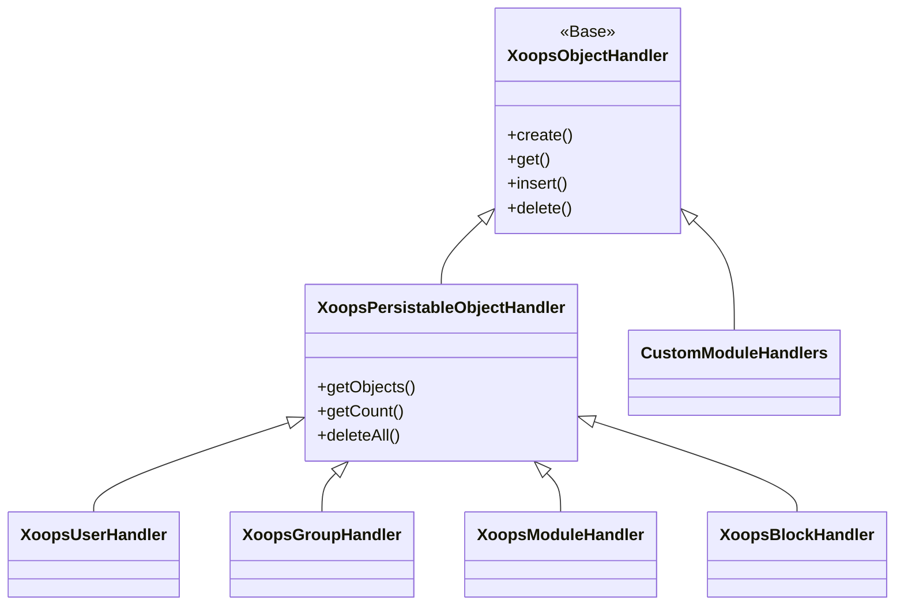
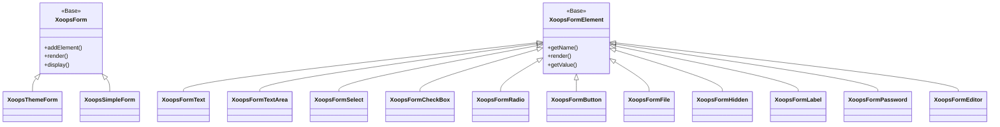

व्यापक XOOPS API संदर्भ दस्तावेज़ में आपका स्वागत है। यह अनुभाग XOOPS सामग्री प्रबंधन प्रणाली बनाने वाले सभी मुख्य वर्गों, विधियों और प्रणालियों के लिए विस्तृत दस्तावेज़ीकरण प्रदान करता है।

## अवलोकन

XOOPS API को कई प्रमुख उपप्रणालियों में व्यवस्थित किया गया है, जिनमें से प्रत्येक सीएमएस कार्यक्षमता के एक विशिष्ट पहलू के लिए जिम्मेदार है। XOOPS के लिए मॉड्यूल, थीम और एक्सटेंशन विकसित करने के लिए इन API को समझना आवश्यक है।

## API अनुभाग

### कोर कक्षाएं

वह आधार वर्ग जिस पर अन्य सभी XOOPS घटक निर्मित होते हैं।

| दस्तावेज़ीकरण | विवरण |
|----|----|
| XoopsObject | XOOPS | में सभी डेटा ऑब्जेक्ट के लिए बेस क्लास
| XoopsObjectHandler | CRUD संचालन के लिए हैंडलर पैटर्न |

### डेटाबेस परत

डेटाबेस अमूर्तन और क्वेरी निर्माण उपयोगिताएँ।

| दस्तावेज़ीकरण | विवरण |
|----|----|
| XoopsDatabase | डेटाबेस अमूर्त परत |
| Criteria सिस्टम | क्वेरी मानदंड और शर्तें |
| QueryBuilder | आधुनिक धाराप्रवाह क्वेरी बिल्डिंग |

### फॉर्म सिस्टम

HTML फॉर्म निर्माण और सत्यापन।

| दस्तावेज़ीकरण | विवरण |
|----|----|
| XoopsForm | प्रपत्र कंटेनर और प्रतिपादन |
| प्रपत्र तत्व | सभी उपलब्ध फॉर्म तत्व प्रकार |

### कर्नेल कक्षाएं

कोर सिस्टम घटक और सेवाएँ।

| दस्तावेज़ीकरण | विवरण |
|----|----|
| कर्नेल क्लासेस | सिस्टम कर्नेल और मुख्य घटक |

### मॉड्यूल सिस्टम

मॉड्यूल प्रबंधन और जीवनचक्र।

| दस्तावेज़ीकरण | विवरण |
|----|----|
| मॉड्यूल सिस्टम | मॉड्यूल लोडिंग, स्थापना और प्रबंधन |

### टेम्पलेट सिस्टम

Smarty टेम्पलेट एकीकरण.

| दस्तावेज़ीकरण | विवरण |
|----|----|
| टेम्पलेट सिस्टम | Smarty एकीकरण और टेम्पलेट प्रबंधन |

### उपयोगकर्ता प्रणाली

उपयोगकर्ता प्रबंधन और प्रमाणीकरण.

| दस्तावेज़ीकरण | विवरण |
|----|----|
| उपयोगकर्ता प्रणाली | उपयोगकर्ता खाते, समूह और अनुमतियाँ |

## वास्तुकला अवलोकन



## वर्ग पदानुक्रम

### ऑब्जेक्ट मॉडल



### हैंडलर मॉडल



### फॉर्म मॉडल



## डिज़ाइन पैटर्न

XOOPS API कई प्रसिद्ध डिज़ाइन पैटर्न लागू करता है:

### सिंगलटन पैटर्न
डेटाबेस कनेक्शन और कंटेनर इंस्टेंसेस जैसी वैश्विक सेवाओं के लिए उपयोग किया जाता है।

```php
$db = XoopsDatabase::getInstance();
$container = XoopsContainer::getInstance();
```

### फ़ैक्टरी पैटर्न
ऑब्जेक्ट हैंडलर लगातार डोमेन ऑब्जेक्ट बनाते हैं।

```php
$handler = xoops_getHandler('user');
$user = $handler->create();
```

### समग्र पैटर्न
प्रपत्रों में एकाधिक प्रपत्र तत्व होते हैं; मानदंड में नेस्टेड मानदंड हो सकते हैं.

```php
$criteria = new CriteriaCompo();
$criteria->add(new Criteria('status', 1));
$criteria->add(new CriteriaCompo(...)); // Nested
```

### प्रेक्षक पैटर्न
इवेंट सिस्टम मॉड्यूल के बीच ढीले युग्मन की अनुमति देता है।

```php
$dispatcher->addListener('module.news.article_published', $callback);
```

## त्वरित प्रारंभ उदाहरण

### किसी वस्तु को बनाना और सहेजना

```php
// Get the handler
$handler = xoops_getHandler('user');

// Create a new object
$user = $handler->create();
$user->setVar('uname', 'newuser');
$user->setVar('email', 'user@example.com');

// Save to database
$handler->insert($user);
```

### Criteria से पूछताछ

```php
// Build criteria
$criteria = new CriteriaCompo();
$criteria->add(new Criteria('level', 0, '>'));
$criteria->setSort('uname');
$criteria->setOrder('ASC');
$criteria->setLimit(10);

// Get objects
$handler = xoops_getHandler('user');
$users = $handler->getObjects($criteria);
```

### एक फॉर्म बनाना

```php
$form = new XoopsThemeForm('User Profile', 'userform', 'save.php', 'post', true);
$form->addElement(new XoopsFormText('Username', 'uname', 50, 255, $user->getVar('uname')));
$form->addElement(new XoopsFormTextArea('Bio', 'bio', $user->getVar('bio')));
$form->addElement(new XoopsFormButton('', 'submit', _SUBMIT, 'submit'));
echo $form->render();
```

## API कन्वेंशन

### नामकरण परंपराएँ

| प्रकार | कन्वेंशन | उदाहरण |
|------|--------|------|
| कक्षाएं | PascalCase | `XoopsUser`, `CriteriaCompo` |
| तरीके | कैमलकेस | `getVar()`, `setVar()` |
| गुण | कैमलकेस (संरक्षित) | `$_vars`, `$_handler` |
| स्थिरांक | UPPER_SNAKE_CASE | `XOBJ_DTYPE_INT` |
| डेटाबेस टेबल्स | साँप का मामला | `users`, `groups_users_link` |

### डेटा प्रकार

XOOPS ऑब्जेक्ट वेरिएबल्स के लिए मानक डेटा प्रकार परिभाषित करता है:| लगातार | प्रकार | विवरण |
|---|------|----|
| `XOBJ_DTYPE_TXTBOX` | स्ट्रिंग | टेक्स्ट इनपुट (स्वच्छता) |
| `XOBJ_DTYPE_TXTAREA` | स्ट्रिंग | पाठक्षेत्र सामग्री |
| `XOBJ_DTYPE_INT` | पूर्णांक | संख्यात्मक मान |
| `XOBJ_DTYPE_URL` | स्ट्रिंग | URL सत्यापन |
| `XOBJ_DTYPE_EMAIL` | स्ट्रिंग | ईमेल सत्यापन |
| `XOBJ_DTYPE_ARRAY` | सारणी | क्रमबद्ध सरणियाँ |
| `XOBJ_DTYPE_OTHER` | मिश्रित | कस्टम हैंडलिंग |
| `XOBJ_DTYPE_SOURCE` | स्ट्रिंग | स्रोत कोड (न्यूनतम स्वच्छता) |
| `XOBJ_DTYPE_STIME` | पूर्णांक | लघु टाइमस्टैम्प |
| `XOBJ_DTYPE_MTIME` | पूर्णांक | मीडियम टाइमस्टैम्प |
| `XOBJ_DTYPE_LTIME` | पूर्णांक | लंबा टाइमस्टैम्प |

## प्रमाणीकरण विधियाँ

API कई प्रमाणीकरण विधियों का समर्थन करता है:

### API कुंजी प्रमाणीकरण
```
X-API-Key: your-api-key
```

### ओऑथ बियरर टोकन
```
Authorization: Bearer your-oauth-token
```

### सत्र-आधारित प्रमाणीकरण
लॉग इन होने पर मौजूदा XOOPS सत्र का उपयोग करता है।

## REST API समापन बिंदु

जब REST API सक्षम हो:

| समापन बिंदु | विधि | विवरण |
|---|--------|--------|
| `/api.php/rest/users` | प्राप्त करें | उपयोगकर्ताओं की सूची |
| `/api.php/rest/users/{id}` | प्राप्त करें | आईडी द्वारा उपयोगकर्ता प्राप्त करें |
| `/api.php/rest/users` | POST | उपयोगकर्ता बनाएं |
| `/api.php/rest/users/{id}` | डालो | उपयोगकर्ता अद्यतन करें |
| `/api.php/rest/users/{id}` | DELETE | उपयोगकर्ता हटाएं |
| `/api.php/rest/modules` | प्राप्त करें | सूची मॉड्यूल |

## संबंधित दस्तावेज़ीकरण

- मॉड्यूल विकास गाइड
- थीम विकास गाइड
- सिस्टम कॉन्फ़िगरेशन
- सुरक्षा सर्वोत्तम प्रथाएँ

## संस्करण इतिहास

| संस्करण | परिवर्तन |
|---------|---------|
| 2.5.11 | वर्तमान स्थिर रिलीज |
| 2.5.10 | GraphQL API समर्थन जोड़ा गया |
| 2.5.9 | उन्नत Criteria सिस्टम |
| 2.5.8 | PSR-4 ऑटोलोडिंग समर्थन |

---

*यह दस्तावेज़ XOOPS नॉलेज बेस का हिस्सा है। नवीनतम अपडेट के लिए, [XOOPS GitHub रिपॉजिटरी](https://github.com/XOOPS) पर जाएं।*