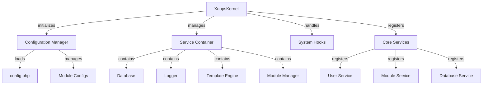

XOOPS कर्नेल सिस्टम को बूटस्ट्रैप करने, कॉन्फ़िगरेशन प्रबंधित करने, सिस्टम इवेंट को संभालने और मुख्य उपयोगिताएँ प्रदान करने के लिए मूलभूत ढांचा प्रदान करता है। ये कक्षाएं XOOPS एप्लिकेशन की रीढ़ बनती हैं।

## सिस्टम आर्किटेक्चर



## XoopsKernel कक्षा

मुख्य कर्नेल वर्ग जो XOOPS सिस्टम को प्रारंभ और प्रबंधित करता है।

### कक्षा अवलोकन

```php
namespace Xoops;

class XoopsKernel
{
    private static ?XoopsKernel $instance = null;
    protected ServiceContainer $services;
    protected ConfigurationManager $config;
    protected array $modules = [];
    protected bool $isLoaded = false;
}
```

### कंस्ट्रक्टर

```php
private function __construct()
```

निजी कंस्ट्रक्टर सिंगलटन पैटर्न लागू करता है।

### getInstance

सिंगलटन कर्नेल उदाहरण पुनर्प्राप्त करता है।

```php
public static function getInstance(): XoopsKernel
```

**रिटर्न:** `XoopsKernel` - सिंगलटन कर्नेल उदाहरण

**उदाहरण:**
```php
$kernel = XoopsKernel::getInstance();
```

### बूट प्रक्रिया

कर्नेल बूट प्रक्रिया इन चरणों का पालन करती है:

1. **प्रारंभीकरण** - त्रुटि हैंडलर सेट करें, स्थिरांक परिभाषित करें
2. **कॉन्फ़िगरेशन** - कॉन्फ़िगरेशन फ़ाइलें लोड करें
3. **सेवा पंजीकरण** - मुख्य सेवाओं को पंजीकृत करें
4. **मॉड्यूल डिटेक्शन** - सक्रिय मॉड्यूल को स्कैन करें और पहचानें
5. **डेटाबेस आरंभीकरण** - डेटाबेस से कनेक्ट करें
6. **सफाई** - अनुरोध से निपटने के लिए तैयारी करें

```php
public function boot(): void
```

**उदाहरण:**
```php
$kernel = XoopsKernel::getInstance();
$kernel->boot();
```

### सेवा कंटेनर विधियाँ

#### रजिस्टर सेवा

सर्विस कंटेनर में एक सेवा पंजीकृत करता है।

```php
public function registerService(
    string $name,
    callable|object $definition
): void
```

**पैरामीटर:**

| पैरामीटर | प्रकार | विवरण |
|----|------|----|
| `$name` | स्ट्रिंग | सेवा पहचानकर्ता |
| `$definition` | कॉल करने योग्य\|ऑब्जेक्ट | सेवा कारखाना या उदाहरण |

**उदाहरण:**
```php
$kernel->registerService('custom.handler', function($c) {
    return new CustomHandler();
});
```

#### सेवा प्राप्त करें

एक पंजीकृत सेवा पुनः प्राप्त करता है।

```php
public function getService(string $name): mixed
```

**पैरामीटर:**

| पैरामीटर | प्रकार | विवरण |
|----|------|----|
| `$name` | स्ट्रिंग | सेवा पहचानकर्ता |

**रिटर्न:** `mixed` - अनुरोधित सेवा

**उदाहरण:**
```php
$database = $kernel->getService('database');
$logger = $kernel->getService('logger');
```

#### में सेवा है

जाँचता है कि कोई सेवा पंजीकृत है या नहीं।

```php
public function hasService(string $name): bool
```

**उदाहरण:**
```php
if ($kernel->hasService('cache')) {
    $cache = $kernel->getService('cache');
}
```

## कॉन्फ़िगरेशन प्रबंधक

एप्लिकेशन कॉन्फ़िगरेशन और मॉड्यूल सेटिंग्स प्रबंधित करता है।

### कक्षा अवलोकन

```php
namespace Xoops\Core;

class ConfigurationManager
{
    protected array $config = [];
    protected array $defaults = [];
    protected string $configPath;
}
```

### तरीके

#### लोड

फ़ाइल या सरणी से कॉन्फ़िगरेशन लोड करता है।

```php
public function load(string|array $source): void
```

**पैरामीटर:**

| पैरामीटर | प्रकार | विवरण |
|----|------|----|
| `$source` | स्ट्रिंग\|सरणी | फ़ाइल पथ या सरणी कॉन्फ़िगर करें |

**उदाहरण:**
```php
$config = $kernel->getService('config');
$config->load(XOOPS_ROOT_PATH . '/include/config.php');
$config->load(['sitename' => 'My Site', 'admin_email' => 'admin@example.com']);
```

#### प्राप्त करें

एक कॉन्फ़िगरेशन मान पुनर्प्राप्त करता है।

```php
public function get(string $key, mixed $default = null): mixed
```

**पैरामीटर:**

| पैरामीटर | प्रकार | विवरण |
|----|------|----|
| `$key` | स्ट्रिंग | कॉन्फ़िगरेशन कुंजी (डॉट नोटेशन) |
| `$default` | मिश्रित | यदि नहीं मिला तो डिफ़ॉल्ट मान |

**रिटर्न:** `mixed` - कॉन्फ़िगरेशन मान

**उदाहरण:**
```php
$siteName = $config->get('sitename');
$adminEmail = $config->get('admin.email', 'admin@example.com');
```

#### सेट

एक कॉन्फ़िगरेशन मान सेट करता है.

```php
public function set(string $key, mixed $value): void
```

**पैरामीटर:**

| पैरामीटर | प्रकार | विवरण |
|----|------|----|
| `$key` | स्ट्रिंग | कॉन्फ़िगरेशन कुंजी |
| `$value` | मिश्रित | कॉन्फ़िगरेशन मान |

**उदाहरण:**
```php
$config->set('sitename', 'New Site Name');
$config->set('features.cache_enabled', true);
```

#### getModuleConfig

किसी विशिष्ट मॉड्यूल के लिए कॉन्फ़िगरेशन प्राप्त करता है।

```php
public function getModuleConfig(
    string $moduleName
): array
```

**पैरामीटर:**

| पैरामीटर | प्रकार | विवरण |
|----|------|----|
| `$moduleName` | स्ट्रिंग | मॉड्यूल निर्देशिका नाम |

**रिटर्न:** `array` - मॉड्यूल कॉन्फ़िगरेशन सरणी

**उदाहरण:**
```php
$publisherConfig = $config->getModuleConfig('publisher');
```

## सिस्टम हुक

सिस्टम हुक मॉड्यूल और प्लगइन्स को एप्लिकेशन जीवनचक्र में विशिष्ट बिंदुओं पर कोड निष्पादित करने की अनुमति देते हैं।

### HookManager कक्षा

```php
namespace Xoops\Core;

class HookManager
{
    protected array $hooks = [];
    protected array $listeners = [];
}
```

### तरीके

#### ऐडहुक

एक हुक प्वाइंट पंजीकृत करता है.

```php
public function addHook(string $name): void
```

**पैरामीटर:**

| पैरामीटर | प्रकार | विवरण |
|----|------|----|
| `$name` | स्ट्रिंग | हुक पहचानकर्ता |

**उदाहरण:**
```php
$hooks = $kernel->getService('hooks');
$hooks->addHook('system.startup');
$hooks->addHook('user.login');
$hooks->addHook('module.install');
```

#### सुनो

श्रोता को एक हुक से जोड़ता है।

```php
public function listen(
    string $hookName,
    callable $callback,
    int $priority = 10
): void
```

**पैरामीटर:**| पैरामीटर | प्रकार | विवरण |
|----|------|----|
| `$hookName` | स्ट्रिंग | हुक पहचानकर्ता |
| `$callback` | कॉल करने योग्य | निष्पादित करने का कार्य |
| `$priority` | int | निष्पादन प्राथमिकता (उच्च रन पहले) |

**उदाहरण:**
```php
$hooks->listen('user.login', function($user) {
    error_log('User ' . $user->uname . ' logged in');
}, 10);

$hooks->listen('module.install', function($module) {
    // Custom module installation logic
    echo "Installing " . $module->getName();
}, 5);
```

#### ट्रिगर

सभी श्रोताओं को एक हुक के लिए निष्पादित करता है।

```php
public function trigger(
    string $hookName,
    mixed $arguments = null
): array
```

**पैरामीटर:**

| पैरामीटर | प्रकार | विवरण |
|----|------|----|
| `$hookName` | स्ट्रिंग | हुक पहचानकर्ता |
| `$arguments` | मिश्रित | श्रोताओं तक पहुंचाया जाने वाला डेटा |

**रिटर्न:** `array` - सभी श्रोताओं के परिणाम

**उदाहरण:**
```php
$results = $hooks->trigger('system.startup');
$results = $hooks->trigger('user.created', $newUser);
```

## मुख्य सेवाओं का अवलोकन

बूट के दौरान कर्नेल कई मुख्य सेवाओं को पंजीकृत करता है:

| सेवा | क्लास | उद्देश्य |
|------|-------|------|
| `database` | XoopsDatabase | डेटाबेस अमूर्त परत |
| `config` | ConfigurationManager | कॉन्फ़िगरेशन प्रबंधन |
| `logger` | लकड़हारा | एप्लिकेशन लॉगिंग |
| `template` | XoopsTpl | टेम्पलेट इंजन |
| `user` | UserManager | उपयोगकर्ता प्रबंधन सेवा |
| `module` | ModuleManager | मॉड्यूल प्रबंधन |
| `cache` | CacheManager | कैशिंग परत |
| `hooks` | HookManager | सिस्टम इवेंट हुक |

## पूर्ण उपयोग उदाहरण

```php
<?php
/**
 * Custom module boot process utilizing kernel
 */

// Get kernel instance
$kernel = XoopsKernel::getInstance();

// Boot the system
$kernel->boot();

// Get services
$config = $kernel->getService('config');
$database = $kernel->getService('database');
$logger = $kernel->getService('logger');
$hooks = $kernel->getService('hooks');

// Access configuration
$siteName = $config->get('sitename');
$adminEmail = $config->get('admin.email');

// Register module-specific hooks
$hooks->listen('user.login', function($user) {
    // Log user login
    $logger->info('User login: ' . $user->uname);

    // Track in database
    $database->query(
        'INSERT INTO ' . $database->prefix('event_log') .
        ' (type, user_id, message, timestamp) VALUES (?, ?, ?, ?)',
        ['login', $user->uid(), 'User login', time()]
    );
});

$hooks->listen('module.install', function($module) {
    $logger->info('Module installed: ' . $module->getName());
});

// Trigger hooks
$hooks->trigger('system.startup');

// Use database service
$result = $database->query(
    'SELECT * FROM ' . $database->prefix('users') .
    ' LIMIT 10'
);

while ($row = $database->fetchArray($result)) {
    echo "User: " . htmlspecialchars($row['uname']) . "\n";
}

// Register custom service
$kernel->registerService('custom.repository', function($c) {
    return new CustomRepository($c->getService('database'));
});

// Later access custom service
$repo = $kernel->getService('custom.repository');
```

## कोर स्थिरांक

कर्नेल बूट के दौरान कई महत्वपूर्ण स्थिरांक को परिभाषित करता है:

```php
// System paths
define('XOOPS_ROOT_PATH', '/var/www/xoops');
define('XOOPS_HTDOCS_PATH', XOOPS_ROOT_PATH . '/htdocs');
define('XOOPS_MODULES_PATH', XOOPS_ROOT_PATH . '/htdocs/modules');
define('XOOPS_THEMES_PATH', XOOPS_ROOT_PATH . '/htdocs/themes');

// Web paths
define('XOOPS_URL', 'http://example.com');
define('XOOPS_HTDOCS_URL', XOOPS_URL . '/htdocs');

// Database
define('XOOPS_DB_PREFIX', 'xoops_');
```

## त्रुटि प्रबंधन

कर्नेल बूट के दौरान त्रुटि हैंडलर सेट करता है:

```php
// Set custom error handler
set_error_handler(function($errno, $errstr, $errfile, $errline) {
    $kernel->getService('logger')->error(
        "Error: $errstr in $errfile:$errline"
    );
});

// Set exception handler
set_exception_handler(function($exception) {
    $kernel->getService('logger')->critical(
        "Exception: " . $exception->getMessage()
    );
});
```

## सर्वोत्तम प्रथाएँ

1. **सिंगल बूट** - एप्लिकेशन स्टार्टअप के दौरान केवल एक बार `boot()` पर कॉल करें
2. **सेवा कंटेनर का उपयोग करें** - कर्नेल के माध्यम से सेवाओं को पंजीकृत करें और पुनः प्राप्त करें
3. **हुक को जल्दी संभालें** - ट्रिगर करने से पहले हुक श्रोताओं को पंजीकृत करें
4. **महत्वपूर्ण घटनाओं को लॉग करें** - डिबगिंग के लिए लॉगर सेवा का उपयोग करें
5. **कैश कॉन्फ़िगरेशन** - कॉन्फ़िगरेशन को एक बार लोड करें और पुन: उपयोग करें
6. **त्रुटि प्रबंधन** - अनुरोधों को संसाधित करने से पहले हमेशा त्रुटि हैंडलर सेट करें

## संबंधित दस्तावेज़ीकरण

- ../मॉड्यूल/मॉड्यूल-सिस्टम - मॉड्यूल प्रणाली और जीवनचक्र
- ../टेम्पलेट/टेम्पलेट-सिस्टम - टेम्पलेट इंजन एकीकरण
- ../उपयोगकर्ता/उपयोगकर्ता-प्रणाली - उपयोगकर्ता प्रमाणीकरण और प्रबंधन
- ../डेटाबेस/XoopsDatabase - डेटाबेस परत

---

*यह भी देखें: [XOOPS कर्नेल स्रोत](https://github.com/XOOPS/XoopsCore27/tree/master/htdocs/class)*