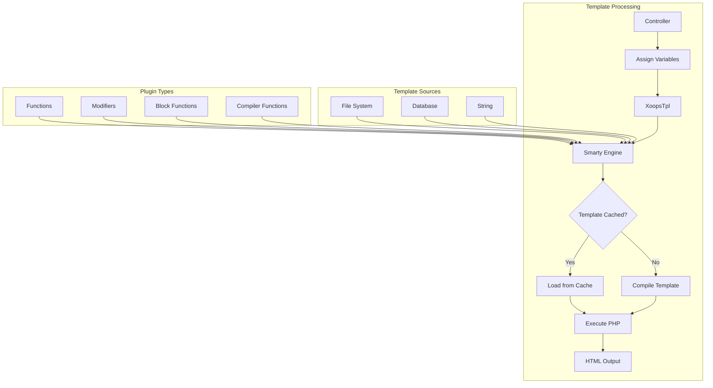
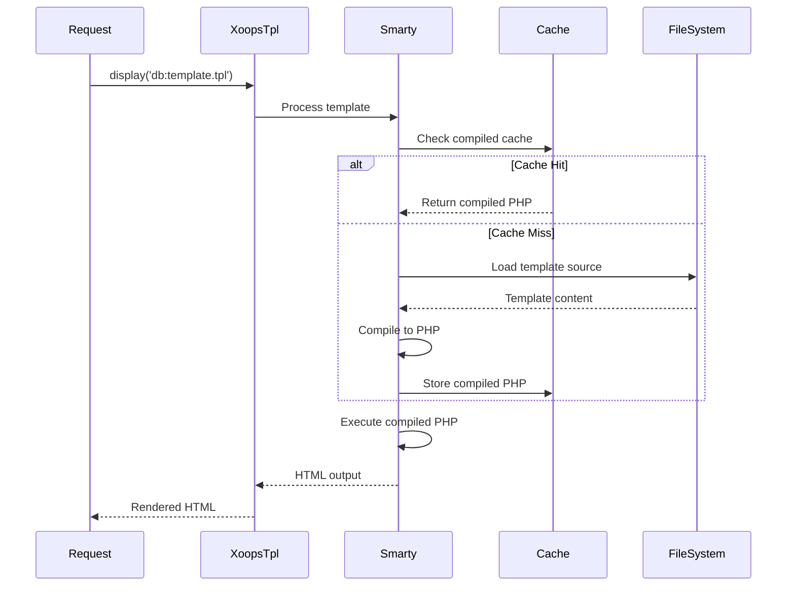
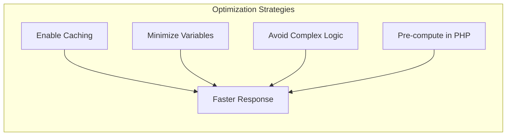

> XOOPS में Smarty टेम्प्लेटिंग के लिए संपूर्ण API दस्तावेज़ीकरण।

---

## टेम्पलेट इंजन आर्किटेक्चर



---

## XoopsTpl कक्षा

### आरंभीकरण

```php
// Global template object
global $xoopsTpl;

// Or get new instance
$tpl = new XoopsTpl();

// Available in modules
$GLOBALS['xoopsTpl']->assign('myvar', $value);
```

### कोर तरीके

| विधि | पैरामीटर्स | विवरण |
|-------|---|----|
| `assign` | `string $name, mixed $value` | टेम्प्लेट में वेरिएबल असाइन करें |
| `assignByRef` | `string $name, mixed &$value` | संदर्भ द्वारा निर्दिष्ट करें |
| `append` | `string $name, mixed $value, bool $merge = false` | सरणी चर में जोड़ें |
| `display` | `string $template` | रेंडर और आउटपुट टेम्पलेट |
| `fetch` | `string $template` | रेंडर और रिटर्न टेम्प्लेट |
| `clearAssign` | `string $name` | असाइन किया गया वेरिएबल साफ़ करें |
| `clearAllAssign` | - | सभी वेरिएबल साफ़ करें |
| `getTemplateVars` | `string $name = null` | निर्दिष्ट चर प्राप्त करें |
| `templateExists` | `string $template` | जांचें कि क्या टेम्पलेट मौजूद है |
| `isCached` | `string $template` | जांचें कि क्या टेम्प्लेट कैश्ड है |
| `clearCache` | `string $template = null` | टेम्पलेट कैश साफ़ करें |

### परिवर्तनीय असाइनमेंट

```php
// Simple assignment
$xoopsTpl->assign('title', 'My Page Title');
$xoopsTpl->assign('count', 42);
$xoopsTpl->assign('is_admin', true);

// Array assignment
$xoopsTpl->assign('items', [
    ['id' => 1, 'name' => 'Item 1'],
    ['id' => 2, 'name' => 'Item 2'],
]);

// Object assignment
$xoopsTpl->assign('user', $xoopsUser);

// Multiple assignments
$xoopsTpl->assign([
    'title' => 'My Title',
    'content' => 'My Content',
    'author' => 'John Doe'
]);

// Append to array
$xoopsTpl->append('items', ['id' => 3, 'name' => 'Item 3']);
```

### टेम्पलेट लोड हो रहा है

```php
// From database (compiled)
$xoopsTpl->display('db:mymodule_index.tpl');

// From file system
$xoopsTpl->display('file:' . XOOPS_ROOT_PATH . '/modules/mymodule/templates/custom.tpl');

// Fetch without output
$html = $xoopsTpl->fetch('db:mymodule_item.tpl');

// From string
$template = '<h1>{$title}</h1><p>{$content}</p>';
$html = $xoopsTpl->fetch('string:' . $template);
```

---

## Smarty सिंटेक्स संदर्भ

### चर

```smarty
{* Simple variable *}
<{$title}>

{* Array access *}
<{$item.name}>
<{$item['name']}>

{* Object property *}
<{$user->name}>
<{$user->getVar('uname')}>

{* Config variable *}
<{$xoops_sitename}>

{* Constant *}
<{$smarty.const._MD_MYMODULE_TITLE}>

{* Server variables *}
<{$smarty.server.REQUEST_URI}>
<{$smarty.get.id}>
<{$smarty.post.name}>
```

### संशोधक

```smarty
{* String modifiers *}
<{$title|upper}>
<{$title|lower}>
<{$title|capitalize}>
<{$title|truncate:50:"..."}>
<{$content|strip_tags}>
<{$content|nl2br}>
<{$text|escape:'html'}>
<{$text|escape:'url'}>

{* Date formatting *}
<{$timestamp|date_format:"%Y-%m-%d"}>
<{$timestamp|date_format:"%B %e, %Y"}>

{* Number formatting *}
<{$price|number_format:2:".":","}>

{* Default value *}
<{$optional|default:"N/A"}>

{* Chained modifiers *}
<{$title|strip_tags|truncate:50|escape}>

{* Count array *}
<{$items|@count}>
```

### नियंत्रण संरचनाएँ

```smarty
{* If/else *}
<{if $is_admin}>
    <p>Admin content</p>
<{elseif $is_moderator}>
    <p>Moderator content</p>
<{else}>
    <p>User content</p>
<{/if}>

{* Foreach loop *}
<{foreach from=$items item=item key=key}>
    <li><{$key}>: <{$item.name}></li>
<{/foreach}>

{* Foreach with properties *}
<{foreach from=$items item=item name=itemLoop}>
    <{if $smarty.foreach.itemLoop.first}>
        <ul>
    <{/if}>

    <li class="<{if $smarty.foreach.itemLoop.iteration is odd}>odd<{else}>even<{/if}>">
        <{$smarty.foreach.itemLoop.iteration}>. <{$item.name}>
    </li>

    <{if $smarty.foreach.itemLoop.last}>
        </ul>
        <p>Total: <{$smarty.foreach.itemLoop.total}></p>
    <{/if}>
<{/foreach}>

{* For loop *}
<{for $i=1 to 10}>
    <{$i}>
<{/for}>

{* While loop *}
<{while $count < 10}>
    <{$count}>
    <{$count = $count + 1}>
<{/while}>
```

### शामिल है

```smarty
{* Include another template *}
<{include file="db:mymodule_header.tpl"}>

{* Include with variables *}
<{include file="db:mymodule_item.tpl" item=$currentItem showAuthor=true}>

{* Include from theme *}
<{include file="$theme_template_set/header.tpl"}>
```

### टिप्पणियाँ

```smarty
{* This is a Smarty comment - not rendered in output *}

{*
    Multi-line comment
    explaining the template
*}
```

---

## XOOPS-विशिष्ट कार्य

### ब्लॉक रेंडरिंग

```smarty
{* Render block by ID *}
<{xoBlock id=5}>

{* Render block by name *}
<{xoBlock name="mymodule_recent"}>

{* Render all blocks in position *}
<{foreach item=block from=$xoBlocks.canvas_left}>
    <div class="block">
        <h3><{$block.title}></h3>
        <{$block.content}>
    </div>
<{/foreach}>
```

### छवि और संपत्ति प्रबंधन

```smarty
{* Module image *}
/modules/<{$xoops_dirname}>/assets/images/logo.png">

{* Theme image *}
icon.png">

{* Upload directory *}
/<{$item.image}>">
```

### URL जनरेशन

```smarty
{* Module URL *}
<a href="<{$xoops_url}>/modules/<{$xoops_dirname}>/item.php?id=<{$item.id}>">
    <{$item.title}>
</a>

{* With SEO-friendly URL (if enabled) *}
<a href="<{$item.url}>"><{$item.title}></a>
```

---

## टेम्पलेट संकलन प्रवाह



---

## कस्टम Smarty प्लगइन्स

### फ़ंक्शन प्लगइन

```php
// plugins/function.myfunction.php
function smarty_function_myfunction($params, $smarty)
{
    $name = $params['name'] ?? 'World';
    return "Hello, {$name}!";
}

// Usage in template:
// <{myfunction name="John"}>
```

### संशोधक प्लगइन

```php
// plugins/modifier.timeago.php
function smarty_modifier_timeago($timestamp)
{
    $diff = time() - $timestamp;

    if ($diff < 60) {
        return 'just now';
    } elseif ($diff < 3600) {
        $mins = floor($diff / 60);
        return "{$mins} minute(s) ago";
    } elseif ($diff < 86400) {
        $hours = floor($diff / 3600);
        return "{$hours} hour(s) ago";
    } else {
        $days = floor($diff / 86400);
        return "{$days} day(s) ago";
    }
}

// Usage in template:
// <{$item.created|timeago}>
```

### ब्लॉक प्लगइन

```php
// plugins/block.cache.php
function smarty_block_cache($params, $content, $smarty, &$repeat)
{
    if ($repeat) {
        // Opening tag
        return '';
    } else {
        // Closing tag - process content
        $ttl = $params['ttl'] ?? 3600;
        $key = md5($content);

        // Check cache...
        return $content;
    }
}

// Usage in template:
// <{cache ttl=3600}>
//     Expensive content here
// <{/cache}>
```

---

## प्रदर्शन युक्तियाँ



### सर्वोत्तम प्रथाएँ

1. उत्पादन में **टेम्पलेट कैशिंग सक्षम करें**
2. **केवल आवश्यक वेरिएबल असाइन करें** - संपूर्ण ऑब्जेक्ट पास न करें
3. **संशोधक का संयम से उपयोग करें** - जब संभव हो तो PHP में प्री-फ़ॉर्मेट करें
4. **नेस्टेड लूप्स से बचें** - PHP में डेटा का पुनर्गठन करें
5. **कैश महंगे ब्लॉक** - जटिल प्रश्नों के लिए ब्लॉक कैशिंग का उपयोग करें

---

## संबंधित दस्तावेज़ीकरण

- Smarty मूल बातें
- थीम विकास
- Smarty 4 प्रवासन

---

#xoops #api #smarty #टेम्प्लेट्स #संदर्भ