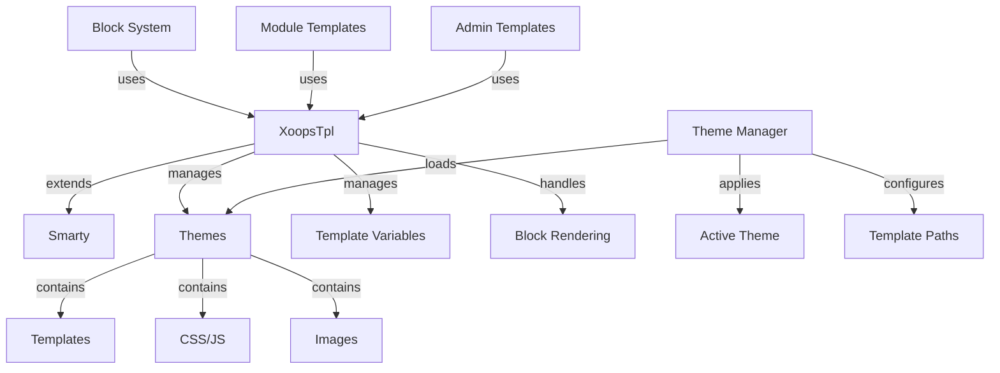

XOOPS टेम्प्लेट सिस्टम शक्तिशाली Smarty टेम्प्लेट इंजन पर बनाया गया है, जो प्रस्तुति तर्क को व्यावसायिक तर्क से अलग करने का एक लचीला और विस्तार योग्य तरीका प्रदान करता है। यह थीम, टेम्प्लेट रेंडरिंग, वेरिएबल असाइनमेंट और डायनामिक कंटेंट जेनरेशन का प्रबंधन करता है।

## टेम्पलेट आर्किटेक्चर



## XoopsTpl कक्षा

मुख्य टेम्पलेट इंजन वर्ग जो Smarty तक विस्तारित है।

### कक्षा अवलोकन

```php
namespace Xoops\Core;

class XoopsTpl extends Smarty
{
    protected array $vars = [];
    protected string $currentTheme = '';
    protected array $blocks = [];
    protected bool $isAdmin = false;
}
```

### विस्तार Smarty

```php
use Xoops\Core\XoopsTpl;

class XoopsTpl extends Smarty
{
    private static ?XoopsTpl $instance = null;

    private function __construct()
    {
        parent::__construct();
        $this->configureDirectories();
        $this->registerPlugins();
    }

    public static function getInstance(): XoopsTpl
    {
        if (!isset(self::$instance)) {
            self::$instance = new self();
        }
        return self::$instance;
    }
}
```

### कोर तरीके

#### getInstance

सिंगलटन टेम्पलेट उदाहरण प्राप्त करता है।

```php
public static function getInstance(): XoopsTpl
```

**रिटर्न:** `XoopsTpl` - सिंगलटन उदाहरण

**उदाहरण:**
```php
$xoopsTpl = XoopsTpl::getInstance();
```

#### असाइन करें

टेम्प्लेट को एक वेरिएबल असाइन करता है।

```php
public function assign(
    string|array $tplVar,
    mixed $value = null
): void
```

**पैरामीटर:**

| पैरामीटर | प्रकार | विवरण |
|----|------|----|
| `$tplVar` | स्ट्रिंग\|सरणी | परिवर्तनीय नाम या सहयोगी सरणी |
| `$value` | मिश्रित | परिवर्तनीय मान |

**उदाहरण:**
```php
$xoopsTpl->assign('page_title', 'Welcome');
$xoopsTpl->assign('user_name', 'John Doe');

// Multiple assignments
$xoopsTpl->assign([
    'items' => $items,
    'total_count' => count($items),
    'show_pagination' => true
]);
```

#### संलग्न करें

टेम्प्लेट सरणी वेरिएबल्स में मान जोड़ता है।

```php
public function appendAssign(
    string $tplVar,
    mixed $value
): void
```

**पैरामीटर:**

| पैरामीटर | प्रकार | विवरण |
|----|------|----|
| `$tplVar` | स्ट्रिंग | परिवर्तनीय नाम |
| `$value` | मिश्रित | जोड़ने का मान |

**उदाहरण:**
```php
$xoopsTpl->assign('breadcrumbs', ['Home']);
$xoopsTpl->appendAssign('breadcrumbs', 'Blog');
$xoopsTpl->appendAssign('breadcrumbs', 'Posts');
// breadcrumbs = ['Home', 'Blog', 'Posts']
```

#### getAssignedVars

सभी निर्दिष्ट टेम्पलेट वेरिएबल प्राप्त करता है।

```php
public function getAssignedVars(): array
```

**रिटर्न:** `array` - निर्दिष्ट चर

**उदाहरण:**
```php
$vars = $xoopsTpl->getAssignedVars();
foreach ($vars as $name => $value) {
    echo "$name = " . var_export($value, true) . "\n";
}
```

#### प्रदर्शन

एक टेम्प्लेट प्रस्तुत करता है और ब्राउज़र पर आउटपुट करता है।

```php
public function display(
    string $resource,
    string|array $cache_id = null,
    string $compile_id = null,
    object $parent = null
): void
```

**पैरामीटर:**

| पैरामीटर | प्रकार | विवरण |
|----|------|----|
| `$resource` | स्ट्रिंग | टेम्पलेट फ़ाइल पथ |
| `$cache_id` | स्ट्रिंग\|सरणी | कैश पहचानकर्ता |
| `$compile_id` | स्ट्रिंग | संकलित पहचानकर्ता |
| `$parent` | वस्तु | पैरेंट टेम्प्लेट ऑब्जेक्ट |

**उदाहरण:**
```php
$xoopsTpl->assign('page_title', 'Home');
$xoopsTpl->display('user:index.tpl');

// With absolute path
$xoopsTpl->display(XOOPS_ROOT_PATH . '/templates/user/index.tpl');
```

#### लाओ

एक टेम्पलेट प्रस्तुत करता है और स्ट्रिंग के रूप में लौटाता है।

```php
public function fetch(
    string $resource,
    string|array $cache_id = null,
    string $compile_id = null,
    object $parent = null
): string
```

**रिटर्न:** `string` - प्रस्तुत टेम्पलेट सामग्री

**उदाहरण:**
```php
$xoopsTpl->assign('message', 'Hello World');
$html = $xoopsTpl->fetch('user:message.tpl');
echo $html;

// Use for email templates
$emailContent = $xoopsTpl->fetch('mail:notification.tpl');
mail($to, $subject, $emailContent);
```

#### लोडथीम

एक विशिष्ट थीम लोड करता है.

```php
public function loadTheme(string $themeName): bool
```

**पैरामीटर:**

| पैरामीटर | प्रकार | विवरण |
|----|------|----|
| `$themeName` | स्ट्रिंग | थीम निर्देशिका का नाम |

**रिटर्न:** `bool` - सफलता पर सच

**उदाहरण:**
```php
if ($xoopsTpl->loadTheme('bluemoon')) {
    echo "Theme loaded successfully";
}
```

#### getCurrentTheme

वर्तमान में सक्रिय थीम का नाम प्राप्त करें.

```php
public function getCurrentTheme(): string
```

**रिटर्न:** `string` - थीम का नाम

**उदाहरण:**
```php
$currentTheme = $xoopsTpl->getCurrentTheme();
echo "Active theme: $currentTheme";
```

#### सेटआउटपुटफ़िल्टर

टेम्प्लेट आउटपुट को संसाधित करने के लिए एक आउटपुट फ़िल्टर जोड़ता है।

```php
public function setOutputFilter(string $function): void
```

**पैरामीटर:**

| पैरामीटर | प्रकार | विवरण |
|----|------|----|
| `$function` | स्ट्रिंग | फ़िल्टर फ़ंक्शन नाम |

**उदाहरण:**
```php
// Remove whitespace from output
$xoopsTpl->setOutputFilter('trim');

// Custom filter
function my_output_filter($output) {
    // Minify HTML
    $output = preg_replace('/\s+/', ' ', $output);
    return trim($output);
}
$xoopsTpl->setOutputFilter('my_output_filter');
```

#### रजिस्टरप्लगइन

एक कस्टम Smarty प्लगइन पंजीकृत करता है।

```php
public function registerPlugin(
    string $type,
    string $name,
    callable $callback
): void
```

**पैरामीटर:**

| पैरामीटर | प्रकार | विवरण |
|----|------|----|
| `$type` | स्ट्रिंग | प्लगइन प्रकार (संशोधक, ब्लॉक, फ़ंक्शन) |
| `$name` | स्ट्रिंग | प्लगइन नाम |
| `$callback` | कॉल करने योग्य | कॉलबैक फ़ंक्शन |

**उदाहरण:**
```php
// Register custom modifier
$xoopsTpl->registerPlugin('modifier', 'markdown', function($text) {
    return markdown_parse($text);
});

// Use in template: {$content|markdown}

// Register custom block tag
$xoopsTpl->registerPlugin('block', 'permission', function($params, $content, $smarty, &$repeat) {
    if ($repeat) return;

    // Check permission
    if (has_permission($params['name'])) {
        return $content;
    }
    return '';
});

// Use in template: {permission name="admin"}...{/permission}
```

## थीम सिस्टम

### थीम संरचना

मानक XOOPS थीम निर्देशिका संरचना:

```
bluemoon/
├── style.css              # Main stylesheet
├── admin.css              # Admin stylesheet
├── theme.html             # Main page template
├── admin.html             # Admin page template
├── blocks/                # Block templates
│   ├── block_left.tpl
│   └── block_right.tpl
├── modules/               # Module templates
│   ├── publisher/
│   │   ├── index.tpl
│   │   └── item.tpl
│   └── news/
│       └── index.tpl
├── images/                # Theme images
│   ├── logo.png
│   └── banner.png
├── js/                    # Theme JavaScript
│   └── script.js
└── readme.txt             # Theme documentation
```

### थीम मैनेजर क्लास

```php
namespace Xoops\Core\Theme;

class ThemeManager
{
    protected array $themes = [];
    protected string $activeTheme = '';
    protected string $themeDirectory = '';

    public function getActiveTheme(): string {}
    public function setActiveTheme(string $theme): bool {}
    public function getThemeList(): array {}
    public function themeExists(string $name): bool {}
}
```

## टेम्पलेट वेरिएबल्स

### मानक वैश्विक चर

XOOPS स्वचालित रूप से कई वैश्विक टेम्पलेट चर निर्दिष्ट करता है:

| परिवर्तनीय | प्रकार | विवरण |
|---|------|----|
| `$xoops_url` | स्ट्रिंग | XOOPS इंस्टॉलेशन URL |
| `$xoops_user` | XoopsUser\|null | वर्तमान उपयोक्ता वस्तु |
| `$xoops_uname` | स्ट्रिंग | वर्तमान उपयोक्तानाम |
| `$xoops_isadmin` | बूल | उपयोगकर्ता व्यवस्थापक है |
| `$xoops_banner` | स्ट्रिंग | बैनर HTML |
| `$xoops_notification` | स्ट्रिंग | अधिसूचना मार्कअप |
| `$xoops_version` | स्ट्रिंग | XOOPS संस्करण |

### ब्लॉक-विशिष्ट चरब्लॉक प्रस्तुत करते समय:

| परिवर्तनीय | प्रकार | विवरण |
|---|------|----|
| `$block` | सारणी | ब्लॉक जानकारी |
| `$block.title` | स्ट्रिंग | ब्लॉक शीर्षक |
| `$block.content` | स्ट्रिंग | सामग्री को ब्लॉक करें |
| `$block.id` | int | ब्लॉक आईडी |
| `$block.module` | स्ट्रिंग | मॉड्यूल का नाम |

### मॉड्यूल टेम्पलेट वेरिएबल्स

मॉड्यूल आम तौर पर निर्दिष्ट करते हैं:

| परिवर्तनीय | प्रकार | विवरण |
|---|------|----|
| `$module_name` | स्ट्रिंग | मॉड्यूल प्रदर्शन नाम |
| `$module_dir` | स्ट्रिंग | मॉड्यूल निर्देशिका |
| `$xoops_module_header` | स्ट्रिंग | मॉड्यूल CSS/जेएस |

## Smarty कॉन्फ़िगरेशन

### सामान्य Smarty संशोधक

| संशोधक | विवरण | उदाहरण |
|---|---|---|
| `capitalize` | पहला अक्षर बड़े अक्षरों में लिखें | `{$title\|capitalize}` |
| `count_characters` | वर्ण गणना | `{$text\|count_characters}` |
| `date_format` | प्रारूप टाइमस्टैम्प | `{$timestamp\|date_format:'%Y-%m-%d'}` |
| `escape` | विशेष वर्ण से बचें | `{$html\|escape:'html'}` |
| `nl2br` | न्यूलाइन को `<br>` | में बदलें `{$text\|nl2br}` |
| `strip_tags` | HTML टैग हटाएँ | `{$content\|strip_tags}` |
| `truncate` | स्ट्रिंग की लंबाई सीमित करें | `{$text\|truncate:100}` |
| `upper` | अपरकेस में कनवर्ट करें | `{$name\|upper}` |
| `lower` | लोअरकेस में कनवर्ट करें | `{$name\|lower}` |

### नियंत्रण संरचनाएँ

```smarty
{* If statement *}
{if $user->isAdmin()}
    <p>Admin content</p>
{else}
    <p>User content</p>
{/if}

{* For loop *}
{foreach $items as $item}
    <div class="item">{$item.title}</div>
{/foreach}

{* For loop with counter *}
{foreach $items as $item name=item_loop}
    {$smarty.foreach.item_loop.iteration}: {$item.title}
{/foreach}

{* While loop *}
{while $condition}
    <!-- content -->
{/while}

{* Switch statement *}
{switch $status}
    {case 'draft'}<span class="draft">Draft</span>{break}
    {case 'published'}<span class="published">Published</span>{break}
    {default}<span class="unknown">Unknown</span>
{/switch}
```

## संपूर्ण टेम्पलेट उदाहरण

### PHP कोड

```php
<?php
/**
 * Module Article List Page
 */

include __DIR__ . '/include/common.inc.php';

$xoopsTpl = XoopsTpl::getInstance();

// Check if module is active
$module = xoops_getModuleByDirname('articles');
if (!$module) {
    redirect_header(XOOPS_URL, 3, 'Module not found');
}

// Get item handler
$itemHandler = xoops_getModuleHandler('item', 'articles');

// Get pagination parameters
$page = !empty($_GET['page']) ? (int)$_GET['page'] : 1;
$perPage = $module->getConfig('items_per_page') ?: 10;
$offset = ($page - 1) * $perPage;

// Build criteria
$criteria = new CriteriaCompo();
$criteria->add(new Criteria('status', 1));
$criteria->setSort('published', 'DESC');
$criteria->setLimit($perPage);
$criteria->setStart($offset);

// Fetch items
$items = $itemHandler->getObjects($criteria);
$total = $itemHandler->getCount(new Criteria('status', 1));

// Calculate pagination
$pages = ceil($total / $perPage);

// Assign template variables
$xoopsTpl->assign([
    'module_name' => $module->getName(),
    'items' => $items,
    'total_items' => $total,
    'current_page' => $page,
    'total_pages' => $pages,
    'items_per_page' => $perPage,
    'show_pagination' => $pages > 1
]);

// Add breadcrumbs
$xoopsTpl->assign('xoops_breadcrumbs', [
    ['url' => XOOPS_URL, 'title' => 'Home'],
    ['url' => $module->getUrl(), 'title' => $module->getName()],
    ['title' => 'Articles']
]);

// Display template
$xoopsTpl->display($module->getPath() . '/templates/user/list.tpl');
```

### टेम्पलेट फ़ाइल (list.tpl)

```smarty
<div id="articles-list">
    <h1>{$module_name|escape}</h1>

    {if $items}
        <div class="articles-container">
            {foreach $items as $item}
                <article class="article-item">
                    <header>
                        <h2>
                            <a href="{$item.url|escape}">
                                {$item.title|escape}
                            </a>
                        </h2>
                        <div class="meta">
                            <span class="author">By {$item.author|escape}</span>
                            <span class="date">
                                {$item.published|date_format:'%B %d, %Y'}
                            </span>
                        </div>
                    </header>

                    <div class="content">
                        <p>{$item.summary|truncate:150}</p>
                    </div>

                    <footer>
                        <a href="{$item.url|escape}" class="read-more">
                            Read More »
                        </a>
                    </footer>
                </article>
            {/foreach}
        </div>

        {* Pagination *}
        {if $show_pagination}
            <nav class="pagination">
                {if $current_page > 1}
                    <a href="?page=1" class="first">« First</a>
                    <a href="?page={$current_page - 1}" class="prev">‹ Previous</a>
                {/if}

                {for $i=1 to $total_pages}
                    {if $i == $current_page}
                        <span class="current">{$i}</span>
                    {else}
                        <a href="?page={$i}">{$i}</a>
                    {/if}
                {/for}

                {if $current_page < $total_pages}
                    <a href="?page={$current_page + 1}" class="next">Next ›</a>
                    <a href="?page={$total_pages}" class="last">Last »</a>
                {/if}
            </nav>
        {/if}
    {else}
        <p class="no-items">No articles found.</p>
    {/if}
</div>
```

## कस्टम Smarty फ़ंक्शन

### एक कस्टम ब्लॉक फ़ंक्शन बनाना

```php
<?php
/**
 * Custom Smarty block function for permission checking
 */

function smarty_block_permission($params, $content, $smarty, &$repeat)
{
    if ($repeat) return;

    if (!isset($params['name'])) {
        return 'Permission name required';
    }

    $permName = $params['name'];
    $user = $GLOBALS['xoopsUser'];

    // Check if user has permission
    if ($user && $user->isAdmin()) {
        return $content;
    }

    if ($user && check_user_permission($user->uid(), $permName)) {
        return $content;
    }

    return '';
}
```

रजिस्टर करें और उपयोग करें:

```php
$xoopsTpl->registerPlugin('block', 'permission', 'smarty_block_permission');
```

टेम्पलेट:

```smarty
{permission name="edit_articles"}
    <button>Edit Article</button>
{/permission}
```

## सर्वोत्तम प्रथाएँ

1. **उपयोगकर्ता सामग्री से बचें** - उपयोगकर्ता-जनित सामग्री के लिए हमेशा `|escape` का उपयोग करें
2. **टेम्पलेट पथों का उपयोग करें** - विषय से संबंधित संदर्भ टेम्पलेट
3. **प्रस्तुति से तर्क को अलग करें** - जटिल तर्क को PHP में रखें
4. **कैश टेम्प्लेट** - उत्पादन में टेम्प्लेट कैशिंग सक्षम करें
5. **संशोधक का सही ढंग से उपयोग करें** - संदर्भ के लिए उपयुक्त फ़िल्टर लागू करें
6. **ब्लॉक व्यवस्थित करें** - ब्लॉक टेम्पलेट्स को समर्पित निर्देशिका में रखें
7. **डॉक्यूमेंट वेरिएबल्स** - PHP में सभी टेम्प्लेट वेरिएबल्स का दस्तावेज़ीकरण करें

## संबंधित दस्तावेज़ीकरण

- ../मॉड्यूल/मॉड्यूल-सिस्टम - मॉड्यूल सिस्टम और हुक
- ../कर्नेल/कर्नेल-क्लासेस - कर्नेल और कॉन्फ़िगरेशन
- ../Core/XoopsObject - बेस ऑब्जेक्ट क्लास

---

*यह भी देखें: [Smarty दस्तावेज़ीकरण](https://www.smarty.net/docs) | [XOOPS टेम्प्लेट API](https://github.com/XOOPS/XoopsCore27/tree/master/htdocs/class)*