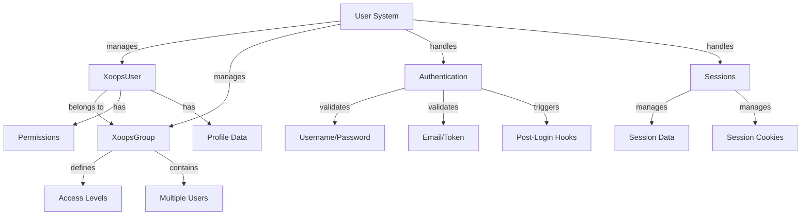

XOOPS उपयोगकर्ता प्रणाली उपयोगकर्ता खाते, प्रमाणीकरण, प्राधिकरण, समूह सदस्यता और सत्र प्रबंधन का प्रबंधन करती है। यह आपके एप्लिकेशन को सुरक्षित करने और उपयोगकर्ता पहुंच को नियंत्रित करने के लिए एक मजबूत ढांचा प्रदान करता है।

## उपयोगकर्ता सिस्टम आर्किटेक्चर



## XoopsUser कक्षा

उपयोगकर्ता खाते का प्रतिनिधित्व करने वाला मुख्य उपयोगकर्ता ऑब्जेक्ट वर्ग।

### कक्षा अवलोकन

```php
namespace Xoops\Core\User;

class XoopsUser extends XoopsObject
{
    protected int $uid = 0;
    protected string $uname = '';
    protected string $email = '';
    protected string $pass = '';
    protected int $uregdate = 0;
    protected int $ulevel = 0;
    protected array $groups = [];
    protected array $permissions = [];
}
```

### कंस्ट्रक्टर

```php
public function __construct(int $uid = null)
```

एक नया उपयोगकर्ता ऑब्जेक्ट बनाता है, जिसे वैकल्पिक रूप से आईडी द्वारा डेटाबेस से लोड किया जाता है।

**पैरामीटर:**

| पैरामीटर | प्रकार | विवरण |
|----|------|----|
| `$uid` | int | लोड करने के लिए उपयोगकर्ता आईडी (वैकल्पिक) |

**उदाहरण:**
```php
// Create new user
$user = new XoopsUser();

// Load existing user
$user = new XoopsUser(123);
```

### मुख्य गुण

| संपत्ति | प्रकार | विवरण |
|---|------|----|
| `uid` | int | उपयोगकर्ता आईडी |
| `uname` | स्ट्रिंग | उपयोगकर्ता नाम |
| `email` | स्ट्रिंग | ईमेल पता |
| `pass` | स्ट्रिंग | पासवर्ड हैश |
| `uregdate` | int | पंजीकरण टाइमस्टैम्प |
| `ulevel` | int | उपयोगकर्ता स्तर (9=व्यवस्थापक, 1=उपयोगकर्ता) |
| `groups` | सारणी | समूह आईडी |
| `permissions` | सारणी | अनुमति झंडे |

### कोर तरीके

#### getID / getUid

उपयोगकर्ता की आईडी प्राप्त करता है.

```php
public function getID(): int
public function getUid(): int  // Alias
```

**रिटर्न:** `int` - उपयोगकर्ता आईडी

**उदाहरण:**
```php
$user = new XoopsUser(1);
echo $user->getID(); // 1
echo $user->getUid(); // 1
```

#### getUnameReal

उपयोगकर्ता का प्रदर्शन नाम प्राप्त करता है.

```php
public function getUnameReal(): string
```

**रिटर्न:** `string` - उपयोगकर्ता का वास्तविक नाम

**उदाहरण:**
```php
$realName = $user->getUnameReal();
echo "Hello, $realName";
```

#### ईमेल प्राप्त करें

उपयोगकर्ता का ईमेल पता प्राप्त करता है.

```php
public function getEmail(): string
```

**रिटर्न:** `string` - ईमेल पता

**उदाहरण:**
```php
$email = $user->getEmail();
mail($email, 'Welcome', 'Welcome to XOOPS');
```

#### getVar / setVar

उपयोगकर्ता वैरिएबल प्राप्त या सेट करता है।

```php
public function getVar(string $key, string $format = 's'): mixed
public function setVar(string $key, mixed $value, bool $notGpc = false): bool
```

**उदाहरण:**
```php
// Get values
$username = $user->getVar('uname');
$email = $user->getVar('email', 's'); // Formatted for display

// Set values
$user->setVar('uname', 'newusername');
$user->setVar('email', 'user@example.com');
```

#### समूह प्राप्त करें

उपयोगकर्ता की समूह सदस्यता प्राप्त करता है।

```php
public function getGroups(): array
```

**रिटर्न:** `array` - समूह आईडी की श्रृंखला

**उदाहरण:**
```php
$groups = $user->getGroups();
echo "Member of " . count($groups) . " groups";
```

#### समूह में है

जाँचता है कि उपयोगकर्ता किसी समूह से संबंधित है या नहीं।

```php
public function isInGroup(int $groupId): bool
```

**पैरामीटर:**

| पैरामीटर | प्रकार | विवरण |
|----|------|----|
| `$groupId` | int | चेक करने के लिए ग्रुप आईडी |

**रिटर्न:** `bool` - यदि समूह में है तो सत्य है

**उदाहरण:**
```php
if ($user->isInGroup(1)) { // 1 = Webmasters
    echo 'User is a webmaster';
}
```

#### एडमिन है

जाँचता है कि उपयोगकर्ता प्रशासक है या नहीं।

```php
public function isAdmin(): bool
```

**रिटर्न:** `bool` - यदि व्यवस्थापक है तो सही है

**उदाहरण:**
```php
if ($user->isAdmin()) {
    // Show admin controls
    echo '<a href="admin/">Admin Panel</a>';
}
```

#### प्रोफ़ाइल प्राप्त करें

उपयोगकर्ता प्रोफ़ाइल जानकारी प्राप्त करता है.

```php
public function getProfile(): array
```

**रिटर्न:** `array` - प्रोफ़ाइल डेटा

**उदाहरण:**
```php
$profile = $user->getProfile();
echo 'Bio: ' . $profile['bio'];
```

#### सक्रिय है

जाँचता है कि उपयोगकर्ता खाता सक्रिय है या नहीं।

```php
public function isActive(): bool
```

**रिटर्न:** `bool` - यदि सक्रिय है तो सत्य है

**उदाहरण:**
```php
if ($user->isActive()) {
    // Allow user access
} else {
    // Restrict access
}
```

#### अपडेटलास्टलॉगिन

उपयोगकर्ता के अंतिम लॉगिन टाइमस्टैम्प को अपडेट करता है।

```php
public function updateLastLogin(): bool
```

**रिटर्न:** `bool` - सफलता पर सच

**उदाहरण:**
```php
if ($user->updateLastLogin()) {
    echo 'Login recorded';
}
```

## XoopsGroup कक्षा

उपयोगकर्ता समूहों और अनुमतियों का प्रबंधन करता है।

### कक्षा अवलोकन

```php
namespace Xoops\Core\User;

class XoopsGroup extends XoopsObject
{
    protected int $groupid = 0;
    protected string $name = '';
    protected string $description = '';
    protected int $group_type = 0;
    protected array $users = [];
}
```

### स्थिरांक

| लगातार | मूल्य | विवरण |
|---|-------|---|
| `TYPE_NORMAL` | 0 | सामान्य उपयोगकर्ता समूह |
| `TYPE_ADMIN` | 1 | प्रशासनिक समूह |
| `TYPE_SYSTEM` | 2 | सिस्टम समूह |

### तरीके

#### नाम प्राप्त करें

समूह का नाम मिलता है.

```php
public function getName(): string
```

**रिटर्न:** `string` - समूह का नाम

**उदाहरण:**
```php
$group = new XoopsGroup(1);
echo $group->getName(); // "Webmasters"
```

#### विवरण प्राप्त करें

समूह विवरण प्राप्त करता है.

```php
public function getDescription(): string
```

**रिटर्न:** `string` - विवरण

**उदाहरण:**
```php
echo $group->getDescription();
```

#### उपयोगकर्ता प्राप्त करें

समूह के सदस्य मिलते हैं.

```php
public function getUsers(): array
```

**रिटर्न:** `array` - उपयोगकर्ता आईडी की श्रृंखला

**उदाहरण:**
```php
$users = $group->getUsers();
echo "Group has " . count($users) . " members";
```

#### addUser

किसी उपयोगकर्ता को समूह में जोड़ता है.

```php
public function addUser(int $uid): bool
```

**पैरामीटर:**

| पैरामीटर | प्रकार | विवरण |
|----|------|----|
| `$uid` | int | उपयोगकर्ता आईडी |

**रिटर्न:** `bool` - सफलता पर सच

**उदाहरण:**
```php
$group = new XoopsGroup(2); // Editors
$group->addUser(123);
$groupHandler->insert($group);
```

#### उपयोगकर्ता हटाएँ

किसी उपयोगकर्ता को समूह से हटा देता है.

```php
public function removeUser(int $uid): bool
```

**उदाहरण:**
```php
$group->removeUser(123);
```

## उपयोगकर्ता प्रमाणीकरण

### लॉगिन प्रक्रिया

```php
/**
 * User login
 */
function xoops_user_login(string $uname, string $pass, bool $rememberMe = false): ?XoopsUser
{
    global $xoopsDB;

    // Sanitize username
    $uname = trim($uname);

    // Get user from database
    $query = $xoopsDB->prepare(
        'SELECT * FROM ' . $xoopsDB->prefix('users') .
        ' WHERE uname = ? AND active = 1'
    );
    $query->bind_param('s', $uname);
    $query->execute();
    $result = $query->get_result();

    if ($result->num_rows === 0) {
        return null; // User not found
    }

    $row = $result->fetch_assoc();

    // Verify password
    if (!password_verify($pass, $row['pass'])) {
        return null; // Invalid password
    }

    // Load user object
    $user = new XoopsUser($row['uid']);

    // Update last login
    $user->updateLastLogin();

    // Handle "Remember Me"
    if ($rememberMe) {
        // Set persistent cookie
        setcookie(
            'xoops_user_remember',
            $user->uid(),
            time() + (30 * 24 * 60 * 60), // 30 days
            '/',
            $_SERVER['HTTP_HOST'] ?? ''
        );
    }

    return $user;
}
```### पासवर्ड प्रबंधन

```php
/**
 * Hash password securely
 */
function xoops_hash_password(string $password): string
{
    return password_hash($password, PASSWORD_BCRYPT, [
        'cost' => 12
    ]);
}

/**
 * Verify password
 */
function xoops_verify_password(string $password, string $hash): bool
{
    return password_verify($password, $hash);
}

/**
 * Check if password needs rehashing
 */
function xoops_password_needs_rehash(string $hash): bool
{
    return password_needs_rehash($hash, PASSWORD_BCRYPT, [
        'cost' => 12
    ]);
}
```

## सत्र प्रबंधन

### सत्र कक्षा

```php
namespace Xoops\Core;

class SessionManager
{
    protected array $data = [];
    protected string $sessionId = '';

    public function start(): void {}
    public function get(string $key): mixed {}
    public function set(string $key, mixed $value): void {}
    public function destroy(): void {}
}
```

### सत्र विधियाँ

#### सत्र प्रारंभ करें

```php
<?php
session_start();

// Regenerate session ID for security
session_regenerate_id(true);

// Set session timeout
ini_set('session.gc_maxlifetime', 3600); // 1 hour

// Store user in session
if ($user) {
    $_SESSION['xoops_user'] = $user;
    $_SESSION['xoops_uid'] = $user->getID();
    $_SESSION['xoops_uname'] = $user->getVar('uname');
}
```

#### जाँच सत्र

```php
/**
 * Get current user from session
 */
function xoops_get_current_user(): ?XoopsUser
{
    if (isset($_SESSION['xoops_user']) && $_SESSION['xoops_user'] instanceof XoopsUser) {
        return $_SESSION['xoops_user'];
    }
    return null;
}

/**
 * Check if user is logged in
 */
function xoops_is_user_logged_in(): bool
{
    return isset($_SESSION['xoops_uid']) && $_SESSION['xoops_uid'] > 0;
}
```

#### सत्र नष्ट करें

```php
/**
 * User logout
 */
function xoops_user_logout()
{
    global $xoopsUser;

    // Log the logout
    if ($xoopsUser) {
        error_log('User ' . $xoopsUser->getVar('uname') . ' logged out');
    }

    // Destroy session data
    $_SESSION = [];

    // Delete session cookie
    if (ini_get('session.use_cookies')) {
        $params = session_get_cookie_params();
        setcookie(
            session_name(),
            '',
            time() - 42000,
            $params['path'],
            $params['domain'],
            $params['secure'],
            $params['httponly']
        );
    }

    // Destroy session
    session_destroy();
}
```

## अनुमति प्रणाली

### अनुमति स्थिरांक

| लगातार | मूल्य | विवरण |
|---|-------|---|
| `XOOPS_PERMISSION_NONE` | 0 | कोई अनुमति नहीं |
| `XOOPS_PERMISSION_VIEW` | 1 | सामग्री देखें |
| `XOOPS_PERMISSION_SUBMIT` | 2 | सामग्री सबमिट करें |
| `XOOPS_PERMISSION_EDIT` | 4 | सामग्री संपादित करें |
| `XOOPS_PERMISSION_DELETE` | 8 | सामग्री हटाएं |
| `XOOPS_PERMISSION_ADMIN` | 16 | व्यवस्थापक पहुंच |

### अनुमति जाँचना

```php
/**
 * Check if user has permission
 */
function xoops_check_permission($user, $resource, $permission)
{
    if (!$user) {
        return false;
    }

    // Admins have all permissions
    if ($user->isAdmin()) {
        return true;
    }

    // Check group permissions
    $groups = $user->getGroups();
    foreach ($groups as $groupId) {
        if (xoops_group_has_permission($groupId, $resource, $permission)) {
            return true;
        }
    }

    return false;
}
```

## उपयोगकर्ता हैंडलर

UserHandler उपयोगकर्ता दृढ़ता संचालन का प्रबंधन करता है।

```php
/**
 * Get user handler
 */
$userHandler = xoops_getHandler('user');

/**
 * Create new user
 */
$user = new XoopsUser();
$user->setVar('uname', 'newuser');
$user->setVar('email', 'user@example.com');
$user->setVar('pass', xoops_hash_password('password123'));
$user->setVar('uregdate', time());
$user->setVar('uactive', 1);

if ($userHandler->insert($user)) {
    echo 'User created with ID: ' . $user->getID();
}

/**
 * Update user
 */
$user = $userHandler->get(123);
$user->setVar('email', 'newemail@example.com');
$userHandler->insert($user);

/**
 * Get user by name
 */
$user = $userHandler->findByUsername('john');

/**
 * Delete user
 */
$userHandler->delete($user);

/**
 * Search users
 */
$criteria = new CriteriaCompo();
$criteria->add(new Criteria('uname', '%admin%', 'LIKE'));
$users = $userHandler->getObjects($criteria);
```

## संपूर्ण उपयोगकर्ता प्रबंधन उदाहरण

```php
<?php
/**
 * Complete user authentication and profile example
 */

require_once XOOPS_ROOT_PATH . '/include/common.inc.php';

$xoopsUser = $GLOBALS['xoopsUser'];

// Check if user is logged in
if (!$xoopsUser || !$xoopsUser->isActive()) {
    redirect_header(XOOPS_URL, 3, 'Please login');
}

// Get user handler
$userHandler = xoops_getHandler('user');

// Get current user with fresh data
$currentUser = $userHandler->get($xoopsUser->getID());

// User profile page
echo '<h1>Profile: ' . htmlspecialchars($currentUser->getVar('uname')) . '</h1>';

echo '<div class="user-profile">';
echo '<p><strong>Username:</strong> ' . htmlspecialchars($currentUser->getVar('uname')) . '</p>';
echo '<p><strong>Email:</strong> ' . htmlspecialchars($currentUser->getVar('email')) . '</p>';
echo '<p><strong>Registered:</strong> ' . date('Y-m-d H:i:s', $currentUser->getVar('uregdate')) . '</p>';
echo '<p><strong>Groups:</strong> ';

$groupHandler = xoops_getHandler('group');
$groups = $currentUser->getGroups();
$groupNames = [];
foreach ($groups as $groupId) {
    $group = $groupHandler->get($groupId);
    if ($group) {
        $groupNames[] = htmlspecialchars($group->getName());
    }
}
echo implode(', ', $groupNames);
echo '</p>';

// Admin status
if ($currentUser->isAdmin()) {
    echo '<p><strong>Status:</strong> Administrator</p>';
}

echo '</div>';

// Change password form
if ($_SERVER['REQUEST_METHOD'] === 'POST' && !empty($_POST['change_password'])) {
    $oldPassword = $_POST['old_password'] ?? '';
    $newPassword = $_POST['new_password'] ?? '';
    $confirmPassword = $_POST['confirm_password'] ?? '';

    // Verify old password
    if (!password_verify($oldPassword, $currentUser->getVar('pass'))) {
        echo '<div class="error">Current password is incorrect</div>';
    } elseif ($newPassword !== $confirmPassword) {
        echo '<div class="error">New passwords do not match</div>';
    } elseif (strlen($newPassword) < 6) {
        echo '<div class="error">Password must be at least 6 characters</div>';
    } else {
        // Update password
        $currentUser->setVar('pass', xoops_hash_password($newPassword));
        if ($userHandler->insert($currentUser)) {
            echo '<div class="success">Password changed successfully</div>';
        } else {
            echo '<div class="error">Failed to update password</div>';
        }
    }
}

// Password change form
echo '<form method="post">';
echo '<h3>Change Password</h3>';
echo '<div class="form-group">';
echo '<label>Current Password:</label>';
echo '<input type="password" name="old_password" required>';
echo '</div>';
echo '<div class="form-group">';
echo '<label>New Password:</label>';
echo '<input type="password" name="new_password" required>';
echo '</div>';
echo '<div class="form-group">';
echo '<label>Confirm Password:</label>';
echo '<input type="password" name="confirm_password" required>';
echo '</div>';
echo '<button type="submit" name="change_password">Change Password</button>';
echo '</form>';
```

## सर्वोत्तम प्रथाएँ

1. **हैश पासवर्ड** - पासवर्ड हैशिंग के लिए हमेशा bcrypt या argon2 का उपयोग करें
2. **इनपुट मान्य करें** - सभी उपयोगकर्ता इनपुट को मान्य और स्वच्छ करें
3. **अनुमतियाँ जाँचें** - कार्यों से पहले हमेशा उपयोगकर्ता की अनुमतियाँ सत्यापित करें
4. **सत्रों का सुरक्षित रूप से उपयोग करें** - लॉगिन पर सत्र आईडी पुन: उत्पन्न करें
5. **लॉग गतिविधियां** - लॉग लॉगिन, लॉगआउट और महत्वपूर्ण क्रियाएं
6. **दर सीमित करना** - लॉगिन प्रयास दर सीमित करना लागू करें
7. **HTTPS केवल** - प्रमाणीकरण के लिए हमेशा HTTPS का उपयोग करें
8. **समूह प्रबंधन** - अनुमति संगठन के लिए समूहों का उपयोग करें

## संबंधित दस्तावेज़ीकरण

- ../कर्नेल/कर्नेल-क्लासेस - कर्नेल सेवाएँ और बूटस्ट्रैपिंग
- ../डेटाबेस/QueryBuilder - उपयोगकर्ता डेटा के लिए डेटाबेस क्वेरीज़
- ../Core/XoopsObject - बेस ऑब्जेक्ट क्लास

---

*यह भी देखें: [XOOPS उपयोगकर्ता API](https://github.com/XOOPS/XoopsCore27/tree/master/htdocs/class) | [PHP सुरक्षा](https://www.php.net/manual/en/book.password.php)*