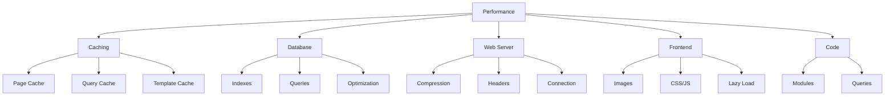

# XOOPS प्रदर्शन अनुकूलन

अधिकतम गति और दक्षता के लिए XOOPS को अनुकूलित करने के लिए व्यापक मार्गदर्शिका।

## प्रदर्शन अनुकूलन अवलोकन



## कैशिंग कॉन्फ़िगरेशन

कैशिंग प्रदर्शन को बेहतर बनाने का सबसे तेज़ तरीका है।

### पृष्ठ-स्तरीय कैशिंग

XOOPS में पूर्ण पृष्ठ कैशिंग सक्षम करें:

**एडमिन पैनल > सिस्टम > प्राथमिकताएँ > कैश सेटिंग्स**

```
Enable Caching: Yes
Cache Type: File Cache (or APCu/Memcache)
Cache Lifetime: 3600 seconds (1 hour)
Cache Module Lists: Yes
Cache Configuration: Yes
Cache Search Results: Yes
```

### फ़ाइल-आधारित कैशिंग

फ़ाइल कैश स्थान कॉन्फ़िगर करें:

```bash
# Create cache directory outside web root (more secure)
mkdir -p /var/cache/xoops
chown www-data:www-data /var/cache/xoops
chmod 755 /var/cache/xoops

# Edit mainfile.php
define('XOOPS_CACHE_PATH', '/var/cache/xoops/');
```

### एपीसीयू कैशिंग

APCu इन-मेमोरी कैशिंग प्रदान करता है (बहुत तेज़):

```bash
# Install APCu
apt-get install php-apcu

# Verify installation
php -m | grep apcu

# Configure in php.ini
apc.enabled = 1
apc.memory_size = 128M
apc.ttl = 0
apc.user_ttl = 3600
apc.shm_size = 128
```

XOOPS में सक्षम करें:

**एडमिन पैनल > सिस्टम > प्राथमिकताएँ > कैश सेटिंग्स**

```
Cache Type: APCu
```

### मेम्कैश/रेडिस कैशिंग

उच्च-यातायात साइटों के लिए वितरित कैशिंग:

**मेमकेचे स्थापित करें:**

```bash
# Install Memcache server
apt-get install memcached

# Start service
systemctl start memcached
systemctl enable memcached

# Verify running
netstat -tlnp | grep memcached
# Should show listening on port 11211
```

**XOOPS में कॉन्फ़िगर करें:**

Mainfile.php संपादित करें:

```php
// Memcache configuration
define('XOOPS_CACHE_TYPE', 'memcache');
define('XOOPS_CACHE_HOST', 'localhost');
define('XOOPS_CACHE_PORT', 11211);
define('XOOPS_CACHE_TIMEOUT', 0);
```

या व्यवस्थापक पैनल में:

```
Cache Type: Memcache
Memcache Host: localhost:11211
```

### टेम्प्लेट कैशिंग

XOOPS टेम्प्लेट संकलित और कैश करें:

```bash
# Ensure templates_c is writable
chmod 777 /var/www/html/xoops/templates_c/

# Clear old cached templates
rm -rf /var/www/html/xoops/templates_c/*
```

थीम में कॉन्फ़िगर करें:

```html
<!-- In theme xoops_version.php -->
{smarty.const.XOOPS_VAR_PATH|constant}
<{$xoops_meta}>

<!-- Templates use caching -->
{cache}
    [Cached content here]
{/cache}
```

## डेटाबेस अनुकूलन

### डेटाबेस इंडेक्स जोड़ें

उचित रूप से अनुक्रमित डेटाबेस बहुत तेजी से क्वेरी करते हैं।

```sql
-- Check current indexes
SHOW INDEXES FROM xoops_users;

-- Common indexes to add
ALTER TABLE xoops_users ADD INDEX idx_uname (uname);
ALTER TABLE xoops_users ADD INDEX idx_email (email);
ALTER TABLE xoops_users ADD INDEX idx_uid_active (uid, user_actkey);

-- Add indexes to posts/content tables
ALTER TABLE xoops_posts ADD INDEX idx_post_published (post_published);
ALTER TABLE xoops_posts ADD INDEX idx_post_uid (post_uid);
ALTER TABLE xoops_posts ADD INDEX idx_post_created (post_created);

-- Verify indexes created
SHOW INDEXES FROM xoops_users\G
```

### तालिकाएँ अनुकूलित करें

नियमित तालिका अनुकूलन से प्रदर्शन में सुधार होता है:

```sql
-- Optimize all tables
OPTIMIZE TABLE xoops_users;
OPTIMIZE TABLE xoops_posts;
OPTIMIZE TABLE xoops_config;
OPTIMIZE TABLE xoops_comments;

-- Or optimize all at once
REPAIR TABLE xoops_users;
OPTIMIZE TABLE xoops_users;
REPAIR TABLE xoops_posts;
OPTIMIZE TABLE xoops_posts;
```

स्वचालित अनुकूलन स्क्रिप्ट बनाएं:

```bash
#!/bin/bash
# Database optimization script

echo "Optimizing XOOPS database..."

mysql -u xoops_user -p xoops_db << EOF
-- Optimize all tables
OPTIMIZE TABLE xoops_users;
OPTIMIZE TABLE xoops_posts;
OPTIMIZE TABLE xoops_config;
OPTIMIZE TABLE xoops_comments;
OPTIMIZE TABLE xoops_users_online;

-- Show database size
SELECT table_schema,
       ROUND(SUM(data_length + index_length) / 1024 / 1024, 2) as total_mb
FROM information_schema.tables
WHERE table_schema = 'xoops_db'
GROUP BY table_schema;
EOF

echo "Database optimization completed!"
```

क्रॉन के साथ शेड्यूल करें:

```bash
# Weekly optimization
crontab -e
# Add: 0 3 * * 0 /usr/local/bin/optimize-xoops-db.sh
```

### क्वेरी अनुकूलन

धीमी क्वेरी की समीक्षा करें:

```sql
-- Enable slow query log
SET GLOBAL slow_query_log = 'ON';
SET GLOBAL long_query_time = 2;

-- View slow queries
SELECT * FROM mysql.slow_log;

-- Or check slow log file
tail -100 /var/log/mysql/slow.log
```

सामान्य अनुकूलन तकनीकें:

```php
// SLOW - Avoid unnecessary queries in loops
foreach ($users as $user) {
    $profile = getUserProfile($user['uid']);  // Query in loop!
    echo $profile['name'];
}

// FAST - Get all data at once
$profiles = getAllUserProfiles($user_ids);
foreach ($users as $user) {
    echo $profiles[$user['uid']]['name'];
}
```

### बफ़र पूल बढ़ाएँ

बेहतर कैशिंग के लिए MySQL कॉन्फ़िगर करें:

संपादित करें `/etc/mysql/mysql.conf.d/mysqld.cnf`:

```ini
# InnoDB Buffer Pool (50-80% of system RAM)
innodb_buffer_pool_size = 1G

# Query Cache (optional, can be disabled in MySQL 5.7+)
query_cache_size = 64M
query_cache_type = 1

# Max Connections
max_connections = 500

# Max Allowed Packet
max_allowed_packet = 256M

# Connection timeout
connect_timeout = 10
```

पुनः आरंभ करें MySQL:

```bash
systemctl restart mysql
```

## वेब सर्वर अनुकूलन

### Gzip संपीड़न सक्षम करें

बैंडविड्थ कम करने के लिए प्रतिक्रियाओं को संपीड़ित करें:

**अपाचे कॉन्फ़िगरेशन:**

```apache
<IfModule mod_deflate.c>
    AddOutputFilterByType DEFLATE text/html text/plain text/xml text/css text/javascript application/javascript application/json

    # Don't compress images and already compressed files
    SetEnvIfNoCase Request_URI \.(jpg|jpeg|png|gif|zip|gzip)$ no-gzip dont-vary

    # Log compressed responses
    DeflateBufferSize 8096
</IfModule>
```

**Nginx कॉन्फ़िगरेशन:**

```nginx
gzip on;
gzip_types text/html text/plain text/css text/javascript application/javascript application/json;
gzip_min_length 1000;
gzip_vary on;
gzip_comp_level 6;

# Don't compress already compressed formats
gzip_disable "msie6";
```

संपीड़न सत्यापित करें:

```bash
# Check if response is gzipped
curl -I -H "Accept-Encoding: gzip" http://your-domain.com/xoops/

# Should show:
# Content-Encoding: gzip
```

### ब्राउज़र कैशिंग हेडर

स्थैतिक संपत्तियों के लिए कैश समाप्ति निर्धारित करें:

**अपाचे:**

```apache
<IfModule mod_expires.c>
    ExpiresActive On

    # Cache images for 30 days
    ExpiresByType image/jpeg "access plus 30 days"
    ExpiresByType image/gif "access plus 30 days"
    ExpiresByType image/png "access plus 30 days"
    ExpiresByType image/svg+xml "access plus 30 days"

    # Cache CSS/JS for 30 days
    ExpiresByType text/css "access plus 30 days"
    ExpiresByType application/javascript "access plus 30 days"
    ExpiresByType text/javascript "access plus 30 days"

    # Cache fonts for 1 year
    ExpiresByType font/eot "access plus 1 year"
    ExpiresByType font/ttf "access plus 1 year"
    ExpiresByType font/woff "access plus 1 year"
    ExpiresByType font/woff2 "access plus 1 year"

    # Don't cache HTML
    ExpiresByType text/html "access plus 1 hour"
</IfModule>
```

**Nginx:**

```nginx
location ~* \.(jpg|jpeg|png|gif|ico|svg|woff|woff2|ttf|eot)$ {
    expires 30d;
    add_header Cache-Control "public, immutable";
}

location ~* \.(css|js)$ {
    expires 30d;
    add_header Cache-Control "public";
}

location ~ \.html$ {
    expires 1h;
    add_header Cache-Control "public";
}
```

### कनेक्शन जीवित रखें

लगातार HTTP कनेक्शन सक्षम करें:

**अपाचे:**

```apache
<IfModule mod_http.c>
    KeepAlive On
    KeepAliveTimeout 15
    MaxKeepAliveRequests 100
</IfModule>
```

**Nginx:**

```nginx
keepalive_timeout 15s;
keepalive_requests 100;
```

## फ्रंटएंड अनुकूलन

### छवियाँ अनुकूलित करें

छवि फ़ाइल का आकार कम करें:

```bash
# Batch compress JPEG images
for img in *.jpg; do
    convert "$img" -quality 85 "optimized_$img"
done

# Batch compress PNG images
for img in *.png; do
    optipng -o2 "$img"
done

# Or use imagemin CLI
npm install -g imagemin-cli
imagemin images/ --out-dir=images-optimized
```

### CSS को छोटा करें और JavaScript

CSS/JS फ़ाइल का आकार कम करें:

**Node.js टूल का उपयोग करना:**

```bash
# Install minifiers
npm install -g uglify-js clean-css-cli

# Minify JavaScript
uglifyjs script.js -o script.min.js

# Minify CSS
cleancss style.css -o style.min.css
```

**ऑनलाइन टूल का उपयोग करना:**
- CSS मिनिफायर: https://cssminifier.com/
- JavaScript मिनिफायर: https://www.minifycode.com/javascript-minifier/

### आलसी लोड छवियां

आवश्यकता होने पर ही छवियाँ लोड करें:

```html
<!-- Add loading="lazy" attribute -->


<!-- Or use JavaScript library for older browsers -->


<script src="https://cdnjs.cloudflare.com/ajax/libs/vanilla-lazyload/17.1.2/lazyload.min.js"></script>
<script>
    var lazyLoad = new LazyLoad({
        elements_selector: ".lazy"
    });
</script>
```

### रेंडर-ब्लॉकिंग संसाधनों को कम करें

CSS/जेएस को रणनीतिक रूप से लोड करें:

```html
<!-- Load critical CSS inline -->
<style>
    /* Critical styles for above-the-fold */
</style>

<!-- Defer non-critical CSS -->
<link rel="stylesheet" href="style.css" media="print" onload="this.media='all'">

<!-- Defer JavaScript -->
<script src="script.js" defer></script>

<!-- Or use async for non-critical scripts -->
<script src="analytics.js" async></script>
```

## सीडीएन एकीकरण

तेज़ वैश्विक पहुंच के लिए सामग्री वितरण नेटवर्क का उपयोग करें।

### लोकप्रिय सीडीएन

| सीडीएन | लागत | विशेषताएँ |
|---|---|---|
| क्लाउडफ्लेयर | निःशुल्क/भुगतान | DDoS, DNS, कैश, एनालिटिक्स |
| एडब्ल्यूएस CloudFront | भुगतान | उच्च प्रदर्शन, वैश्विक |
| बनी सीडीएन | किफायती | भंडारण, वीडियो, कैश |
| जेएसडेलिवर | मुफ़्त | JavaScript पुस्तकालय |
| सीडीएनजेएस | मुफ़्त | लोकप्रिय पुस्तकालय |

### क्लाउडफ्लेयर सेटअप

1. https://www.cloudflare.com/ पर साइन अप करें
2. अपना डोमेन जोड़ें
3. क्लाउडफ्लेयर के साथ नेमसर्वर को अपडेट करें
4. कैशिंग विकल्प सक्षम करें:
   - कैश स्तर: आक्रामक
   - हर चीज़ पर कैशिंग: चालू
   - ब्राउज़र कैशिंग टीटीएल: 1 महीना

5. XOOPS में, Cloudflare DNS का उपयोग करने के लिए अपने डोमेन को अपडेट करें

### CDN को XOOPS में कॉन्फ़िगर करें

छवि URL को सीडीएन में अपडेट करें:

थीम टेम्पलेट संपादित करें:

```html
<!-- Original -->


<!-- With CDN -->

```

या PHP में सेट करें:

```php
// In mainfile.php or config
define('XOOPS_CDN_URL', 'https://cdn.your-domain.com');

// In template

```

## प्रदर्शन की निगरानी

### PageSpeed अंतर्दृष्टि परीक्षण

अपनी साइट के प्रदर्शन का परीक्षण करें:

1. Google पर जाएँ PageSpeed अंतर्दृष्टि: https://pagespeed.web.dev/
2. अपना XOOPS URL दर्ज करें
3. सिफ़ारिशों की समीक्षा करें
4. सुझाए गए सुधारों को लागू करें

### सर्वर प्रदर्शन की निगरानी

वास्तविक समय सर्वर मेट्रिक्स की निगरानी करें:

```bash
# Install monitoring tools
apt-get install htop iotop nethogs

# Monitor CPU and memory
htop

# Monitor disk I/O
iotop

# Monitor network
nethogs
```

### PHP प्रदर्शन प्रोफ़ाइलिंग

धीमे PHP कोड को पहचानें:

```php
<?php
// Use Xdebug for profiling
xdebug_start_trace('profile');

// Your code here
$result = someExpensiveFunction();

xdebug_stop_trace();
?>
```

### MySQL क्वेरी मॉनिटरिंगधीमी क्वेरी ट्रैक करें:

```bash
# Enable query logging
mysql -u root -p

SET GLOBAL general_log = 'ON';
SET GLOBAL log_output = 'FILE';
SET GLOBAL general_log_file = '/var/log/mysql/query.log';

# Review slow queries
tail -f /var/log/mysql/slow.log

# Analyze query with EXPLAIN
EXPLAIN SELECT * FROM xoops_users WHERE uid = 1\G
```

## प्रदर्शन अनुकूलन चेकलिस्ट

सर्वोत्तम प्रदर्शन के लिए इन्हें लागू करें:

- [ ] **कैशिंग:** फ़ाइल/एपीसीयू/मेमकैश कैशिंग सक्षम करें
- [ ] **डेटाबेस:** इंडेक्स जोड़ें, तालिकाओं को अनुकूलित करें
- [ ] **संपीड़न:** Gzip संपीड़न सक्षम करें
- [ ] **ब्राउज़र कैश:** कैश हेडर सेट करें
- [ ] **छवियां:** अनुकूलन और संपीड़ित करें
- [ ] **CSS/जेएस:** फ़ाइलें छोटा करें
- [ ] **आलसी लोडिंग:** छवियों के लिए लागू करें
- [ ] **सीडीएन:** स्थिर संपत्तियों के लिए उपयोग करें
- [ ] **कीप-अलाइव:** लगातार कनेक्शन सक्षम करें
- [ ] **मॉड्यूल:** अप्रयुक्त मॉड्यूल को अक्षम करें
- [ ] **थीम:** हल्के, अनुकूलित थीम का उपयोग करें
- [ ] **निगरानी:** प्रदर्शन मेट्रिक्स को ट्रैक करें
- [ ] **नियमित रखरखाव:** कैश साफ़ करें, डीबी अनुकूलित करें

## प्रदर्शन अनुकूलन स्क्रिप्ट

स्वचालित अनुकूलन:

```bash
#!/bin/bash
# Performance optimization script

echo "=== XOOPS Performance Optimization ==="

# Clear cache
echo "Clearing cache..."
rm -rf /var/www/html/xoops/cache/*
rm -rf /var/www/html/xoops/templates_c/*

# Optimize database
echo "Optimizing database..."
mysql -u xoops_user -p xoops_db << EOF
OPTIMIZE TABLE xoops_users;
OPTIMIZE TABLE xoops_posts;
OPTIMIZE TABLE xoops_config;
OPTIMIZE TABLE xoops_comments;
EOF

# Check file permissions
echo "Verifying file permissions..."
find /var/www/html/xoops -type f -exec chmod 644 {} \;
find /var/www/html/xoops -type d -exec chmod 755 {} \;
chmod 777 /var/www/html/xoops/cache
chmod 777 /var/www/html/xoops/templates_c
chmod 777 /var/www/html/xoops/uploads
chmod 777 /var/www/html/xoops/var

# Generate performance report
echo "Performance Optimization Complete!"
echo ""
echo "Next steps:"
echo "1. Test site at https://pagespeed.web.dev/"
echo "2. Monitor performance in admin panel"
echo "3. Consider CDN for static assets"
echo "4. Review slow queries in MySQL"
```

## मेट्रिक्स से पहले और बाद में

ट्रैक सुधार:

```
Before Optimization:
- Page Load Time: 3.5 seconds
- Database Queries: 45
- Cache Hit Rate: 0%
- Database Size: 250MB

After Optimization:
- Page Load Time: 0.8 seconds (77% faster)
- Database Queries: 8 (cached)
- Cache Hit Rate: 85%
- Database Size: 120MB (optimized)
```

## अगले चरण

1. बुनियादी विन्यास की समीक्षा करें
2. सुरक्षा उपाय सुनिश्चित करें
3. कैशिंग लागू करें
4. उपकरणों के साथ प्रदर्शन की निगरानी करें
5. मेट्रिक्स के आधार पर समायोजित करें

---

**टैग्स:** #प्रदर्शन #अनुकूलन #कैशिंग #डेटाबेस #सीडीएन

**संबंधित लेख:**
- ../../06-प्रकाशक-मॉड्यूल/उपयोगकर्ता-गाइड/बेसिक-कॉन्फ़िगरेशन
- सिस्टम-सेटिंग्स
- सुरक्षा-विन्यास
- ../स्थापना/सर्वर-आवश्यकताएँ