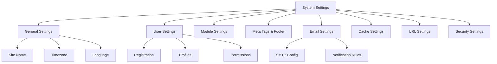

# XOOPS सिस्टम सेटिंग्स

यह मार्गदर्शिका श्रेणी के अनुसार व्यवस्थित XOOPS व्यवस्थापक पैनल में उपलब्ध संपूर्ण सिस्टम सेटिंग्स को कवर करती है।

## सिस्टम सेटिंग्स आर्किटेक्चर



## सिस्टम सेटिंग्स तक पहुँचना

### स्थान

**एडमिन पैनल > सिस्टम > प्राथमिकताएँ**

या सीधे नेविगेट करें:

```
http://your-domain.com/xoops/admin/index.php?fct=preferences
```

### अनुमति आवश्यकताएँ

- केवल प्रशासक (वेबमास्टर) ही सिस्टम सेटिंग्स तक पहुंच सकते हैं
- परिवर्तन संपूर्ण साइट को प्रभावित करते हैं
- अधिकांश परिवर्तन तुरंत प्रभावी होते हैं

## सामान्य सेटिंग्स

आपके XOOPS इंस्टॉलेशन के लिए मूलभूत कॉन्फ़िगरेशन।

### बुनियादी जानकारी

```
Site Name: [Your Site Name]
Default Description: [Brief description of your site]
Site Slogan: [Catchy slogan]
Admin Email: admin@your-domain.com
Webmaster Name: Administrator Name
Webmaster Email: admin@your-domain.com
```

### उपस्थिति सेटिंग्स

```
Default Theme: [Select theme]
Default Language: English (or preferred language)
Items Per Page: 15 (typically 10-25)
Words in Snippet: 25 (for search results)
Theme Upload Permission: Disabled (security)
```

### क्षेत्रीय सेटिंग्स

```
Default Timezone: [Your timezone]
Date Format: %Y-%m-%d (YYYY-MM-DD format)
Time Format: %H:%M:%S (HH:MM:SS format)
Daylight Saving Time: [Auto/Manual/None]
```

**समयक्षेत्र प्रारूप तालिका:**

| क्षेत्र | समय क्षेत्र | यूटीसी ऑफसेट |
|---|---|---|
| यूएस ईस्टर्न | अमेरिका/न्यूयॉर्क | -5/-4 |
| यूएस सेंट्रल | अमेरिका/शिकागो | -6/-5 |
| यूएस माउंटेन | अमेरिका/डेनवर | -7/-6 |
| यूएस प्रशांत | अमेरिका/लॉस_एंजेल्स | -8/-7 |
| यूके/लंदन | यूरोप/लंदन | 0 / +1 |
| फ़्रांस/जर्मनी | यूरोप/पेरिस | +1 / +2 |
| जापान | एशिया/टोक्यो | +9 |
| चीन | एशिया/शंघाई | +8 |
| ऑस्ट्रेलिया/सिडनी | ऑस्ट्रेलिया/सिडनी | +10 / +11 |

### खोज कॉन्फ़िगरेशन

```
Enable Search: Yes
Search Admin Pages: Yes/No
Search Archives: Yes
Default Search Type: All / Pages only
Words Excluded from Search: [Comma-separated list]
```

**सामान्य बहिष्कृत शब्द:** द, ए, एन, और, या, लेकिन, इन, ऑन, एट, बाय, टू, फ्रॉम

## उपयोगकर्ता सेटिंग्स

उपयोगकर्ता खाता व्यवहार और पंजीकरण प्रक्रिया को नियंत्रित करें।

### उपयोगकर्ता पंजीकरण

```
Allow User Registration: Yes/No
Registration Type:
  ☐ Auto-activate (Instant access)
  ☐ Admin approval (Admin must approve)
  ☐ Email verification (User must verify email)

Notification to Users: Yes/No
User Email Verification: Required/Optional
```

### नया उपयोगकर्ता कॉन्फ़िगरेशन

```
Auto-login New Users: Yes/No
Assign Default User Group: Yes
Default User Group: [Select group]
Create User Avatar: Yes/No
Initial User Avatar: [Select default]
```

### उपयोगकर्ता प्रोफ़ाइल सेटिंग्स

```
Allow User Profiles: Yes
Show Member List: Yes
Show User Statistics: Yes
Show Last Online Time: Yes
Allow User Avatar: Yes
Avatar Max File Size: 100KB
Avatar Dimensions: 100x100 pixels
```

### उपयोगकर्ता ईमेल सेटिंग्स

```
Allow Users to Hide Email: Yes
Show Email on Profile: Yes
Notification Email Interval: Immediately/Daily/Weekly/Never
```

### उपयोगकर्ता गतिविधि ट्रैकिंग

```
Track User Activity: Yes
Log User Logins: Yes
Log Failed Logins: Yes
Track IP Address: Yes
Clear Activity Logs Older Than: 90 days
```

### खाता सीमाएँ

```
Allow Duplicate Email: No
Minimum Username Length: 3 characters
Maximum Username Length: 15 characters
Minimum Password Length: 6 characters
Require Special Characters: Yes
Require Numbers: Yes
Password Expiration: 90 days (or Never)
Accounts Inactive Days to Delete: 365 days
```

## मॉड्यूल सेटिंग्स

व्यक्तिगत मॉड्यूल व्यवहार कॉन्फ़िगर करें.

### सामान्य मॉड्यूल विकल्प

प्रत्येक स्थापित मॉड्यूल के लिए, आप सेट कर सकते हैं:

```
Module Status: Active/Inactive
Display in Menu: Yes/No
Module Weight: [1-999](higher = lower in display)
Homepage Default: This module shows when visiting /
Admin Access: [Allowed user groups]
User Access: [Allowed user groups]
```

### सिस्टम मॉड्यूल सेटिंग्स

```
Show Homepage as: Portal / Module / Static Page
Default Homepage Module: [Select module]
Show Footer Menu: Yes
Footer Color: [Color selector]
Show System Stats: Yes
Show Memory Usage: Yes
```

### प्रति मॉड्यूल कॉन्फ़िगरेशन

प्रत्येक मॉड्यूल में मॉड्यूल-विशिष्ट सेटिंग्स हो सकती हैं:

**उदाहरण - पेज मॉड्यूल:**
```
Enable Comments: Yes/No
Moderate Comments: Yes/No
Comments Per Page: 10
Enable Ratings: Yes
Allow Anonymous Ratings: Yes
```

**उदाहरण - उपयोगकर्ता मॉड्यूल:**
```
Avatar Upload Folder: ./uploads/
Maximum Upload Size: 100KB
Allow File Upload: Yes
Allowed File Types: jpg, gif, png
```

एक्सेस मॉड्यूल-विशिष्ट सेटिंग्स:
- **व्यवस्थापक > मॉड्यूल > [मॉड्यूल नाम] > प्राथमिकताएँ**

## मेटा टैग और एसईओ सेटिंग्स

खोज इंजन अनुकूलन के लिए मेटा टैग कॉन्फ़िगर करें।

### ग्लोबल मेटा टैग

```
Meta Keywords: xoops, cms, content management system
Meta Description: A powerful content management system for building dynamic websites
Meta Author: Your Name
Meta Copyright: Copyright 2025, Your Company
Meta Robots: index, follow
Meta Revisit: 30 days
```

### मेटा टैग सर्वोत्तम अभ्यास

| टैग | उद्देश्य | सिफ़ारिश |
|---|---|---|
| कीवर्ड | खोज शब्द | 5-10 प्रासंगिक कीवर्ड, अल्पविराम से अलग |
| विवरण | खोज सूची | 150-160 अक्षर |
| लेखक | पेज निर्माता | आपका नाम या कंपनी |
| कॉपीराइट | कानूनी | आपका कॉपीराइट नोटिस |
| रोबोट | क्रॉलर निर्देश | अनुक्रमणिका, अनुसरण करें (अनुक्रमणिका की अनुमति दें) |

### पाद लेख सेटिंग्स

```
Show Footer: Yes
Footer Color: Dark/Light
Footer Background: [Color code]
Footer Text: [HTML allowed]
Additional Footer Links: [URL and text pairs]
```

**नमूना पाद लेख HTML:**
```html
<p>Copyright &copy; 2025 Your Company. All rights reserved.</p>
<p><a href="/privacy">Privacy Policy</a> | <a href="/terms">Terms of Use</a></p>
```

### सोशल मेटा टैग (खुला ग्राफ़)

```
Enable Open Graph: Yes
Facebook App ID: [App ID]
Twitter Card Type: summary / summary_large_image / player
Default Share Image: [Image URL]
```

## ईमेल सेटिंग्स

ईमेल वितरण और अधिसूचना प्रणाली कॉन्फ़िगर करें.

### ईमेल डिलीवरी विधि

```
Use SMTP: Yes/No

If SMTP:
  SMTP Host: smtp.gmail.com
  SMTP Port: 587 (TLS) or 465 (SSL)
  SMTP Security: TLS / SSL / None
  SMTP Username: [email@example.com]
  SMTP Password: [password]
  SMTP Authentication: Yes/No
  SMTP Timeout: 10 seconds

If PHP mail():
  Sendmail Path: /usr/sbin/sendmail -t -i
```

### ईमेल कॉन्फ़िगरेशन

```
From Address: noreply@your-domain.com
From Name: Your Site Name
Reply-To Address: support@your-domain.com
BCC Admin Emails: Yes/No
```

### अधिसूचना सेटिंग्स

```
Send Welcome Email: Yes/No
Welcome Email Subject: Welcome to [Site Name]
Welcome Email Body: [Custom message]

Send Password Reset Email: Yes/No
Include Random Password: Yes/No
Token Expiration: 24 hours
```

### व्यवस्थापक अधिसूचनाएँ

```
Notify Admin on Registration: Yes
Notify Admin on Comments: Yes
Notify Admin on Submissions: Yes
Notify Admin on Errors: Yes
```

### उपयोगकर्ता सूचनाएं

```
Notify User on Registration: Yes
Notify User on Comments: Yes
Notify User on Private Messages: Yes
Allow Users to Disable Notifications: Yes
Default Notification Frequency: Immediately
```

### ईमेल टेम्प्लेट

व्यवस्थापक पैनल में अधिसूचना ईमेल अनुकूलित करें:

**पथ:** सिस्टम > ईमेल टेम्पलेट्स

उपलब्ध टेम्पलेट:
- उपयोगकर्ता पंजीकरण
- पासवर्ड रीसेट
- टिप्पणी अधिसूचना
- निजी संदेश
- सिस्टम अलर्ट
- मॉड्यूल-विशिष्ट ईमेल

## कैश सेटिंग्स

कैशिंग के माध्यम से प्रदर्शन को अनुकूलित करें.

### कैश कॉन्फ़िगरेशन

```
Enable Caching: Yes/No
Cache Type:
  ☐ File Cache
  ☐ APCu (Alternative PHP Cache)
  ☐ Memcache (Distributed caching)
  ☐ Redis (Advanced caching)

Cache Lifetime: 3600 seconds (1 hour)
```

### प्रकार के अनुसार कैश विकल्प

**फ़ाइल कैश:**
```
Cache Directory: /var/www/html/xoops/cache/
Clear Interval: Daily
Maximum Cache Files: 1000
```

**एपीसीयू कैश:**
```
Memory Allocation: 128MB
Fragmentation Level: Low
```

**मेमकेचे/रेडिस:**
```
Server Host: localhost
Server Port: 11211 (Memcache) / 6379 (Redis)
Persistent Connection: Yes
```

### क्या कैश हो जाता है

```
Cache Module Lists: Yes
Cache Configuration Data: Yes
Cache Template Data: Yes
Cache User Session Data: Yes
Cache Search Results: Yes
Cache Database Queries: Yes
Cache RSS Feeds: Yes
Cache Images: Yes
```

## URL सेटिंग्स

URL पुनर्लेखन और फ़ॉर्मेटिंग कॉन्फ़िगर करें.

### अनुकूल URL सेटिंग्स

```
Enable Friendly URLs: Yes/No
Friendly URL Type:
  ☐ Path Info: /page/about
  ☐ Query String: /index.php?p=about

Trailing Slash: Include / Omit
URL Case: Lower case / Case sensitive
```

### URL पुनर्लेखन नियम

```
.htaccess Rules: [Display current]
Nginx Rules: [Display current if Nginx]
IIS Rules: [Display current if IIS]
```

## सुरक्षा सेटिंग्स

सुरक्षा संबंधी कॉन्फ़िगरेशन को नियंत्रित करें.### पासवर्ड सुरक्षा

```
Password Policy:
  ☐ Require uppercase letters
  ☐ Require lowercase letters
  ☐ Require numbers
  ☐ Require special characters

Minimum Password Length: 8 characters
Password Expiration: 90 days
Password History: Remember last 5 passwords
Force Password Change: On next login
```

### लॉगिन सुरक्षा

```
Lock Account After Failed Attempts: 5 attempts
Lock Duration: 15 minutes
Log All Login Attempts: Yes
Log Failed Logins: Yes
Admin Login Alert: Send email on admin login
Two-Factor Authentication: Disabled/Enabled
```

### फ़ाइल अपलोड सुरक्षा

```
Allow File Uploads: Yes/No
Maximum File Size: 128MB
Allowed File Types: jpg, gif, png, pdf, zip, doc, docx
Scan Uploads for Malware: Yes (if available)
Quarantine Suspicious Files: Yes
```

### सत्र सुरक्षा

```
Session Management: Database/Files
Session Timeout: 1800 seconds (30 min)
Session Cookie Lifetime: 0 (until browser closes)
Secure Cookie: Yes (HTTPS only)
HTTP Only Cookie: Yes (prevent JavaScript access)
```

### CORS सेटिंग्स

```
Allow Cross-Origin Requests: No
Allowed Origins: [List domains]
Allow Credentials: No
Allowed Methods: GET, POST
```

## उन्नत सेटिंग्स

उन्नत उपयोगकर्ताओं के लिए अतिरिक्त कॉन्फ़िगरेशन विकल्प।

### डिबग मोड

```
Debug Mode: Disabled/Enabled
Log Level: Error / Warning / Info / Debug
Debug Log File: /var/log/xoops_debug.log
Display Errors: Disabled (production)
```

### प्रदर्शन ट्यूनिंग

```
Optimize Database Queries: Yes
Use Query Cache: Yes
Compress Output: Yes
Minify CSS/JavaScript: Yes
Lazy Load Images: Yes
```

### सामग्री सेटिंग्स

```
Allow HTML in Posts: Yes/No
Allowed HTML Tags: [Configure]
Strip Harmful Code: Yes
Allow Embed: Yes/No
Content Moderation: Automatic/Manual
Spam Detection: Yes
```

## सेटिंग्स निर्यात/आयात

### बैकअप सेटिंग्स

वर्तमान सेटिंग्स निर्यात करें:

**एडमिन पैनल > सिस्टम > टूल्स > एक्सपोर्ट सेटिंग्स**

```bash
# Settings exported as JSON file
# Download and store securely
```

### सेटिंग्स पुनर्स्थापित करें

पहले से निर्यात की गई सेटिंग्स आयात करें:

**एडमिन पैनल > सिस्टम > टूल्स > आयात सेटिंग्स**

```bash
# Upload JSON file
# Verify changes before confirming
```

## कॉन्फ़िगरेशन पदानुक्रम

XOOPS सेटिंग्स पदानुक्रम (ऊपर से नीचे - पहला मैच जीत):

```
1. mainfile.php (Constants)
2. Module-specific config
3. Admin System Settings
4. Theme configuration
5. User preferences (for user-specific settings)
```

## सेटिंग्स बैकअप स्क्रिप्ट

वर्तमान सेटिंग्स का बैकअप बनाएं:

```php
<?php
// Backup script: /var/www/html/xoops/backup-settings.php
require_once __DIR__ . '/mainfile.php';

$config_handler = xoops_getHandler('config');
$configs = $config_handler->getConfigs();

$backup = [
    'exported_date' => date('Y-m-d H:i:s'),
    'xoops_version' => XOOPS_VERSION,
    'php_version' => PHP_VERSION,
    'settings' => []
];

foreach ($configs as $config) {
    $backup['settings'][$config->getVar('conf_name')] = [
        'value' => $config->getVar('conf_value'),
        'description' => $config->getVar('conf_desc'),
        'type' => $config->getVar('conf_type'),
    ];
}

// Save to JSON file
file_put_contents(
    '/backups/xoops_settings_' . date('YmdHis') . '.json',
    json_encode($backup, JSON_PRETTY_PRINT)
);

echo "Settings backed up successfully!";
?>
```

## सामान्य सेटिंग्स परिवर्तन

### साइट का नाम बदलें

1. एडमिन > सिस्टम > प्राथमिकताएँ > सामान्य सेटिंग्स
2. "साइट का नाम" संशोधित करें
3. "सहेजें" पर क्लिक करें

### पंजीकरण सक्षम/अक्षम करें

1. एडमिन > सिस्टम > प्राथमिकताएँ > उपयोगकर्ता सेटिंग्स
2. "उपयोगकर्ता पंजीकरण की अनुमति दें" टॉगल करें
3. पंजीकरण प्रकार चुनें
4. "सहेजें" पर क्लिक करें

### डिफ़ॉल्ट थीम बदलें

1. एडमिन > सिस्टम > प्राथमिकताएँ > सामान्य सेटिंग्स
2. "डिफ़ॉल्ट थीम" चुनें
3. "सहेजें" पर क्लिक करें
4. परिवर्तनों को प्रभावी बनाने के लिए कैश साफ़ करें

### संपर्क ईमेल अपडेट करें

1. एडमिन > सिस्टम > प्राथमिकताएँ > सामान्य सेटिंग्स
2. "व्यवस्थापक ईमेल" संशोधित करें
3. "वेबमास्टर ईमेल" को संशोधित करें
4. "सहेजें" पर क्लिक करें

## सत्यापन चेकलिस्ट

सिस्टम सेटिंग्स कॉन्फ़िगर करने के बाद, सत्यापित करें:

- [ ] साइट का नाम सही ढंग से प्रदर्शित होता है
- [ ] टाइमज़ोन सही समय दिखाता है
- [ ] ईमेल सूचनाएं ठीक से भेजी जाती हैं
- [ ] उपयोगकर्ता पंजीकरण कॉन्फ़िगर के अनुसार काम करता है
- [ ] मुखपृष्ठ चयनित डिफ़ॉल्ट प्रदर्शित करता है
- [ ] खोज कार्यक्षमता काम करती है
- [ ] कैश पेज लोड समय में सुधार करता है
- [ ] अनुकूल URL काम करते हैं (यदि सक्षम हो)
- [ ] मेटा टैग पृष्ठ स्रोत में दिखाई देते हैं
- [ ] व्यवस्थापक सूचनाएं प्राप्त हुईं
- [ ] सुरक्षा सेटिंग्स लागू की गईं

## समस्या निवारण सेटिंग्स

### सेटिंग्स सहेजी नहीं जा रही हैं

**समाधान:**
```bash
# Check file permissions on config directory
chmod 755 /var/www/html/xoops/var/

# Verify database writable
# Try saving again in admin panel
```

### परिवर्तन प्रभावी नहीं हो रहे

**समाधान:**
```bash
# Clear cache
rm -rf /var/www/html/xoops/cache/*
rm -rf /var/www/html/xoops/templates_c/*

# If still not working, restart web server
systemctl restart apache2
```

### ईमेल नहीं भेजा जा रहा है

**समाधान:**
1. ईमेल सेटिंग में SMTP क्रेडेंशियल सत्यापित करें
2. "परीक्षण ईमेल भेजें" बटन के साथ परीक्षण करें
3. त्रुटि लॉग की जाँच करें
4. SMTP के बजाय PHP mail() का उपयोग करने का प्रयास करें

## अगले चरण

सिस्टम सेटिंग्स कॉन्फ़िगरेशन के बाद:

1. सुरक्षा सेटिंग्स कॉन्फ़िगर करें
2. प्रदर्शन का अनुकूलन करें
3. व्यवस्थापक पैनल सुविधाओं का अन्वेषण करें
4. उपयोगकर्ता प्रबंधन सेट करें

---

**टैग:** #सिस्टम-सेटिंग्स #कॉन्फ़िगरेशन #प्राथमिकताएं #एडमिन-पैनल

**संबंधित लेख:**
- ../../06-प्रकाशक-मॉड्यूल/उपयोगकर्ता-गाइड/बेसिक-कॉन्फ़िगरेशन
- सुरक्षा-विन्यास
- प्रदर्शन-अनुकूलन
- ../प्रथम-चरण/एडमिन-पैनल-अवलोकन