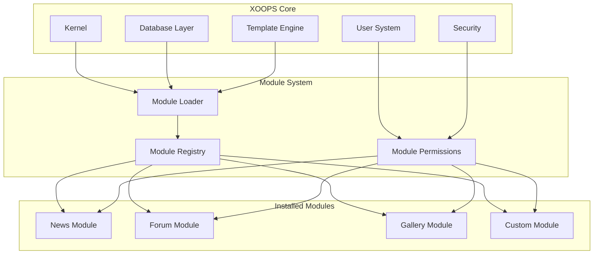
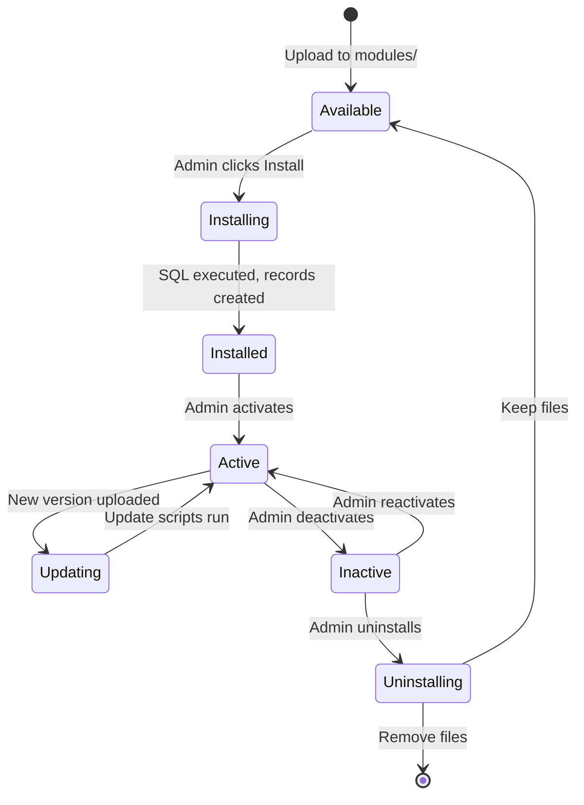

# ADR-001: मॉड्यूलर आर्किटेक्चर

>XOOPS के मूल मॉड्यूलर डिज़ाइन दर्शन के लिए आर्किटेक्चर निर्णय रिकॉर्ड।

---

## स्थिति

**स्वीकृत** - XOOPS शुरुआत से ही मूलभूत निर्णय

---

## प्रसंग

XOOPS (एक्स्टेंसिबल ऑब्जेक्ट-ओरिएंटेड पोर्टल सिस्टम) को एक आर्किटेक्चर की आवश्यकता थी जो:

1. तृतीय-पक्ष डेवलपर्स को कार्यक्षमता बढ़ाने की अनुमति दें
2. साइट प्रशासकों को बिना कोडिंग के अनुकूलित करने में सक्षम करें
3. स्वतंत्र विकास और अद्यतन का समर्थन करें
4. विभिन्न विशेषताओं के बीच अलगाव प्रदान करें
5. सरल ब्लॉग से जटिल पोर्टल तक का पैमाना

2000 के दशक की शुरुआत में सीएमएस परिदृश्य ने अखंड प्रणालियों की पेशकश की थी जिन्हें अनुकूलित करना और विस्तारित करना मुश्किल था।

---

## निर्णय आरेख



---

## फैसला

हम एक **मॉड्यूलर आर्किटेक्चर** लागू करेंगे जहां:

### 1. कोर इन्फ्रास्ट्रक्चर प्रदान करता है
- डेटाबेस अमूर्तन
- उपयोगकर्ता प्रमाणीकरण और अनुमतियाँ
- टेम्पलेट रेंडरिंग (Smarty)
- सुरक्षा उपयोगिताएँ
- फॉर्म पीढ़ी
- सामान्य उपयोगिताएँ

### 2. मॉड्यूल स्व-निहित हैं
प्रत्येक मॉड्यूल:
- इसकी अपनी निर्देशिका संरचना है
- इसमें अपनी कक्षाएं, टेम्पलेट, SQL शामिल हैं
- अपने स्वयं के विन्यास को परिभाषित करता है
- स्वतंत्र रूप से इंस्टॉल/अनइंस्टॉल किया जा सकता है
- संस्करण ट्रैकिंग है

### 3. मानक मॉड्यूल संरचना
```
modules/modulename/
├── admin/                  # Admin interface
│   ├── index.php
│   └── menu.php
├── class/                  # PHP classes
├── include/                # Include files
├── language/               # Translations
├── sql/                    # Database schema
├── templates/              # Smarty templates
├── blocks/                 # Block definitions
├── xoops_version.php       # Module manifest
├── index.php               # Entry point
└── header.php              # Module bootstrap
```

### 4. मॉड्यूल मेनिफेस्ट (xoops_version.php)
```php
<?php
$modversion['name']        = 'Module Name';
$modversion['version']     = '1.0.0';
$modversion['description'] = 'Module description';
$modversion['dirname']     = basename(__DIR__);
$modversion['hasMain']     = 1;
$modversion['hasAdmin']    = 1;
$modversion['sqlfile']['mysql'] = 'sql/mysql.sql';
$modversion['tables']      = ['modulename_table1'];
$modversion['templates']   = [...];
$modversion['config']      = [...];
$modversion['blocks']      = [...];
```

### 5. मॉड्यूल संचार
- कोर API (हैंडलर, इवेंट) के माध्यम से
- डेटाबेस संबंध
- प्रीलोड हुक
- साझा सेवाएँ

---

## मॉड्यूल जीवनचक्र



---

## परिणाम

### सकारात्मक

1. **एक्स्टेंसिबिलिटी**: समुदाय द्वारा बनाए गए हजारों मॉड्यूल
2. **स्वतंत्रता**: मॉड्यूल अलग से विकसित किए जा सकते हैं
3. **लचीलापन**: साइटें सुविधाओं का मिश्रण और मिलान कर सकती हैं
4. **रखरखाव**: अपडेट अन्य मॉड्यूल को प्रभावित नहीं करते हैं
5. **बाज़ार**: मॉड्यूल पारिस्थितिकी तंत्र उभरा
6. **सीखने की अवस्था**: डेवलपर्स एक पैटर्न सीखते हैं

### नकारात्मक

1. **ओवरहेड**: प्रत्येक मॉड्यूल की बूटस्ट्रैप लागत होती है
2. **दोहराव**: सामान्य कोड दोहराया जा सकता है
3. **एकीकरण**: क्रॉस-मॉड्यूल सुविधाओं को सावधानीपूर्वक डिजाइन की आवश्यकता होती है
4. **संस्करण**: मॉड्यूल अनुकूलता प्रबंधन की आवश्यकता
5. **गुणवत्ता भिन्नता**: तृतीय-पक्ष मॉड्यूल की गुणवत्ता भिन्न होती है

### तटस्थ

1. **डेटाबेस**: प्रत्येक मॉड्यूल अपनी तालिकाओं का प्रबंधन करता है
2. **टेम्पलेट्स**: थीम में विभिन्न मॉड्यूल शामिल होने चाहिए
3. **अपडेट**: कोर और मॉड्यूल स्वतंत्र रूप से अपडेट होते हैं

---

## विकल्पों पर विचार किया गया

### 1. अखंड वास्तुकला
**अस्वीकृत** - बहुत कठोर, अनुकूलित करना कठिन

### 2. प्लगइन आर्किटेक्चर (WordPress-style)
**आंशिक रूप से अपनाया गया** - ब्लॉक और प्रीलोड मॉड्यूल के भीतर प्लगइन-जैसे हुक प्रदान करते हैं

### 3. घटक वास्तुकला (जूमला-शैली)
**अस्वीकृत** - अधिक जटिल, कम डेवलपर-अनुकूल

### 4. माइक्रोसर्विसेज
**लागू नहीं** - साझा होस्टिंग युग के लिए बहुत जटिल

---

##संबंधित निर्णय

- ADR-002: ऑब्जेक्ट-ओरिएंटेड डेटाबेस एक्सेस
- ADR-003: Smarty टेम्पलेट इंजन
- ADR-005: अनुमति प्रणाली

---

## सन्दर्भ

- XOOPS प्रोजेक्ट इतिहास
- PHP एप्लीकेशन आर्किटेक्चर पैटर्न
- सीएमएस तुलना अध्ययन (2001-2005)

---

#xoops #आर्किटेक्चर #adr #मॉड्यूल #डिज़ाइन-निर्णय