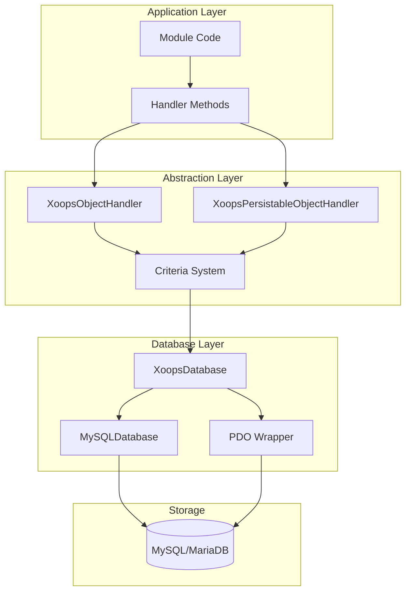
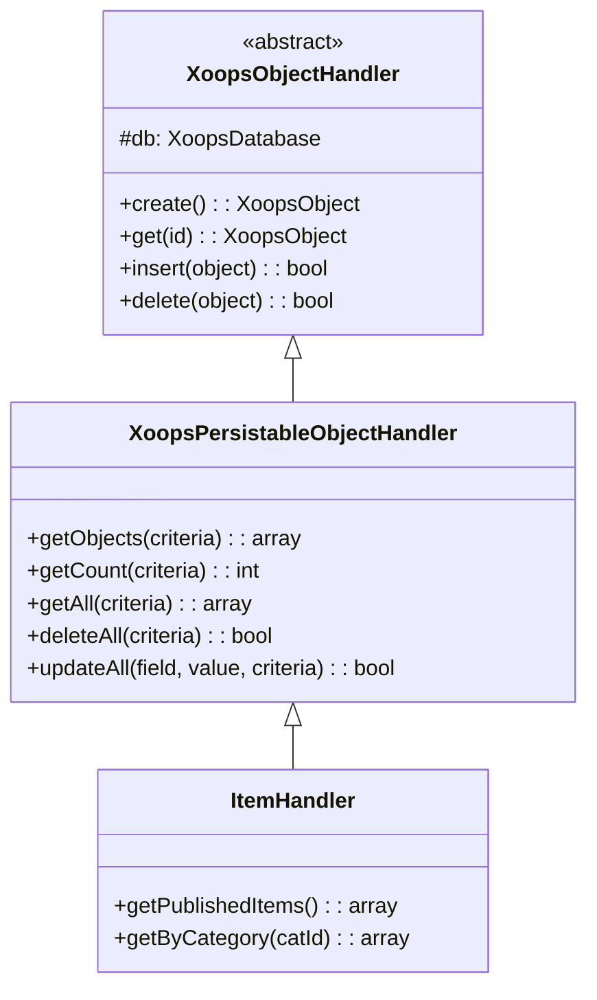
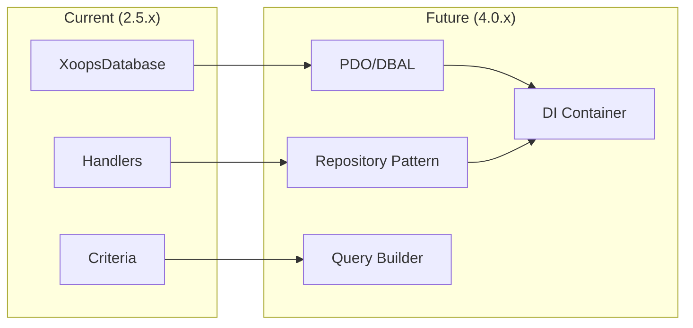

# ADR-002: डेटाबेस एब्स्ट्रैक्शन

> XOOPS के ऑब्जेक्ट-ओरिएंटेड डेटाबेस एक्सेस पैटर्न के लिए आर्किटेक्चर निर्णय रिकॉर्ड।

---

## स्थिति

**स्वीकृत** - XOOPS 2.0 के बाद से कोर पैटर्न

---

## प्रसंग

XOOPS को एक डेटाबेस इंटरेक्शन रणनीति की आवश्यकता है जो:

1. डेटाबेस-विशिष्ट SQL सिंटैक्स का सार निकालें
2. सभी मॉड्यूल में लगातार CRUD संचालन प्रदान करें
3. स्वचालित डेटा सैनिटाइजेशन और एस्केपिंग सक्षम करें
4. भविष्य के डेटाबेस इंजन परिवर्तनों का समर्थन करें
5. डेवलपर्स के लिए सामान्य संचालन को सरल बनाएं

विकल्प थे:
- पूरे कोडबेस में रॉ SQL
- पूर्ण ORM (सिद्धांत, सुवक्ता)
- कस्टम हल्का अमूर्तन

---

## निर्णय आरेख



---

## फैसला

हम इसके साथ **हैंडलर पैटर्न** लागू करेंगे:

### 1. XoopsObject - डेटा कंटेनर

प्रत्येक डेटा इकाई XoopsObject तक विस्तारित होती है:

```php
class Item extends XoopsObject
{
    public function __construct()
    {
        $this->initVar('id', XOBJ_DTYPE_INT, null, false);
        $this->initVar('title', XOBJ_DTYPE_TXTBOX, '', true, 255);
        $this->initVar('content', XOBJ_DTYPE_TXTAREA, '', false);
        $this->initVar('status', XOBJ_DTYPE_INT, 0, false);
    }
}
```

### 2. हैंडलर - संचालन प्रबंधक

प्रत्येक ऑब्जेक्ट में एक संगत हैंडलर होता है:

```php
class ItemHandler extends XoopsPersistableObjectHandler
{
    public function __construct($db)
    {
        parent::__construct($db, 'mymodule_items', Item::class, 'id', 'title');
    }

    // CRUD methods inherited:
    // - create(), get(), insert(), delete()
    // - getObjects(), getCount(), getAll()
}
```

### 3. Criteria - क्वेरी बिल्डर

वस्तु-उन्मुख क्वेरी स्थितियाँ:

```php
$criteria = new CriteriaCompo();
$criteria->add(new Criteria('status', 1));
$criteria->add(new Criteria('created', time() - 86400, '>='));
$criteria->setSort('created');
$criteria->setOrder('DESC');
$criteria->setLimit(10);

$items = $handler->getObjects($criteria);
```

---

## डेटा प्रकार स्थिरांक

```php
// Variable types with automatic sanitization
XOBJ_DTYPE_INT       // Integer
XOBJ_DTYPE_TXTBOX    // Single-line text (escaped)
XOBJ_DTYPE_TXTAREA   // Multi-line text (escaped)
XOBJ_DTYPE_EMAIL     // Email validation
XOBJ_DTYPE_URL       // URL validation
XOBJ_DTYPE_ARRAY     // Serialized array
XOBJ_DTYPE_OTHER     // No processing
XOBJ_DTYPE_FLOAT     // Floating point
```

---

## हैंडलर विरासत



---

## परिणाम

### सकारात्मक

1. **संगति**: सभी मॉड्यूल समान पैटर्न का उपयोग करते हैं
2. **सुरक्षा**: स्वचालित एस्केपिंग SQL इंजेक्शन को रोकता है
3. **सरलता**: सामान्य संचालन के लिए न्यूनतम कोड की आवश्यकता होती है
4. **रखरखाव**: डेटाबेस परत में परिवर्तन मॉड्यूल को प्रभावित नहीं करते हैं
5. **परीक्षणशीलता**: परीक्षण के लिए हैंडलर का मज़ाक उड़ाया जा सकता है

### नकारात्मक

1. **प्रदर्शन**: अतिरिक्त अमूर्तता ओवरहेड
2. **जटिलता**: नए डेवलपर्स के लिए सीखने की अवस्था
3. **सीमाएँ**: जटिल प्रश्नों के लिए कच्चे SQL की आवश्यकता हो सकती है
4. **एन+1 समस्या**: कोई अंतर्निहित उत्सुक लोडिंग नहीं

### शमन

- **प्रदर्शन**: बार-बार एक्सेस की गई वस्तुओं को कैश करें
- **जटिल प्रश्न**: जरूरत पड़ने पर कच्चे SQL की अनुमति दें
- **N+1**: उचित मानदंड के साथ getAll() का उपयोग करें

---

## विकास XOOPS 4.0 तक



XOOPS 4.0 योजनाएं:
- डेटाबेस अमूर्तन के लिए सिद्धांत DBAL
- रिपॉजिटरी पैटर्न हैंडलर की जगह ले रहा है
- जटिल प्रश्नों के लिए क्वेरी बिल्डर
- पूर्ण PSR-11 कंटेनर एकीकरण

---

## कोड उदाहरण

### बेसिक CRUD

```php
$helper = Helper::getInstance();
$handler = $helper->getHandler('Item');

// Create
$item = $handler->create();
$item->setVar('title', 'New Item');
$handler->insert($item);

// Read
$item = $handler->get($id);
$title = $item->getVar('title');

// Update
$item->setVar('title', 'Updated Title');
$handler->insert($item);

// Delete
$handler->delete($item);
```

### जटिल प्रश्न

```php
$criteria = new CriteriaCompo();
$criteria->add(new Criteria('status', 'published'));
$criteria->add(new Criteria('category_id', '(1,2,3)', 'IN'));
$criteria->add(new Criteria('created', strtotime('-30 days'), '>='));
$criteria->setSort('views');
$criteria->setOrder('DESC');
$criteria->setLimit(10);
$criteria->setStart(0);

$items = $handler->getObjects($criteria);
$total = $handler->getCount($criteria);
```

---

##संबंधित निर्णय

- ADR-001: मॉड्यूलर आर्किटेक्चर
- ADR-003: Smarty टेम्पलेट इंजन

---

## सन्दर्भ

- मार्टिन फाउलर - एंटरप्राइज एप्लिकेशन आर्किटेक्चर के पैटर्न
- डोमेन-संचालित डिज़ाइन अवधारणाएँ
- सक्रिय रिकॉर्ड बनाम डेटा मैपर पैटर्न

---

#xoops #आर्किटेक्चर #adr #डेटाबेस #हैंडलर #डिज़ाइन-निर्णय