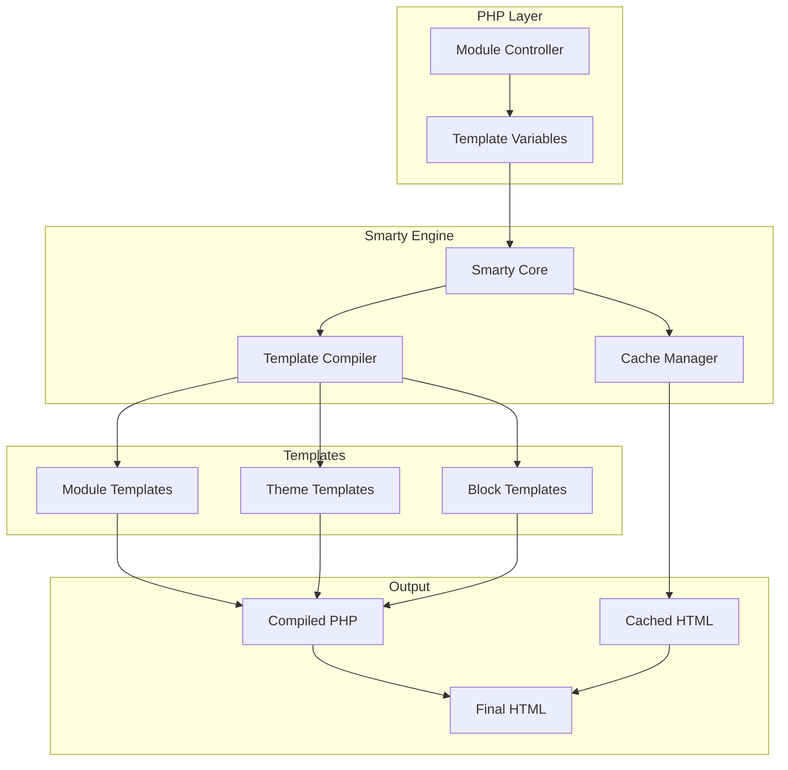
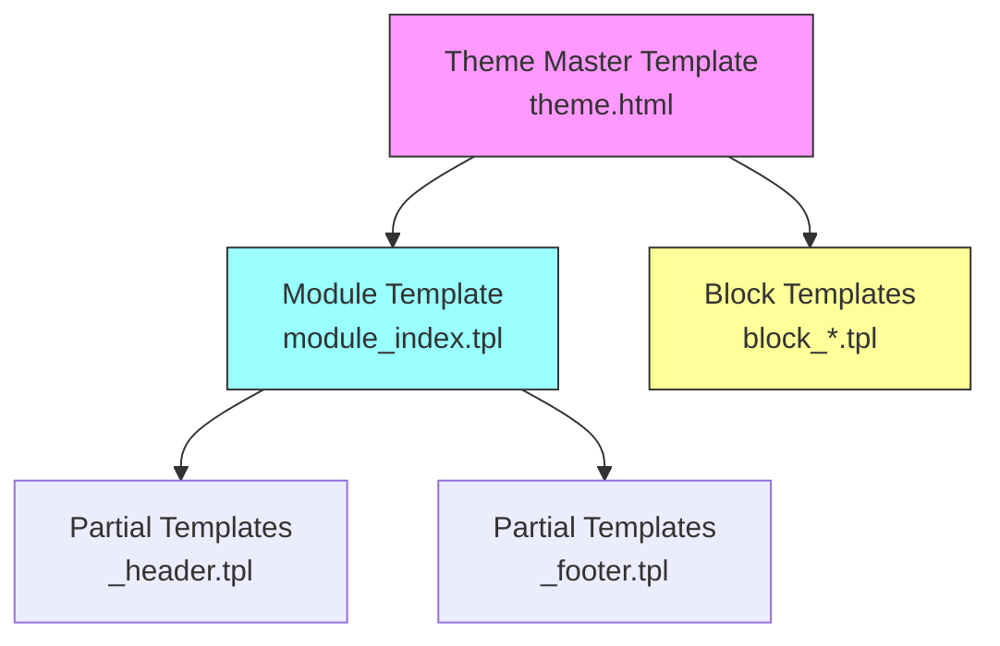
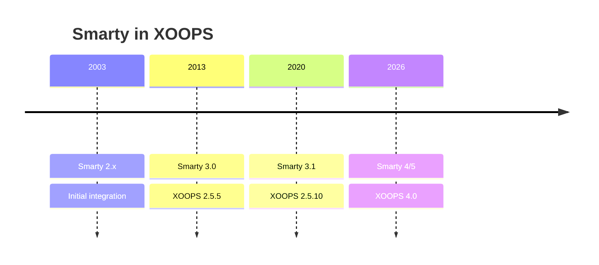

# ADR-003: टेम्पलेट इंजन (Smarty)

> XOOPS द्वारा Smarty टेम्पलेट इंजन को अपनाने के लिए आर्किटेक्चर निर्णय रिकॉर्ड।

---

## स्थिति

**स्वीकृत** - XOOPS 2.0 के बाद से मुख्य निर्णय

**विकसित हो रहा है** - XOOPS 4.0 के लिए Smarty 4/5 पर माइग्रेशन की योजना बनाई गई है

---

## प्रसंग

XOOPS को एक टेम्प्लेटिंग समाधान की आवश्यकता है जो:

1. प्रस्तुतिकरण को व्यावसायिक तर्क से अलग करें
2. थीम डिजाइनरों को PHP ज्ञान के बिना काम करने की अनुमति दें
3. समर्थन टेम्पलेट विरासत और शामिल हैं
4. प्रदर्शन के लिए कैशिंग प्रदान करें
5. उपयोगकर्ता-अनुकूलन योग्य टेम्पलेट सक्षम करें
6. अंतर्राष्ट्रीयकरण का समर्थन करें

---

## निर्णय आरेख



---

## फैसला

हम टेम्पलेट इंजन के रूप में **Smarty** का उपयोग करेंगे क्योंकि:

### 1. चिंताओं का पृथक्करण

```php
// PHP (Controller) - Business logic
$items = $itemHandler->getPublishedItems();
$xoopsTpl->assign('items', $items);

// Smarty (View) - Presentation
// templates/items.tpl
```

```smarty
{* Smarty template - No PHP logic *}
<{foreach item=item from=$items}>
    <article>
        <h2><{$item.title}></h2>
        <p><{$item.summary}></p>
    </article>
<{/foreach}>
```

### 2. XOOPS डिलीमीटर

XOOPS मानक `{` `}` के बजाय `<{` और `}>` का उपयोग करता है:

```smarty
{* Standard Smarty *}
{$variable}

{* XOOPS Smarty - Avoids JavaScript conflicts *}
<{$variable}>
```

### 3. टेम्पलेट पदानुक्रम



### 4. टेम्पलेट संग्रहण

- **डेटाबेस**: रिवर्ट क्षमता के लिए संग्रहीत अनुकूलित टेम्पलेट
- **फ़ाइल सिस्टम**: मॉड्यूल निर्देशिकाओं में मूल टेम्पलेट
- **कैश**: प्रदर्शन के लिए संकलित टेम्पलेट

---

## Smarty कॉन्फ़िगरेशन

```php
// XOOPS Smarty initialization
$xoopsTpl = new XoopsTpl();

// Custom delimiters
$xoopsTpl->left_delim = '<{';
$xoopsTpl->right_delim = '}>';

// Caching
$xoopsTpl->caching = XOOPS_TEMPLATE_CACHE;
$xoopsTpl->cache_lifetime = 3600;

// Security
$xoopsTpl->security_policy = new Smarty_Security($xoopsTpl);
$xoopsTpl->security_policy->php_functions = [];
$xoopsTpl->security_policy->php_modifiers = ['escape', 'count'];
```

---

## प्रयुक्त टेम्प्लेट सुविधाएँ

### चर

```smarty
{* Simple variable *}
<{$title}>

{* Object property *}
<{$item.title}>

{* With modifier *}
<{$content|truncate:200:'...'}>

{* Escaped output *}
<{$userInput|escape:'html'}>
```

### नियंत्रण संरचनाएँ

```smarty
{* Conditional *}
<{if $isAdmin}>
    <a href="admin.php">Admin</a>
<{elseif $isUser}>
    <a href="profile.php">Profile</a>
<{else}>
    <a href="login.php">Login</a>
<{/if}>

{* Loop *}
<{foreach item=item from=$items name=itemloop}>
    <{$smarty.foreach.itemloop.index}>: <{$item.title}>
<{/foreach}>
```

### शामिल है

```smarty
{* Include another template *}
<{include file="db:mymodule_header.tpl"}>

{* Include with variables *}
<{include file="db:mymodule_item.tpl" item=$currentItem}>

{* Include from theme *}
<{include file="file:$theme_path/partials/sidebar.tpl"}>
```

---

## परिणाम

### सकारात्मक

1. **डिज़ाइनर-अनुकूल**: HTML-जैसा वाक्यविन्यास
2. **कैशिंग**: अंतर्निहित टेम्पलेट कैशिंग
3. **सुरक्षा**: PHP कोड अलगाव
4. **लचीलापन**: संशोधक, फ़ंक्शन, प्लगइन्स
5. **अनुकूलन**: उपयोगकर्ता टेम्पलेट्स को संशोधित कर सकते हैं
6. **समुदाय**: बड़ा Smarty पारिस्थितिकी तंत्र

### नकारात्मक

1. **सीखने की अवस्था**: Smarty-विशिष्ट वाक्यविन्यास
2. **ओवरहेड**: संकलन चरण आवश्यक
3. **डीबगिंग**: टेम्प्लेट त्रुटियाँ गुप्त हो सकती हैं
4. **संस्करण मुद्दे**: संस्करणों के बीच परिवर्तन को तोड़ना

### शमन

- **सीखना**: व्यापक दस्तावेज़ीकरण
- **प्रदर्शन**: आक्रामक कैशिंग
- **डीबगिंग**: डीबग कंसोल, त्रुटि संदेश साफ़ करें
- **संस्करण**: XOOPS में संगतता परत

---

## संस्करण इतिहास



---

## माइग्रेशन: Smarty 3 से 4/5

### परिवर्तन तोड़ना

```smarty
{* Smarty 3 - Deprecated *}
<{php}>echo date('Y');<{/php}>

{* Smarty 4+ - Use modifiers or assign from PHP *}
<{$current_year}>

{* Smarty 3 - {section} deprecated *}
<{section name=i loop=$items}>
    <{$items[i].title}>
<{/section}>

{* Smarty 4+ - Use {foreach} *}
<{foreach $items as $item}>
    <{$item.title}>
<{/foreach}>
```

### अनुकूलता परत

XOOPS सुचारू बदलाव के लिए एक अनुकूलता परत प्रदान करता है:

```php
// XoopsTpl extends Smarty with compatibility methods
class XoopsTpl extends Smarty
{
    public function assign($tpl_var, $value = null)
    {
        // Handles both Smarty 3 and 4 syntax
        return parent::assign($tpl_var, $value);
    }
}
```

---

## विकल्पों पर विचार किया गया

### 1. टहनी
**पेशेवर**: आधुनिक, सिम्फनी पारिस्थितिकी तंत्र
**विपक्ष**: भिन्न वाक्यविन्यास, माइग्रेशन प्रयास
**निर्णय**: XOOPS 3.x के लिए संभावित भविष्य विकल्प

### 2. ब्लेड (लारवेल)
**पेशेवर**: स्वच्छ वाक्यविन्यास, लोकप्रिय
**विपक्ष**: लारवेल-विशिष्ट
**निर्णय**: अकेले उपयोग के लिए उपयुक्त नहीं है

### 3. मूल PHP टेम्पलेट्स
**पेशेवर**: कोई सीखने की अवस्था नहीं, तेज़
**नुकसान**: सुरक्षा जोखिम, कोई अलगाव नहीं
**निर्णय**: रखरखाव के कारण अस्वीकृत

---

##संबंधित निर्णय

- ADR-001: मॉड्यूलर आर्किटेक्चर
- ADR-002: डेटाबेस एब्स्ट्रैक्शन

---

## सन्दर्भ

- Smarty दस्तावेज़ीकरण: https://www.smarty.net/docs/en/
- XOOPS टेम्पलेट सिस्टम गाइड
- वेब अनुप्रयोगों में एमवीसी पैटर्न

---

#xoops #आर्किटेक्चर #adr #smarty #टेम्पलेट्स #डिज़ाइन-निर्णय