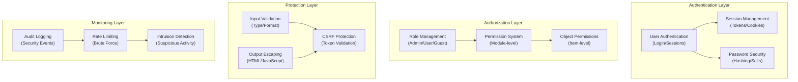

# ADR-004: सुरक्षा प्रणाली वास्तुकला

> आधुनिक खतरों से बचाने के लिए XOOPS सीएमएस के लिए व्यापक सुरक्षा वास्तुकला।

---

## स्थिति

**स्वीकृत** - XOOPS 2.5 के बाद से मुख्य सुरक्षा परत

---

## प्रसंग

### समस्या कथन

XOOPS को एक मजबूत सुरक्षा प्रणाली की आवश्यकता है:

1. **सामान्य वेब कमजोरियों से बचाता है** (OWASP टॉप 10)
2. **मॉड्यूल में विस्तृत अनुमति नियंत्रण** प्रदान करता है
3. **आधुनिक मानकों के साथ सुरक्षित उपयोगकर्ता प्रमाणीकरण सक्षम करता है**
4. **डेटा उल्लंघनों** और अनधिकृत पहुंच को रोकता है
5. **बहु-स्तरीय अभिगम नियंत्रण का समर्थन करता है** (व्यवस्थापक, मॉडरेटर, उपयोगकर्ता, अतिथि)
6. **सभी मॉड्यूल के साथ निर्बाध रूप से एकीकृत**

### वर्तमान खतरे

आधुनिक वेब हमलों में शामिल हैं:

- **SQL इंजेक्शन** - उपयोगकर्ता इनपुट में दुर्भावनापूर्ण SQL
- **XSS (क्रॉस-साइट स्क्रिप्टिंग)** - पेजों में JavaScript इंजेक्ट किया गया
- **CSRF (क्रॉस-साइट अनुरोध जालसाजी)** - अनधिकृत फॉर्म सबमिशन
- **प्रमाणीकरण बाईपास** - कमजोर सत्र/पासवर्ड प्रबंधन
- **प्राधिकरण बाईपास** - विशेषाधिकार वृद्धि
- **डेटा एक्सपोज़र** - URL, लॉग या कैश में संवेदनशील डेटा

### XOOPS सुरक्षा आवश्यकताएँ

1. उपयोगकर्ता प्रमाणीकरण और सत्र प्रबंधन
2. भूमिका-आधारित अभिगम नियंत्रण (RBAC)
3. मॉड्यूल और ऑब्जेक्ट के लिए अनुमति प्रणाली
4. इनपुट सत्यापन और आउटपुट एस्केपिंग
5. आम हमलों से सुरक्षा
6. सुरक्षा घटनाओं की ऑडिट लॉगिंग
7. सुरक्षित पासवर्ड प्रबंधन
8. CSRF टोकन सुरक्षा

---

## फैसला

### कोर सुरक्षा वास्तुकला



---

## सुरक्षा घटक

### 1. प्रमाणीकरण प्रणाली

**उपयोगकर्ता लॉगिन प्रक्रिया:**

```php
<?php
// 1. Validate credentials
$user = $userHandler->findByLogin($username);
if (!$user || !password_verify($password, $user->getVar('pass'))) {
    throw new AuthenticationException('Invalid credentials');
}

// 2. Check if account is active
if (!$user->getVar('uactive')) {
    throw new AuthenticationException('Account inactive');
}

// 3. Create secure session
session_regenerate_id(true);
$_SESSION['uid'] = $user->getVar('uid');
$_SESSION['token'] = bin2hex(random_bytes(32));
$_SESSION['created'] = time();

// 4. Log the login
$this->auditLog('USER_LOGIN', $user->getVar('uid'));
```

**पासवर्ड सुरक्षा:**

```php
<?php
// Use password_hash (not MD5 or SHA1)
$hashed = password_hash($password, PASSWORD_BCRYPT, [
    'cost' => 12, // High cost = slow brute force
]);

// Verify password
if (!password_verify($inputPassword, $hashed)) {
    throw new Exception('Invalid password');
}

// Rehash if algorithm or cost changed
if (password_needs_rehash($hashed, PASSWORD_BCRYPT, ['cost' => 12])) {
    $newHash = password_hash($password, PASSWORD_BCRYPT, ['cost' => 12]);
    $user->setVar('pass', $newHash);
    $userHandler->insert($user);
}
```

### 2. सत्र प्रबंधन

**सुरक्षित सत्र प्रबंधन:**

```php
<?php
// Session configuration
ini_set('session.cookie_httponly', true);  // No JS access
ini_set('session.cookie_secure', true);     // HTTPS only
ini_set('session.cookie_samesite', 'Strict'); // CSRF protection
ini_set('session.gc_maxlifetime', 3600);   // 1 hour timeout
ini_set('session.sid_length', 64);         // 64-char session ID

// Validate session
function validateSession() {
    // Check timeout
    if (time() - $_SESSION['created'] > 3600) {
        session_destroy();
        throw new SessionExpiredException();
    }

    // Validate user agent (prevent session hijacking)
    if ($_SESSION['user_agent'] !== $_SERVER['HTTP_USER_AGENT']) {
        throw new SessionInvalidException();
    }

    // Validate IP (optional, can be too strict)
    if (!in_array($_SERVER['REMOTE_ADDR'], $_SESSION['ips'])) {
        $_SESSION['ips'][] = $_SERVER['REMOTE_ADDR'];
    }
}
```

### 3. प्राधिकरण (RBAC)

**भूमिका-आधारित अभिगम नियंत्रण:**

```php
<?php
class XoopsUser {
    public function hasPermission(string $permissionName): bool
    {
        // Get user groups
        $groups = $this->getGroups();

        // Check if any group has permission
        foreach ($groups as $groupId) {
            if ($this->checkGroupPermission($groupId, $permissionName)) {
                return true;
            }
        }

        return false;
    }

    /**
     * User groups and their permissions
     * Admin: Full access
     * Moderator: Content management
     * User: Create own content
     * Guest: Read-only access
     */
    private function checkGroupPermission(int $groupId, string $permission): bool
    {
        $permissions = [
            1 => ['admin_access'],                 // Admin group
            2 => ['moderate_content', 'edit_own'], // Moderator group
            3 => ['create_content', 'edit_own'],   // User group
            4 => [],                               // Guest group (no permissions)
        ];

        return in_array($permission, $permissions[$groupId] ?? []);
    }
}
```

### 4. इनपुट सत्यापन

**SQL इंजेक्शन और प्रकार की त्रुटियों को रोकें:**

```php
<?php
// Always use prepared statements
$sql = 'SELECT * FROM users WHERE id = ?';
$result = $db->query($sql, [$userId]); // ✅ Safe

// Input validation
function validateUserInput(array $data): array
{
    return [
        'email' => filter_var($data['email'] ?? '', FILTER_VALIDATE_EMAIL),
        'age' => filter_var($data['age'] ?? 0, FILTER_VALIDATE_INT),
        'website' => filter_var($data['website'] ?? '', FILTER_VALIDATE_URL),
        'title' => substr(trim($data['title'] ?? ''), 0, 255),
    ];
}

// XOOPS Safe Input class
$safe = \Xmf\Request::getHtmlRequest('var_name', '');
$int = \Xmf\Request::getInt('page', 1);
```

### 5. आउटपुट एस्केपिंग

**XSS हमलों को रोकें:**

```php
<?php
// In PHP templates
echo htmlspecialchars($userInput, ENT_QUOTES, 'UTF-8');

// In Smarty templates (automatic escaping)
<{$user_input}>  {* Escaped by default *}
<{$html|escape:false}>  {* Only when needed *}

// JavaScript context
<script>
var message = "<{$userMessage|escape:'javascript'}>";
</script>

// URL context
<a href="<{$url|escape:'url'}>">Link</a>
```

### 6. CSRF सुरक्षा

**क्रॉस-साइट अनुरोध जालसाजी रोकथाम:**

```php
<?php
// Generate CSRF token
session_start();
if (empty($_SESSION['csrf_token'])) {
    $_SESSION['csrf_token'] = bin2hex(random_bytes(32));
}

// In forms
<form method="POST">
    <input type="hidden" name="csrf_token" value="<{$csrf_token}>">
    <button type="submit">Submit</button>
</form>

// Validate token
if ($_SERVER['REQUEST_METHOD'] === 'POST') {
    if (hash_equals($_SESSION['csrf_token'], $_POST['csrf_token'] ?? '')) {
        // Process form
    } else {
        throw new InvalidTokenException('CSRF token invalid');
    }
}
```

---

## परिणाम

### सकारात्मक प्रभाव

1. **व्यापक सुरक्षा** - प्रमुख भेद्यता वर्गों को कवर करता है
2. **स्तरित सुरक्षा** - रक्षा की कई परतें
3. **लचीला RBAC** - सूक्ष्म अनुमति नियंत्रण
4. **ऑडिट ट्रेल** - सुरक्षा घटनाओं को ट्रैक करें
5. **उद्योग मानक** - OWASP अनुशंसाओं के अनुरूप
6. **मॉड्यूल एकीकरण** - मॉड्यूल के लिए सुरक्षा API का उपयोग करना आसान है

### नकारात्मक प्रभाव

1. **जटिलता** - अधिक कोड और कॉन्फ़िगरेशन की आवश्यकता है
2. **प्रदर्शन** - हैशिंग और सत्यापन ओवरहेड जोड़ते हैं
3. **उपयोगकर्ता अनुभव** - सुरक्षा कभी-कभी असुविधाजनक होती है
4. **रखरखाव** - निरंतर सुरक्षा अद्यतन की आवश्यकता है
5. **प्रशिक्षण आवश्यक** - डेवलपर्स को प्रथाओं का पालन करना चाहिए

### जोखिम और शमन

| जोखिम | गंभीरता | शमन |
|------|----------|-----------|
| डेवलपर सुरक्षा पर ध्यान नहीं देता | उच्च | कोड समीक्षा, सुरक्षा प्रशिक्षण |
| नई कमजोरियाँ खोजी गईं | मध्यम | नियमित सुरक्षा ऑडिट, अपडेट |
| प्रदर्शन प्रभाव | निम्न | हॉट पाथ, कैशिंग को अनुकूलित करें |
| अत्यधिक जटिल अनुमतियाँ | मध्यम | स्पष्ट दस्तावेज़ीकरण, उदाहरण |

---

## सुरक्षा सर्वोत्तम प्रथाएँ

### मॉड्यूल डेवलपर्स के लिए

```php
<?php
// ✅ DO: Use prepared statements
$result = $db->prepare('SELECT * FROM table WHERE id = ?')->execute([$id]);

// ❌ DON'T: Concatenate queries
$result = $db->query("SELECT * FROM table WHERE id = $id");

// ✅ DO: Escape output
echo htmlspecialchars($user_input, ENT_QUOTES, 'UTF-8');

// ❌ DON'T: Output raw user data
echo $user_input;

// ✅ DO: Check permissions
if (!$user->hasPermission('edit_content')) {
    throw new PermissionException();
}

// ❌ DON'T: Trust user roles directly
if ($_POST['is_admin']) {
    // Make user admin - SECURITY HOLE!
}

// ✅ DO: Validate input types
$page = (int)$_GET['page'];

// ❌ DON'T: Use untrusted values directly
$sql .= " LIMIT " . $_GET['limit'];
```

---

## विकल्पों पर विचार किया गया

### OAuth/OpenID कनेक्ट करें

**शुरुआत में क्यों नहीं चुना गया:** साझा होस्टिंग वातावरण के लिए बहुत जटिल, लेकिन बाहरी प्रमाणीकरण प्रणालियों के साथ भविष्य के एकीकरण के लिए अच्छा है।

### दो-कारक प्रमाणीकरण (2एफए)

**स्थिति:** विस्तार के रूप में स्वीकृत, मुख्य आवश्यकता नहीं, ADR-006 देखें

### HTTP-केवल सत्र कुकीज़**स्थिति:** कार्यान्वित - सत्र डेटा तक JavaScript पहुंच को रोकता है

---

##संबंधित निर्णय

- ADR-001: मॉड्यूलर आर्किटेक्चर - मॉड्यूल सुरक्षा लागू करते हैं
- ADR-005: मॉड्यूल अनुमति प्रणाली
- ADR-006: दो-कारक प्रमाणीकरण (भविष्य)

---

## सन्दर्भ

### सुरक्षा मानक

- [OWASP शीर्ष 10](https://owasp.org/www-project-top-ten/)
- [NIST साइबर सुरक्षा फ्रेमवर्क](https://www.nist.gov/cyberframework)
- [सीडब्ल्यूई टॉप 25](@@00012@@)

### PHP सुरक्षा

- [PHP सुरक्षा मैनुअल](https://www.php.net/manual/en/security.php)
- [password_hash() दस्तावेज़ीकरण](https://www.php.net/manual/en/function.password-hash.php)
- [सत्र सुरक्षा](https://www.php.net/manual/en/session.security.php)

### उपकरण

- [OWASP ZAP](https://www.zaproxy.org/) - सुरक्षा परीक्षण
- [स्निक](https://snyk.io/) - भेद्यता स्कैनिंग
- [SonarQube]https://www.sonarqube.org/) - कोड गुणवत्ता

---

## कार्यान्वयन चेकलिस्ट

- [ ] उपयोगकर्ता प्रमाणीकरण प्रणाली
- [ ] सत्र प्रबंधन
- [ ] पासवर्ड हैशिंग (बीक्रिप्ट)
- [ ] भूमिका-आधारित अभिगम नियंत्रण
- [ ] मॉड्यूल अनुमतियाँ
- [ ] इनपुट सत्यापन ढांचा
- [ ] आउटपुट एस्केपिंग (PHP + Smarty)
- [ ] CSRF टोकन सुरक्षा
- [ ] सुरक्षा ऑडिट लॉगिंग
- [ ] दर सीमित करना
- [ ] सुरक्षा शीर्षलेख

---

## संस्करण इतिहास

| संस्करण | दिनांक | परिवर्तन |
|------|------|------|
| 1.0.0 | 2024-01-28 | प्रारंभिक दस्तावेज़ |

---

#xoops #adr #सुरक्षा #वास्तुकला #प्रमाणीकरण #प्राधिकरण #rbac