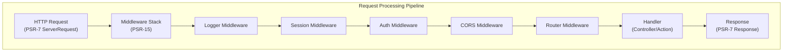

# ADR-005: XOOPS 4.0 के लिए PSR-15 मिडलवेयर पैटर्न

> बेहतर अनुरोध प्रसंस्करण पाइपलाइन के लिए PSR-15 HTTP सर्वर अनुरोध हैंडलर (मिडलवेयर) को अपनाएं।

:::सावधानी[XOOPS 4.0 प्रस्ताव — 2.5.x में उपलब्ध नहीं]
यह एडीआर XOOPS 4.0** के लिए **प्रस्तावित आर्किटेक्चर का वर्णन करता है। PSR-15 मिडलवेयर **XOOPS 2.5.x** में उपलब्ध नहीं है। वर्तमान 2.5.x मॉड्यूल `mainfile.php` बूटस्ट्रैप के साथ पेज कंट्रोलर पैटर्न का उपयोग करते हैं। वर्तमान अनुरोध जीवनचक्र के लिए XOOPS आर्किटेक्चर देखें।
:::

---

## स्थिति

**प्रस्तावित** - XOOPS 4.0 रिलीज़ के लिए मूल्यांकनाधीन

---

## प्रसंग

### वर्तमान दृष्टिकोण

XOOPS 2.5 एक अखंड अनुरोध प्रबंधन दृष्टिकोण का उपयोग करता है:

```php
// Current: Sequential processing
require_once 'mainfile.php';
// → Kernel initialization
// → User authentication
// → Module loading
// → Page rendering

// All in one flow, mixed concerns
```

### वर्तमान दृष्टिकोण की समस्याएँ

1. **मिश्रित चिंताएँ** - प्रमाणीकरण, लॉगिंग, रूटिंग सभी आपस में जुड़े हुए हैं
2. **परीक्षण करना कठिन** - व्यक्तिगत अनुरोध प्रसंस्करण चरणों का इकाई परीक्षण करना कठिन
3. **विस्तार करना कठिन** - मॉड्यूल केवल प्रीलोड/ईवेंट के माध्यम से हुक कर सकते हैं
4. **खराब पृथक्करण** - अनुरोध प्रसंस्करण तर्क पूरे कोडबेस में बिखरा हुआ है
5. **कंपोज़ेबल नहीं** - प्रसंस्करण चरणों को आसानी से श्रृंखलाबद्ध या पुन: व्यवस्थित नहीं किया जा सकता

### PSR-15 मिडलवेयर क्या है?

PSR-15 HTTP मिडलवेयर के लिए एक मानक इंटरफ़ेस को परिभाषित करता है:

```php
<?php
interface RequestHandlerInterface {
    public function handle(ServerRequestInterface $request): ResponseInterface;
}

interface MiddlewareInterface {
    public function process(
        ServerRequestInterface $request,
        RequestHandlerInterface $handler
    ): ResponseInterface;
}
```

**मिडिलवेयर श्रृंखला:**

```
Request
  ↓
[Logger] → logs request
  ↓
[Auth] → validates user session
  ↓
[CORS] → checks cross-origin
  ↓
[Router] → dispatches to handler
  ↓
[Handler] → generates response
  ↓
Response
```

---

## फैसला

### XOOPS 4.0 के लिए PSR-15 मिडलवेयर स्टैक अपनाएं

PSR-15 मानक का पालन करते हुए एक मिडलवेयर-आधारित अनुरोध प्रसंस्करण पाइपलाइन लागू करें।

### वास्तुकला अवलोकन



### कोर मिडलवेयर घटक

#### 1. एप्लीकेशन मिडलवेयर (कोर लेयर)

```php
<?php
declare(strict_types=1);

namespace XoopsCore;

use Psr\Http\Message\ResponseInterface;
use Psr\Http\Message\ServerRequestInterface;
use Psr\Http\Server\MiddlewareInterface;
use Psr\Http\Server\RequestHandlerInterface;

class SessionMiddleware implements MiddlewareInterface
{
    public function process(
        ServerRequestInterface $request,
        RequestHandlerInterface $handler
    ): ResponseInterface {
        // 1. Retrieve session (or start new)
        $sessionId = $request->getCookieParams()['PHPSESSID'] ?? null;
        $session = $this->sessionManager->load($sessionId);

        // 2. Attach session to request
        $request = $request->withAttribute('session', $session);

        // 3. Pass to next middleware
        $response = $handler->handle($request);

        // 4. Set session cookie if needed
        if ($session->isModified()) {
            $response = $response->withAddedHeader(
                'Set-Cookie',
                'PHPSESSID=' . $session->getId() . '; HttpOnly; SameSite=Strict'
            );
        }

        return $response;
    }
}
```

#### 2. प्रमाणीकरण मिडलवेयर

```php
<?php
class AuthMiddleware implements MiddlewareInterface
{
    public function process(
        ServerRequestInterface $request,
        RequestHandlerInterface $handler
    ): ResponseInterface {
        // Get session from previous middleware
        $session = $request->getAttribute('session');

        // Authenticate user from session
        $user = $this->authenticate($session);

        // Attach user to request
        $request = $request->withAttribute('user', $user);

        return $handler->handle($request);
    }

    private function authenticate(?Session $session): User
    {
        if ($session && $session->has('uid')) {
            return $this->userRepository->findById($session->get('uid'));
        }

        return new AnonymousUser();
    }
}
```

#### 3. प्राधिकरण मिडलवेयर

```php
<?php
class AuthorizationMiddleware implements MiddlewareInterface
{
    public function __construct(private AuthorizationChecker $checker)
    {
    }

    public function process(
        ServerRequestInterface $request,
        RequestHandlerInterface $handler
    ): ResponseInterface {
        $user = $request->getAttribute('user');
        $route = $request->getAttribute('route');

        // Check if user has permission for this route
        if (!$this->checker->isGranted($user, $route)) {
            return new JsonResponse(
                ['error' => 'Unauthorized'],
                403
            );
        }

        return $handler->handle($request);
    }
}
```

#### 4. मॉड्यूल मिडलवेयर

```php
<?php
// Modules can provide their own middleware
class PublisherAccessMiddleware implements MiddlewareInterface
{
    public function process(
        ServerRequestInterface $request,
        RequestHandlerInterface $handler
    ): ResponseInterface {
        $user = $request->getAttribute('user');

        // Module-specific access control
        if (!$user->hasPermission('publisher_view')) {
            return new HtmlResponse('Access denied', 403);
        }

        return $handler->handle($request);
    }
}
```

### कार्यान्वयन उदाहरण

```php
<?php
// bootstrap.php - Application setup

use Psr\Http\Message\ServerRequestInterface;
use Psr\Http\Server\RequestHandlerInterface;
use Xoops\Core\Middleware\{
    LoggerMiddleware,
    SessionMiddleware,
    AuthMiddleware,
    CorsMiddleware,
    ErrorHandlingMiddleware
};

// Create middleware pipeline
$middlewareStack = [
    // 1. Error handling (outermost)
    new ErrorHandlingMiddleware(),

    // 2. Logging
    new LoggerMiddleware($logger),

    // 3. CORS handling
    new CorsMiddleware($corsConfig),

    // 4. Session management
    new SessionMiddleware($sessionManager),

    // 5. Authentication
    new AuthMiddleware($userRepository),

    // 6. Authorization
    new AuthorizationMiddleware($authChecker),

    // 7. Routing and dispatching
    new RoutingMiddleware($router),

    // 8. Module middleware (dynamic)
    ...$this->loadModuleMiddleware(),
];

// Process request through middleware stack
$request = ServerRequestFactory::fromGlobals();
$dispatcher = new MiddlewareDispatcher($middlewareStack);
$response = $dispatcher->dispatch($request);

// Send response
http_response_code($response->getStatusCode());
foreach ($response->getHeaders() as $name => $values) {
    foreach ($values as $value) {
        header("$name: $value", false);
    }
}
echo $response->getBody();
```

### मॉड्यूल एकीकरण

मॉड्यूल मिडलवेयर प्रदान कर सकते हैं:

```php
<?php
// Publisher module - xoops_version.php

$modversion['middleware'] = [
    'PublisherAccessMiddleware' => true,      // Auto-load
    'PublisherLogMiddleware' => true,
];

// Or custom:
$modversion['middleware_factory'] = function() {
    return [
        new PublisherCacheMiddleware(),
        new PublisherPermissionMiddleware(),
    ];
};
```

---

## परिणाम

### सकारात्मक प्रभाव

1. **चिंताओं का पृथक्करण** - प्रत्येक मिडलवेयर एक जिम्मेदारी संभालता है
2. **टेस्टेबिलिटी** - व्यक्तिगत मिडलवेयर घटकों का यूनिट परीक्षण करना आसान
3. **रचना** - मिडलवेयर को मिश्रित और पुन: व्यवस्थित किया जा सकता है
4. **मानकों के अनुरूप** - पीएसआर-15 और पीएसआर-7 मानकों का उपयोग करता है
5. **एक्स्टेंसिबिलिटी** - मॉड्यूल आसानी से कस्टम मिडलवेयर जोड़ सकते हैं
6. **डिबगिंग** - पाइपलाइन के माध्यम से स्पष्ट अनुरोध प्रवाह
7. **प्रदर्शन** - विशिष्ट मिडलवेयर परतों को अनुकूलित कर सकता है
8. **इंटरऑपरेबिलिटी** - तृतीय-पक्ष PSR-15 मिडलवेयर का उपयोग कर सकते हैं

### नकारात्मक प्रभाव

1. **लर्निंग कर्व** - डेवलपर्स को PSR-15 को अवश्य समझना चाहिए
2. **प्रदर्शन ओवरहेड** - पाइपलाइन में अधिक फ़ंक्शन कॉल
3. **जटिलता** - अखंड दृष्टिकोण की तुलना में अधिक गतिशील भाग
4. **माइग्रेशन प्रयास** - मौजूदा कोड को दोबारा बनाने की आवश्यकता है
5. **निर्भरताएं** - PSR-7 HTTP लाइब्रेरी की आवश्यकता है

### जोखिम और शमन

| जोखिम | गंभीरता | शमन |
|------|----------|-----------|
| जटिल मिडलवेयर श्रृंखलाएं | मध्यम | स्पष्ट दस्तावेज़ीकरण, उदाहरण |
| प्रदर्शन में गिरावट | मध्यम | बेंचमार्क, हॉट पाथ को अनुकूलित करें |
| डेवलपर का दुरुपयोग | मध्यम | कोड समीक्षा, सर्वोत्तम अभ्यास मार्गदर्शिका |
| माइग्रेशन ब्रेकिंग परिवर्तन | उच्च | पदावनति काल, सहायक |
| मिडलवेयर ऑर्डरिंग मुद्दे | मध्यम | स्पष्ट निर्भरता ग्राफ |

---

## कार्यान्वयन योजना

### चरण 1: फाउंडेशन (Q2 2026)

- [ ] PSR-7 @@00031@@ संदेश आवरण लागू करें
- [ ] MiddlewareDispatcher बनाएं
- [ ] कोर मिडलवेयर लागू करें (सत्र, प्रमाणीकरण)
- [ ] मिडलवेयर का उपयोग करने के लिए कर्नेल को अपडेट करें

### चरण 2: एकीकरण (Q3 2026)- [ ] मौजूदा कार्यक्षमता को मिडलवेयर में स्थानांतरित करें
- [ ] मॉड्यूल मिडलवेयर समर्थन जोड़ें
- [ ] मिडलवेयर परीक्षण उपयोगिताएँ बनाएँ
- [ ] व्यापक दस्तावेज़ लिखें

### चरण 3: प्रवासन (Q4 2026)

- [ ] पुराने कोड के लिए अनुकूलता परत प्रदान करें
- [ ] मॉड्यूल को नए मिडलवेयर में अपडेट करने में सहायता करें
- [ ] प्रदर्शन अनुकूलन
- [ ] सुरक्षा ऑडिट

### चरण 4: रिलीज़ (Q1 2027)

- [ ] XOOPS 4.0 मिडलवेयर के साथ रिलीज
- [ ] पुराने प्रीलोड/हुक सिस्टम को हटा दें
- [ ] सामुदायिक प्रतिक्रिया और अपडेट

---

## सफलता Criteria

- [ ] सभी मुख्य कार्यक्षमताएँ मिडलवेयर में स्थानांतरित हो गईं
- [ ] मिडलवेयर के लिए 90%+ परीक्षण कवरेज
- [ ] उदाहरण सहित संपूर्ण दस्तावेज़ीकरण
- [ ] पिछले संस्करण के 10% के भीतर प्रदर्शन
- [ ] मॉड्यूल नए मिडलवेयर सिस्टम का सफलतापूर्वक उपयोग करते हैं
- [ ] सामुदायिक गोद लेने की दर >80%

---

## मिडलवेयर सर्वोत्तम अभ्यास

### करो

- मिडलवेयर को केंद्रित रखें (एकल जिम्मेदारी)
- अपरिवर्तनीयता का उपयोग करें (नया अनुरोध/प्रतिक्रिया बनाएं)
- त्रुटियों को शालीनता से संभालें
- दस्तावेज़ निर्भरताएँ
- प्रकार संकेत जोड़ें
- मिडलवेयर के लिए परीक्षण लिखें
- मानक PSR-15 इंटरफेस का उपयोग करें

### मत करो

- साझा अनुरोध/प्रतिक्रिया ऑब्जेक्ट को संशोधित न करें
- ग्लोबल्स तक सीधे न पहुंचें
- मिडलवेयर ऑर्डर पर निर्भरता न बनाएं
- सभी अपवादों को न पकड़ें
- व्यावसायिक तर्क को मिडलवेयर के साथ न मिलाएं
- मिडलवेयर से बहुत अधिक काम न कराएं

---

## उदाहरण

### कस्टम मिडलवेयर

```php
<?php
// Example: Rate limiting middleware

use Psr\Http\Message\ResponseInterface;
use Psr\Http\Message\ServerRequestInterface;
use Psr\Http\Server\MiddlewareInterface;
use Psr\Http\Server\RequestHandlerInterface;

class RateLimitMiddleware implements MiddlewareInterface
{
    public function __construct(
        private RateLimiter $limiter,
        private int $limit = 100,
        private int $window = 3600
    ) {
    }

    public function process(
        ServerRequestInterface $request,
        RequestHandlerInterface $handler
    ): ResponseInterface {
        $user = $request->getAttribute('user');
        $identifier = $user->getId() ?? $request->getClientIp();

        // Check rate limit
        $remaining = $this->limiter->check($identifier, $this->limit, $this->window);

        if ($remaining < 0) {
            return new JsonResponse(
                ['error' => 'Rate limit exceeded'],
                429
            );
        }

        // Add rate limit headers
        $response = $handler->handle($request);
        return $response
            ->withAddedHeader('X-RateLimit-Limit', (string)$this->limit)
            ->withAddedHeader('X-RateLimit-Remaining', (string)$remaining);
    }
}
```

---

##संबंधित निर्णय

- ADR-001: मॉड्यूलर आर्किटेक्चर - फाउंडेशन
- ADR-004: सुरक्षा प्रणाली - प्रमाणीकरण के लिए मिडलवेयर का उपयोग करता है
- ADR-006: दो-कारक प्रामाणिक - मिडलवेयर हो सकता है

---

## सन्दर्भ

### पीएसआर मानक

- [पीएसआर-7: HTTP संदेश इंटरफ़ेस](@@00012@@)
- [पीएसआर-15: HTTP सर्वर रिक्वेस्ट हैंडलर](@@00013@@)

### मिडलवेयर फ्रेमवर्क

- [स्लिम फ्रेमवर्क](https://www.slimframework.com/) - मिडलवेयर उदाहरण
- [ज़ेंड एक्सप्रेसिव](https://docs.zendframework.com/zend-expressive/) - पीएसआर-15 ढांचा
- [गज़ल](https://docs.guzzlephp.org/) - HTTP क्लाइंट मिडलवेयर

### उपकरण

- [RelayPHP](https://relayphp.com/) - मिडलवेयर लाइब्रेरी
- [पीएसआर-15 मिडलवेयर](@@00018@@) - मिडलवेयर का संग्रह

---

## संस्करण इतिहास

| संस्करण | दिनांक | परिवर्तन |
|------|------|------|
| 1.0.0 | 2024-01-28 | प्रारंभिक प्रस्ताव |

---

#xoops #adr #psr-15 #मिडलवेयर #आर्किटेक्चर #psr-7