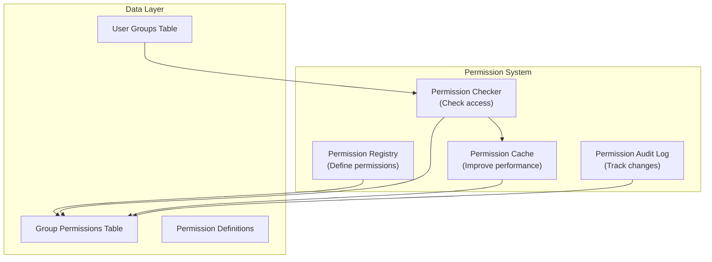

# ADR-006: मॉड्यूल अनुमति प्रणाली

> बारीक पहुंच नियंत्रण को सक्षम करने वाले XOOPS मॉड्यूल के लिए बारीक-बारीक, पदानुक्रमित अनुमति प्रणाली।

---

## स्थिति

**स्वीकृत** - XOOPS 2.5.x में लागू किया गया और XOOPS 4.0 में विस्तारित किया गया

---

## प्रसंग

### समस्या कथन

XOOPS मॉड्यूल को लचीले अनुमति नियंत्रण की आवश्यकता होती है जो अनुमति देते हैं:

1. **मॉड्यूल-स्तरीय अनुमतियाँ** - क्या उपयोगकर्ता इस मॉड्यूल तक पहुंच सकता है?
2. **ऑब्जेक्ट-स्तरीय अनुमतियाँ** - क्या उपयोगकर्ता इस विशिष्ट आइटम तक पहुंच सकता है?
3. **कार्य-स्तर की अनुमतियाँ** - क्या उपयोगकर्ता यह क्रिया कर सकता है?
4. **कस्टम अनुमतियाँ** - क्या मॉड्यूल अपनी स्वयं की अनुमतियाँ परिभाषित कर सकते हैं?

### वर्तमान स्थिति

XOOPS 2.5 XoopsGroupPermission सिस्टम का उपयोग करता है:

```php
<?php
$perm_handler = xoops_getHandler('groupperm');
$isAllowed = $perm_handler->checkRight(
    'modulename',
    'action',
    $itemId,
    $groupId
);
```

### चुनौतियाँ

1. **जटिल क्वेरीज़** - अनुमति जांच के लिए डेटाबेस जॉइन की आवश्यकता होती है
2. **सीमित पदानुक्रम** - अनुमति समूह बनाना कठिन है
3. **ख़राब कैशिंग** - कोई अंतर्निहित अनुमति कैशिंग नहीं
4. **मॉड्यूल विविधताएँ** - प्रत्येक मॉड्यूल अलग ढंग से कार्यान्वित होता है
5. **प्रदर्शन** - अनुमति जांच के लिए एकाधिक डीबी प्रश्न

---

## फैसला

### पदानुक्रमित अनुमति प्रणाली लागू करें

समर्थन करने वाली एक मानकीकृत, कैश्ड अनुमति प्रणाली बनाएं:

1. **पदानुक्रमित अनुमतियाँ** - मूल समूहों से विरासत
2. **भूमिका-आधारित पहुंच** - भूमिकाओं के लिए मानचित्र अनुमतियाँ (व्यवस्थापक, मॉडरेटर, उपयोगकर्ता, अतिथि)
3. **ऑब्जेक्ट अनुमतियाँ** - प्रति आइटम बारीक नियंत्रण
4. **कैशिंग** - प्रश्नों को कम करने के लिए कैश अनुमतियाँ
5. **कस्टम अनुमतियाँ** - मॉड्यूल स्वयं को परिभाषित करते हैं
6. **ऑडिट ट्रेल** - लॉग अनुमति परिवर्तन

### अनुमति पदानुक्रम

```
User
  └── Group 1 (Admin)
      └── Permission: admin_module
      └── Permission: edit_all_items
      └── Permission: delete_all_items
  └── Group 2 (Moderator)
      └── Permission: moderate_comments
      └── Permission: edit_own_items
  └── Group 3 (User)
      └── Permission: view_published_items
      └── Permission: edit_own_items
  └── Group 4 (Guest)
      └── Permission: view_published_items
```

### वास्तुकला



---

## मुख्य घटक

### 1. अनुमति परिभाषा

```php
<?php
// Module defines its permissions in xoops_version.php

$modversion['permissions'] = [
    [
        'name' => 'module_view',
        'description' => 'Can view module',
        'level' => 'module',
    ],
    [
        'name' => 'item_view',
        'description' => 'Can view items',
        'level' => 'item',
    ],
    [
        'name' => 'item_create',
        'description' => 'Can create items',
        'level' => 'item',
    ],
    [
        'name' => 'item_edit',
        'description' => 'Can edit items',
        'level' => 'item',
    ],
    [
        'name' => 'item_delete',
        'description' => 'Can delete items',
        'level' => 'item',
    ],
    [
        'name' => 'admin_manage',
        'description' => 'Can manage module',
        'level' => 'admin',
    ],
];

// Default permissions by group
$modversion['group_permissions'] = [
    // Admin group gets all permissions
    '1' => [
        'module_view' => 1,
        'item_view' => 1,
        'item_create' => 1,
        'item_edit' => 1,
        'item_delete' => 1,
        'admin_manage' => 1,
    ],
    // User group
    '3' => [
        'module_view' => 1,
        'item_view' => 1,
        'item_create' => 1,
        'item_edit' => 0,
        'item_delete' => 0,
        'admin_manage' => 0,
    ],
    // Guest group
    '4' => [
        'module_view' => 1,
        'item_view' => 1,
        'item_create' => 0,
        'item_edit' => 0,
        'item_delete' => 0,
        'admin_manage' => 0,
    ],
];
```

### 2. अनुमति चेकर

```php
<?php
declare(strict_types=1);

namespace XoopsCore\Permission;

class PermissionChecker
{
    private PermissionCache $cache;
    private PermissionRepository $repository;

    public function hasPermission(
        User $user,
        string $permissionName,
        ?int $itemId = null
    ): bool {
        // Check cache first
        $cacheKey = "perm_{$user->getId()}_{$permissionName}_{$itemId}";
        if ($this->cache->has($cacheKey)) {
            return $this->cache->get($cacheKey);
        }

        $hasPermission = false;

        // Check all user groups
        foreach ($user->getGroups() as $group) {
            if ($this->checkGroupPermission($group, $permissionName, $itemId)) {
                $hasPermission = true;
                break;
            }
        }

        // Cache result
        $this->cache->set($cacheKey, $hasPermission, 3600);

        // Log high-level access checks
        if ($hasPermission && $this->shouldAuditLog($permissionName)) {
            $this->auditLog('PERMISSION_CHECKED', [
                'user_id' => $user->getId(),
                'permission' => $permissionName,
                'item_id' => $itemId,
                'result' => 'ALLOWED',
            ]);
        }

        return $hasPermission;
    }

    private function checkGroupPermission(
        Group $group,
        string $permissionName,
        ?int $itemId = null
    ): bool {
        $sql = 'SELECT COUNT(*) FROM ' . $this->table . '
                WHERE groupid = ?
                AND permission = ?
                AND itemid = ?
                AND granted = 1';

        $stmt = $this->db->prepare($sql);
        $stmt->execute([$group->getId(), $permissionName, $itemId ?? 0]);

        return $stmt->fetchColumn() > 0;
    }
}
```

### 3. अनुमति स्तर

```php
<?php
// Different permission levels with different scopes

class PermissionLevel
{
    // Module-level: Affects entire module
    public const LEVEL_MODULE = 'module';

    // Admin-level: Admin panel access
    public const LEVEL_ADMIN = 'admin';

    // Item-level: Specific objects/items
    public const LEVEL_ITEM = 'item';

    // Field-level: Specific object fields
    public const LEVEL_FIELD = 'field';

    // Action-level: Specific actions/operations
    public const LEVEL_ACTION = 'action';
}
```

### 4. वस्तु-स्तर की अनुमतियाँ

```php
<?php
// Fine-grained control for specific items

class Item extends XoopsObject
{
    /**
     * Check if user can view this item
     */
    public function canView(User $user): bool
    {
        // Public items anyone can view
        if ($this->getVar('status') === 'published') {
            return true;
        }

        // Owner can always view their items
        if ($this->getVar('user_id') === $user->getId()) {
            return true;
        }

        // Check group permissions
        $permChecker = xoops_getActiveModule()->getPermissionChecker();
        return $permChecker->hasPermission(
            $user,
            'item_view',
            $this->getVar('id')
        );
    }

    public function canEdit(User $user): bool
    {
        // Owner can edit their items
        if ($this->getVar('user_id') === $user->getId()) {
            return $permChecker->hasPermission($user, 'item_edit', $this->getVar('id'));
        }

        // Check if user can edit all items
        return $permChecker->hasPermission($user, 'item_edit_all', $this->getVar('id'));
    }

    public function canDelete(User $user): bool
    {
        return $permChecker->hasPermission($user, 'item_delete', $this->getVar('id'));
    }
}
```

### 5. नियंत्रकों में उपयोग

```php
<?php
// Example: Article controller

class ArticleController
{
    private PermissionChecker $permChecker;

    public function view(int $id, User $user): Response
    {
        $article = $this->repository->find($id);

        // Check permission
        if (!$article->canView($user)) {
            throw new AccessDeniedException('Cannot view this article');
        }

        return new HtmlResponse($this->renderArticle($article));
    }

    public function edit(int $id, User $user): Response
    {
        $article = $this->repository->find($id);

        // Check permission
        if (!$article->canEdit($user)) {
            throw new AccessDeniedException('Cannot edit this article');
        }

        // Handle form submission
        if ($this->request->isMethod('POST')) {
            $article->setVar('title', $this->request->getPost('title'));
            $article->setVar('content', $this->request->getPost('content'));
            $this->repository->insert($article);

            $this->auditLog('ARTICLE_EDITED', ['id' => $id, 'user_id' => $user->getId()]);

            // Invalidate permission cache
            $this->permChecker->clearCache($user->getId());

            return new RedirectResponse('/article/' . $id);
        }

        return new HtmlResponse($this->renderForm($article));
    }

    public function delete(int $id, User $user): Response
    {
        $article = $this->repository->find($id);

        if (!$article->canDelete($user)) {
            throw new AccessDeniedException('Cannot delete this article');
        }

        $this->repository->delete($article);

        $this->auditLog('ARTICLE_DELETED', ['id' => $id, 'user_id' => $user->getId()]);

        // Invalidate cache
        $this->permChecker->clearCache($user->getId());

        return new JsonResponse(['success' => true]);
    }
}
```

---

## परिणाम

### सकारात्मक प्रभाव

1. **ग्रैन्युलर कंट्रोल** - सुव्यवस्थित अनुमति प्रबंधन
2. **मानकीकृत** - सभी मॉड्यूल में सुसंगत
3. **कैश्ड** - कैशिंग के साथ बेहतर प्रदर्शन
4. **ऑडिटेबल** - ट्रैक करें कि किसने क्या बदला
5. **लचीला** - कस्टम अनुमतियों का समर्थन करें
6. **स्केलेबल** - जटिल अनुमति पदानुक्रमों को संभालता है
7. **परीक्षण योग्य** - इकाई परीक्षण में आसान

### नकारात्मक प्रभाव

1. **जटिलता** - प्रबंधित करने के लिए अधिक कोड
2. **डेटाबेस ओवरहेड** - अधिक टेबल और जोड़
3. **कैश अमान्यकरण** - परिवर्तनों पर कैश साफ़ करना होगा
4. **लर्निंग कर्व** - डेवलपर्स को सिस्टम को समझना चाहिए
5. **प्रदर्शन** - यदि कैश ठीक से कॉन्फ़िगर नहीं किया गया है

### जोखिम और शमन

| जोखिम | गंभीरता | शमन |
|------|----------|-----------|
| अत्यधिक जटिल अनुमतियाँ | मध्यम | अच्छे डिफ़ॉल्ट, दस्तावेज़ीकरण |
| कैश बासी डेटा | उच्च | टीटीएल, स्मार्ट अमान्यकरण |
| प्रदर्शन प्रतिगमन | मध्यम | बेंचमार्क, प्रश्नों का अनुकूलन करें |
| अनुमति बायपास | उच्च | सुरक्षा ऑडिट, परीक्षण |

---

## अनुमति डिज़ाइन पैटर्न

### पैटर्न 1: स्वामी-आधारित अनुमतियाँ

```php
<?php
// User can edit their own items but not others'

public function canEdit(User $user): bool
{
    // Owner can always edit
    if ($this->isOwner($user)) {
        return true;
    }

    // Check group permissions for editing others' items
    return $this->permChecker->hasPermission($user, 'edit_all_items');
}

private function isOwner(User $user): bool
{
    return $this->getVar('user_id') === $user->getId();
}
```

### पैटर्न 2: स्थिति-आधारित अनुमतियाँ

```php
<?php
// Different permissions based on status

public function canView(User $user): bool
{
    switch ($this->getVar('status')) {
        case 'published':
            // Anyone with module permission can view
            return $this->permChecker->hasPermission($user, 'item_view');

        case 'draft':
            // Only owner or admin can view
            return $this->isOwner($user) ||
                   $this->permChecker->hasPermission($user, 'admin_manage');

        case 'archived':
            // Only admin can view
            return $this->permChecker->hasPermission($user, 'admin_manage');

        default:
            return false;
    }
}
```

### पैटर्न 3: भूमिका-आधारित अनुमतियाँ

```php
<?php
// Check against specific roles

public function hasAdminRole(User $user): bool
{
    return $user->getGroups()->contains('admin_group');
}

public function hasModeratorRole(User $user): bool
{
    return $user->getGroups()->contains('moderator_group') ||
           $this->hasAdminRole($user);
}

public function canModerate(User $user): bool
{
    return $this->hasModeratorRole($user);
}
```

---

##संबंधित निर्णय

- ADR-001: मॉड्यूलर आर्किटेक्चर - मॉड्यूल अनुमतियाँ परिभाषित करते हैं
- ADR-004: सुरक्षा प्रणाली - सुरक्षा के लिए आधार
- ADR-005: मिडलवेयर - अनुमतियाँ लागू कर सकता है

---

## सन्दर्भ

### अनुमति मॉडल

- [RBAC (भूमिका-आधारित अभिगम नियंत्रण)](https://en.wikipedia.org/wiki/Role-based_access_control)
- [ABAC (विशेषता-आधारित पहुंच नियंत्रण)](https://en.wikipedia.org/wiki/Attribute-based_access_control)
- [एसीएल (एक्सेस कंट्रोल लिस्ट)](https://en.wikipedia.org/wiki/Access-control_list)

### कार्यान्वयन

- [सिम्फनी सिक्योरिटी](https://symfony.com/doc/current/security.html)
- [लारवेल प्राधिकरण](https://laravel.com/docs/authorization)

---

## कार्यान्वयन चेकलिस्ट- [ ] मानक अनुमति स्तरों को परिभाषित करें
- [ ] PermissionChecker क्लास बनाएं
- [ ] कैशिंग रणनीति लागू करें
- [ ] ऑडिट लॉगिंग जोड़ें
- [ ] सहायक फ़ंक्शन बनाएं
- [ ] व्यापक परीक्षण लिखें
- [ ] डेवलपर्स के लिए दस्तावेज़
- [ ] सभी मॉड्यूल अपडेट करें
- [ ] प्रदर्शन अनुकूलन
- [ ] सुरक्षा समीक्षा

---

## संस्करण इतिहास

| संस्करण | दिनांक | परिवर्तन |
|------|------|------|
| 1.0.0 | 2024-01-28 | प्रारंभिक दस्तावेज़ |

---

#xoops #adr #अनुमतियाँ #प्राधिकरण #rbac #सुरक्षा