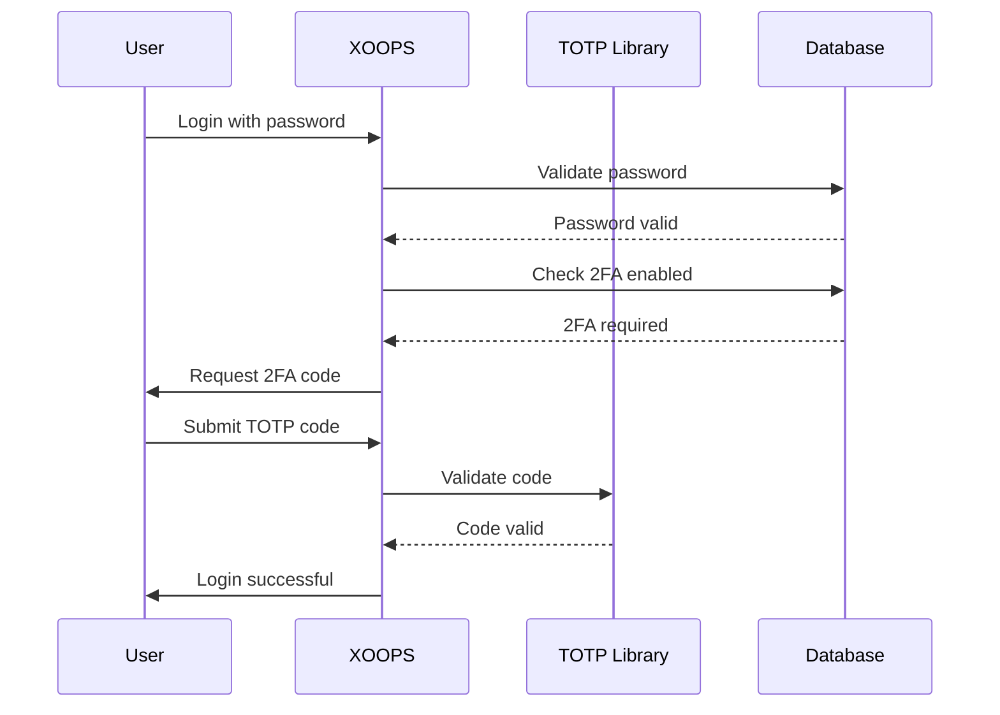

## स्थिति

प्रस्तावित

## प्रसंग

XOOPS को उपयोगकर्ता प्रमाणीकरण के लिए उन्नत सुरक्षा की आवश्यकता है। दो-कारक प्रमाणीकरण (2FA) पासवर्ड से परे सुरक्षा की एक अतिरिक्त परत प्रदान करता है, पासवर्ड से छेड़छाड़ होने पर भी खातों की सुरक्षा करता है।

मुख्य विचार:
- मौजूदा प्रमाणीकरण के साथ पिछड़ा संगतता
- एकाधिक 2FA विधियों के लिए समर्थन
- सेटअप और लॉगिन के दौरान उपयोगकर्ता अनुभव
- खोए हुए उपकरणों के लिए पुनर्प्राप्ति तंत्र
- मौजूदा अनुमति प्रणाली के साथ एकीकरण

## फैसला

हम बैकअप कोड के समर्थन के साथ TOTP (टाइम-आधारित वन-टाइम पासवर्ड) को प्राथमिक 2FA विधि के रूप में लागू करेंगे।

### कार्यान्वयन दृष्टिकोण



### डेटाबेस स्कीमा

```sql
CREATE TABLE `{PREFIX}_users_2fa` (
    `user_id` INT(11) NOT NULL,
    `secret` VARCHAR(32) NOT NULL,
    `enabled` TINYINT(1) DEFAULT 0,
    `backup_codes` TEXT,
    `last_used` INT(11),
    `created` INT(11) NOT NULL,
    PRIMARY KEY (`user_id`),
    FOREIGN KEY (`user_id`) REFERENCES `{PREFIX}_users`(`uid`)
);
```

### सेवा इंटरफ़ेस

```php
interface TwoFactorAuthInterface
{
    public function enable(int $userId): TwoFactorSetup;
    public function disable(int $userId): void;
    public function verify(int $userId, string $code): bool;
    public function generateBackupCodes(int $userId): array;
    public function isEnabled(int $userId): bool;
}
```

### मिडलवेयर इंटीग्रेशन

```php
class TwoFactorMiddleware implements MiddlewareInterface
{
    public function process(
        ServerRequestInterface $request,
        RequestHandlerInterface $handler
    ): ResponseInterface {
        $session = $request->getAttribute('session');

        if ($session->has('pending_2fa_user_id')) {
            // User needs to complete 2FA
            if ($this->isVerificationRequest($request)) {
                return $handler->handle($request);
            }
            return new RedirectResponse('/2fa/verify');
        }

        return $handler->handle($request);
    }
}
```

## परिणाम

### सकारात्मक

- खाता सुरक्षा में उल्लेखनीय सुधार हुआ
- उद्योग-मानक TOTP अनुकूलता (Google प्रमाणक, ऑथी, आदि)
- बैकअप कोड अकाउंट लॉकआउट को रोकते हैं
- प्रति-उपयोगकर्ता वैकल्पिक - अपनाने के लिए बाध्य नहीं करता
- PSR-15 मिडलवेयर स्वच्छ एकीकरण की अनुमति देता है

### नकारात्मक

- अतिरिक्त लॉगिन चरण उपयोगकर्ता अनुभव को प्रभावित करता है
- उपयोगकर्ताओं को प्रमाणक ऐप्स प्रबंधित करना होगा
- खोए हुए उपकरणों को पुनर्प्राप्ति प्रक्रिया की आवश्यकता होती है
- अतिरिक्त डेटाबेस भंडारण और प्रश्न
- क्रिप्टोग्राफ़िक लाइब्रेरी निर्भरता की आवश्यकता है

### प्रवास पथ

1. 2एफए डेटा के लिए डेटाबेस तालिका जोड़ें
2. लाइब्रेरी निर्भरता के साथ TOTP सेवा लागू करें
3. प्रमाणीकरण श्रृंखला में मिडलवेयर जोड़ें
4. सेटअप और सत्यापन यूआई बनाएं
5. विशिष्ट समूहों के लिए 2FA की आवश्यकता के लिए व्यवस्थापक विकल्प

## विकल्पों पर विचार किया गया

### एसएमएस-आधारित ओटीपी

इस कारण से अस्वीकृत:
- सिम स्वैपिंग कमजोरियाँ
- एसएमएस गेटवे की लागत
- फ़ोन नंबर सत्यापन जटिलता
- गोपनीयता संबंधी चिंताएँ

### हार्डवेयर सुरक्षा कुंजियाँ (WebAuthn)

भविष्य के एडीआर के लिए स्थगित:
- अधिक जटिल कार्यान्वयन
- ऐतिहासिक रूप से सीमित ब्राउज़र समर्थन
-उच्च उपयोगकर्ता लागत
- बाद में TOTP के साथ जोड़ा जा सकता है

### ईमेल-आधारित ओटीपी

इस कारण से अस्वीकृत:
- ईमेल खाते से समझौता करने से उद्देश्य विफल हो जाता है
- डिलीवरी में देरी से UX पर असर पड़ता है
- स्पैम फ़िल्टर समस्याएँ

## सन्दर्भ

- [आरएफसी 6238 - @@00011@@](@@00004@@)
- [Google प्रमाणक कुंजी प्रारूप](https://github.com/google/google-authenticator/wiki/Key-Uri-Format)
- ../../02-कोर-अवधारणाएं/सुरक्षा/सुरक्षा-सर्वोत्तम अभ्यास - सुरक्षा दिशानिर्देश
- ../../02-कोर-कॉन्सेप्ट्स/उपयोगकर्ता-अनुमतियाँ/प्रमाणीकरण - प्रमाणीकरण प्रणाली दस्तावेज़ीकरण