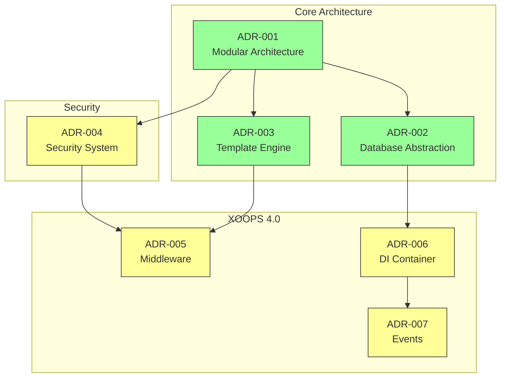
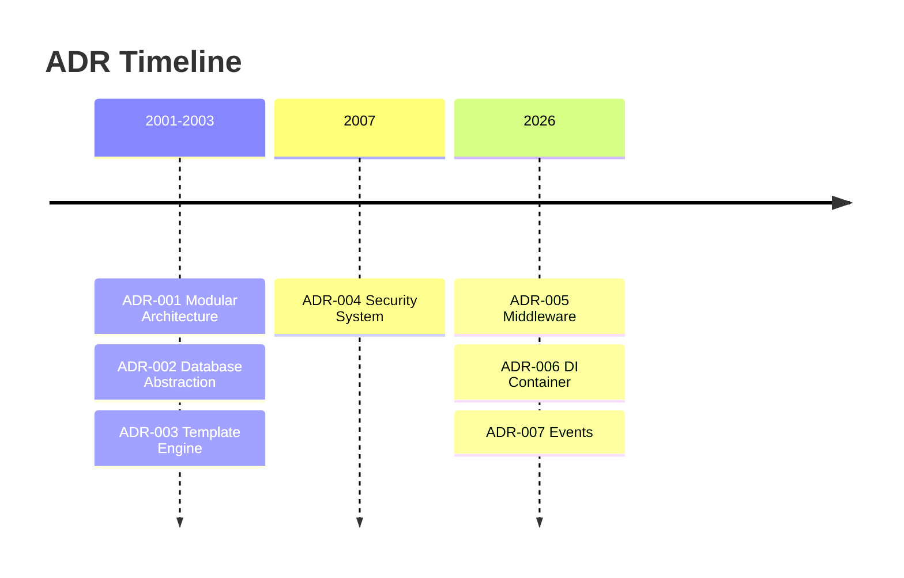

# 📋वास्तुकला निर्णय अभिलेख सूचकांक

> XOOPS सीएमएस को आकार देने वाले वास्तुशिल्प निर्णयों का व्यापक सूचकांक।

---

## एडीआर क्या हैं?

आर्किटेक्चर डिसीजन रिकॉर्ड्स (एडीआर) XOOPS के विकास के दौरान किए गए महत्वपूर्ण वास्तुशिल्प निर्णयों का दस्तावेजीकरण करते हैं। वे प्रत्येक विकल्प के संदर्भ, निर्णय और परिणामों को पकड़ते हैं, और अनुरक्षकों और योगदानकर्ताओं के लिए मूल्यवान ऐतिहासिक संदर्भ प्रदान करते हैं।

---

## एडीआर स्टेटस लेजेंड

| स्थिति | मतलब |
|-------|------|
| **प्रस्तावित** | चर्चा में, अभी स्वीकृत नहीं |
| **स्वीकृत** | निर्णय अपनाया गया है |
| **बहिष्कृत** | अब अनुशंसित नहीं |
| **अतिक्रमित** | दूसरे एडीआर द्वारा प्रतिस्थापित |

---

## वर्तमान एडीआर

### मूलभूत निर्णय

| एडीआर | शीर्षक | स्थिति | प्रभाव |
|----|-------|--------|--------|
| एडीआर-001 | मॉड्यूलर आर्किटेक्चर | स्वीकृत | कोर |
| एडीआर-002 | ऑब्जेक्ट-ओरिएंटेड डेटाबेस एक्सेस | स्वीकृत | कोर |
| एडीआर-003 | Smarty टेम्पलेट इंजन | स्वीकृत | कोर |

### नियोजित एडीआर (XOOPS 4.0)

| एडीआर | शीर्षक | स्थिति | प्रभाव |
|----|-------|--------|--------|
| एडीआर-004 | सुरक्षा प्रणाली डिज़ाइन | प्रस्तावित | सुरक्षा |
| एडीआर-005 | पीएसआर-15 मिडलवेयर | प्रस्तावित | वास्तुकला |
| एडीआर-006 | निर्भरता इंजेक्शन कंटेनर | प्रस्तावित | वास्तुकला |
| एडीआर-007 | इवेंट सिस्टम रीडिज़ाइन | प्रस्तावित | वास्तुकला |

---

## एडीआर रिश्ते



---

## समयरेखा



---

## नए एडीआर बनाना

एक नया वास्तुशिल्प निर्णय प्रस्तावित करते समय:

1. एडीआर टेम्पलेट की प्रतिलिपि बनाएँ
2. सभी अनुभाग भरें
3. पुल अनुरोध के रूप में सबमिट करें
4. GitHub मुद्दों पर चर्चा करें
5. निर्णय के बाद अद्यतन स्थिति

### एडीआर टेम्पलेट संरचना

```markdown
# ADR-XXX: Title

## Status
Proposed | Accepted | Deprecated | Superseded

## Context
What is the issue motivating this decision?

## Decision
What is the change that we're proposing?

## Consequences
What becomes easier or harder as a result?

## Alternatives Considered
What other options were evaluated?
```

---

## 🔗संबंधित दस्तावेज

- मूल अवधारणाएँ
- योगदान दिशानिर्देश
- XOOPS 4.0 रोडमैप

---

#xoops #adr #आर्किटेक्चर #सूचकांक #निर्णय