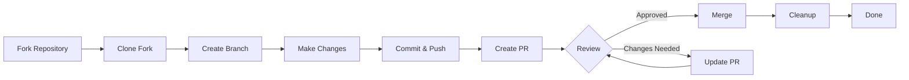

> यह मार्गदर्शिका आपको प्रारंभिक सेटअप से लेकर मर्ज किए गए पुल अनुरोध तक XOOPS में योगदान करने की पूरी प्रक्रिया के बारे में बताती है।

---

## पूर्वावश्यकताएँ

इससे पहले कि आप योगदान देना शुरू करें, सुनिश्चित करें कि आपके पास:

- **Git** स्थापित और कॉन्फ़िगर किया गया
- **GitHub खाता** (निःशुल्क)
- **PHP 7.4+** XOOPS विकास के लिए
- निर्भरता प्रबंधन के लिए **संगीतकार**
- गिट वर्कफ़्लोज़ का बुनियादी ज्ञान
-आचार संहिता से परिचित होना

---

## चरण 1: रिपॉजिटरी को फोर्क करें

### GitHub वेब इंटरफ़ेस पर

1. रिपॉजिटरी पर नेविगेट करें (उदाहरण के लिए, `XOOPS/XoopsCore27`)
2. ऊपरी दाएं कोने में **फोर्क** बटन पर क्लिक करें
3. चुनें कि कहां फोर्क करना है (आपका व्यक्तिगत खाता)
4. कांटा पूरा होने तक प्रतीक्षा करें

### कांटा क्यों?

- आपको काम करने के लिए अपनी स्वयं की प्रति मिलती है
- अनुरक्षकों को कई शाखाओं का प्रबंधन करने की आवश्यकता नहीं है
- आपके पास अपने कांटे का पूरा नियंत्रण है
- पुल अनुरोध आपके फोर्क और अपस्ट्रीम रेपो का संदर्भ देते हैं

---

## चरण 2: अपने फोर्क को स्थानीय रूप से क्लोन करें

```bash
# Clone your fork (replace YOUR_USERNAME)
git clone https://github.com/YOUR_USERNAME/XoopsCore27.git
cd XoopsCore27

# Add upstream remote to track original repository
git remote add upstream https://github.com/XOOPS/XoopsCore27.git

# Verify remotes are set correctly
git remote -v
# origin    https://github.com/YOUR_USERNAME/XoopsCore27.git (fetch)
# origin    https://github.com/YOUR_USERNAME/XoopsCore27.git (push)
# upstream  https://github.com/XOOPS/XoopsCore27.git (fetch)
# upstream  https://github.com/XOOPS/XoopsCore27.git (nofetch)
```

---

## चरण 3: विकास वातावरण स्थापित करें

### निर्भरताएँ स्थापित करें

```bash
# Install Composer dependencies
composer install

# Install development dependencies
composer install --dev

# For module development
cd modules/mymodule
composer install
```

### गिट कॉन्फ़िगर करें

```bash
# Set your Git identity
git config user.name "Your Name"
git config user.email "your.email@example.com"

# Optional: Set global Git config
git config --global user.name "Your Name"
git config --global user.email "your.email@example.com"
```

### परीक्षण चलाएँ

```bash
# Make sure tests pass in clean state
./vendor/bin/phpunit

# Run specific test suite
./vendor/bin/phpunit --testsuite unit
```

---

## चरण 4: फ़ीचर शाखा बनाएँ

### शाखा नामकरण सम्मेलन

इस पैटर्न का पालन करें: `<type>/<description>`

**प्रकार:**
- `feature/` - नई सुविधा
- `fix/` - बग फिक्स
- `docs/` - केवल दस्तावेज़ीकरण
- `refactor/` - कोड रीफैक्टरिंग
- `test/` - परीक्षण परिवर्धन
- `chore/` - रखरखाव, टूलींग

**उदाहरण:**
```bash
# Feature branch
git checkout -b feature/add-two-factor-auth

# Bug fix branch
git checkout -b fix/prevent-xss-in-forms

# Documentation branch
git checkout -b docs/update-api-guide

# Always branch from upstream/main (or develop)
git checkout -b feature/my-feature upstream/main
```

### शाखा को अद्यतन रखें

```bash
# Before you start work, sync with upstream
git fetch upstream
git merge upstream/main

# Later, if upstream has changed
git fetch upstream
git rebase upstream/main
```

---

## चरण 5: अपना परिवर्तन करें

### विकास प्रथाएँ

1. PHP मानकों का पालन करते हुए **कोड लिखें**
2. **नई कार्यक्षमता के लिए परीक्षण लिखें**
3. यदि आवश्यक हो तो **दस्तावेज़ अद्यतन करें**
4. **लिंटर चलाएँ** और कोड फ़ॉर्मेटर

### कोड गुणवत्ता जांच

```bash
# Run all tests
./vendor/bin/phpunit

# Run with coverage
./vendor/bin/phpunit --coverage-html coverage/

# Run PHP CS Fixer
./vendor/bin/php-cs-fixer fix --dry-run

# Run PHPStan static analysis
./vendor/bin/phpstan analyse class/ src/
```

### अच्छे बदलाव करें

```bash
# Check what you changed
git status
git diff

# Stage specific files
git add class/MyClass.php
git add tests/MyClassTest.php

# Or stage all changes
git add .

# Commit with descriptive message
git commit -m "feat(auth): add two-factor authentication support"
```

---

## चरण 6: शाखा को समन्वयित रखें

आपकी सुविधा पर काम करते समय, मुख्य शाखा आगे बढ़ सकती है:

```bash
# Fetch latest changes from upstream
git fetch upstream

# Option A: Rebase (preferred for clean history)
git rebase upstream/main

# Option B: Merge (simpler but adds merge commits)
git merge upstream/main

# If conflicts occur, resolve them then:
git add .
git rebase --continue  # or git merge --continue
```

---

## चरण 7: अपने कांटे पर दबाव डालें

```bash
# Push your branch to your fork
git push origin feature/my-feature

# On subsequent pushes
git push

# If you rebased, you might need force push (use carefully!)
git push --force-with-lease origin feature/my-feature
```

---

## चरण 8: पुल अनुरोध बनाएँ

### GitHub वेब इंटरफ़ेस पर

1. GitHub पर अपने कांटे पर जाएं
2. आपको अपनी शाखा से पीआर बनाने के लिए एक अधिसूचना दिखाई देगी
3. **"तुलना करें और अनुरोध खींचें"** पर क्लिक करें
4. या मैन्युअल रूप से **"न्यू पुल रिक्वेस्ट"** पर क्लिक करें और अपनी शाखा चुनें

### पीआर शीर्षक और विवरण

**शीर्षक प्रारूप:**
```
<type>(<scope>): <subject>
```

उदाहरण:
```
feat(auth): add two-factor authentication
fix(forms): prevent XSS in text input
docs: update installation guide
refactor(core): improve performance
```

**विवरण टेम्पलेट:**

```markdown
## Description
Brief explanation of what this PR does.

## Changes
- Changed X from A to B
- Added feature Y
- Fixed bug Z

## Type of Change
- [ ] New feature (adds new functionality)
- [ ] Bug fix (fixes an issue)
- [ ] Breaking change (API/behavior change)
- [ ] Documentation update

## Testing
- [ ] Added tests for new functionality
- [ ] All existing tests pass
- [ ] Manual testing performed

## Screenshots (if applicable)
Include before/after screenshots for UI changes.

## Related Issues
Closes #123
Related to #456

## Checklist
- [ ] Code follows style guidelines
- [ ] Self-reviewed own code
- [ ] Commented complex code
- [ ] Updated documentation
- [ ] No new warnings generated
- [ ] Tests pass locally
```

### पीआर समीक्षा चेकलिस्ट

सबमिट करने से पहले, सुनिश्चित करें:

- [ ] कोड PHP मानकों का पालन करता है
- [ ] टेस्ट शामिल हैं और पास हैं
- [ ] दस्तावेज़ीकरण अद्यतन (यदि आवश्यक हो)
- [ ] कोई मर्ज विवाद नहीं
- [ ] प्रतिबद्ध संदेश स्पष्ट हैं
- [ ] संबंधित मुद्दों का संदर्भ दिया गया है
- [ ] पीआर विवरण विस्तृत है
- [ ] कोई डिबग कोड या कंसोल लॉग नहीं

---

## चरण 9: फीडबैक का जवाब दें

### कोड समीक्षा के दौरान

1. **टिप्पणियों को ध्यान से पढ़ें** - फीडबैक को समझें
2. **प्रश्न पूछें** - यदि अस्पष्ट है, तो स्पष्टीकरण मांगें
3. **विकल्पों पर चर्चा करें** - दृष्टिकोणों पर सम्मानपूर्वक बहस करें
4. **अनुरोधित परिवर्तन करें** - अपनी शाखा को अद्यतन करें
5. **फोर्स-पुश अपडेटेड कमिट्स** - यदि इतिहास को फिर से लिखा जा रहा है

```bash
# Make changes
git add .
git commit --amend  # Modify last commit
git push --force-with-lease origin feature/my-feature

# Or add new commits
git commit -m "Address feedback on PR review"
git push origin feature/my-feature
```

### पुनरावृत्ति की अपेक्षा करें

- अधिकांश पीआर को कई समीक्षा दौरों की आवश्यकता होती है
- धैर्यवान और रचनात्मक रहें
- फीडबैक को सीखने के अवसर के रूप में देखें
- अनुरक्षक रिफैक्टर्स का सुझाव दे सकते हैं

---

## चरण 10: विलय और सफ़ाई

### अनुमोदन के बाद

एक बार अनुरक्षक अनुमोदन और विलय कर दें:

1. **GitHub ऑटो-मर्ज** या मेंटेनर क्लिक मर्ज
2. **आपकी शाखा हटा दी गई है** (आमतौर पर स्वचालित)
3. **परिवर्तन अपस्ट्रीम में हैं**

### स्थानीय सफ़ाई

```bash
# Switch to main branch
git checkout main

# Update main with merged changes
git fetch upstream
git merge upstream/main

# Delete local feature branch
git branch -d feature/my-feature

# Delete from your fork (if not auto-deleted)
git push origin --delete feature/my-feature
```

---

## वर्कफ़्लो आरेख



---

## सामान्य परिदृश्य

### शुरू करने से पहले सिंक करना

```bash
# Always start fresh
git fetch upstream
git checkout -b feature/new-thing upstream/main
```### अधिक प्रतिबद्धताएँ जोड़ना

```bash
# Just push again
git add .
git commit -m "feat: additional changes"
git push origin feature/new-thing
```

### गलतियाँ सुधारना

```bash
# Last commit has wrong message
git commit --amend -m "Correct message"
git push --force-with-lease

# Revert to previous state (careful!)
git reset --soft HEAD~1  # Keep changes
git reset --hard HEAD~1  # Discard changes
```

### मर्ज विवादों को संभालना

```bash
# Rebase and resolve conflicts
git fetch upstream
git rebase upstream/main

# Edit conflicted files to resolve
# Then continue
git add .
git rebase --continue
git push --force-with-lease
```

---

## सर्वोत्तम प्रथाएँ

### करो

- शाखाओं को एकल मुद्दों पर केंद्रित रखें
- छोटे, तार्किक वादे करें
- वर्णनात्मक प्रतिबद्ध संदेश लिखें
- अपनी शाखा को बार-बार अपडेट करें
- धक्का देने से पहले परीक्षण करें
- दस्तावेज़ परिवर्तन
- फीडबैक के प्रति उत्तरदायी रहें

### मत करो

- सीधे मुख्य/मास्टर शाखा पर कार्य करें
- एक पीआर में असंबंधित परिवर्तन मिलाएं
- जेनरेट की गई फ़ाइलें या नोड_मॉड्यूल प्रतिबद्ध करें
- पीआर सार्वजनिक होने के बाद फोर्स पुश (उपयोग --force-with-lease)
- कोड समीक्षा प्रतिक्रिया पर ध्यान न दें
- विशाल पीआर बनाएं (छोटे-छोटे में तोड़ें)
- संवेदनशील डेटा प्रतिबद्ध करें (API कुंजी, पासवर्ड)

---

##सफलता के लिए युक्तियाँ

### संवाद करें

- काम शुरू करने से पहले मुद्दों में सवाल पूछें
- जटिल परिवर्तनों पर मार्गदर्शन मांगें
- पीआर विवरण में दृष्टिकोण पर चर्चा करें
- फीडबैक का तुरंत जवाब दें

### मानकों का पालन करें

- PHP मानकों की समीक्षा करें
- समस्या रिपोर्टिंग दिशानिर्देशों की जाँच करें
- योगदान अवलोकन पढ़ें
- पुल अनुरोध दिशानिर्देशों का पालन करें

### कोडबेस सीखें

- मौजूदा कोड पैटर्न पढ़ें
- समान कार्यान्वयन का अध्ययन करें
-वास्तुकला को समझें
- मूल अवधारणाओं की जाँच करें

---

## संबंधित दस्तावेज़ीकरण

-आचार संहिता
- पुल अनुरोध दिशानिर्देश
- मुद्दे की रिपोर्टिंग
- PHP कोडिंग मानक
- योगदान अवलोकन

---

#xoops #git #github #योगदान #वर्कफ़्लो #पुल-अनुरोध