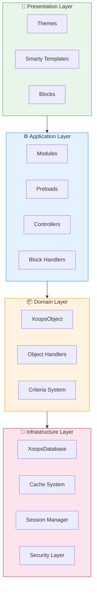
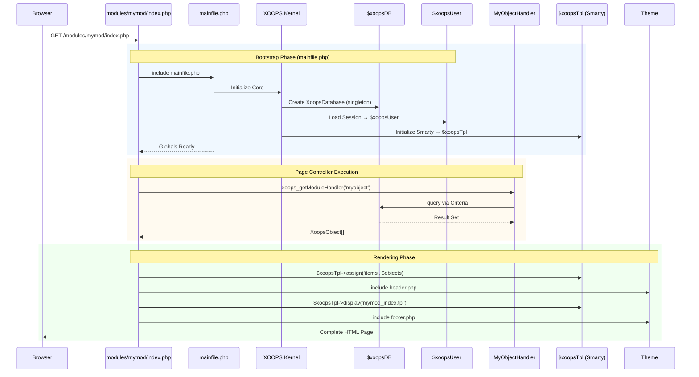

:::नोट[इस दस्तावेज़ के बारे में]
यह पृष्ठ XOOPS की **वैचारिक वास्तुकला** का वर्णन करता है जो वर्तमान (2.5.x) और भविष्य (4.0.x) दोनों संस्करणों पर लागू होता है। कुछ आरेख स्तरित डिज़ाइन दृष्टि दिखाते हैं।

**संस्करण-विशिष्ट विवरण के लिए:**
- **XOOPS 2.5.x आज:** `mainfile.php`, ग्लोबल्स (`$xoopsDB`, `$xoopsUser`), प्रीलोड और हैंडलर पैटर्न का उपयोग करता है
- **XOOPS 4.0 लक्ष्य:** पीएसआर-15 मिडलवेयर, डीआई कंटेनर, राउटर - देखें [रोडमैप](../../07-XOOPS-4.0/XOOPS-4.0-Roadmap.md)
:::

यह दस्तावेज़ XOOPS सिस्टम आर्किटेक्चर का एक व्यापक अवलोकन प्रदान करता है, जिसमें बताया गया है कि एक लचीली और विस्तार योग्य सामग्री प्रबंधन प्रणाली बनाने के लिए विभिन्न घटक एक साथ कैसे काम करते हैं।

## अवलोकन

XOOPS एक मॉड्यूलर आर्किटेक्चर का अनुसरण करता है जो चिंताओं को अलग-अलग परतों में अलग करता है। यह प्रणाली कई मूल सिद्धांतों के आधार पर बनाई गई है:

- **मॉड्यूलैरिटी**: कार्यक्षमता को स्वतंत्र, इंस्टॉल करने योग्य मॉड्यूल में व्यवस्थित किया गया है
- **एक्स्टेंसिबिलिटी**: सिस्टम को कोर कोड को संशोधित किए बिना बढ़ाया जा सकता है
- **अमूर्त**: डेटाबेस और प्रस्तुति परतें व्यावसायिक तर्क से अमूर्त होती हैं
- **सुरक्षा**: अंतर्निहित सुरक्षा तंत्र सामान्य कमजोरियों से रक्षा करते हैं

## सिस्टम परतें



### 1. प्रस्तुति परत

प्रस्तुति परत Smarty टेम्पलेट इंजन का उपयोग करके उपयोगकर्ता इंटरफ़ेस रेंडरिंग को संभालती है।

**मुख्य घटक:**
- **विषय-वस्तु**: दृश्य शैली और लेआउट
- **Smarty टेम्प्लेट**: गतिशील सामग्री प्रतिपादन
- **ब्लॉक**: पुन: प्रयोज्य सामग्री विजेट

### 2. अनुप्रयोग परत

एप्लिकेशन परत में व्यावसायिक तर्क, नियंत्रक और मॉड्यूल कार्यक्षमता शामिल है।

**मुख्य घटक:**
- **मॉड्यूल**: स्व-निहित कार्यक्षमता पैकेज
- **हैंडलर**: डेटा हेरफेर कक्षाएं
- **प्रीलोड्स**: इवेंट श्रोता और हुक

### 3. डोमेन परत

डोमेन परत में मुख्य व्यावसायिक वस्तुएं और नियम शामिल हैं।

**मुख्य घटक:**
- **XoopsObject**: सभी डोमेन ऑब्जेक्ट के लिए बेस क्लास
- **हैंडलर**: CRUD डोमेन ऑब्जेक्ट के लिए संचालन

### 4. इन्फ्रास्ट्रक्चर परत

इन्फ्रास्ट्रक्चर परत डेटाबेस एक्सेस और कैशिंग जैसी मुख्य सेवाएं प्रदान करती है।

## जीवनचक्र का अनुरोध करें

प्रभावी XOOPS विकास के लिए अनुरोध जीवनचक्र को समझना महत्वपूर्ण है।

### XOOPS 2.5.x पृष्ठ नियंत्रक प्रवाह

वर्तमान XOOPS 2.5.x एक **पेज कंट्रोलर** पैटर्न का उपयोग करता है जहां प्रत्येक PHP फ़ाइल अपने स्वयं के अनुरोध को संभालती है। ग्लोबल्स (`$xoopsDB`, `$xoopsUser`, `$xoopsTpl`, आदि) बूटस्ट्रैप के दौरान प्रारंभ किए जाते हैं और पूरे निष्पादन के दौरान उपलब्ध होते हैं।



### 2.5.x में प्रमुख वैश्विक

| वैश्विक | प्रकार | आरंभ | उद्देश्य |
|--------|------|---|---|
| `$xoopsDB` | `XoopsDatabase` | बूटस्ट्रैप | डेटाबेस कनेक्शन (सिंगलटन) |
| `$xoopsUser` | `XoopsUser\|null` | सत्र भार | वर्तमान लॉग-इन उपयोगकर्ता |
| `$xoopsTpl` | `XoopsTpl` | टेम्पलेट init | Smarty टेम्पलेट इंजन |
| `$xoopsModule` | `XoopsModule` | मॉड्यूल लोड | वर्तमान मॉड्यूल संदर्भ |
| `$xoopsConfig` | `array` | कॉन्फ़िग लोड | सिस्टम कॉन्फ़िगरेशन |

:::नोट[XOOPS 4.0 तुलना]
XOOPS 4.0 में, पेज कंट्रोलर पैटर्न को **PSR-15 मिडलवेयर पाइपलाइन** और राउटर-आधारित डिस्पैचिंग से बदल दिया गया है। ग्लोबल्स को निर्भरता इंजेक्शन से बदल दिया जाता है। माइग्रेशन के दौरान अनुकूलता गारंटी के लिए [हाइब्रिड मोड अनुबंध](../../07-XOOPS-4.0/Specifications/Hybrid-Mode-Contract.md) देखें।
:::

### 1. बूटस्ट्रैप चरण

```php
// mainfile.php is the entry point
include_once XOOPS_ROOT_PATH . '/mainfile.php';

// Core initialization
$xoops = Xoops::getInstance();
$xoops->boot();
```

**कदम:**
1. लोड कॉन्फ़िगरेशन (`mainfile.php`)
2. ऑटोलोडर को आरंभ करें
3. त्रुटि प्रबंधन सेट करें
4. डेटाबेस कनेक्शन स्थापित करें
5. उपयोगकर्ता सत्र लोड करें
6. Smarty टेम्प्लेट इंजन प्रारंभ करें

### 2. रूटिंग चरण

```php
// Request routing to appropriate module
$module = $GLOBALS['xoopsModule'];
$controller = $module->getController();
$controller->dispatch($request);
```**कदम:**
1. पार्स अनुरोध URL
2. लक्ष्य मॉड्यूल को पहचानें
3. लोड मॉड्यूल कॉन्फ़िगरेशन
4. अनुमतियाँ जाँचें
5. उपयुक्त हैंडलर के लिए रूट

### 3. निष्पादन चरण

```php
// Controller execution
$data = $handler->getObjects($criteria);
$xoopsTpl->assign('items', $data);
```

**कदम:**
1. नियंत्रक तर्क निष्पादित करें
2. डेटा स्तर के साथ इंटरैक्ट करें
3. प्रक्रिया व्यवसाय नियम
4. दृश्य डेटा तैयार करें

### 4. प्रतिपादन चरण

```php
// Template rendering
include XOOPS_ROOT_PATH . '/header.php';
$xoopsTpl->display('db:module_template.tpl');
include XOOPS_ROOT_PATH . '/footer.php';
```

**कदम:**
1. थीम लेआउट लागू करें
2. मॉड्यूल टेम्पलेट प्रस्तुत करें
3. प्रक्रिया ब्लॉक
4. आउटपुट प्रतिक्रिया

## मुख्य घटक

### XoopsObject

XOOPS में सभी डेटा ऑब्जेक्ट के लिए बेस क्लास।

```php
<?php
class MyModuleItem extends XoopsObject
{
    public function __construct()
    {
        $this->initVar('id', XOBJ_DTYPE_INT, null, false);
        $this->initVar('title', XOBJ_DTYPE_TXTBOX, '', true, 255);
        $this->initVar('content', XOBJ_DTYPE_TXTAREA, '', false);
        $this->initVar('created', XOBJ_DTYPE_INT, time(), false);
    }
}
```

**मुख्य विधियाँ:**
- `initVar()` - ऑब्जेक्ट गुणों को परिभाषित करें
- `getVar()` - संपत्ति मूल्य पुनः प्राप्त करें
- `setVar()` - संपत्ति मान सेट करें
- `assignVars()` - सरणी से थोक में असाइन करें

### XoopsPersistableObjectHandler

XoopsObject उदाहरणों के लिए CRUD संचालन संभालता है।

```php
<?php
class MyModuleItemHandler extends XoopsPersistableObjectHandler
{
    public function __construct(\XoopsDatabase $db)
    {
        parent::__construct($db, 'mymodule_items', 'MyModuleItem', 'id', 'title');
    }

    public function getActiveItems($limit = 10)
    {
        $criteria = new CriteriaCompo();
        $criteria->add(new Criteria('status', 1));
        $criteria->setSort('created');
        $criteria->setOrder('DESC');
        $criteria->setLimit($limit);

        return $this->getObjects($criteria);
    }
}
```

**मुख्य विधियाँ:**
- `create()` - नया ऑब्जेक्ट इंस्टेंस बनाएं
- `get()` - आईडी द्वारा ऑब्जेक्ट पुनर्प्राप्त करें
- `insert()` - ऑब्जेक्ट को डेटाबेस में सहेजें
- `delete()` - डेटाबेस से ऑब्जेक्ट हटाएँ
- `getObjects()` - एकाधिक ऑब्जेक्ट पुनर्प्राप्त करें
- `getCount()` - मेल खाने वाली वस्तुओं की गणना करें

### मॉड्यूल संरचना

प्रत्येक XOOPS मॉड्यूल एक मानक निर्देशिका संरचना का अनुसरण करता है:

```
modules/mymodule/
├── class/                  # PHP classes
│   ├── MyModuleItem.php
│   └── MyModuleItemHandler.php
├── include/                # Include files
│   ├── common.php
│   └── functions.php
├── templates/              # Smarty templates
│   ├── mymodule_index.tpl
│   └── mymodule_item.tpl
├── admin/                  # Admin area
│   ├── index.php
│   └── menu.php
├── language/               # Translations
│   └── english/
│       ├── main.php
│       └── modinfo.php
├── sql/                    # Database schema
│   └── mysql.sql
├── xoops_version.php       # Module info
├── index.php               # Module entry
└── header.php              # Module header
```

## निर्भरता इंजेक्शन कंटेनर

आधुनिक XOOPS विकास बेहतर परीक्षण क्षमता के लिए निर्भरता इंजेक्शन का लाभ उठा सकता है।

### बुनियादी कंटेनर कार्यान्वयन

```php
<?php
class XoopsDependencyContainer
{
    private array $services = [];

    public function register(string $name, callable $factory): void
    {
        $this->services[$name] = $factory;
    }

    public function resolve(string $name): mixed
    {
        if (!isset($this->services[$name])) {
            throw new \InvalidArgumentException("Service not found: $name");
        }

        $factory = $this->services[$name];

        if (is_callable($factory)) {
            return $factory($this);
        }

        return $factory;
    }

    public function has(string $name): bool
    {
        return isset($this->services[$name]);
    }
}
```

### पीएसआर-11 संगत कंटेनर

```php
<?php
namespace Xmf\Di;

use Psr\Container\ContainerInterface;

class BasicContainer implements ContainerInterface
{
    protected array $definitions = [];

    public function set(string $id, mixed $value): void
    {
        $this->definitions[$id] = $value;
    }

    public function get(string $id): mixed
    {
        if (!$this->has($id)) {
            throw new \InvalidArgumentException("Service not found: $id");
        }

        $entry = $this->definitions[$id];

        if (is_callable($entry)) {
            return $entry($this);
        }

        return $entry;
    }

    public function has(string $id): bool
    {
        return isset($this->definitions[$id]);
    }
}
```

### उपयोग उदाहरण

```php
<?php
// Service registration
$container = new XoopsDependencyContainer();

$container->register('database', function () {
    return XoopsDatabaseFactory::getDatabaseConnection();
});

$container->register('userHandler', function ($c) {
    return new XoopsUserHandler($c->resolve('database'));
});

// Service resolution
$userHandler = $container->resolve('userHandler');
$user = $userHandler->get($userId);
```

## विस्तार बिंदु

XOOPS कई विस्तार तंत्र प्रदान करता है:

### 1. प्रीलोड

प्रीलोड मॉड्यूल को मुख्य घटनाओं से जुड़ने की अनुमति देता है।

```php
<?php
// modules/mymodule/preloads/core.php
class MymoduleCorePreload extends XoopsPreloadItem
{
    public static function eventCoreHeaderEnd($args)
    {
        // Execute when header processing ends
    }

    public static function eventCoreFooterStart($args)
    {
        // Execute when footer processing starts
    }
}
```

### 2. प्लगइन्स

प्लगइन्स मॉड्यूल के भीतर विशिष्ट कार्यक्षमता का विस्तार करते हैं।

```php
<?php
// modules/mymodule/plugins/notify.php
class MymoduleNotifyPlugin
{
    public function onItemCreate($item)
    {
        // Send notification when item is created
    }
}
```

### 3. फिल्टर

सिस्टम से गुजरते ही फ़िल्टर डेटा को संशोधित कर देते हैं।

```php
<?php
// Content filter example
$myts = MyTextSanitizer::getInstance();
$content = $myts->displayTarea($rawContent, 1, 1, 1);
```

## सर्वोत्तम प्रथाएँ

### कोड संगठन

1. **नए कोड के लिए नेमस्पेस का उपयोग करें**:
   ```php
   namespace XoopsModules\MyModule;

   class Item extends \XoopsObject
   {
       // Implementation
   }
   ```

2. **पीएसआर-4 ऑटोलोडिंग का पालन करें**:
   ```json
   {
       "autoload": {
           "psr-4": {
               "XoopsModules\\MyModule\\": "class/"
           }
       }
   }
   ```

3. **अलग चिंताएँ**:
   - `class/` में डोमेन तर्क
   - `templates/` में प्रस्तुति
   - मॉड्यूल रूट में नियंत्रक

### प्रदर्शन

1. महंगे कार्यों के लिए **कैशिंग का उपयोग करें**
2. जब संभव हो तो **आलसी लोड** संसाधन
3. मानदंड बैचिंग का उपयोग करके **डेटाबेस क्वेरीज़ को कम करें**
4. जटिल तर्क से बचकर **टेम्प्लेट अनुकूलित करें**

### सुरक्षा

1. `Xmf\Request` का उपयोग करके **सभी इनपुट सत्यापित करें**
2. टेम्पलेट्स में **एस्केप आउटपुट**
3. डेटाबेस प्रश्नों के लिए **तैयार कथनों का उपयोग करें**
4. संवेदनशील परिचालन से पहले **अनुमतियाँ जांचें**

## संबंधित दस्तावेज़ीकरण

- [डिज़ाइन-पैटर्न](Design-Patterns.md) - XOOPS में प्रयुक्त डिज़ाइन पैटर्न
- [डेटाबेस परत](../Database/Database-Layer.md) - डेटाबेस अमूर्त विवरण
- [Smarty मूल बातें](../Templates/Smarty-Basics.md) - टेम्पलेट सिस्टम दस्तावेज़ीकरण
- [सुरक्षा सर्वोत्तम अभ्यास](../Security/Security-Best-Practices.md) - सुरक्षा दिशानिर्देश

---

#xoops #आर्किटेक्चर #कोर #डिज़ाइन #सिस्टम-डिज़ाइन