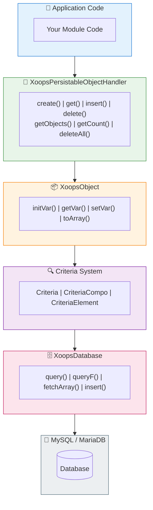

# 🗄️डेटाबेस परत

<span class="version-badge version-25x">2.5.x ✅</span> <span class="version-badge version-40x">4.0.x ✅</span>

> XOOPS डेटाबेस एब्स्ट्रैक्शन, ऑब्जेक्ट दृढ़ता और क्वेरी बिल्डिंग को समझना।

:::टिप[अपने डेटा एक्सेस को भविष्य में सुरक्षित रखें]
हैंडलर/Criteria पैटर्न दोनों संस्करणों में काम करता है। XOOPS 4.0 की तैयारी के लिए, बेहतर परीक्षण क्षमता के लिए हैंडलर को [रिपॉजिटरी क्लासेस](../../03-Module-Development/Patterns/Repository-Pattern.md) में लपेटने पर विचार करें। [डेटा एक्सेस पैटर्न चुनना](../../03-Module-Development/Choosing-Data-Access-Pattern.md) देखें।
:::

---

## अवलोकन

XOOPS डेटाबेस परत MySQL/MariaDB पर एक मजबूत अमूर्तता प्रदान करती है, जिसमें शामिल हैं:

- **फ़ैक्टरी पैटर्न** - केंद्रीकृत डेटाबेस कनेक्शन प्रबंधन
- **ऑब्जेक्ट-रिलेशनल मैपिंग** - XoopsObject और हैंडलर
- **क्वेरी बिल्डिंग** - जटिल प्रश्नों के लिए Criteria सिस्टम
- **कनेक्शन का पुन: उपयोग** - सिंगलटन फैक्ट्री के माध्यम से एकल कनेक्शन (पूलिंग नहीं)

---

## 🏗️वास्तुकला



---

## 🔌 डेटाबेस कनेक्शन

### कनेक्शन प्राप्त करना

```php
// Recommended: Use the global database instance
$db = \XoopsDatabaseFactory::getDatabaseConnection();

// Legacy: Global variable (still works)
global $xoopsDB;
```

### XoopsDatabaseFactory

फ़ैक्टरी पैटर्न सुनिश्चित करता है कि एकल डेटाबेस कनेक्शन का पुन: उपयोग किया जाए:

```php
<?php

class XoopsDatabaseFactory
{
    private static ?XoopsDatabase $instance = null;

    public static function getDatabaseConnection(): XoopsDatabase
    {
        if (self::$instance === null) {
            self::$instance = new XoopsMySQLDatabase();
        }
        return self::$instance;
    }
}
```

---

## 📦 XoopsObject

XOOPS में सभी डेटा ऑब्जेक्ट के लिए बेस क्लास।

### किसी वस्तु को परिभाषित करना

```php
<?php

namespace XoopsModules\MyModule;

class Article extends \XoopsObject
{
    public function __construct()
    {
        $this->initVar('article_id', \XOBJ_DTYPE_INT, null, false);
        $this->initVar('category_id', \XOBJ_DTYPE_INT, 0, true);
        $this->initVar('title', \XOBJ_DTYPE_TXTBOX, '', true, 255);
        $this->initVar('content', \XOBJ_DTYPE_TXTAREA, '', false);
        $this->initVar('author_id', \XOBJ_DTYPE_INT, 0, true);
        $this->initVar('status', \XOBJ_DTYPE_TXTBOX, 'draft', true, 20);
        $this->initVar('views', \XOBJ_DTYPE_INT, 0, false);
        $this->initVar('created', \XOBJ_DTYPE_INT, time(), false);
        $this->initVar('updated', \XOBJ_DTYPE_INT, 0, false);
    }
}
```

### डेटा प्रकार

| लगातार | प्रकार | विवरण |
|---|------|----|
| `XOBJ_DTYPE_INT` | पूर्णांक | संख्यात्मक मान |
| `XOBJ_DTYPE_TXTBOX` | स्ट्रिंग | लघु पाठ (<255 वर्ण) |
| `XOBJ_DTYPE_TXTAREA` | पाठ | लंबी पाठ्य सामग्री |
| `XOBJ_DTYPE_EMAIL` | ईमेल | ईमेल पते |
| `XOBJ_DTYPE_URL` | URL | वेब पते |
| `XOBJ_DTYPE_FLOAT` | तैरना | दशमलव संख्या |
| `XOBJ_DTYPE_ARRAY` | सारणी | क्रमबद्ध सरणियाँ |
| `XOBJ_DTYPE_OTHER` | मिश्रित | कच्चा डेटा |

### वस्तुओं के साथ कार्य करना

```php
// Create new object
$article = new Article();

// Set values
$article->setVar('title', 'My Article');
$article->setVar('content', 'Article content here...');
$article->setVar('category_id', 5);
$article->setVar('author_id', $xoopsUser->getVar('uid'));

// Get values
$title = $article->getVar('title');           // Raw value
$titleDisplay = $article->getVar('title', 'e'); // For editing (HTML entities)
$titleShow = $article->getVar('title', 's');    // For display (sanitized)

// Bulk assign from array
$article->assignVars([
    'title' => 'New Title',
    'status' => 'published'
]);

// Convert to array
$data = $article->toArray();
```

---

## 🔧 ऑब्जेक्ट हैंडलर

### XoopsPersistableObjectHandler

हैंडलर वर्ग XoopsObject उदाहरणों के लिए CRUD संचालन का प्रबंधन करता है।

```php
<?php

namespace XoopsModules\MyModule;

class ArticleHandler extends \XoopsPersistableObjectHandler
{
    public function __construct(\XoopsDatabase $db = null)
    {
        parent::__construct(
            $db,
            'mymodule_articles',  // Table name
            Article::class,       // Object class
            'article_id',         // Primary key
            'title'               // Identifier field
        );
    }
}
```

### हैंडलर तरीके

```php
// Get handler instance
$articleHandler = xoops_getModuleHandler('article', 'mymodule');

// Create new object
$article = $articleHandler->create();

// Get by ID
$article = $articleHandler->get(123);

// Insert (create or update)
$success = $articleHandler->insert($article);

// Delete
$success = $articleHandler->delete($article);

// Get multiple objects
$articles = $articleHandler->getObjects($criteria);

// Get count
$count = $articleHandler->getCount($criteria);

// Get as array (key => value)
$list = $articleHandler->getList($criteria);

// Delete multiple
$deleted = $articleHandler->deleteAll($criteria);
```

### कस्टम हैंडलर तरीके

```php
<?php

namespace XoopsModules\MyModule;

class ArticleHandler extends \XoopsPersistableObjectHandler
{
    // ... constructor

    /**
     * Get published articles
     */
    public function getPublished(int $limit = 10, int $start = 0): array
    {
        $criteria = new \CriteriaCompo();
        $criteria->add(new \Criteria('status', 'published'));
        $criteria->setSort('created');
        $criteria->setOrder('DESC');
        $criteria->setLimit($limit);
        $criteria->setStart($start);

        return $this->getObjects($criteria);
    }

    /**
     * Get articles by category
     */
    public function getByCategory(int $categoryId, int $limit = 10): array
    {
        $criteria = new \CriteriaCompo();
        $criteria->add(new \Criteria('category_id', $categoryId));
        $criteria->add(new \Criteria('status', 'published'));
        $criteria->setSort('created');
        $criteria->setOrder('DESC');
        $criteria->setLimit($limit);

        return $this->getObjects($criteria);
    }

    /**
     * Get articles by author
     */
    public function getByAuthor(int $authorId): array
    {
        $criteria = new \Criteria('author_id', $authorId);
        return $this->getObjects($criteria);
    }

    /**
     * Increment view count
     */
    public function incrementViews(int $articleId): bool
    {
        $sql = sprintf(
            'UPDATE %s SET views = views + 1 WHERE article_id = %d',
            $this->table,
            $articleId
        );
        return $this->db->queryF($sql) !== false;
    }

    /**
     * Get popular articles
     */
    public function getPopular(int $limit = 5): array
    {
        $criteria = new \CriteriaCompo();
        $criteria->add(new \Criteria('status', 'published'));
        $criteria->setSort('views');
        $criteria->setOrder('DESC');
        $criteria->setLimit($limit);

        return $this->getObjects($criteria);
    }
}
```

---

## 🔍 Criteria सिस्टम

Criteria सिस्टम SQL WHERE क्लॉज़ बनाने के लिए एक शक्तिशाली, ऑब्जेक्ट-ओरिएंटेड तरीका प्रदान करता है।

### बेसिक Criteria

```php
// Simple equality
$criteria = new \Criteria('status', 'published');

// With operator
$criteria = new \Criteria('views', 100, '>=');

// Column comparison
$criteria = new \Criteria('updated', 'created', '>');
```

### CriteriaCompo (संयोजन Criteria)

```php
$criteria = new \CriteriaCompo();

// AND conditions (default)
$criteria->add(new \Criteria('status', 'published'));
$criteria->add(new \Criteria('category_id', 5));

// OR conditions
$criteria->add(new \Criteria('featured', 1), 'OR');

// Nested conditions
$subCriteria = new \CriteriaCompo();
$subCriteria->add(new \Criteria('author_id', 1));
$subCriteria->add(new \Criteria('author_id', 2), 'OR');
$criteria->add($subCriteria);
```

### सॉर्टिंग और पेजिनेशन

```php
$criteria = new \CriteriaCompo();
$criteria->add(new \Criteria('status', 'published'));

// Sorting
$criteria->setSort('created');
$criteria->setOrder('DESC');

// Multiple sort fields
$criteria->setSort('category_id, created');
$criteria->setOrder('ASC, DESC');

// Pagination
$criteria->setLimit(10);    // Items per page
$criteria->setStart(20);    // Offset

// Group by
$criteria->setGroupby('category_id');
```

### संचालक

| ऑपरेटर | उदाहरण | SQL आउटपुट |
|---|---|----|
| `=` | `new Criteria('status', 'published')` | `status = 'published'` |
| `!=` | `new Criteria('status', 'draft', '!=')` | `status != 'draft'` |
| `>` | `new Criteria('views', 100, '>')` | `views > 100` |
| `>=` | `new Criteria('views', 100, '>=')` | `views >= 100` |
| `<` | `new Criteria('views', 100, '<')` | `views < 100` |
| `<=` | `new Criteria('views', 100, '<=')` | `views <= 100` |
| `LIKE` | `new Criteria('title', '%php%', 'LIKE')` | `title LIKE '%php%'` |
| `NOT LIKE` | `new Criteria('title', '%test%', 'NOT LIKE')` | `title NOT LIKE '%test%'` |
| `IN` | `new Criteria('id', '(1,2,3)', 'IN')` | `id IN (1,2,3)` |
| `NOT IN` | `new Criteria('id', '(1,2,3)', 'NOT IN')` | `id NOT IN (1,2,3)` |

### जटिल उदाहरण

```php
// Find published articles in specific categories,
// with search term in title, sorted by views
$criteria = new \CriteriaCompo();

// Status must be published
$criteria->add(new \Criteria('status', 'published'));

// In categories 1, 2, or 3
$criteria->add(new \Criteria('category_id', '(1, 2, 3)', 'IN'));

// Title contains search term
$searchTerm = '%' . $db->escape($searchQuery) . '%';
$criteria->add(new \Criteria('title', $searchTerm, 'LIKE'));

// Created in last 30 days
$thirtyDaysAgo = time() - (30 * 24 * 60 * 60);
$criteria->add(new \Criteria('created', $thirtyDaysAgo, '>='));

// Sort by views descending
$criteria->setSort('views');
$criteria->setOrder('DESC');

// Paginate
$criteria->setLimit(10);
$criteria->setStart($page * 10);

$articles = $articleHandler->getObjects($criteria);
$totalCount = $articleHandler->getCount($criteria);
```

---

## 📝 प्रत्यक्ष प्रश्न

Criteria के साथ संभव नहीं होने वाले जटिल प्रश्नों के लिए, सीधे SQL का उपयोग करें।

### सुरक्षित प्रश्न (पढ़ें)

```php
$db = \XoopsDatabaseFactory::getDatabaseConnection();

$sql = sprintf(
    'SELECT a.*, c.category_name
     FROM %s a
     LEFT JOIN %s c ON a.category_id = c.category_id
     WHERE a.status = %s
     ORDER BY a.created DESC
     LIMIT %d',
    $db->prefix('mymodule_articles'),
    $db->prefix('mymodule_categories'),
    $db->quoteString('published'),
    10
);

$result = $db->query($sql);

while ($row = $db->fetchArray($result)) {
    // Process row
    echo $row['title'];
}
```

### प्रश्न लिखें

```php
// Insert
$sql = sprintf(
    "INSERT INTO %s (title, content, created) VALUES (%s, %s, %d)",
    $db->prefix('mymodule_articles'),
    $db->quoteString($title),
    $db->quoteString($content),
    time()
);
$db->queryF($sql);
$newId = $db->getInsertId();

// Update
$sql = sprintf(
    "UPDATE %s SET views = views + 1 WHERE article_id = %d",
    $db->prefix('mymodule_articles'),
    $articleId
);
$db->queryF($sql);
$affectedRows = $db->getAffectedRows();

// Delete
$sql = sprintf(
    "DELETE FROM %s WHERE article_id = %d",
    $db->prefix('mymodule_articles'),
    $articleId
);
$db->queryF($sql);
```

### मूल्यों से बचना

```php
// String escaping
$safeString = $db->quoteString($userInput);
// or
$safeString = $db->escape($userInput);

// Integer (no escaping needed, just cast)
$safeInt = (int) $userInput;
```

---

## ⚠️ सुरक्षा सर्वोत्तम अभ्यास

### उपयोगकर्ता इनपुट से हमेशा बचें

```php
// NEVER do this
$sql = "SELECT * FROM articles WHERE title = '$_GET[title]'"; // SQL Injection!

// DO this
$title = $db->escape($_GET['title']);
$sql = "SELECT * FROM articles WHERE title = '$title'";

// Or better, use Criteria
$criteria = new \Criteria('title', $db->escape($_GET['title']));
```

### पैरामीटरयुक्त क्वेरीज़ (XMF) का उपयोग करें

```php
use Xmf\Database\TableLoad;

// Safe bulk insert
$tableLoad = new TableLoad('mymodule_articles');
$tableLoad->insert([
    ['title' => 'Article 1', 'content' => 'Content 1'],
    ['title' => 'Article 2', 'content' => 'Content 2'],
]);
```

### इनपुट प्रकार मान्य करें

```php
use Xmf\Request;

$id = Request::getInt('id', 0, 'GET');
$title = Request::getString('title', '', 'POST');
```

---

## 📊 डेटाबेस स्कीमा उदाहरण

```sql
-- sql/mysql.sql

CREATE TABLE `{PREFIX}_mymodule_articles` (
    `article_id` INT(11) UNSIGNED NOT NULL AUTO_INCREMENT,
    `category_id` INT(11) UNSIGNED NOT NULL DEFAULT 0,
    `title` VARCHAR(255) NOT NULL DEFAULT '',
    `content` TEXT,
    `author_id` INT(11) UNSIGNED NOT NULL DEFAULT 0,
    `status` VARCHAR(20) NOT NULL DEFAULT 'draft',
    `views` INT(11) UNSIGNED NOT NULL DEFAULT 0,
    `created` INT(11) UNSIGNED NOT NULL DEFAULT 0,
    `updated` INT(11) UNSIGNED NOT NULL DEFAULT 0,
    PRIMARY KEY (`article_id`),
    KEY `category_id` (`category_id`),
    KEY `author_id` (`author_id`),
    KEY `status` (`status`),
    KEY `created` (`created`)
) ENGINE=InnoDB DEFAULT CHARSET=utf8mb4;
```

---

## 🔗संबंधित दस्तावेज

- [Criteria सिस्टम डीप डाइव](@000024@@)
- [डिज़ाइन पैटर्न - फ़ैक्टरी](../Architecture/Design-Patterns.md)
- [SQL इंजेक्शन रोकथाम](../Security/SQL-Injection-Prevention.md)
- [XoopsDatabase API संदर्भ](../../04-API-Reference/Database/XoopsDatabase.md)

---

#xoops #डेटाबेस #orm #मानदंड #हैंडलर #mysql