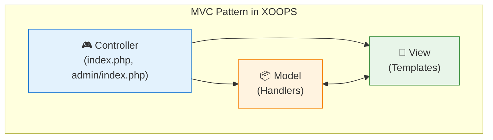

<span class="version-badge version-25x">2.5.x ✅</span> <span class="version-badge version-40x">4.0.x ✅</span>

डिज़ाइन पैटर्न सामान्य सॉफ़्टवेयर डिज़ाइन समस्याओं के लिए पुन: प्रयोज्य समाधान हैं। XOOPS कई सुस्थापित पैटर्न का उपयोग करता है जो कोड गुणवत्ता बनाए रखने, परीक्षण क्षमता में सुधार और सिस्टम लचीलेपन को बढ़ाने में मदद करता है।

:::नोट[त्वरित पैटर्न चयन]
निश्चित नहीं है कि किस पैटर्न का उपयोग करें? देखें:
- [डेटा एक्सेस पैटर्न चुनना](../../03-Module-Development/Choosing-Data-Access-Pattern.md) - हैंडलर बनाम रिपॉजिटरी बनाम सेवा बनाम CQRS
- [एक इवेंट सिस्टम चुनना](../Choosing-Event-System.md) - प्रीलोड बनाम PSR-14 इवेंट
:::

## अवलोकन

रखरखाव योग्य XOOPS मॉड्यूल बनाने के लिए डिज़ाइन पैटर्न को समझना और ठीक से लागू करना महत्वपूर्ण है। यह मार्गदर्शिका XOOPS विकास में सबसे अधिक उपयोग किए जाने वाले पैटर्न को कवर करती है।

| पैटर्न | उद्देश्य | सामान्य उपयोग के मामले |
|--|---|-----|
| एमवीसी | चिंताओं का पृथक्करण | मॉड्यूल संरचना |
| सिंगलटन | एकल उदाहरण गारंटी | डेटाबेस कनेक्शन |
| फ़ैक्टरी | वस्तु निर्माण अमूर्तन | हैंडलर, डेटाबेस |
| प्रेक्षक | घटना अधिसूचना | प्रीलोड, सूचनाएं |
| डेकोरेटर | गतिशील व्यवहार विस्तार | प्रपत्र तत्व, फ़िल्टर |
| रणनीति | एल्गोरिथम इंटरचेंज | प्रमाणीकरण, सत्यापन |
| एडाप्टर | इंटरफ़ेस अनुकूलता | लीगेसी कोड एकीकरण |
| भण्डार | डेटा एक्सेस एब्स्ट्रैक्शन | डेटा दृढ़ता |

## मॉडल-व्यू-कंट्रोलर (एमवीसी)

एमवीसी पैटर्न एक एप्लिकेशन को तीन परस्पर जुड़े घटकों में अलग करता है, जिससे कोडबेस अधिक व्यवस्थित और परीक्षण योग्य हो जाता है।

### वास्तुकला



### मॉडल (डेटा परत)

```php
<?php
namespace XoopsModules\MyModule;

class Article extends \XoopsObject
{
    public function __construct()
    {
        $this->initVar('article_id', XOBJ_DTYPE_INT, null, false);
        $this->initVar('title', XOBJ_DTYPE_TXTBOX, '', true, 255);
        $this->initVar('content', XOBJ_DTYPE_TXTAREA, '', true);
        $this->initVar('author_id', XOBJ_DTYPE_INT, 0, true);
        $this->initVar('status', XOBJ_DTYPE_INT, 1, false);
        $this->initVar('created', XOBJ_DTYPE_INT, time(), false);
        $this->initVar('modified', XOBJ_DTYPE_INT, time(), false);
    }

    public function isPublished(): bool
    {
        return $this->getVar('status') === 1;
    }

    public function getFormattedDate(): string
    {
        return formatTimestamp($this->getVar('created'));
    }
}

class ArticleHandler extends \XoopsPersistableObjectHandler
{
    public function __construct(\XoopsDatabase $db)
    {
        parent::__construct($db, 'mymodule_articles', Article::class, 'article_id', 'title');
    }

    public function getPublishedArticles(int $limit = 10): array
    {
        $criteria = new \CriteriaCompo();
        $criteria->add(new \Criteria('status', 1));
        $criteria->setSort('created');
        $criteria->setOrder('DESC');
        $criteria->setLimit($limit);

        return $this->getObjects($criteria);
    }
}
```

### देखें (प्रस्तुति परत)

```smarty
{* templates/article_list.tpl *}
<div class="article-list">
    <h2>{$smarty.const._MD_MYMODULE_ARTICLES}</h2>

    {foreach from=$articles item=article}
        <article class="article-item">
            <h3>
                <a href="{$xoops_url}/modules/mymodule/article.php?id={$article.article_id}">
                    {$article.title|escape}
                </a>
            </h3>
            <p class="meta">
                {$smarty.const._MD_MYMODULE_POSTED}: {$article.formatted_date}
            </p>
            <div class="content">
                {$article.content|truncate:200}
            </div>
        </article>
    {/foreach}
</div>
```

### नियंत्रक (तर्क परत)

```php
<?php
// index.php
require_once dirname(__DIR__, 2) . '/mainfile.php';

use XoopsModules\MyModule\Helper;

$helper = Helper::getInstance();
$articleHandler = $helper->getHandler('Article');

// Get action from request
$op = \Xmf\Request::getString('op', 'list');

switch ($op) {
    case 'view':
        $articleId = \Xmf\Request::getInt('id', 0);
        $article = $articleHandler->get($articleId);

        if (!$article) {
            redirect_header(XOOPS_URL, 3, _MD_MYMODULE_NOT_FOUND);
        }

        $GLOBALS['xoopsOption']['template_main'] = 'mymodule_article_view.tpl';
        require_once XOOPS_ROOT_PATH . '/header.php';

        $xoopsTpl->assign('article', $article->toArray());
        break;

    case 'list':
    default:
        $articles = $articleHandler->getPublishedArticles(10);

        $GLOBALS['xoopsOption']['template_main'] = 'mymodule_article_list.tpl';
        require_once XOOPS_ROOT_PATH . '/header.php';

        $xoopsTpl->assign('articles', array_map(fn($a) => $a->toArray(), $articles));
        break;
}

require_once XOOPS_ROOT_PATH . '/footer.php';
```

## सिंगलटन पैटर्न

सिंगलटन पैटर्न यह सुनिश्चित करता है कि एक वर्ग का केवल एक ही उदाहरण हो और उस तक वैश्विक पहुंच प्रदान करता है।

### कब उपयोग करें

- डेटाबेस कनेक्शन
- कॉन्फ़िगरेशन प्रबंधक
- लकड़हारा उदाहरण
- कैश प्रबंधक

### कार्यान्वयन

```php
<?php
namespace XoopsModules\MyModule;

class ConfigurationManager
{
    private static ?self $instance = null;
    private array $config = [];

    private function __construct()
    {
        // Load configuration
        $this->loadConfiguration();
    }

    // Prevent cloning
    private function __clone() {}

    // Prevent unserialization
    public function __wakeup()
    {
        throw new \Exception("Cannot unserialize singleton");
    }

    public static function getInstance(): self
    {
        if (self::$instance === null) {
            self::$instance = new self();
        }

        return self::$instance;
    }

    private function loadConfiguration(): void
    {
        $helper = Helper::getInstance();
        $this->config = [
            'items_per_page' => $helper->getConfig('items_per_page', 10),
            'allow_comments' => $helper->getConfig('allow_comments', true),
            'date_format' => $helper->getConfig('date_format', 'Y-m-d'),
        ];
    }

    public function get(string $key, mixed $default = null): mixed
    {
        return $this->config[$key] ?? $default;
    }
}

// Usage
$config = ConfigurationManager::getInstance();
$itemsPerPage = $config->get('items_per_page');
```

### XOOPS मुख्य उदाहरण

```php
<?php
// XoopsDatabaseFactory uses Singleton pattern
$db = XoopsDatabaseFactory::getDatabaseConnection();

// XMF Module Helper uses Singleton
$helper = \Xmf\Module\Helper::getHelper('mymodule');

// Xoops main instance
$xoops = \Xoops::getInstance();
```

## फ़ैक्टरी पैटर्न

फ़ैक्टरी पैटर्न उनकी सटीक कक्षा निर्दिष्ट किए बिना ऑब्जेक्ट बनाता है, जिससे लचीली ऑब्जेक्ट निर्माण की अनुमति मिलती है।

### कब उपयोग करें

- गतिशील रूप से हैंडलर बनाना
- विभिन्न डेटाबेस के लिए डेटाबेस कनेक्शन
- प्रमाणीकरण प्रदाता
- रूप तत्व रचना

### कार्यान्वयन

```php
<?php
namespace XoopsModules\MyModule;

interface ContentInterface
{
    public function render(): string;
}

class ArticleContent implements ContentInterface
{
    private array $data;

    public function __construct(array $data)
    {
        $this->data = $data;
    }

    public function render(): string
    {
        return "<article><h2>{$this->data['title']}</h2><p>{$this->data['body']}</p></article>";
    }
}

class NewsContent implements ContentInterface
{
    private array $data;

    public function __construct(array $data)
    {
        $this->data = $data;
    }

    public function render(): string
    {
        return "<div class='news'><h3>{$this->data['headline']}</h3><p>{$this->data['summary']}</p></div>";
    }
}

class ContentFactory
{
    public static function create(string $type, array $data): ContentInterface
    {
        return match ($type) {
            'article' => new ArticleContent($data),
            'news' => new NewsContent($data),
            default => throw new \InvalidArgumentException("Unknown content type: $type"),
        };
    }
}

// Usage
$article = ContentFactory::create('article', ['title' => 'Hello', 'body' => 'World']);
echo $article->render();
```

### XOOPS डेटाबेस फ़ैक्टरी

```php
<?php
class XoopsDatabaseFactory
{
    public static function getDatabaseConnection()
    {
        static $instance;

        if (!isset($instance)) {
            $dbType = XOOPS_DB_TYPE ?? 'mysql';
            $className = 'XoopsDatabase' . ucfirst($dbType);

            if (!class_exists($className)) {
                $file = XOOPS_ROOT_PATH . '/class/database/' . strtolower($dbType) . '.php';
                if (file_exists($file)) {
                    require_once $file;
                }
            }

            $instance = new $className();

            if (!$instance->connect()) {
                trigger_error('Unable to connect to database', E_USER_ERROR);
            }
        }

        return $instance;
    }
}
```

## प्रेक्षक पैटर्न

ऑब्जर्वर पैटर्न ऑब्जेक्ट को किसी विषय की स्थिति में परिवर्तनों के बारे में सूचित करने की अनुमति देता है, जिससे घटना-संचालित व्यवहार सक्षम होता है।

### कब उपयोग करें

- इवेंट हैंडलिंग
- अधिसूचना प्रणाली
- प्लगइन आर्किटेक्चर
- लॉगिंग और ऑडिटिंग

### कार्यान्वयन

```php
<?php
namespace XoopsModules\MyModule;

interface ObserverInterface
{
    public function update(string $event, array $data): void;
}

class EventDispatcher
{
    private array $observers = [];

    public function attach(string $event, ObserverInterface $observer): void
    {
        if (!isset($this->observers[$event])) {
            $this->observers[$event] = [];
        }

        $this->observers[$event][] = $observer;
    }

    public function detach(string $event, ObserverInterface $observer): void
    {
        if (isset($this->observers[$event])) {
            $key = array_search($observer, $this->observers[$event], true);
            if ($key !== false) {
                unset($this->observers[$event][$key]);
            }
        }
    }

    public function notify(string $event, array $data = []): void
    {
        if (isset($this->observers[$event])) {
            foreach ($this->observers[$event] as $observer) {
                $observer->update($event, $data);
            }
        }
    }
}

class EmailNotifier implements ObserverInterface
{
    public function update(string $event, array $data): void
    {
        if ($event === 'article.published') {
            // Send email notification
            $this->sendEmail($data['article']);
        }
    }

    private function sendEmail($article): void
    {
        $xoopsMailer = xoops_getMailer();
        $xoopsMailer->setSubject('New Article Published: ' . $article->getVar('title'));
        $xoopsMailer->setBody('A new article has been published.');
        $xoopsMailer->send();
    }
}

// Usage
$dispatcher = new EventDispatcher();
$dispatcher->attach('article.published', new EmailNotifier());

// When article is published
$dispatcher->notify('article.published', ['article' => $article]);
```

### XOOPS प्रीलोड्स (ऑब्जर्वर कार्यान्वयन)

```php
<?php
// modules/mymodule/preloads/core.php
class MymoduleCorePreload extends XoopsPreloadItem
{
    public static function eventCoreIncludeCommonEnd($args)
    {
        // React to core common include completing
        $GLOBALS['xoopsLogger']->addExtra('MyModule', 'Initialized');
    }

    public static function eventCoreHeaderEnd($args)
    {
        // Add custom headers
        $GLOBALS['xoTheme']->addStylesheet('modules/mymodule/assets/css/custom.css');
    }

    public static function eventCoreFooterStart($args)
    {
        // Execute before footer renders
    }
}
```

## डेकोरेटर पैटर्न

डेकोरेटर पैटर्न उसी वर्ग की अन्य वस्तुओं को प्रभावित किए बिना गतिशील रूप से वस्तुओं में व्यवहार जोड़ता है।

### कब उपयोग करें

- प्रपत्र तत्व अनुकूलन
- आउटपुट स्वरूपण
- अनुमति की जाँच
- कैशिंग परतें

### कार्यान्वयन

```php
<?php
namespace XoopsModules\MyModule;

interface FormElementInterface
{
    public function render(): string;
}

class TextInput implements FormElementInterface
{
    private string $name;
    private string $value;

    public function __construct(string $name, string $value = '')
    {
        $this->name = $name;
        $this->value = $value;
    }

    public function render(): string
    {
        return sprintf(
            '<input type="text" name="%s" value="%s">',
            htmlspecialchars($this->name),
            htmlspecialchars($this->value)
        );
    }
}

abstract class FormElementDecorator implements FormElementInterface
{
    protected FormElementInterface $element;

    public function __construct(FormElementInterface $element)
    {
        $this->element = $element;
    }

    public function render(): string
    {
        return $this->element->render();
    }
}

class RequiredDecorator extends FormElementDecorator
{
    public function render(): string
    {
        return $this->element->render() . '<span class="required">*</span>';
    }
}

class LabelDecorator extends FormElementDecorator
{
    private string $label;

    public function __construct(FormElementInterface $element, string $label)
    {
        parent::__construct($element);
        $this->label = $label;
    }

    public function render(): string
    {
        return sprintf(
            '<label>%s</label>%s',
            htmlspecialchars($this->label),
            $this->element->render()
        );
    }
}

class HelpTextDecorator extends FormElementDecorator
{
    private string $helpText;

    public function __construct(FormElementInterface $element, string $helpText)
    {
        parent::__construct($element);
        $this->helpText = $helpText;
    }

    public function render(): string
    {
        return $this->element->render() . sprintf(
            '<small class="help-text">%s</small>',
            htmlspecialchars($this->helpText)
        );
    }
}

// Usage - decorators can be stacked
$input = new TextInput('username');
$input = new RequiredDecorator($input);
$input = new LabelDecorator($input, 'Username');
$input = new HelpTextDecorator($input, 'Enter your username');

echo $input->render();
// Output: <label>Username</label><input type="text" name="username" value=""><span class="required">*</span><small class="help-text">Enter your username</small>
```

## रणनीति पैटर्न

रणनीति पैटर्न एल्गोरिदम के एक परिवार को परिभाषित करता है, प्रत्येक को समाहित करता है, और उन्हें विनिमेय बनाता है।

### कब उपयोग करें

- एकाधिक प्रमाणीकरण विधियाँ
- विभिन्न सॉर्टिंग एल्गोरिदम
- विभिन्न निर्यात प्रारूप
- लचीले सत्यापन नियम

### कार्यान्वयन

```php
<?php
namespace XoopsModules\MyModule;

interface AuthStrategyInterface
{
    public function authenticate(string $username, string $password): bool;
}

class DatabaseAuthStrategy implements AuthStrategyInterface
{
    public function authenticate(string $username, string $password): bool
    {
        $memberHandler = xoops_getHandler('member');
        $user = $memberHandler->loginUser($username, $password);

        return $user !== false;
    }
}

class LdapAuthStrategy implements AuthStrategyInterface
{
    private string $ldapHost;
    private int $ldapPort;

    public function __construct(string $host, int $port = 389)
    {
        $this->ldapHost = $host;
        $this->ldapPort = $port;
    }

    public function authenticate(string $username, string $password): bool
    {
        $ldap = ldap_connect($this->ldapHost, $this->ldapPort);

        if (!$ldap) {
            return false;
        }

        $bind = @ldap_bind($ldap, "uid=$username,ou=users,dc=example,dc=com", $password);

        ldap_close($ldap);

        return $bind;
    }
}

class AuthService
{
    private AuthStrategyInterface $strategy;

    public function __construct(AuthStrategyInterface $strategy)
    {
        $this->strategy = $strategy;
    }

    public function setStrategy(AuthStrategyInterface $strategy): void
    {
        $this->strategy = $strategy;
    }

    public function login(string $username, string $password): bool
    {
        return $this->strategy->authenticate($username, $password);
    }
}

// Usage
$authService = new AuthService(new DatabaseAuthStrategy());

// Can switch strategies at runtime
if ($useLdap) {
    $authService->setStrategy(new LdapAuthStrategy('ldap.example.com'));
}

$authenticated = $authService->login($username, $password);
```

## रिपॉजिटरी पैटर्न

रिपॉजिटरी पैटर्न डेटा एक्सेस लॉजिक और बिजनेस लॉजिक के बीच एक अमूर्त परत प्रदान करता है।

### कब उपयोग करें

- जटिल डेटा एक्सेस आवश्यकताएँ
- एकाधिक डेटा स्रोत
- परीक्षण योग्य डेटा परतें
- डोमेन-संचालित डिज़ाइन

### कार्यान्वयन

```php
<?php
namespace XoopsModules\MyModule\Repository;

use XoopsModules\MyModule\Entity\Article;

interface ArticleRepositoryInterface
{
    public function find(int $id): ?Article;
    public function findBySlug(string $slug): ?Article;
    public function findPublished(int $limit = 10, int $offset = 0): array;
    public function save(Article $article): bool;
    public function delete(Article $article): bool;
}

class ArticleRepository implements ArticleRepositoryInterface
{
    private \XoopsPersistableObjectHandler $handler;

    public function __construct(\XoopsPersistableObjectHandler $handler)
    {
        $this->handler = $handler;
    }

    public function find(int $id): ?Article
    {
        $obj = $this->handler->get($id);
        return $obj ?: null;
    }

    public function findBySlug(string $slug): ?Article
    {
        $criteria = new \Criteria('slug', $slug);
        $objects = $this->handler->getObjects($criteria);

        return !empty($objects) ? $objects[0] : null;
    }

    public function findPublished(int $limit = 10, int $offset = 0): array
    {
        $criteria = new \CriteriaCompo();
        $criteria->add(new \Criteria('status', 'published'));
        $criteria->setSort('published_at');
        $criteria->setOrder('DESC');
        $criteria->setLimit($limit);
        $criteria->setStart($offset);

        return $this->handler->getObjects($criteria);
    }

    public function save(Article $article): bool
    {
        return $this->handler->insert($article);
    }

    public function delete(Article $article): bool
    {
        return $this->handler->delete($article);
    }
}
```

## निर्भरता इंजेक्शननिर्भरता इंजेक्शन (डीआई) वस्तुओं को आंतरिक रूप से बनाने के बजाय उनकी निर्भरता के साथ निर्माण करने की अनुमति देता है।

### लाभ

- बेहतर परीक्षण क्षमता
- ढीला युग्मन
- लचीला विन्यास
- बेहतर कोड संगठन

### कार्यान्वयन

```php
<?php
namespace XoopsModules\MyModule;

class ArticleService
{
    private Repository\ArticleRepositoryInterface $repository;
    private CacheInterface $cache;
    private LoggerInterface $logger;

    public function __construct(
        Repository\ArticleRepositoryInterface $repository,
        CacheInterface $cache,
        LoggerInterface $logger
    ) {
        $this->repository = $repository;
        $this->cache = $cache;
        $this->logger = $logger;
    }

    public function getArticle(int $id): ?Entity\Article
    {
        $cacheKey = "article_{$id}";

        // Try cache first
        if ($this->cache->has($cacheKey)) {
            $this->logger->debug("Article {$id} loaded from cache");
            return $this->cache->get($cacheKey);
        }

        // Load from repository
        $article = $this->repository->find($id);

        if ($article) {
            $this->cache->set($cacheKey, $article, 3600);
            $this->logger->debug("Article {$id} loaded from database");
        }

        return $article;
    }
}

// Service container setup
$container = new DependencyContainer();

$container->register('db', fn() => XoopsDatabaseFactory::getDatabaseConnection());

$container->register('articleHandler', fn($c) =>
    new ArticleHandler($c->resolve('db'))
);

$container->register('articleRepository', fn($c) =>
    new Repository\ArticleRepository($c->resolve('articleHandler'))
);

$container->register('cache', fn() => new FileCache(XOOPS_VAR_PATH . '/caches'));

$container->register('logger', fn() => new XoopsLogger());

$container->register('articleService', fn($c) =>
    new ArticleService(
        $c->resolve('articleRepository'),
        $c->resolve('cache'),
        $c->resolve('logger')
    )
);

// Usage
$articleService = $container->resolve('articleService');
$article = $articleService->getArticle(1);
```

## सर्वोत्तम प्रथाएँ

### पैटर्न चयन दिशानिर्देश

1. **वास्तविक ज़रूरतों के आधार पर पैटर्न चुनें**, प्रत्याशित नहीं
2. **कार्यान्वयन को सरल रखें** - अति-इंजीनियरिंग न करें
3. टीम को समझने के लिए **दस्तावेज़ पैटर्न का उपयोग**
4. **पैटर्न को संयोजित करें** जब उपयुक्त हो (उदाहरण के लिए, फ़ैक्टरी + सिंगलटन)
5. पैटर्न का चयन करते समय **परीक्षणशीलता पर विचार करें**

### सामान्य विरोधी पैटर्न से बचना चाहिए

| विरोधी पैटर्न | समस्या | समाधान |
|----|--|---|
| ईश्वर वस्तु | क्लास बहुत ज्यादा करती है | एकल जिम्मेदारी |
| स्पेगेटी कोड | कोई स्पष्ट संरचना नहीं | एमवीसी पैटर्न का प्रयोग करें |
| कॉपी-पेस्ट करें | कोड दोहराव | सामान्य कोड निकालें |
| जादुई अंक | अस्पष्ट स्थिरांक | नामित स्थिरांक का प्रयोग करें |
| टाइट कपलिंग | परीक्षण/रखरखाव करना कठिन | निर्भरता इंजेक्शन का उपयोग करें |

### परीक्षण पैटर्न

```php
<?php
// Unit testing with dependency injection
class ArticleServiceTest extends \PHPUnit\Framework\TestCase
{
    private $repository;
    private $cache;
    private $logger;
    private $service;

    protected function setUp(): void
    {
        $this->repository = $this->createMock(ArticleRepositoryInterface::class);
        $this->cache = $this->createMock(CacheInterface::class);
        $this->logger = $this->createMock(LoggerInterface::class);

        $this->service = new ArticleService(
            $this->repository,
            $this->cache,
            $this->logger
        );
    }

    public function testGetArticleFromCache(): void
    {
        $article = new Article();
        $article->setVar('article_id', 1);

        $this->cache->expects($this->once())
            ->method('has')
            ->with('article_1')
            ->willReturn(true);

        $this->cache->expects($this->once())
            ->method('get')
            ->with('article_1')
            ->willReturn($article);

        $result = $this->service->getArticle(1);

        $this->assertSame($article, $result);
    }
}
```

## संबंधित दस्तावेज़ीकरण

- [XOOPS-आर्किटेक्चर](XOOPS-Architecture.md) - समग्र सिस्टम आर्किटेक्चर
- [डेटाबेस परत](../Database/Database-Layer.md) - डेटा दृढ़ता पैटर्न
- [सुरक्षा सर्वोत्तम अभ्यास](../Security/Security-Best-Practices.md) - सुरक्षित पैटर्न कार्यान्वयन

---

#xoops #डिज़ाइन-पैटर्न #आर्किटेक्चर #एमवीसी #सिंगलटन #फ़ैक्टरी #ऑब्जर्वर