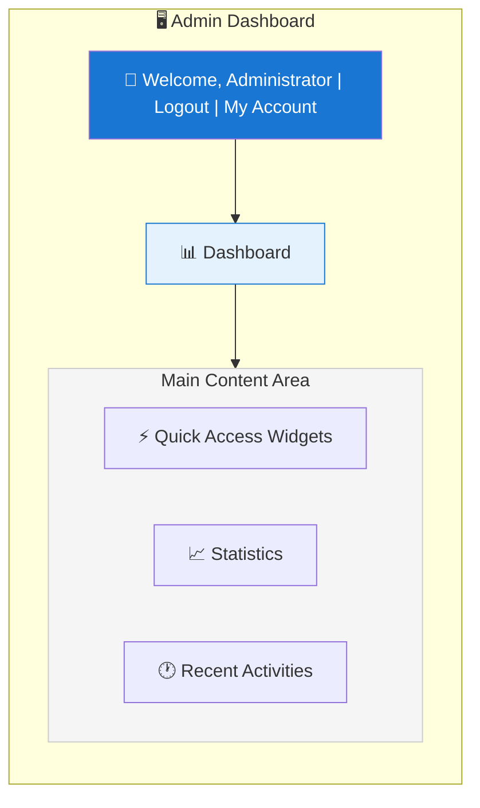
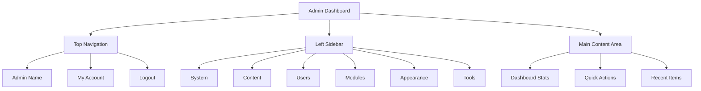

# XOOPS एडमिन पैनल अवलोकन

XOOPS व्यवस्थापक डैशबोर्ड को नेविगेट करने और उपयोग करने के लिए संपूर्ण मार्गदर्शिका।

## एडमिन पैनल तक पहुँचना

### व्यवस्थापक लॉगिन

अपना ब्राउज़र खोलें और यहां नेविगेट करें:

```
http://your-domain.com/xoops/admin/
```

या यदि XOOPS रूट में है:

```
http://your-domain.com/admin/
```

अपने व्यवस्थापक क्रेडेंशियल दर्ज करें:

```
Username: [Your admin username]
Password: [Your admin password]
```

### लॉग इन करने के बाद

आपको मुख्य व्यवस्थापक डैशबोर्ड दिखाई देगा:



## एडमिन पैनल लेआउट



## डैशबोर्ड घटक

### शीर्ष बार

शीर्ष बार में आवश्यक नियंत्रण होते हैं:

| तत्त्व | उद्देश्य |
|---|---|
| **एडमिन लोगो** | डैशबोर्ड पर लौटने के लिए क्लिक करें |
| **स्वागत संदेश** | लॉग-इन व्यवस्थापक नाम दिखाता है |
| **मेरा खाता** | व्यवस्थापक प्रोफ़ाइल और पासवर्ड संपादित करें |
| **मदद** | प्रवेश दस्तावेज |
| **लॉगआउट** | एडमिन पैनल से साइन आउट करें |

### बायाँ नेविगेशन साइडबार

फ़ंक्शन द्वारा आयोजित मुख्य मेनू:

```
├── System
│   ├── Dashboard
│   ├── Preferences
│   ├── Admin Users
│   ├── Groups
│   ├── Permissions
│   ├── Modules
│   └── Tools
├── Content
│   ├── Pages
│   ├── Categories
│   ├── Comments
│   └── Media Manager
├── Users
│   ├── Users
│   ├── User Requests
│   ├── Online Users
│   └── User Groups
├── Modules
│   ├── Modules
│   ├── Module Settings
│   └── Module Updates
├── Appearance
│   ├── Themes
│   ├── Templates
│   ├── Blocks
│   └── Images
└── Tools
    ├── Maintenance
    ├── Email
    ├── Statistics
    ├── Logs
    └── Backups
```

### मुख्य सामग्री क्षेत्र

चयनित अनुभाग के लिए जानकारी और नियंत्रण प्रदर्शित करता है:

- विन्यास के लिए प्रपत्र
- सूचियों के साथ डेटा तालिकाएँ
- चार्ट और आँकड़े
- त्वरित कार्रवाई बटन
- सहायता पाठ और टूलटिप्स

### डैशबोर्ड विजेट

प्रमुख जानकारी तक त्वरित पहुंच:

- **सिस्टम जानकारी:** PHP संस्करण, MySQL संस्करण, XOOPS संस्करण
- **त्वरित आँकड़े:** उपयोगकर्ता संख्या, कुल पोस्ट, स्थापित मॉड्यूल
- **हाल की गतिविधि:** नवीनतम लॉगिन, सामग्री परिवर्तन, त्रुटियां
- **सर्वर स्थिति:** सीपीयू, मेमोरी, डिस्क उपयोग
- **सूचनाएँ:** सिस्टम अलर्ट, लंबित अपडेट

## कोर एडमिन फ़ंक्शंस

### सिस्टम प्रबंधन

**स्थान:** सिस्टम > [विभिन्न विकल्प]

#### प्राथमिकताएँ

बुनियादी सिस्टम सेटिंग्स कॉन्फ़िगर करें:

```
System > Preferences > [Settings Category]
```

श्रेणियाँ:
- सामान्य सेटिंग्स (साइट का नाम, समयक्षेत्र)
- उपयोगकर्ता सेटिंग्स (पंजीकरण, प्रोफाइल)
- ईमेल सेटिंग्स (SMTP कॉन्फ़िगरेशन)
- कैश सेटिंग्स (कैशिंग विकल्प)
- URL सेटिंग्स (अनुकूल URL)
- मेटा टैग (एसईओ सेटिंग्स)

बुनियादी कॉन्फ़िगरेशन और सिस्टम सेटिंग्स देखें।

#### व्यवस्थापक उपयोगकर्ता

व्यवस्थापक खाते प्रबंधित करें:

```
System > Admin Users
```

कार्य:
- नए प्रशासक जोड़ें
- व्यवस्थापक प्रोफ़ाइल संपादित करें
- एडमिन पासवर्ड बदलें
- व्यवस्थापक खाते हटाएँ
- व्यवस्थापक अनुमतियाँ सेट करें

### सामग्री प्रबंधन

**स्थान:** सामग्री > [विभिन्न विकल्प]

#### पेज/लेख

साइट सामग्री प्रबंधित करें:

```
Content > Pages (or your module)
```

कार्य:
- नए पेज बनाएं
- मौजूदा सामग्री संपादित करें
- पेज हटाएं
- प्रकाशित/अप्रकाशित करें
- श्रेणियां निर्धारित करें
- संशोधन प्रबंधित करें

#### श्रेणियाँ

सामग्री व्यवस्थित करें:

```
Content > Categories
```

कार्य:
- श्रेणी पदानुक्रम बनाएँ
- श्रेणियां संपादित करें
- श्रेणियां हटाएं
- पेजों को असाइन करें

#### टिप्पणियाँ

मध्यम उपयोगकर्ता टिप्पणियाँ:

```
Content > Comments
```

कार्य:
- सभी टिप्पणियाँ देखें
- टिप्पणियाँ स्वीकृत करें
- टिप्पणियाँ संपादित करें
- स्पैम हटाएँ
- टिप्पणीकारों को ब्लॉक करें

### उपयोगकर्ता प्रबंधन

**स्थान:** उपयोगकर्ता > [विभिन्न विकल्प]

#### उपयोगकर्ता

उपयोगकर्ता खाते प्रबंधित करें:

```
Users > Users
```

कार्य:
- सभी उपयोगकर्ताओं को देखें
- नए उपयोगकर्ता बनाएं
- उपयोगकर्ता प्रोफ़ाइल संपादित करें
- खाते हटाएँ
- पासवर्ड रीसेट करें
- उपयोगकर्ता स्थिति बदलें
- समूहों को असाइन करें

#### ऑनलाइन उपयोगकर्ता

सक्रिय उपयोगकर्ताओं की निगरानी करें:

```
Users > Online Users
```

दिखाता है:
- वर्तमान में ऑनलाइन उपयोगकर्ता
- अंतिम गतिविधि का समय
-आईपी पता
- उपयोगकर्ता स्थान (यदि कॉन्फ़िगर किया गया है)

#### उपयोगकर्ता समूह

उपयोगकर्ता भूमिकाएँ और अनुमतियाँ प्रबंधित करें:

```
Users > Groups
```

कार्य:
- कस्टम समूह बनाएं
- समूह अनुमतियाँ सेट करें
- उपयोगकर्ताओं को समूहों में असाइन करें
- समूह हटाएँ

### मॉड्यूल प्रबंधन

**स्थान:** मॉड्यूल > [विभिन्न विकल्प]

#### मॉड्यूल

मॉड्यूल स्थापित और कॉन्फ़िगर करें:

```
Modules > Modules
```

कार्य:
- स्थापित मॉड्यूल देखें
- मॉड्यूल सक्षम/अक्षम करें
- अद्यतन मॉड्यूल
- मॉड्यूल सेटिंग्स कॉन्फ़िगर करें
- नए मॉड्यूल स्थापित करें
- मॉड्यूल विवरण देखें

#### अद्यतनों की जाँच करें

```
Modules > Modules > Check for Updates
```प्रदर्शित करता है:
- उपलब्ध मॉड्यूल अपडेट
- चेंजलॉग
- डाउनलोड और इंस्टॉल विकल्प

### उपस्थिति प्रबंधन

**स्थान:** दिखावट > [विभिन्न विकल्प]

#### थीम्स

साइट थीम प्रबंधित करें:

```
Appearance > Themes
```

कार्य:
- स्थापित थीम देखें
- डिफ़ॉल्ट थीम सेट करें
- नई थीम अपलोड करें
- थीम हटाएं
- थीम पूर्वावलोकन
- थीम विन्यास

#### ब्लॉक

सामग्री ब्लॉक प्रबंधित करें:

```
Appearance > Blocks
```

कार्य:
- कस्टम ब्लॉक बनाएं
- ब्लॉक सामग्री संपादित करें
- पेज पर ब्लॉक व्यवस्थित करें
- ब्लॉक दृश्यता सेट करें
- ब्लॉक हटाएँ
- ब्लॉक कैशिंग कॉन्फ़िगर करें

#### टेम्पलेट्स

टेम्प्लेट प्रबंधित करें (उन्नत):

```
Appearance > Templates
```

उन्नत उपयोगकर्ताओं और डेवलपर्स के लिए.

### सिस्टम उपकरण

**स्थान:** सिस्टम > उपकरण

#### रखरखाव मोड

रखरखाव के दौरान उपयोगकर्ता की पहुंच रोकें:

```
System > Maintenance Mode
```

कॉन्फ़िगर करें:
- रखरखाव सक्षम/अक्षम करें
- कस्टम रखरखाव संदेश
- अनुमत आईपी पते (परीक्षण के लिए)

#### डेटाबेस प्रबंधन

```
System > Database
```

कार्य:
- डेटाबेस स्थिरता की जाँच करें
- डेटाबेस अद्यतन चलाएँ
- मरम्मत टेबल
- डेटाबेस का अनुकूलन करें
- निर्यात डेटाबेस संरचना

#### गतिविधि लॉग

```
System > Logs
```

मॉनिटर:
- उपयोगकर्ता गतिविधि
- प्रशासनिक कार्रवाई
- सिस्टम इवेंट
- त्रुटि लॉग

## त्वरित कार्रवाई

डैशबोर्ड से पहुंच योग्य सामान्य कार्य:

```
Quick Links:
├── Create New Page
├── Add New User
├── Create Content Block
├── Upload Image
├── Send Mass Email
├── Update All Modules
└── Clear Cache
```

## एडमिन पैनल कीबोर्ड शॉर्टकट

त्वरित नेविगेशन:

| शॉर्टकट | कार्रवाई |
|---|---|
| `Ctrl+H` | मदद के लिए जाओ |
| `Ctrl+D` | डैशबोर्ड पर जाएँ |
| `Ctrl+Q` | त्वरित खोज |
| `Ctrl+L` | लॉगआउट |

## उपयोगकर्ता खाता प्रबंधन

### मेरा खाता

अपनी व्यवस्थापक प्रोफ़ाइल तक पहुंचें:

1. ऊपर दाईं ओर "मेरा खाता" पर क्लिक करें
2. प्रोफ़ाइल जानकारी संपादित करें:
   - ईमेल पता
   - असली नाम
   - उपयोगकर्ता जानकारी
   - अवतार

### पासवर्ड बदलें

अपना व्यवस्थापक पासवर्ड बदलें:

1. **मेरा खाता** पर जाएँ
2. "पासवर्ड बदलें" पर क्लिक करें
3. वर्तमान पासवर्ड दर्ज करें
4. नया पासवर्ड डालें (दो बार)
5. "सहेजें" पर क्लिक करें

**सुरक्षा युक्तियाँ:**
- मजबूत पासवर्ड का प्रयोग करें (16+ अक्षर)
- अपरकेस, लोअरकेस, संख्याएं, प्रतीक शामिल करें
- हर 90 दिन में पासवर्ड बदलें
- कभी भी एडमिन क्रेडेंशियल साझा न करें

### लॉगआउट

व्यवस्थापक पैनल से साइन आउट करें:

1. ऊपर दाईं ओर "लॉगआउट" पर क्लिक करें
2. आपको लॉगिन पेज पर पुनः निर्देशित किया जाएगा

## एडमिन पैनल सांख्यिकी

### डैशबोर्ड आँकड़े

साइट मेट्रिक्स का त्वरित अवलोकन:

| मीट्रिक | मूल्य |
|-------|-------|
| उपयोगकर्ता ऑनलाइन | 12 |
| कुल उपयोगकर्ता | 256 |
| कुल पोस्ट | 1,234 |
| कुल टिप्पणियाँ | 5,678 |
| कुल मॉड्यूल | 8 |

### सिस्टम स्थिति

सर्वर और प्रदर्शन जानकारी:

| घटक | संस्करण/मूल्य |
|--------|------------|
| XOOPS संस्करण | 2.5.11 |
| PHP संस्करण | 8.2.x |
| MySQL संस्करण | 8.0.x |
| सर्वर लोड | 0.45, 0.42 |
| अपटाइम | 45 दिन |

### हाल की गतिविधि

हाल की घटनाओं की समयरेखा:

```
12:45 - Admin login
12:30 - New user registered
12:15 - Page published
12:00 - Comment posted
11:45 - Module updated
```

## अधिसूचना प्रणाली

### एडमिन अलर्ट

इनके लिए सूचनाएं प्राप्त करें:

- नए उपयोगकर्ता पंजीकरण
- टिप्पणियाँ मॉडरेशन की प्रतीक्षा में हैं
- लॉगिन प्रयास विफल
- सिस्टम त्रुटियाँ
- मॉड्यूल अपडेट उपलब्ध
- डेटाबेस मुद्दे
- डिस्क स्थान चेतावनियाँ

अलर्ट कॉन्फ़िगर करें:

**सिस्टम > प्राथमिकताएँ > ईमेल सेटिंग्स**

```
Notify Admin on Registration: Yes
Notify Admin on Comments: Yes
Notify Admin on Errors: Yes
Alert Email: admin@your-domain.com
```

## सामान्य व्यवस्थापक कार्य

### एक नया पेज बनाएं

1. **सामग्री > पेज** (या प्रासंगिक मॉड्यूल) पर जाएं
2. "नया पृष्ठ जोड़ें" पर क्लिक करें
3. भरें:
   - शीर्षक
   - सामग्री
   - विवरण
   - श्रेणी
   - मेटाडेटा
4. "प्रकाशित करें" पर क्लिक करें

### उपयोगकर्ताओं को प्रबंधित करें

1. **उपयोगकर्ता > उपयोगकर्ता** पर जाएं
2. उपयोगकर्ता सूची देखें:
   - उपयोक्तानाम
   - ईमेल
   - पंजीकरण की तारीख
   - अंतिम लॉगिन
   - स्थिति

3. उपयोगकर्ता नाम पर क्लिक करें:
   - प्रोफ़ाइल संपादित करें
   - पासवर्ड बदलें
   - समूह संपादित करें
   - उपयोगकर्ता को ब्लॉक/अनब्लॉक करें

### मॉड्यूल कॉन्फ़िगर करें1. **मॉड्यूल > मॉड्यूल** पर जाएं
2. सूची में मॉड्यूल ढूंढें
3. मॉड्यूल नाम पर क्लिक करें
4. "वरीयताएँ" या "सेटिंग्स" पर क्लिक करें
5. मॉड्यूल विकल्प कॉन्फ़िगर करें
6. परिवर्तन सहेजें

### एक नया ब्लॉक बनाएं

1. **प्रकटन > ब्लॉक** पर जाएं
2. "नया ब्लॉक जोड़ें" पर क्लिक करें
3. दर्ज करें:
   - ब्लॉक शीर्षक
   - सामग्री को ब्लॉक करें (HTML अनुमति)
   - पृष्ठ पर स्थिति
   - दृश्यता (सभी पृष्ठ या विशिष्ट)
   - मॉड्यूल (यदि लागू हो)
4. "सबमिट करें" पर क्लिक करें

## एडमिन पैनल सहायता

### अंतर्निहित दस्तावेज़ीकरण

व्यवस्थापक पैनल से सहायता प्राप्त करें:

1. शीर्ष बार में "सहायता" बटन पर क्लिक करें
2. वर्तमान पृष्ठ के लिए संदर्भ-संवेदनशील सहायता
3. दस्तावेज़ीकरण के लिंक
4. अक्सर पूछे जाने वाले प्रश्न

### बाहरी संसाधन

- XOOPS आधिकारिक साइट: https://xoops.org/
- सामुदायिक मंच: https://xoops.org/modules/newbb/
- मॉड्यूल रिपॉजिटरी: https://xoops.org/modules/repository/
- बग/मुद्दे: https://github.com/XOOPS/XoopsCore/issues

## एडमिन पैनल को अनुकूलित करना

### एडमिन थीम

व्यवस्थापक इंटरफ़ेस थीम चुनें:

**सिस्टम > प्राथमिकताएँ > सामान्य सेटिंग्स**

```
Admin Theme: [Select theme]
```

उपलब्ध थीम:
- डिफ़ॉल्ट (प्रकाश)
- डार्क मोड
- कस्टम थीम

### डैशबोर्ड अनुकूलन

चुनें कि कौन से विजेट दिखाई देंगे:

**डैशबोर्ड > अनुकूलित करें**

चुनें:
- सिस्टम की जानकारी
- सांख्यिकी
- हाल की गतिविधि
- त्वरित लिंक
- कस्टम विजेट

## एडमिन पैनल अनुमतियाँ

विभिन्न व्यवस्थापक स्तरों की अलग-अलग अनुमतियाँ होती हैं:

| भूमिका | क्षमताएं |
|---|---|
| **वेबमास्टर** | सभी व्यवस्थापक कार्यों तक पूर्ण पहुंच |
| **एडमिन** | सीमित व्यवस्थापक कार्य |
| **मॉडरेटर** | केवल सामग्री मॉडरेशन |
| **संपादक** | सामग्री निर्माण और संपादन |

अनुमतियाँ प्रबंधित करें:

**सिस्टम > अनुमतियाँ**

## एडमिन पैनल के लिए सुरक्षा संबंधी सर्वोत्तम प्रक्रियाएं

1. **मजबूत पासवर्ड:** 16+ अक्षर का पासवर्ड उपयोग करें
2. **नियमित परिवर्तन:** हर 90 दिन में पासवर्ड बदलें
3. **मॉनिटर एक्सेस:** नियमित रूप से "एडमिन उपयोगकर्ता" लॉग की जांच करें
4. **पहुँच सीमित करें:** अतिरिक्त सुरक्षा के लिए व्यवस्थापक फ़ोल्डर का नाम बदलें
5. **HTTPS का उपयोग करें:** हमेशा HTTPS के माध्यम से एडमिन तक पहुंचें
6. **आईपी श्वेतसूची:** विशिष्ट आईपी तक व्यवस्थापक पहुंच को प्रतिबंधित करें
7. **नियमित लॉगआउट:** पूरा होने पर लॉगआउट करें
8. **ब्राउज़र सुरक्षा:** ब्राउज़र कैश को नियमित रूप से साफ़ करें

सुरक्षा कॉन्फ़िगरेशन देखें.

## समस्या निवारण व्यवस्थापक पैनल

### एडमिन पैनल तक नहीं पहुंच सकता

**समाधान:**
1. लॉगिन क्रेडेंशियल सत्यापित करें
2. ब्राउज़र कैश और कुकीज़ साफ़ करें
3. भिन्न ब्राउज़र आज़माएँ
4. जांचें कि क्या व्यवस्थापक फ़ोल्डर पथ सही है
5. व्यवस्थापक फ़ोल्डर पर फ़ाइल अनुमतियाँ सत्यापित करें
6. mainfile.php में डेटाबेस कनेक्शन की जाँच करें

### रिक्त व्यवस्थापक पृष्ठ

**समाधान:**
```bash
# Check PHP errors
tail -f /var/log/apache2/error.log

# Enable debug mode temporarily
sed -i "s/define('XOOPS_DEBUG', 0)/define('XOOPS_DEBUG', 1)/" /var/www/html/xoops/mainfile.php

# Check file permissions
ls -la /var/www/html/xoops/admin/
```

### धीमा व्यवस्थापक पैनल

**समाधान:**
1. कैश साफ़ करें: **सिस्टम > टूल्स > कैश साफ़ करें**
2. डेटाबेस को ऑप्टिमाइज़ करें: **सिस्टम > डेटाबेस > ऑप्टिमाइज़**
3. सर्वर संसाधनों की जाँच करें: `htop`
4. MySQL में धीमी क्वेरी की समीक्षा करें

### मॉड्यूल दिखाई नहीं दे रहा है

**समाधान:**
1. स्थापित मॉड्यूल सत्यापित करें: **मॉड्यूल > मॉड्यूल**
2. सक्षम मॉड्यूल की जाँच करें
3. सौंपी गई अनुमतियों को सत्यापित करें
4. जांचें कि मॉड्यूल फ़ाइलें मौजूद हैं
5. त्रुटि लॉग की समीक्षा करें

## अगले चरण

व्यवस्थापक पैनल से स्वयं को परिचित करने के बाद:

1. अपना पहला पेज बनाएं
2. उपयोगकर्ता समूह स्थापित करें
3. अतिरिक्त मॉड्यूल स्थापित करें
4. बुनियादी सेटिंग्स कॉन्फ़िगर करें
5. सुरक्षा लागू करें

---

**टैग्स:** #एडमिन-पैनल #डैशबोर्ड #नेविगेशन #आरंभ करना

**संबंधित लेख:**
- ../कॉन्फ़िगरेशन/बेसिक-कॉन्फ़िगरेशन
- ../कॉन्फ़िगरेशन/सिस्टम-सेटिंग्स
- अपना प्रथम पृष्ठ बनाना
- प्रबंध-उपयोगकर्ता
- इंस्टालेशन-मॉड्यूल