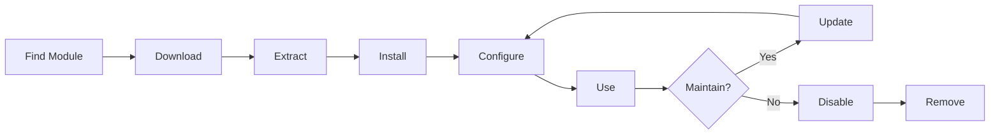

# XOOPS मॉड्यूल स्थापित करना और प्रबंधित करना

मॉड्यूल स्थापित और कॉन्फ़िगर करके XOOPS कार्यक्षमता को बढ़ाने का तरीका जानें।

## XOOPS मॉड्यूल को समझना

### मॉड्यूल क्या हैं?

मॉड्यूल ऐसे एक्सटेंशन हैं जो XOOPS में कार्यक्षमता जोड़ते हैं:

| प्रकार | उद्देश्य | उदाहरण |
|---|---|---|
| **सामग्री** | विशिष्ट सामग्री प्रकार प्रबंधित करें | समाचार, ब्लॉग, टिकट |
| **समुदाय** | उपयोगकर्ता सहभागिता | फोरम, टिप्पणियाँ, समीक्षाएँ |
| **ईकॉमर्स** | उत्पाद बेचना | दुकान, गाड़ी, भुगतान |
| **मीडिया** | फ़ाइलें/छवियाँ संभालें | गैलरी, डाउनलोड, वीडियो |
| **उपयोगिता** | उपकरण और सहायक | ईमेल, बैकअप, एनालिटिक्स |

### कोर बनाम वैकल्पिक मॉड्यूल

| मॉड्यूल | प्रकार | सम्मिलित | हटाने योग्य |
|---|---|---|---|
| **सिस्टम** | कोर | हाँ | नहीं |
| **उपयोगकर्ता** | कोर | हाँ | नहीं |
| **प्रोफ़ाइल** | अनुशंसित | हाँ | हाँ |
| **प्रधानमंत्री (निजी संदेश)** | अनुशंसित | हाँ | हाँ |
| **डब्ल्यूएफ-चैनल** | वैकल्पिक | अक्सर | हाँ |
| **समाचार** | वैकल्पिक | नहीं | हाँ |
| **फोरम** | वैकल्पिक | नहीं | हाँ |

## मॉड्यूल जीवनचक्र



## मॉड्यूल ढूँढना

### XOOPS मॉड्यूल रिपॉजिटरी

आधिकारिक XOOPS मॉड्यूल भंडार:

**विज़िट:** https://xoops.org/modules/repository/

```
Directory > Modules > [Browse Categories]
```

श्रेणी के अनुसार ब्राउज़ करें:
- सामग्री प्रबंधन
- समुदाय
- ईकॉमर्स
- मल्टीमीडिया
- विकास
- साइट प्रशासन

### मॉड्यूल का मूल्यांकन

इंस्टॉल करने से पहले जांच लें:

| Criteria | क्या देखना है |
|---|---|
| **संगतता** | आपके XOOPS संस्करण के साथ काम करता है |
| **रेटिंग** | अच्छी उपयोगकर्ता समीक्षाएँ और रेटिंग |
| **अपडेट** | हाल ही में बनाए रखा गया |
| **डाउनलोड** | लोकप्रिय और व्यापक रूप से उपयोग किया जाने वाला |
| **आवश्यकताएँ** | आपके सर्वर के साथ संगत |
| **लाइसेंस** | जीपीएल या समान खुला स्रोत |
| **समर्थन** | सक्रिय डेवलपर और समुदाय |

### मॉड्यूल जानकारी पढ़ें

प्रत्येक मॉड्यूल सूची से पता चलता है:

```
Module Name: [Name]
Version: [X.X.X]
Requires: XOOPS [Version]
Author: [Name]
Last Update: [Date]
Downloads: [Number]
Rating: [Stars]
Description: [Brief description]
Compatibility: PHP [Version], MySQL [Version]
```

## मॉड्यूल स्थापित करना

### विधि 1: व्यवस्थापक पैनल स्थापना

**चरण 1: एक्सेस मॉड्यूल अनुभाग**

1. एडमिन पैनल में लॉग इन करें
2. **मॉड्यूल > मॉड्यूल** पर नेविगेट करें
3. **"नया मॉड्यूल इंस्टॉल करें"** या **"मॉड्यूल ब्राउज़ करें"** पर क्लिक करें

**चरण 2: मॉड्यूल अपलोड करें**

विकल्प ए - सीधा अपलोड:
1. **"फ़ाइल चुनें"** पर क्लिक करें
2. कंप्यूटर से मॉड्यूल .ज़िप फ़ाइल का चयन करें
3. **"अपलोड"** पर क्लिक करें

विकल्प बी - URL अपलोड:
1. मॉड्यूल URL चिपकाएँ
2. **"डाउनलोड और इंस्टॉल करें"** पर क्लिक करें

**चरण 3: मॉड्यूल जानकारी की समीक्षा करें**

```
Module Name: [Name shown]
Version: [Version]
Author: [Author info]
Description: [Full description]
Requirements: [PHP/MySQL versions]
```

समीक्षा करें और **"इंस्टॉलेशन के साथ आगे बढ़ें"** पर क्लिक करें

**चरण 4: इंस्टॉल प्रकार चुनें**

```
☐ Fresh Install (New installation)
☐ Update (Upgrade existing)
☐ Delete Then Install (Replace existing)
```

उचित विकल्प का चयन करें.

**चरण 5: स्थापना की पुष्टि करें**

अंतिम पुष्टि की समीक्षा करें:
```
Module will be installed to: /modules/modulename/
Database: xoops_db
Proceed? [Yes] [No]
```

पुष्टि करने के लिए **"हाँ"** पर क्लिक करें।

**चरण 6: स्थापना पूर्ण**

```
Installation successful!

Module: [Module Name]
Version: [Version]
Tables created: [Number]
Files installed: [Number]

[Go to Module Settings]  [Return to Modules]
```

### विधि 2: मैन्युअल इंस्टालेशन (उन्नत)

मैन्युअल स्थापना या समस्या निवारण के लिए:

**चरण 1: मॉड्यूल डाउनलोड करें**

1. रिपॉजिटरी से मॉड्यूल .zip डाउनलोड करें
2. `/var/www/html/xoops/modules/modulename/` पर निकालें

```bash
# Extract module
unzip module_name.zip
cp -r module_name /var/www/html/xoops/modules/

# Set permissions
chmod -R 755 /var/www/html/xoops/modules/module_name
```

**चरण 2: इंस्टालेशन स्क्रिप्ट चलाएँ**

```
Visit: http://your-domain.com/xoops/modules/module_name/admin/index.php?op=install
```

या व्यवस्थापक पैनल के माध्यम से (सिस्टम > मॉड्यूल > अपडेट डीबी)।

**चरण 3: स्थापना सत्यापित करें**

1. एडमिन में **मॉड्यूल > मॉड्यूल** पर जाएँ
2. सूची में अपना मॉड्यूल देखें
3. सत्यापित करें कि यह "सक्रिय" के रूप में दिखता है

## मॉड्यूल कॉन्फ़िगरेशन

### एक्सेस मॉड्यूल सेटिंग्स

1. **मॉड्यूल > मॉड्यूल** पर जाएं
2. अपना मॉड्यूल ढूंढें
3. मॉड्यूल नाम पर क्लिक करें
4. **"वरीयताएँ"** या **"सेटिंग्स"** पर क्लिक करें

### सामान्य मॉड्यूल सेटिंग्स

अधिकांश मॉड्यूल ऑफ़र करते हैं:

```
Module Status: [Enabled/Disabled]
Display in Menu: [Yes/No]
Module Weight: [1-999](display order)
Visible To Groups: [Checkboxes for user groups]
```

### मॉड्यूल-विशिष्ट विकल्प

प्रत्येक मॉड्यूल में अद्वितीय सेटिंग्स होती हैं। उदाहरण:

**समाचार मॉड्यूल:**
```
Items Per Page: 10
Show Author: Yes
Allow Comments: Yes
Moderation Required: Yes
```

**फोरम मॉड्यूल:**
```
Topics Per Page: 20
Posts Per Page: 15
Maximum Attachment Size: 5MB
Enable Signatures: Yes
```

**गैलरी मॉड्यूल:**
```
Images Per Page: 12
Thumbnail Size: 150x150
Maximum Upload: 10MB
Watermark: Yes/No
```

विशिष्ट विकल्पों के लिए अपने मॉड्यूल दस्तावेज़ की समीक्षा करें।

### कॉन्फ़िगरेशन सहेजें

सेटिंग्स समायोजित करने के बाद:1. **"सबमिट"** या **"सहेजें"** पर क्लिक करें
2. आपको पुष्टिकरण दिखाई देगा:
   ```
   Settings saved successfully!
   ```

## मॉड्यूल ब्लॉकों का प्रबंधन

कई मॉड्यूल "ब्लॉक" बनाते हैं - विजेट-जैसे सामग्री क्षेत्र।

### मॉड्यूल ब्लॉक देखें

1. **प्रकटन > ब्लॉक** पर जाएं
2. अपने मॉड्यूल से ब्लॉक देखें
3. अधिकांश मॉड्यूल "[मॉड्यूल नाम] - [ब्लॉक विवरण]" दिखाते हैं

### ब्लॉक कॉन्फ़िगर करें

1. ब्लॉक नाम पर क्लिक करें
2. समायोजित करें:
   - ब्लॉक शीर्षक
   - दृश्यता (सभी पृष्ठ या विशिष्ट)
   - पृष्ठ पर स्थिति (बाएँ, मध्य, दाएँ)
   - उपयोगकर्ता समूह जो देख सकते हैं
3. **"सबमिट करें"** पर क्लिक करें

### मुखपृष्ठ पर ब्लॉक प्रदर्शित करें

1. **प्रकटन > ब्लॉक** पर जाएं
2. वह ब्लॉक ढूंढें जो आप चाहते हैं
3. **"संपादित करें"** पर क्लिक करें
4. सेट:
   - **इसके लिए दृश्यमान:** समूहों का चयन करें
   - **स्थिति:** कॉलम चुनें (बाएं/केंद्र/दाएं)
   - **पेज:** होमपेज या सभी पेज
5. **"सबमिट"** पर क्लिक करें

## विशिष्ट मॉड्यूल उदाहरण स्थापित करना

### समाचार मॉड्यूल स्थापित करना

**इसके लिए बिल्कुल सही:** ब्लॉग पोस्ट, घोषणाएँ

1. रिपॉजिटरी से समाचार मॉड्यूल डाउनलोड करें
2. **मॉड्यूल > मॉड्यूल > इंस्टॉल** के माध्यम से अपलोड करें
3. **मॉड्यूल > समाचार > प्राथमिकताएँ** में कॉन्फ़िगर करें:
   - प्रति पृष्ठ कहानियाँ: 10
   - टिप्पणियों की अनुमति दें: हाँ
   - प्रकाशन से पहले अनुमोदन करें: हाँ
4. नवीनतम समाचारों के लिए ब्लॉक बनाएं
5. कहानियाँ प्रकाशित करना शुरू करें!

### फोरम मॉड्यूल स्थापित करना

**इसके लिए बिल्कुल सही:** सामुदायिक चर्चा

1. फोरम मॉड्यूल डाउनलोड करें
2. व्यवस्थापक पैनल के माध्यम से स्थापित करें
3. मॉड्यूल में फोरम श्रेणियां बनाएं
4. सेटिंग्स कॉन्फ़िगर करें:
   - विषय/पेज: 20
   - पोस्ट/पेज: 15
   - मॉडरेशन सक्षम करें: हाँ
5. उपयोगकर्ता समूहों को अनुमतियाँ निर्दिष्ट करें
6. नवीनतम विषयों के लिए ब्लॉक बनाएं

### गैलरी मॉड्यूल स्थापित करना

**इसके लिए बिल्कुल सही:** छवि शोकेस

1. गैलरी मॉड्यूल डाउनलोड करें
2. स्थापित करें और कॉन्फ़िगर करें
3. फोटो एलबम बनाएं
4. छवियाँ अपलोड करें
5. देखने/अपलोड करने के लिए अनुमतियाँ सेट करें
6. वेबसाइट पर गैलरी प्रदर्शित करें

## मॉड्यूल अद्यतन करना

### अद्यतनों की जाँच करें

```
Admin Panel > Modules > Modules > Check for Updates
```

इससे पता चलता है:
- उपलब्ध मॉड्यूल अपडेट
- वर्तमान बनाम नया संस्करण
- चेंजलॉग/रिलीज़ नोट्स

### एक मॉड्यूल अपडेट करें

1. **मॉड्यूल > मॉड्यूल** पर जाएं
2. उपलब्ध अद्यतन के साथ मॉड्यूल पर क्लिक करें
3. **"अपडेट"** बटन पर क्लिक करें
4. इंस्टॉल प्रकार से **"अपडेट" चुनें**
5. इंस्टॉलेशन विज़ार्ड का पालन करें
6. मॉड्यूल अपडेट किया गया!

### महत्वपूर्ण अद्यतन नोट्स

अद्यतन करने से पहले:

- [ ] बैकअप डेटाबेस
- [ ] बैकअप मॉड्यूल फ़ाइलें
- [ ] चेंजलॉग की समीक्षा करें
- [ ] पहले स्टेजिंग सर्वर पर परीक्षण करें
- [ ] किसी भी कस्टम संशोधन पर ध्यान दें

अद्यतन करने के बाद:
- [ ] कार्यक्षमता सत्यापित करें
- [ ] मॉड्यूल सेटिंग्स की जाँच करें
- [ ] चेतावनियों/त्रुटियों के लिए समीक्षा करें
- [ ] कैश साफ़ करें

## मॉड्यूल अनुमतियाँ

### उपयोगकर्ता समूह पहुंच निर्दिष्ट करें

नियंत्रित करें कि कौन से उपयोगकर्ता समूह मॉड्यूल तक पहुंच सकते हैं:

**स्थान:** सिस्टम > अनुमतियाँ

प्रत्येक मॉड्यूल के लिए, कॉन्फ़िगर करें:

```
Module: [Module Name]

Admin Access: [Select groups]
User Access: [Select groups]
Read Permission: [Groups allowed to view]
Write Permission: [Groups allowed to post]
Delete Permission: [Administrators only]
```

### सामान्य अनुमति स्तर

```
Public Content (News, Pages):
├── Admin Access: Webmaster
├── User Access: All logged-in users
└── Read Permission: Everyone

Community Features (Forum, Comments):
├── Admin Access: Webmaster, Moderators
├── User Access: All logged-in users
└── Write Permission: All logged-in users

Admin Tools:
├── Admin Access: Webmaster only
└── User Access: Disabled
```

## मॉड्यूल को अक्षम करना और हटाना

### मॉड्यूल अक्षम करें (फ़ाइलें रखें)

मॉड्यूल रखें लेकिन साइट से छिपाएँ:

1. **मॉड्यूल > मॉड्यूल** पर जाएं
2. मॉड्यूल खोजें
3. मॉड्यूल नाम पर क्लिक करें
4. **"अक्षम करें"** पर क्लिक करें या स्थिति को निष्क्रिय पर सेट करें
5. मॉड्यूल छिपा हुआ है लेकिन डेटा संरक्षित है

किसी भी समय पुन: सक्षम करें:
1. मॉड्यूल पर क्लिक करें
2. **"सक्षम करें"** पर क्लिक करें

### मॉड्यूल को पूरी तरह से हटा दें

मॉड्यूल और उसका डेटा हटाएं:

1. **मॉड्यूल > मॉड्यूल** पर जाएं
2. मॉड्यूल खोजें
3. **"अनइंस्टॉल"** या **"डिलीट"** पर क्लिक करें
4. पुष्टि करें: "मॉड्यूल और सभी डेटा हटाएं?"
5. पुष्टि करने के लिए **"हाँ"** पर क्लिक करें

**चेतावनी:** अनइंस्टॉल करने से सभी मॉड्यूल डेटा नष्ट हो जाता है!

### अनइंस्टॉल के बाद पुनः इंस्टॉल करें

यदि आप किसी मॉड्यूल को अनइंस्टॉल करते हैं:
- मॉड्यूल फ़ाइलें हटा दी गईं
- डेटाबेस तालिकाएँ हटा दी गईं
- सारा डेटा नष्ट हो गया
- दोबारा उपयोग करने के लिए पुनः इंस्टॉल करना होगा
- बैकअप से रिस्टोर कर सकते हैं

## समस्या निवारण मॉड्यूल स्थापना

### इंस्टॉल के बाद मॉड्यूल दिखाई नहीं दे रहा है**लक्षण:** मॉड्यूल सूचीबद्ध है लेकिन साइट पर दिखाई नहीं दे रहा है

**समाधान:**
```
1. Check module is "Active" (Modules > Modules)
2. Enable module blocks (Appearance > Blocks)
3. Verify user permissions (System > Permissions)
4. Clear cache (System > Tools > Clear Cache)
5. Check .htaccess doesn't block module
```

### स्थापना त्रुटि: "तालिका पहले से मौजूद है"

**लक्षण:** मॉड्यूल स्थापना के दौरान त्रुटि

**समाधान:**
```
1. Module partially installed before
2. Try "Delete then Install" option
3. Or uninstall first, then install fresh
4. Check database for existing tables:
   mysql> SHOW TABLES LIKE 'xoops_module%';
```

### मॉड्यूल गुम निर्भरताएँ

**लक्षण:** मॉड्यूल स्थापित नहीं होगा - अन्य मॉड्यूल की आवश्यकता है

**समाधान:**
```
1. Note required modules from error message
2. Install required modules first
3. Then install the module
4. Install in correct order
```

### मॉड्यूल तक पहुँचने पर रिक्त पृष्ठ

**लक्षण:** मॉड्यूल लोड होता है लेकिन कुछ नहीं दिखाता

**समाधान:**
```
1. Enable debug mode in mainfile.php:
   define('XOOPS_DEBUG', 1);

2. Check PHP error log:
   tail -f /var/log/php_errors.log

3. Verify file permissions:
   chmod -R 755 /var/www/html/xoops/modules/modulename

4. Check database connection in module config

5. Disable module and reinstall
```

### मॉड्यूल साइट को तोड़ता है

**लक्षण:** मॉड्यूल स्थापित करने से वेबसाइट टूट जाती है

**समाधान:**
```
1. Disable the problematic module immediately:
   Admin > Modules > [Module] > Disable

2. Clear cache:
   rm -rf /var/www/html/xoops/cache/*
   rm -rf /var/www/html/xoops/templates_c/*

3. Restore from backup if needed

4. Check error logs for root cause

5. Contact module developer
```

## मॉड्यूल सुरक्षा संबंधी विचार

### केवल विश्वसनीय स्रोतों से ही इंस्टॉल करें

```
✓ Official XOOPS Repository
✓ GitHub official XOOPS modules
✓ Trusted module developers
✗ Unknown websites
✗ Unverified sources
```

### मॉड्यूल अनुमतियाँ जाँचें

स्थापना के बाद:

1. संदिग्ध गतिविधि के लिए मॉड्यूल कोड की समीक्षा करें
2. विसंगतियों के लिए डेटाबेस तालिकाओं की जाँच करें
3. फ़ाइल परिवर्तनों की निगरानी करें
4. मॉड्यूल को अद्यतन रखें
5. अप्रयुक्त मॉड्यूल हटाएं

### अनुमतियाँ सर्वोत्तम अभ्यास

```
Module directory: 755 (readable, not writable by web server)
Module files: 644 (readable only)
Module data: Protected by database
```

## मॉड्यूल विकास संसाधन

### मॉड्यूल विकास सीखें

- आधिकारिक दस्तावेज़ीकरण: https://xoops.org/
- GitHub रिपोजिटरी: https://github.com/XOOPS/
- सामुदायिक मंच: https://xoops.org/modules/newbb/
- डेवलपर गाइड: डॉक्स फ़ोल्डर में उपलब्ध है

## मॉड्यूल के लिए सर्वोत्तम अभ्यास

1. **एक समय में एक इंस्टॉल करें:** विवादों पर नज़र रखें
2. **इंस्टॉल करने के बाद परीक्षण करें:** कार्यक्षमता सत्यापित करें
3. **दस्तावेज़ कस्टम कॉन्फ़िगरेशन:** अपनी सेटिंग्स नोट करें
4. **अपडेट रखें:** मॉड्यूल अपडेट तुरंत इंस्टॉल करें
5. **अप्रयुक्त को हटाएं:** उन मॉड्यूल को हटाएं जिनकी आवश्यकता नहीं है
6. **पहले बैकअप:** इंस्टॉल करने से पहले हमेशा बैकअप लें
7. **दस्तावेज़ीकरण पढ़ें:** मॉड्यूल निर्देश जांचें
8. **समुदाय से जुड़ें:** जरूरत पड़ने पर मदद मांगें

## मॉड्यूल इंस्टालेशन चेकलिस्ट

प्रत्येक मॉड्यूल स्थापना के लिए:

- [ ] शोध करें और समीक्षाएँ पढ़ें
- [ ] XOOPS संस्करण संगतता सत्यापित करें
- [ ] बैकअप डेटाबेस और फ़ाइलें
- [ ] नवीनतम संस्करण डाउनलोड करें
- [ ] व्यवस्थापक पैनल के माध्यम से इंस्टॉल करें
- [ ] सेटिंग्स कॉन्फ़िगर करें
- [ ] ब्लॉक बनाएं/पोज़िशन करें
- [ ] उपयोगकर्ता अनुमतियाँ सेट करें
- [ ] परीक्षण कार्यक्षमता
- [ ] दस्तावेज़ विन्यास
- [ ] अपडेट के लिए शेड्यूल

## अगले चरण

मॉड्यूल स्थापित करने के बाद:

1. मॉड्यूल के लिए सामग्री बनाएं
2. उपयोगकर्ता समूह स्थापित करें
3. व्यवस्थापक सुविधाओं का अन्वेषण करें
4. प्रदर्शन को अनुकूलित करें
5. आवश्यकतानुसार अतिरिक्त मॉड्यूल स्थापित करें

---

**टैग:** #मॉड्यूल #इंस्टॉलेशन #एक्सटेंशन #प्रबंधन

**संबंधित लेख:**
- एडमिन-पैनल-अवलोकन
- प्रबंध-उपयोगकर्ता
- अपना प्रथम पृष्ठ बनाना
- ../कॉन्फ़िगरेशन/सिस्टम-सेटिंग्स