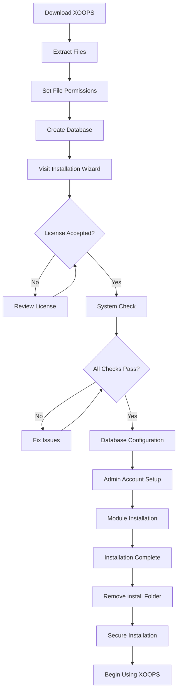

# पूर्ण XOOPS इंस्टालेशन गाइड

यह मार्गदर्शिका इंस्टॉलेशन विज़ार्ड का उपयोग करके स्क्रैच से XOOPS इंस्टॉल करने के लिए एक व्यापक पूर्वाभ्यास प्रदान करती है।

## पूर्वावश्यकताएँ

इंस्टालेशन शुरू करने से पहले, सुनिश्चित करें कि आपके पास:

- एफ़टीपी या एसएसएच के माध्यम से अपने वेब सर्वर तक पहुंच
- आपके डेटाबेस सर्वर तक प्रशासक की पहुंच
- एक पंजीकृत डोमेन नाम
- सर्वर आवश्यकताएँ सत्यापित
- बैकअप उपकरण उपलब्ध हैं

## स्थापना प्रक्रिया



## चरण-दर-चरण स्थापना

### चरण 1: XOOPS डाउनलोड करें

[https://xoops.org/]https://xoops.org/ से नवीनतम संस्करण डाउनलोड करें:

```bash
# Using wget
wget https://xoops.org/download/xoops-2.5.8.zip

# Using curl
curl -O https://xoops.org/download/xoops-2.5.8.zip
```

### चरण 2: फ़ाइलें निकालें

XOOPS संग्रह को अपने वेब रूट पर निकालें:

```bash
# Navigate to web root
cd /var/www/html

# Extract XOOPS
unzip xoops-2.5.8.zip

# Rename folder (optional, but recommended)
mv xoops-2.5.8 xoops
cd xoops
```

### चरण 3: फ़ाइल अनुमतियाँ सेट करें

XOOPS निर्देशिकाओं के लिए उचित अनुमतियाँ सेट करें:

```bash
# Make directories writable (755 for dirs, 644 for files)
find . -type d -exec chmod 755 {} \;
find . -type f -exec chmod 644 {} \;

# Make specific directories writable by web server
chmod 777 uploads/
chmod 777 templates_c/
chmod 777 var/
chmod 777 cache/

# Secure mainfile.php after installation
chmod 644 mainfile.php
```

### चरण 4: डेटाबेस बनाएं

MySQL का उपयोग करके XOOPS के लिए एक नया डेटाबेस बनाएं:

```sql
-- Create database
CREATE DATABASE xoops_db CHARACTER SET utf8mb4 COLLATE utf8mb4_unicode_ci;

-- Create user
CREATE USER 'xoops_user'@'localhost' IDENTIFIED BY 'secure_password_here';

-- Grant privileges
GRANT ALL PRIVILEGES ON xoops_db.* TO 'xoops_user'@'localhost';
FLUSH PRIVILEGES;
```

या phpMyAdmin का उपयोग करें:

1. phpMyAdmin में लॉग इन करें
2. "डेटाबेस" टैब पर क्लिक करें
3. डेटाबेस का नाम दर्ज करें: `xoops_db`
4. "utf8mb4_unicode_ci" संयोजन चुनें
5. "बनाएं" पर क्लिक करें
6. डेटाबेस के समान नाम वाला एक उपयोगकर्ता बनाएं
7. सभी विशेषाधिकार प्रदान करें

### चरण 5: इंस्टॉलेशन विज़ार्ड चलाएँ

अपना ब्राउज़र खोलें और यहां नेविगेट करें:

```
http://your-domain.com/xoops/install/
```

#### सिस्टम जांच चरण

विज़ार्ड आपके सर्वर कॉन्फ़िगरेशन की जाँच करता है:

- PHP संस्करण >=5.6.0
- MySQL/MariaDB उपलब्ध
- आवश्यक PHP एक्सटेंशन (जीडी, पीडीओ, आदि)
- निर्देशिका अनुमतियाँ
- डेटाबेस कनेक्टिविटी

**यदि जाँच विफल हो जाती है:**

समाधान के लिए #सामान्य-स्थापना-समस्याएँ अनुभाग देखें।

#### डेटाबेस कॉन्फ़िगरेशन

अपना डेटाबेस क्रेडेंशियल दर्ज करें:

```
Database Host: localhost
Database Name: xoops_db
Database User: xoops_user
Database Password: [your_secure_password]
Table Prefix: xoops_
```

**महत्वपूर्ण टिप्पणियाँ:**
- यदि आपका डेटाबेस होस्ट लोकलहोस्ट (उदाहरण के लिए, रिमोट सर्वर) से अलग है, तो सही होस्टनाम दर्ज करें
- यदि एक डेटाबेस में एकाधिक XOOPS इंस्टेंसेस चल रहे हों तो तालिका उपसर्ग मदद करता है
- मिश्रित केस, संख्या और प्रतीकों के साथ एक मजबूत पासवर्ड का उपयोग करें

#### व्यवस्थापक खाता सेटअप

अपना व्यवस्थापक खाता बनाएं:

```
Admin Username: admin (or choose custom)
Admin Email: admin@your-domain.com
Admin Password: [strong_unique_password]
Confirm Password: [repeat_password]
```

**सर्वोत्तम अभ्यास:**
- एक अद्वितीय उपयोक्तानाम का उपयोग करें, न कि "व्यवस्थापक" का
- 16+ अक्षर वाले पासवर्ड का उपयोग करें
- एक सुरक्षित पासवर्ड मैनेजर में क्रेडेंशियल स्टोर करें
- कभी भी एडमिन क्रेडेंशियल साझा न करें

#### मॉड्यूल स्थापना

स्थापित करने के लिए डिफ़ॉल्ट मॉड्यूल चुनें:

- **सिस्टम मॉड्यूल** (आवश्यक) - कोर XOOPS कार्यक्षमता
- **उपयोगकर्ता मॉड्यूल** (आवश्यक) - उपयोगकर्ता प्रबंधन
- **प्रोफ़ाइल मॉड्यूल** (अनुशंसित) - उपयोगकर्ता प्रोफ़ाइल
- **पीएम (निजी संदेश) मॉड्यूल** (अनुशंसित) - आंतरिक संदेश
- **डब्ल्यूएफ-चैनल मॉड्यूल** (वैकल्पिक) - सामग्री प्रबंधन

पूर्ण स्थापना के लिए सभी अनुशंसित मॉड्यूल का चयन करें।

### चरण 6: पूर्ण स्थापना

सभी चरणों के बाद, आपको एक पुष्टिकरण स्क्रीन दिखाई देगी:

```
Installation Complete!

Your XOOPS installation is ready to use.
Admin Panel: http://your-domain.com/xoops/admin/
User Panel: http://your-domain.com/xoops/
```

### चरण 7: अपना इंस्टालेशन सुरक्षित करें

#### इंस्टालेशन फ़ोल्डर हटाएँ

```bash
# Remove the install directory (CRITICAL for security)
rm -rf /var/www/html/xoops/install/

# Or rename it
mv /var/www/html/xoops/install/ /var/www/html/xoops/install.bak
```

**WARNING:** इंस्टॉल फ़ोल्डर को कभी भी उत्पादन में पहुंच योग्य न छोड़ें!

#### सुरक्षित mainfile.php

```bash
# Make mainfile.php read-only
chmod 644 /var/www/html/xoops/mainfile.php

# Set ownership
chown www-data:www-data /var/www/html/xoops/mainfile.php
```

#### उचित फ़ाइल अनुमतियाँ सेट करें

```bash
# Recommended production permissions
find . -type f -name "*.php" -exec chmod 644 {} \;
find . -type d -exec chmod 755 {} \;

# Writable directories for web server
chmod 777 uploads/ var/ cache/ templates_c/
```

#### HTTPS/एसएसएल सक्षम करें

अपने वेब सर्वर (nginx या Apache) में SSL कॉन्फ़िगर करें।

**अपाचे के लिए:**
```apache
<VirtualHost *:443>
    ServerName your-domain.com
    DocumentRoot /var/www/html/xoops

    SSLEngine on
    SSLCertificateFile /etc/ssl/certs/your-cert.crt
    SSLCertificateKeyFile /etc/ssl/private/your-key.key

    # Force HTTPS redirect
    <IfModule mod_rewrite.c>
        RewriteEngine On
        RewriteCond %{HTTPS} off
        RewriteRule ^(.*)$ https://%{HTTP_HOST}%{REQUEST_URI} [L,R=301]
    </IfModule>
</VirtualHost>
```

## इंस्टालेशन के बाद का कॉन्फ़िगरेशन

### 1. एडमिन पैनल तक पहुंचें

इस पर नेविगेट करें:
```
http://your-domain.com/xoops/admin/
```

अपने व्यवस्थापक क्रेडेंशियल के साथ लॉगिन करें.

### 2. बुनियादी सेटिंग्स कॉन्फ़िगर करें

निम्नलिखित कॉन्फ़िगर करें:

- साइट का नाम और विवरण
- व्यवस्थापक ईमेल पता
- समयक्षेत्र और दिनांक प्रारूप
- खोज इंजन अनुकूलन

### 3. परीक्षण स्थापना

- [ ] होमपेज पर जाएँ
- [ ] मॉड्यूल लोड की जाँच करें
- [ ] उपयोगकर्ता पंजीकरण कार्यों को सत्यापित करें
- [ ] व्यवस्थापक पैनल कार्यों का परीक्षण करें
- [ ] SSL/HTTPS कार्यों की पुष्टि करें

### 4. बैकअप शेड्यूल करें

स्वचालित बैकअप सेट करें:

```bash
# Create backup script (backup.sh)
#!/bin/bash
DATE=$(date +%Y%m%d_%H%M%S)
BACKUP_DIR="/backups/xoops"
XOOPS_DIR="/var/www/html/xoops"

# Backup database
mysqldump -u xoops_user -p[password] xoops_db > $BACKUP_DIR/db_$DATE.sql

# Backup files
tar -czf $BACKUP_DIR/files_$DATE.tar.gz $XOOPS_DIR

echo "Backup completed: $DATE"
```

क्रॉन के साथ शेड्यूल करें:
```bash
# Daily backup at 2 AM
0 2 * * * /usr/local/bin/backup.sh
```## सामान्य स्थापना समस्याएँ

### समस्या: अनुमति अस्वीकृत त्रुटियाँ

**लक्षण:** फ़ाइलें अपलोड करते या बनाते समय "अनुमति अस्वीकृत"।

**समाधान:**
```bash
# Check web server user
ps aux | grep apache  # For Apache
ps aux | grep nginx   # For Nginx

# Fix permissions (replace www-data with your web server user)
chown -R www-data:www-data /var/www/html/xoops
chmod -R 755 /var/www/html/xoops
chmod 777 uploads/ var/ cache/ templates_c/
```

### समस्या: डेटाबेस कनेक्शन विफल

**लक्षण:** "डेटाबेस सर्वर से कनेक्ट नहीं हो सकता"

**समाधान:**
1. इंस्टॉलेशन विज़ार्ड में डेटाबेस क्रेडेंशियल सत्यापित करें
2. जांचें कि MySQL/MariaDB चल रहा है:
   ```bash
   service mysql status  # or mariadb
   ```
3. सत्यापित करें कि डेटाबेस मौजूद है:
   ```sql
   SHOW DATABASES;
   ```
4. कमांड लाइन से टेस्ट कनेक्शन:
   ```bash
   mysql -h localhost -u xoops_user -p xoops_db
   ```

### समस्या: खाली सफेद स्क्रीन

**लक्षण:** XOOPS पर जाने पर खाली पेज दिखता है

**समाधान:**
1. PHP त्रुटि लॉग जांचें:
   ```bash
   tail -f /var/log/apache2/error.log
   ```
2. mainfile.php में डिबग मोड सक्षम करें:
   ```php
   define('XOOPS_DEBUG', 1);
   ```
3. mainfile.php और config फ़ाइलों पर फ़ाइल अनुमतियाँ जाँचें
4. सत्यापित करें कि PHP-MySQL एक्सटेंशन स्थापित है

### समस्या: अपलोड निर्देशिका में नहीं लिखा जा सकता

**लक्षण:** अपलोड सुविधा विफल, "अपलोड पर नहीं लिखा जा सकता/"

**समाधान:**
```bash
# Check current permissions
ls -la uploads/

# Fix permissions
chmod 777 uploads/
chown www-data:www-data uploads/

# For specific files
chmod 644 uploads/*
```

### समस्या: PHP एक्सटेंशन गायब हैं

**लक्षण:** अनुपलब्ध एक्सटेंशन (जीडी, MySQL, आदि) के साथ सिस्टम जांच विफल हो जाती है।

**समाधान (उबंटू/डेबियन):**
```bash
# Install PHP GD library
apt-get install php-gd

# Install PHP MySQL support
apt-get install php-mysql

# Restart web server
systemctl restart apache2  # or nginx
```

**समाधान (CentOS/RHEL):**
```bash
# Install PHP GD library
yum install php-gd

# Install PHP MySQL support
yum install php-mysql

# Restart web server
systemctl restart httpd
```

### समस्या: धीमी स्थापना प्रक्रिया

**लक्षण:** इंस्टालेशन विज़ार्ड का समय समाप्त हो गया है या बहुत धीमी गति से चलता है

**समाधान:**
1. php.ini में PHP टाइमआउट बढ़ाएँ:
   ```ini
   max_execution_time = 300  # 5 minutes
   ```
2. MySQL max_allowed_packet बढ़ाएँ:
   ```sql
   SET GLOBAL max_allowed_packet = 256M;
   ```
3. सर्वर संसाधनों की जाँच करें:
   ```bash
   free -h  # Check RAM
   df -h    # Check disk space
   ```

### समस्या: एडमिन पैनल पहुंच योग्य नहीं है

**लक्षण:** इंस्टालेशन के बाद एडमिन पैनल तक नहीं पहुंच सकता

**समाधान:**
1. सत्यापित करें कि व्यवस्थापक उपयोगकर्ता डेटाबेस में मौजूद है:
   ```sql
   SELECT * FROM xoops_users WHERE uid = 1;
   ```
2. ब्राउज़र कैश और कुकीज़ साफ़ करें
3. जांचें कि क्या सत्र फ़ोल्डर लिखने योग्य है:
   ```bash
   chmod 777 var/
   ```
4. सत्यापित करें कि htaccess नियम व्यवस्थापक पहुंच को अवरुद्ध नहीं करते हैं

## सत्यापन चेकलिस्ट

स्थापना के बाद, सत्यापित करें:

- [x] XOOPS होमपेज सही ढंग से लोड होता है
- [x] एडमिन पैनल /xoops/admin/ पर पहुंच योग्य है
- [x] SSL/HTTPS काम कर रहा है
- [x] इंस्टॉल फ़ोल्डर हटा दिया गया है या पहुंच योग्य नहीं है
- [x] फ़ाइल अनुमतियाँ सुरक्षित हैं (फ़ाइलों के लिए 644, डीआईआर के लिए 755)
- [x] डेटाबेस बैकअप निर्धारित हैं
- [x] मॉड्यूल त्रुटियों के बिना लोड होते हैं
- [x] उपयोगकर्ता पंजीकरण प्रणाली काम करती है
- [x] फ़ाइल अपलोड कार्यक्षमता काम करती है
- [x] ईमेल सूचनाएं ठीक से भेजी जाती हैं

## अगले चरण

एक बार इंस्टॉलेशन पूरा हो जाने पर:

1. बुनियादी कॉन्फ़िगरेशन मार्गदर्शिका पढ़ें
2. अपनी स्थापना सुरक्षित करें
3. व्यवस्थापक पैनल का अन्वेषण करें
4. अतिरिक्त मॉड्यूल स्थापित करें
5. उपयोगकर्ता समूह और अनुमतियाँ सेट करें

---

**टैग्स:** #इंस्टॉलेशन #सेटअप #आरंभ करना #समस्या निवारण

**संबंधित लेख:**
- सर्वर-आवश्यकताएँ
- उन्नयन-XOOPS
- ../कॉन्फ़िगरेशन/सुरक्षा-कॉन्फ़िगरेशन