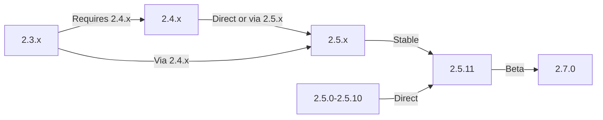

यह मार्गदर्शिका आपके डेटा और अनुकूलन को संरक्षित करते हुए XOOPS को पुराने संस्करणों से नवीनतम रिलीज़ में अपग्रेड करना शामिल करती है।

> **संस्करण जानकारी**
> - **स्थिर:** XOOPS 2.5.11
> - **बीटा:** XOOPS 2.7.0 (परीक्षण)
> - **भविष्य:** XOOPS 4.0 (विकास में - रोडमैप देखें)

## प्री-अपग्रेड चेकलिस्ट

अपग्रेड शुरू करने से पहले, सत्यापित करें:

- [ ] वर्तमान XOOPS संस्करण प्रलेखित
- [ ] लक्ष्य @@00043@@ संस्करण की पहचान की गई
- [ ] पूर्ण सिस्टम बैकअप पूरा हो गया
- [ ] डेटाबेस बैकअप सत्यापित
- [ ] स्थापित मॉड्यूल सूची दर्ज की गई
- [ ] कस्टम संशोधनों का दस्तावेजीकरण किया गया
- [ ] परीक्षण वातावरण उपलब्ध है
- [ ] अपग्रेड पथ की जाँच की गई (कुछ संस्करण मध्यवर्ती रिलीज़ को छोड़ देते हैं)
- [ ] सर्वर संसाधन सत्यापित (पर्याप्त डिस्क स्थान, मेमोरी)
- [ ] रखरखाव मोड सक्षम

## अपग्रेड पाथ गाइड

वर्तमान संस्करण के आधार पर विभिन्न उन्नयन पथ:



**महत्वपूर्ण:** प्रमुख संस्करणों को कभी न छोड़ें। यदि 2.3.x से अपग्रेड कर रहे हैं, तो पहले 2.4.x पर अपग्रेड करें, फिर 2.5.x पर।

## चरण 1: सिस्टम बैकअप पूरा करें

### डेटाबेस बैकअप

mysqldump to backup the database: का प्रयोग करें

```bash
# Full database backup
mysqldump -u xoops_user -p xoops_db > /backups/xoops_db_backup_$(date +%Y%m%d_%H%M%S).sql

# Compressed backup
mysqldump -u xoops_user -p xoops_db | gzip > /backups/xoops_db_backup_$(date +%Y%m%d_%H%M%S).sql.gz
```

या phpMyAdmin का उपयोग करें:

1. अपना XOOPS डेटाबेस चुनें
2. "निर्यात" टैब पर क्लिक करें
3. "SQL" प्रारूप चुनें
4. "फ़ाइल के रूप में सहेजें" चुनें
5. "जाओ" पर क्लिक करें

बैकअप फ़ाइल सत्यापित करें:

```bash
# Check backup size
ls -lh /backups/xoops_db_backup*.sql

# Verify backup integrity (uncompressed)
head -20 /backups/xoops_db_backup_*.sql

# Verify compressed backup
zcat /backups/xoops_db_backup_*.sql.gz | head -20
```

### फ़ाइल सिस्टम बैकअप

सभी XOOPS फ़ाइलों का बैकअप लें:

```bash
# Compressed file backup
tar -czf /backups/xoops_files_$(date +%Y%m%d_%H%M%S).tar.gz /var/www/html/xoops

# Uncompressed (faster, requires more disk space)
tar -cf /backups/xoops_files_$(date +%Y%m%d_%H%M%S).tar /var/www/html/xoops

# Show backup progress
tar -czf /backups/xoops_files_$(date +%Y%m%d_%H%M%S).tar.gz --verbose /var/www/html/xoops | tail
```

बैकअप सुरक्षित रूप से संग्रहीत करें:

```bash
# Secure backup storage
chmod 600 /backups/xoops_*
ls -lah /backups/

# Optional: Copy to remote storage
scp /backups/xoops_* user@backup-server:/secure/backups/
```

### परीक्षण बैकअप बहाली

**CRITICAL:** हमेशा अपने बैकअप कार्यों का परीक्षण करें:

```bash
# Verify tar archive contents
tar -tzf /backups/xoops_files_*.tar.gz | head -20

# Extract to test location
mkdir /tmp/restore_test
cd /tmp/restore_test
tar -xzf /backups/xoops_files_*.tar.gz

# Verify key files exist
ls -la xoops/mainfile.php
ls -la xoops/install/
```

## चरण 2: रखरखाव मोड सक्षम करें

अपग्रेड के दौरान उपयोगकर्ताओं को साइट तक पहुंचने से रोकें:

### विकल्प 1: XOOPS एडमिन पैनल

1. एडमिन पैनल में लॉग इन करें
2. सिस्टम > रखरखाव पर जाएँ
3. "साइट रखरखाव मोड" सक्षम करें
4. रखरखाव संदेश सेट करें
5. सहेजें

### विकल्प 2: मैन्युअल रखरखाव मोड

वेब रूट पर एक रखरखाव फ़ाइल बनाएँ:

```html
<!-- /var/www/html/maintenance.html -->
<!DOCTYPE html>
<html>
<head>
    <title>Under Maintenance</title>
    <style>
        body { font-family: Arial; text-align: center; padding: 50px; }
        h1 { color: #333; }
        p { color: #666; margin: 20px 0; }
    </style>
</head>
<body>
    <h1>Site Under Maintenance</h1>
    <p>We're currently upgrading our site.</p>
    <p>Expected time: approximately 30 minutes.</p>
    <p>Thank you for your patience!</p>
</body>
</html>
```

रखरखाव पृष्ठ दिखाने के लिए अपाचे को कॉन्फ़िगर करें:

```apache
# In .htaccess or vhost config
ErrorDocument 503 /maintenance.html

# Redirect all traffic to maintenance page
<IfModule mod_rewrite.c>
    RewriteEngine On
    RewriteCond %{REMOTE_ADDR} !^192\.168\.1\.100$  # Your IP
    RewriteRule ^(.*)$ - [R=503,L]
</IfModule>
```

## चरण 3: नया संस्करण डाउनलोड करें

आधिकारिक साइट से XOOPS डाउनलोड करें:

```bash
# Download latest version
cd /tmp
wget https://xoops.org/download/xoops-2.5.8.zip

# Verify checksum (if provided)
sha256sum xoops-2.5.8.zip
# Compare with official SHA256 hash

# Extract to temporary location
unzip xoops-2.5.8.zip
cd xoops-2.5.8
```

## चरण 4: प्री-अपग्रेड फ़ाइल तैयार करना

### कस्टम संशोधनों को पहचानें

अनुकूलित कोर फ़ाइलों की जाँच करें:

```bash
# Look for modified files (files with newer mtime)
find /var/www/html/xoops -type f -newer /var/www/html/xoops/install.php

# Check for custom themes
ls /var/www/html/xoops/themes/
# Note any custom themes

# Check for custom modules
ls /var/www/html/xoops/modules/
# Note any custom modules created by you
```

### दस्तावेज़ की वर्तमान स्थिति

एक अपग्रेड रिपोर्ट बनाएं:

```bash
cat > /tmp/upgrade_report.txt << EOF
=== XOOPS Upgrade Report ===
Date: $(date)
Current Version: 2.5.6
Target Version: 2.5.8

=== Installed Modules ===
$(ls /var/www/html/xoops/modules/)

=== Custom Modifications ===
[Document any custom theme or module modifications]

=== Themes ===
$(ls /var/www/html/xoops/themes/)

=== Plugin Status ===
[List any custom code modifications]

EOF
```

## चरण 5: नई फ़ाइलों को वर्तमान इंस्टॉलेशन के साथ मर्ज करें

### रणनीति: कस्टम फ़ाइलें सुरक्षित रखें

XOOPS कोर फ़ाइलें बदलें लेकिन संरक्षित करें:
- `mainfile.php` (आपका डेटाबेस कॉन्फ़िगरेशन)
- `themes/` में कस्टम थीम
- `modules/` में कस्टम मॉड्यूल
- उपयोगकर्ता `uploads/` में अपलोड करता है
- `var/` में साइट डेटा

### मैन्युअल मर्ज प्रक्रिया

```bash
# Set variables
XOOPS_OLD="/var/www/html/xoops"
XOOPS_NEW="/tmp/xoops-2.5.8"
BACKUP="/backups/pre-upgrade"

# Create pre-upgrade backup in place
mkdir -p $BACKUP
cp -r $XOOPS_OLD/* $BACKUP/

# Copy new files (but preserve sensitive files)
# Copy everything except protected directories
rsync -av --exclude='mainfile.php' \
    --exclude='modules/custom*' \
    --exclude='themes/custom*' \
    --exclude='uploads' \
    --exclude='var' \
    --exclude='cache' \
    --exclude='templates_c' \
    $XOOPS_NEW/ $XOOPS_OLD/

# Verify critical files preserved
ls -la $XOOPS_OLD/mainfile.php
```

### अपग्रेड.php का उपयोग करना (यदि उपलब्ध हो)

कुछ XOOPS संस्करणों में स्वचालित अपग्रेड स्क्रिप्ट शामिल है:

```bash
# Copy new files with installer
cp -r /tmp/xoops-2.5.8/* /var/www/html/xoops/

# Run upgrade wizard
# Visit: http://your-domain.com/xoops/upgrade/
```

### मर्ज के बाद फ़ाइल अनुमतियाँ

उचित अनुमतियाँ पुनर्स्थापित करें:

```bash
# Set ownership
chown -R www-data:www-data /var/www/html/xoops

# Set directory permissions
find /var/www/html/xoops -type d -exec chmod 755 {} \;

# Set file permissions
find /var/www/html/xoops -type f -exec chmod 644 {} \;

# Make writable directories
chmod 777 /var/www/html/xoops/cache
chmod 777 /var/www/html/xoops/templates_c
chmod 777 /var/www/html/xoops/uploads
chmod 777 /var/www/html/xoops/var

# Secure mainfile.php
chmod 644 /var/www/html/xoops/mainfile.php
```

## चरण 6: डेटाबेस माइग्रेशन

### डेटाबेस परिवर्तनों की समीक्षा करें

डेटाबेस संरचना में बदलाव के लिए XOOPS रिलीज़ नोट देखें:

```bash
# Extract and review SQL migration files
find /tmp/xoops-2.5.8 -name "*.sql" -type f
# Document all .sql files found
```

### डेटाबेस अद्यतन चलाएँ

### विकल्प 1: स्वचालित अद्यतन (यदि उपलब्ध हो)

व्यवस्थापक पैनल का उपयोग करें:

1. एडमिन में लॉग इन करें
2. **सिस्टम > डेटाबेस** पर जाएँ
3. "अपडेट जांचें" पर क्लिक करें
4. लंबित परिवर्तनों की समीक्षा करें
5. "अपडेट लागू करें" पर क्लिक करें

### विकल्प 2: मैन्युअल डेटाबेस अपडेट

माइग्रेशन SQL फ़ाइलें निष्पादित करें:

```bash
# Connect to database
mysql -u xoops_user -p xoops_db

# View pending changes (varies by version)
SELECT * FROM xoops_config WHERE conf_name LIKE '%version%';

# Run migration scripts manually if needed
SOURCE /tmp/xoops-2.5.8/migrate_2.5.6_to_2.5.8.sql;
```

### डेटाबेस सत्यापन

अद्यतन के बाद डेटाबेस अखंडता सत्यापित करें:

```sql
-- Check database consistency
REPAIR TABLE xoops_users;
OPTIMIZE TABLE xoops_users;

-- Verify key tables exist
SHOW TABLES LIKE 'xoops_%';

-- Check row counts (should increase or stay same)
SELECT COUNT(*) FROM xoops_users;
SELECT COUNT(*) FROM xoops_posts;
```

## चरण 7: अपग्रेड सत्यापित करें

### मुखपृष्ठ जांचें

अपने XOOPS मुखपृष्ठ पर जाएँ:

```
http://your-domain.com/xoops/
```

अपेक्षित: पृष्ठ त्रुटियों के बिना लोड होता है, सही ढंग से प्रदर्शित होता है

### एडमिन पैनल की जाँच करें

व्यवस्थापक तक पहुंचें:

```
http://your-domain.com/xoops/admin/
```

सत्यापित करें:
- [ ] व्यवस्थापक पैनल लोड होता है
- [ ] नेविगेशन कार्य करता है
- [ ] डैशबोर्ड ठीक से प्रदर्शित होता है
- [ ] लॉग में कोई डेटाबेस त्रुटि नहीं

### मॉड्यूल सत्यापनस्थापित मॉड्यूल की जाँच करें:

1. एडमिन में **मॉड्यूल > मॉड्यूल** पर जाएँ
2. अभी भी स्थापित सभी मॉड्यूल सत्यापित करें
3. किसी भी त्रुटि संदेश की जाँच करें
4. अक्षम किए गए किसी भी मॉड्यूल को सक्षम करें

### लॉग फ़ाइल जांचें

त्रुटियों के लिए सिस्टम लॉग की समीक्षा करें:

```bash
# Check web server error log
tail -50 /var/log/apache2/error.log

# Check PHP error log
tail -50 /var/log/php_errors.log

# Check XOOPS system log (if available)
# In admin panel: System > Logs
```

### मुख्य कार्यों का परीक्षण करें

- [ ] उपयोगकर्ता लॉगिन/लॉगआउट कार्य करता है
- [ ] उपयोगकर्ता पंजीकरण कार्य करता है
- [ ] फ़ाइल अपलोड फ़ंक्शन
- [ ] ईमेल सूचनाएं भेजें
- [ ] खोज कार्यक्षमता काम करती है
- [ ] एडमिन कार्यशील है
- [ ] मॉड्यूल कार्यक्षमता बरकरार है

## चरण 8: अपग्रेड के बाद सफ़ाई

### अस्थायी फ़ाइलें हटाएँ

```bash
# Remove extraction directory
rm -rf /tmp/xoops-2.5.8

# Clear template cache (safe to delete)
rm -rf /var/www/html/xoops/templates_c/*

# Clear site cache
rm -rf /var/www/html/xoops/cache/*
```

### रखरखाव मोड हटाएँ

सामान्य साइट पहुंच पुनः सक्षम करें:

```apache
# Remove maintenance mode redirect from .htaccess
# Or delete maintenance.html file
rm /var/www/html/maintenance.html
```

### दस्तावेज़ अद्यतन करें

अपने अपग्रेड नोट अपडेट करें:

```bash
# Document successful upgrade
cat >> /tmp/upgrade_report.txt << EOF

=== Upgrade Results ===
Status: SUCCESS
Upgrade Date: $(date)
New Version: 2.5.8
Duration: [time in minutes]

Post-Upgrade Tests:
- [x] Homepage loads
- [x] Admin panel accessible
- [x] Modules functional
- [x] User registration works
- [x] Database optimized

EOF
```

## समस्या निवारण उन्नयन

### समस्या: अपग्रेड के बाद खाली सफेद स्क्रीन

**लक्षण:** मुखपृष्ठ कुछ नहीं दिखाता

**समाधान:**
```bash
# Check PHP errors
tail -f /var/log/apache2/error.log

# Enable debug mode temporarily
echo "define('XOOPS_DEBUG', 1);" >> /var/www/html/xoops/mainfile.php

# Check file permissions
ls -la /var/www/html/xoops/mainfile.php

# Restore from backup if needed
cp /backups/xoops_files_*.tar.gz /tmp/
cd /tmp && tar -xzf xoops_files_*.tar.gz
```

### समस्या: डेटाबेस कनेक्शन त्रुटि

**लक्षण:** संदेश "डेटाबेस से कनेक्ट नहीं हो सकता"।

**समाधान:**
```bash
# Verify database credentials in mainfile.php
grep -i "database\|host\|user" /var/www/html/xoops/mainfile.php

# Test connection
mysql -h localhost -u xoops_user -p xoops_db -e "SELECT 1"

# Check MySQL status
systemctl status mysql

# Verify database still exists
mysql -u xoops_user -p -e "SHOW DATABASES" | grep xoops
```

### समस्या: एडमिन पैनल पहुंच योग्य नहीं है

**लक्षण:** /xoops/admin/ तक नहीं पहुंच सकता

**समाधान:**
```bash
# Check .htaccess rules
cat /var/www/html/xoops/.htaccess

# Verify admin files exist
ls -la /var/www/html/xoops/admin/

# Check mod_rewrite enabled
apache2ctl -M | grep rewrite

# Restart web server
systemctl restart apache2
```

### समस्या: मॉड्यूल लोड नहीं हो रहा है

**लक्षण:** मॉड्यूल त्रुटियाँ दिखाते हैं या निष्क्रिय हो जाते हैं

**समाधान:**
```bash
# Verify module files exist
ls /var/www/html/xoops/modules/

# Check module permissions
ls -la /var/www/html/xoops/modules/*/

# Check module configuration in database
mysql -u xoops_user -p xoops_db -e "SELECT * FROM xoops_modules WHERE module_status = 0"

# Reactivate modules in admin panel
# System > Modules > Click module > Update Status
```

### समस्या: अनुमति अस्वीकृत त्रुटियाँ

**लक्षण:** अपलोड या सहेजते समय "अनुमति अस्वीकृत"।

**समाधान:**
```bash
# Check file ownership
ls -la /var/www/html/xoops/ | head -20

# Fix ownership
chown -R www-data:www-data /var/www/html/xoops

# Fix directory permissions
find /var/www/html/xoops -type d -exec chmod 755 {} \;

# Make cache/uploads writable
chmod 777 /var/www/html/xoops/cache
chmod 777 /var/www/html/xoops/templates_c
chmod 777 /var/www/html/xoops/uploads
chmod 777 /var/www/html/xoops/var
```

### समस्या: धीमी गति से पेज लोड हो रहा है

**लक्षण:** अपग्रेड के बाद पेज बहुत धीमी गति से लोड होते हैं

**समाधान:**
```bash
# Clear all caches
rm -rf /var/www/html/xoops/cache/*
rm -rf /var/www/html/xoops/templates_c/*

# Optimize database
mysql -u xoops_user -p xoops_db << EOF
OPTIMIZE TABLE xoops_users;
OPTIMIZE TABLE xoops_posts;
OPTIMIZE TABLE xoops_config;
ANALYZE TABLE xoops_users;
EOF

# Check PHP error log for warnings
grep -i "deprecated\|warning" /var/log/php_errors.log | tail -20

# Increase PHP memory/execution time temporarily
# Edit php.ini:
memory_limit = 256M
max_execution_time = 300
```

## रोलबैक प्रक्रिया

यदि अपग्रेड गंभीर रूप से विफल हो जाता है, तो बैकअप से पुनर्स्थापित करें:

### डेटाबेस पुनर्स्थापित करें

```bash
# Restore from backup
mysql -u xoops_user -p xoops_db < /backups/xoops_db_backup_YYYYMMDD_HHMMSS.sql

# Or from compressed backup
gunzip < /backups/xoops_db_backup_YYYYMMDD_HHMMSS.sql.gz | mysql -u xoops_user -p xoops_db

# Verify restoration
mysql -u xoops_user -p xoops_db -e "SELECT COUNT(*) FROM xoops_users"
```

### फ़ाइल सिस्टम पुनर्स्थापित करें

```bash
# Stop web server
systemctl stop apache2

# Remove current installation
rm -rf /var/www/html/xoops/*

# Extract backup
cd /var/www/html
tar -xzf /backups/xoops_files_YYYYMMDD_HHMMSS.tar.gz

# Fix permissions
chown -R www-data:www-data xoops/
find xoops -type d -exec chmod 755 {} \;
find xoops -type f -exec chmod 644 {} \;
chmod 777 xoops/cache xoops/templates_c xoops/uploads xoops/var

# Start web server
systemctl start apache2

# Verify restoration
# Visit http://your-domain.com/xoops/
```

## सत्यापन चेकलिस्ट को अपग्रेड करें

अपग्रेड पूरा होने के बाद, सत्यापित करें:

- [ ] @@00053@@ संस्करण अपडेट किया गया (व्यवस्थापक > सिस्टम जानकारी जांचें)
- [ ] मुखपृष्ठ त्रुटियों के बिना लोड होता है
- [ ] सभी मॉड्यूल कार्यात्मक
- [ ] उपयोगकर्ता लॉगिन काम करता है
- [ ] एडमिन पैनल पहुंच योग्य
- [ ] फ़ाइल अपलोड कार्य
- [ ] ईमेल सूचनाएं कार्यात्मक
- [ ] डेटाबेस अखंडता सत्यापित
- [ ] फ़ाइल अनुमतियाँ सही हैं
- [ ] रखरखाव मोड हटा दिया गया
- [ ] बैकअप सुरक्षित और परीक्षण किया गया
- [ ] प्रदर्शन स्वीकार्य
- [ ] SSL/HTTPS काम कर रहा है
- [ ] लॉग में कोई त्रुटि संदेश नहीं

## अगले चरण

सफल उन्नयन के बाद:

1. किसी भी कस्टम मॉड्यूल को नवीनतम संस्करण में अपडेट करें
2. अप्रचलित सुविधाओं के लिए रिलीज़ नोट्स की समीक्षा करें
3. प्रदर्शन को अनुकूलित करने पर विचार करें
4. सुरक्षा सेटिंग्स अपडेट करें
5. सभी कार्यक्षमताओं का अच्छी तरह से परीक्षण करें
6. बैकअप फ़ाइलों को सुरक्षित रखें

---

**टैग:** #अपग्रेड #रखरखाव #बैकअप #डेटाबेस-माइग्रेशन

**संबंधित लेख:**
- ../../06-प्रकाशक-मॉड्यूल/उपयोगकर्ता-मार्गदर्शिका/स्थापना
- सर्वर-आवश्यकताएँ
- ../कॉन्फ़िगरेशन/बेसिक-कॉन्फ़िगरेशन
- ../कॉन्फ़िगरेशन/सुरक्षा-कॉन्फ़िगरेशन