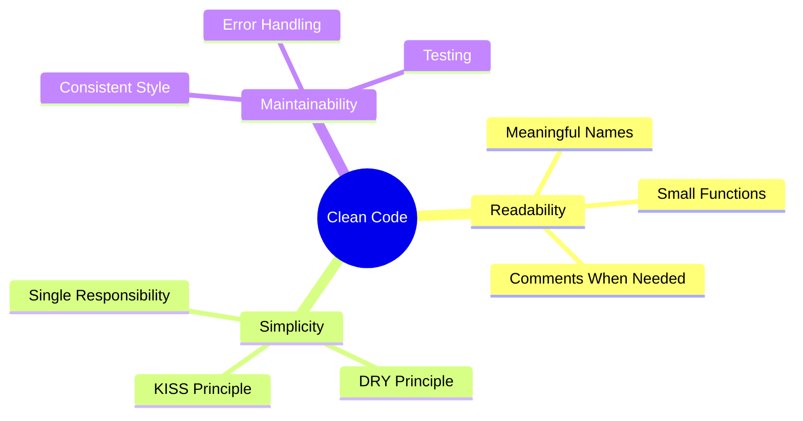

## अवलोकन

क्लीन कोड वह कोड है जिसे पढ़ना, समझना और बनाए रखना आसान है। यह मार्गदर्शिका विशेष रूप से XOOPS मॉड्यूल विकास पर लागू स्वच्छ कोड सिद्धांतों को शामिल करती है।

## मूल सिद्धांत



## अर्थपूर्ण नाम

### चर

```php
// Bad
$d = new DateTime();
$u = $memberHandler->getUser($id);
$arr = [];

// Good
$createdDate = new DateTime();
$currentUser = $memberHandler->getUser($userId);
$publishedArticles = [];
```

### कार्य

```php
// Bad
function process($data) { ... }
function handle($item) { ... }
function doStuff($x, $y) { ... }

// Good
function publishArticle(Article $article): void { ... }
function calculateTotalPrice(array $items): float { ... }
function sendNotificationEmail(User $user, string $subject): bool { ... }
```

### कक्षाएं

```php
// Bad
class Manager { ... }
class Helper { ... }
class Utils { ... }

// Good
class ArticleRepository { ... }
class NotificationService { ... }
class PermissionChecker { ... }
```

## छोटे कार्य

### एकल जिम्मेदारी

```php
// Bad - does too many things
function processArticle($data) {
    // Validate
    if (empty($data['title'])) {
        throw new Exception('Title required');
    }
    // Save
    $article = new Article();
    $article->setTitle($data['title']);
    $this->repository->save($article);
    // Notify
    $this->mailer->send($article->getAuthor(), 'Article published');
    // Log
    $this->logger->info('Article created');
    return $article;
}

// Good - each function does one thing
function validateArticleData(array $data): void
{
    if (empty($data['title'])) {
        throw new ValidationException('Title required');
    }
}

function createArticle(array $data): Article
{
    $this->validateArticleData($data);
    return Article::create($data['title'], $data['content']);
}

function publishArticle(Article $article): void
{
    $this->repository->save($article);
    $this->notifyAuthor($article);
    $this->logArticleCreation($article);
}
```

### फ़ंक्शन की लंबाई

फ़ंक्शंस को छोटा रखें - आदर्श रूप से 20 पंक्तियों से कम:

```php
// Good - focused function
public function getPublishedArticles(int $limit = 10): array
{
    $criteria = new CriteriaCompo();
    $criteria->add(new Criteria('status', 'published'));
    $criteria->setSort('published_at');
    $criteria->setOrder('DESC');
    $criteria->setLimit($limit);

    return $this->repository->getObjects($criteria);
}
```

## शुष्क सिद्धांत (स्वयं को दोहराएँ नहीं)

### सामान्य कोड निकालें

```php
// Bad - repeated code
function getActiveUsers() {
    $criteria = new CriteriaCompo();
    $criteria->add(new Criteria('level', 0, '>'));
    $criteria->setSort('uname');
    return $this->userHandler->getObjects($criteria);
}

function getActiveAdmins() {
    $criteria = new CriteriaCompo();
    $criteria->add(new Criteria('level', 0, '>'));
    $criteria->add(new Criteria('is_admin', 1));
    $criteria->setSort('uname');
    return $this->userHandler->getObjects($criteria);
}

// Good - shared logic extracted
function getUsers(CriteriaCompo $criteria): array
{
    $criteria->add(new Criteria('level', 0, '>'));
    $criteria->setSort('uname');
    return $this->userHandler->getObjects($criteria);
}

function getActiveUsers(): array
{
    return $this->getUsers(new CriteriaCompo());
}

function getActiveAdmins(): array
{
    $criteria = new CriteriaCompo();
    $criteria->add(new Criteria('is_admin', 1));
    return $this->getUsers($criteria);
}
```

## त्रुटि प्रबंधन

### अपवादों का उचित उपयोग करें

```php
// Bad - generic exceptions
throw new Exception('Error');

// Good - specific exceptions
throw new ArticleNotFoundException($articleId);
throw new PermissionDeniedException('Cannot edit article');
throw new ValidationException(['title' => 'Title is required']);
```

### त्रुटियों को शालीनता से संभालें

```php
public function findArticle(string $id): ?Article
{
    try {
        return $this->repository->findById($id);
    } catch (DatabaseException $e) {
        $this->logger->error('Database error finding article', [
            'id' => $id,
            'error' => $e->getMessage()
        ]);
        throw new ServiceException('Unable to retrieve article', 0, $e);
    }
}
```

## टिप्पणियाँ

### कब टिप्पणी करें

```php
// Bad - obvious comment
// Increment counter
$counter++;

// Good - explains why, not what
// Cache for 1 hour to reduce database load during peak traffic
$cache->set($key, $data, 3600);

// Good - documents complex algorithm
/**
 * Calculate article relevance score using TF-IDF algorithm.
 * Higher scores indicate better match with search terms.
 */
function calculateRelevanceScore(Article $article, array $terms): float
{
    // ...
}
```

## कोड संगठन

### कक्षा संरचना

```php
class ArticleService
{
    // 1. Constants
    private const MAX_TITLE_LENGTH = 255;

    // 2. Properties
    private ArticleRepository $repository;
    private EventDispatcher $events;

    // 3. Constructor
    public function __construct(
        ArticleRepository $repository,
        EventDispatcher $events
    ) {
        $this->repository = $repository;
        $this->events = $events;
    }

    // 4. Public methods
    public function publish(Article $article): void { ... }
    public function archive(Article $article): void { ... }

    // 5. Private methods
    private function validateForPublication(Article $article): void { ... }
}
```

## क्लीन कोड चेकलिस्ट

- [ ] नाम सार्थक और उच्चारण योग्य हैं
- [ ] फ़ंक्शन केवल एक ही कार्य करते हैं
- [ ] फ़ंक्शन छोटे हैं (<20 पंक्तियाँ)
- [ ] कोई डुप्लिकेट कोड नहीं
- [ ] विशिष्ट अपवादों के साथ उचित त्रुटि प्रबंधन
- [ ] टिप्पणियाँ "क्यों" बताती हैं, "क्या" नहीं
- [ ] सुसंगत स्वरूपण और शैली
- [ ] कोई जादुई संख्या या तार नहीं
- [ ] निर्भरताएं इंजेक्ट की जाती हैं, बनाई नहीं जातीं

## संबंधित दस्तावेज़ीकरण

- कोड संगठन
- त्रुटि प्रबंधन
- सर्वोत्तम प्रथाओं का परीक्षण
- PHP मानक