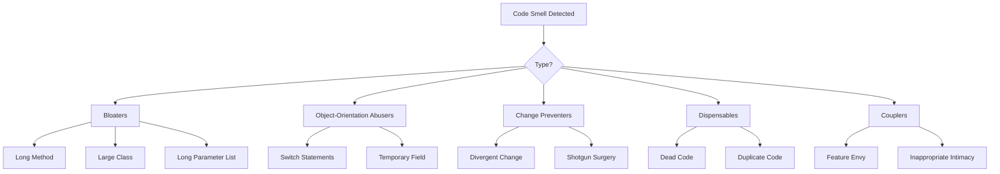

## अवलोकन

कोड गंध कोड में संभावित समस्याओं के संकेतक हैं। उनका मतलब यह नहीं है कि कोड टूट गया है, लेकिन वे ऐसे क्षेत्रों का सुझाव देते हैं जो रिफैक्टरिंग से लाभान्वित हो सकते हैं।

## सामान्य कोड गंध



## ब्लोटर्स

### लंबी विधि

```php
// Smell: Method does too much
function processArticleSubmission($data) {
    // 100+ lines of validation, saving, notification, etc.
}

// Solution: Extract into focused methods
function processArticleSubmission(array $data): Article
{
    $this->validateInput($data);
    $article = $this->createArticle($data);
    $this->saveArticle($article);
    $this->notifySubscribers($article);
    return $article;
}
```

### बड़ा वर्ग (भगवान वस्तु)

```php
// Smell: Class does everything
class ArticleManager {
    public function create() { ... }
    public function delete() { ... }
    public function sendEmail() { ... }
    public function generatePDF() { ... }
    public function exportToExcel() { ... }
    public function validateUser() { ... }
    public function checkPermissions() { ... }
    // ... 50 more methods
}

// Solution: Split into focused classes
class ArticleService { ... }
class ArticleExporter { ... }
class ArticleNotifier { ... }
class PermissionChecker { ... }
```

### लंबी पैरामीटर सूची

```php
// Smell: Too many parameters
function createArticle($title, $content, $author, $category, $tags, $status, $publishDate, $featured, $image) { ... }

// Solution: Use parameter object
class CreateArticleCommand {
    public string $title;
    public string $content;
    public int $authorId;
    public int $categoryId;
    public array $tags;
    public string $status;
    public ?DateTime $publishDate;
    public bool $featured;
    public ?string $image;
}

function createArticle(CreateArticleCommand $command): Article { ... }
```

## वस्तु-अभिविन्यास का दुरुपयोग करने वाले

### स्टेटमेंट स्विच करें

```php
// Smell: Type checking with switch
function getDiscount($userType) {
    switch ($userType) {
        case 'regular':
            return 0;
        case 'premium':
            return 10;
        case 'vip':
            return 20;
        default:
            return 0;
    }
}

// Solution: Use polymorphism
interface UserType {
    public function getDiscount(): int;
}

class RegularUser implements UserType {
    public function getDiscount(): int { return 0; }
}

class PremiumUser implements UserType {
    public function getDiscount(): int { return 10; }
}

class VipUser implements UserType {
    public function getDiscount(): int { return 20; }
}
```

### अस्थायी क्षेत्र

```php
// Smell: Fields only used in certain situations
class Article {
    private $tempCalculatedScore;

    public function search($terms) {
        $this->tempCalculatedScore = $this->calculateScore($terms);
        // ... use score
    }
}

// Solution: Pass as parameter or return value
class Article {
    public function getSearchScore(array $terms): float {
        return $this->calculateScore($terms);
    }
}
```

## परिवर्तन निरोधक

### भिन्न परिवर्तन

```php
// Smell: One class changed for many different reasons
class Article {
    public function save() { ... } // Database change
    public function toJson() { ... } // API format change
    public function validate() { ... } // Business rule change
    public function render() { ... } // UI change
}

// Solution: Separate responsibilities
class Article { ... } // Domain object only
class ArticleRepository { public function save() { ... } }
class ArticleSerializer { public function toJson() { ... } }
class ArticleValidator { public function validate() { ... } }
```

### शॉटगन सर्जरी

```php
// Smell: One change requires many file edits
// Changing date format requires editing:
// - ArticleController.php
// - ArticleView.php
// - ArticleAPI.php
// - ArticleExport.php

// Solution: Centralize
class DateFormatter {
    public function format(DateTime $date): string {
        return $date->format($this->config->get('date_format'));
    }
}
```

## डिस्पेंसेबल्स

### डेड कोड

```php
// Smell: Unreachable or unused code
function processData($data) {
    if (true) {
        return $this->handleData($data);
    }
    // This never executes
    return $this->legacyHandler($data);
}

// Old unused method still in codebase
function oldMethod() {
    // Not called anywhere
}

// Solution: Remove dead code
function processData($data) {
    return $this->handleData($data);
}
```

### डुप्लिकेट कोड

```php
// Smell: Same logic in multiple places
class ArticleHandler {
    public function getActive() {
        $criteria = new CriteriaCompo();
        $criteria->add(new Criteria('status', 'active'));
        return $this->getObjects($criteria);
    }
}

class NewsHandler {
    public function getActive() {
        $criteria = new CriteriaCompo();
        $criteria->add(new Criteria('status', 'active'));
        return $this->getObjects($criteria);
    }
}

// Solution: Extract common behavior
trait ActiveRecordsTrait {
    public function getActive(): array {
        $criteria = new CriteriaCompo();
        $criteria->add(new Criteria('status', 'active'));
        return $this->getObjects($criteria);
    }
}
```

## कप्लर्स

### फ़ीचर ईर्ष्या

```php
// Smell: Method uses another object's data more than its own
class Invoice {
    public function calculateTotal(Customer $customer) {
        $total = 0;
        foreach ($this->items as $item) {
            $total += $item->price;
        }
        // Uses customer data extensively
        if ($customer->isPremium()) {
            $total *= (1 - $customer->getDiscountRate());
        }
        if ($customer->getCountry() === 'US') {
            $total *= 1.08; // Tax
        }
        return $total;
    }
}

// Solution: Move behavior to the object with the data
class Customer {
    public function applyDiscount(float $amount): float {
        return $this->isPremium()
            ? $amount * (1 - $this->discountRate)
            : $amount;
    }

    public function applyTax(float $amount): float {
        return $this->country === 'US'
            ? $amount * 1.08
            : $amount;
    }
}
```

## रिफैक्टरिंग चेकलिस्ट

जब आपको कोई कोड गंध दिखे:

1. **पहचानें** - यह कौन सी गंध है?
2. **आकलन** - प्रभाव कितना गंभीर है?
3. **योजना** - कौन सी रीफैक्टरिंग तकनीक लागू होती है?
4. **परीक्षण** - सुनिश्चित करें कि रिफैक्टरिंग से पहले परीक्षण मौजूद हैं
5. **रिफैक्टर** - छोटे, वृद्धिशील परिवर्तन करें
6. **सत्यापित करें** - प्रत्येक परिवर्तन के बाद परीक्षण चलाएँ

## संबंधित दस्तावेज़ीकरण

- स्वच्छ कोड सिद्धांत
- कोड संगठन
- सर्वोत्तम प्रथाओं का परीक्षण