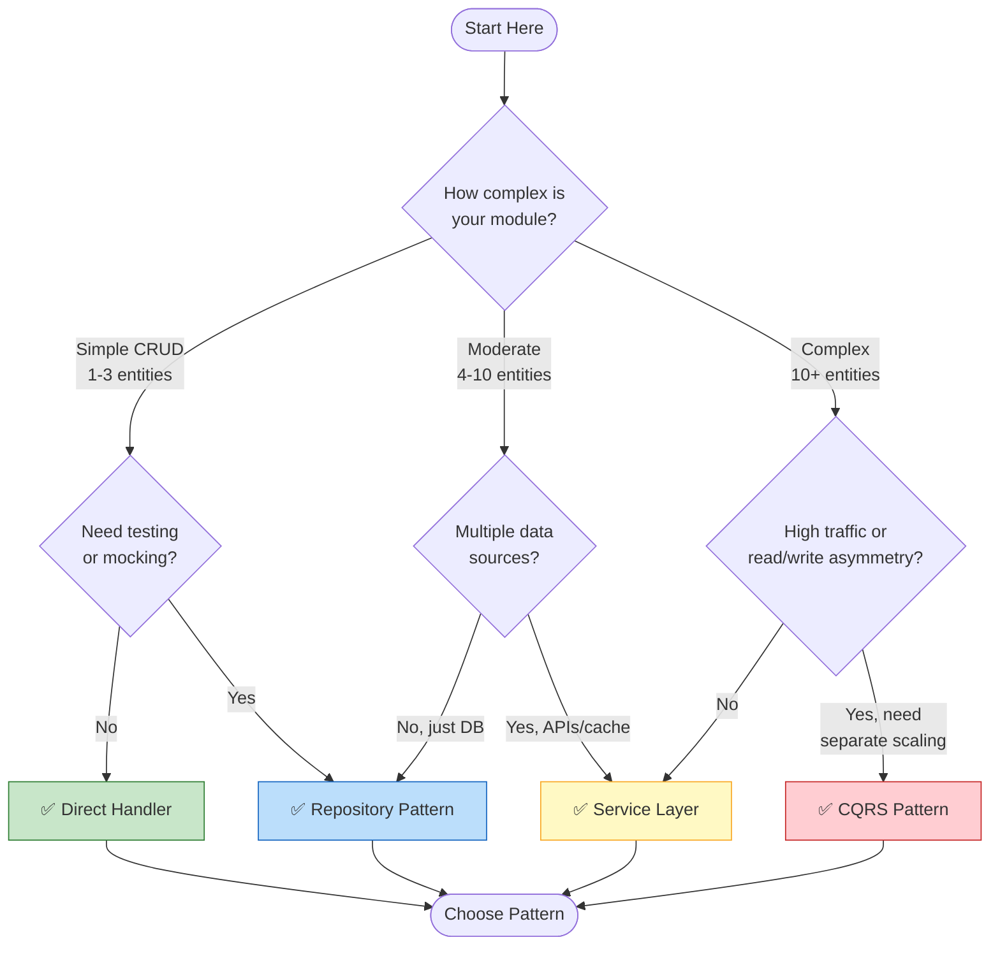
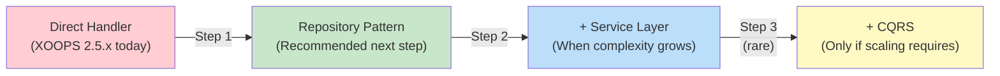

<span class="version-badge version-25x">2.5.x ✅</span> <span class="version-badge version-40x">4.0.x ✅</span>

> **मुझे किस पैटर्न का उपयोग करना चाहिए?** यह निर्णय वृक्ष आपको प्रत्यक्ष हैंडलर, रिपोजिटरी पैटर्न, सर्विस लेयर और CQRS के बीच चयन करने में मदद करता है।

---

## त्वरित निर्णय वृक्ष



---

## पैटर्न तुलना

| Criteria | डायरेक्ट हैंडलर | भण्डार | सेवा परत | CQRS |
|---|----------------------|-----------|------|
| **जटिलता** | ⭐ | ⭐⭐ | ⭐⭐⭐ | ⭐⭐⭐⭐⭐ |
| **टेस्टैबिलिटी** | ❌ कठिन | ✅ अच्छा | ✅ बढ़िया | ✅ बढ़िया |
| **लचीलापन** | ❌ कम | ✅ मध्यम | ✅ उच्च | ✅ बहुत ऊँचा |
| **XOOPS 2.5.x** | ✅ मूलनिवासी | ✅ कार्य | ✅ कार्य | ⚠️ जटिल |
| **XOOPS 4.0** | ⚠️ पदावनत | ✅ अनुशंसित | ✅ अनुशंसित | ✅ पैमाने के लिए |
| **टीम का आकार** | 1 देव | 1-3 देव | 2-5 देव | 5+ देव |
| **रखरखाव** | ❌ उच्चतर | ✅ मध्यम | ✅ निचला | ⚠️ विशेषज्ञता की आवश्यकता है |

---

## प्रत्येक पैटर्न का उपयोग कब करें

### ✅ डायरेक्ट हैंडलर (`XoopsPersistableObjectHandler`)

**इसके लिए सर्वोत्तम:** सरल मॉड्यूल, त्वरित प्रोटोटाइप, सीखना XOOPS

```php
// Simple and direct - good for small modules
$handler = xoops_getModuleHandler('article', 'news');
$articles = $handler->getObjects(new Criteria('status', 1));
```

**इसे तब चुनें जब:**
- 1-3 डेटाबेस तालिकाओं के साथ एक सरल मॉड्यूल का निर्माण
- एक त्वरित प्रोटोटाइप बनाना
- आप एकमात्र डेवलपर हैं और आपको परीक्षण की आवश्यकता नहीं है
- मॉड्यूल महत्वपूर्ण रूप से विकसित नहीं होगा

**सीमाएँ:**
- इकाई परीक्षण करना कठिन (वैश्विक निर्भरता)
- XOOPS डेटाबेस परत से मजबूत युग्मन
- व्यावसायिक तर्क नियंत्रकों में लीक हो जाता है

---

### ✅ रिपॉजिटरी पैटर्न

**इसके लिए सर्वोत्तम:** अधिकांश मॉड्यूल, टीमें परीक्षण योग्यता चाहती हैं

```php
// Abstraction allows mocking for tests
interface ArticleRepositoryInterface {
    public function findPublished(): array;
    public function save(Article $article): void;
}

class XoopsArticleRepository implements ArticleRepositoryInterface {
    private $handler;

    public function __construct() {
        $this->handler = xoops_getModuleHandler('article', 'news');
    }

    public function findPublished(): array {
        return $this->handler->getObjects(new Criteria('status', 1));
    }
}
```

**इसे तब चुनें जब:**
- आप यूनिट परीक्षण लिखना चाहते हैं
- आप बाद में डेटा स्रोत बदल सकते हैं (डीबी → API)
- 2+ डेवलपर्स के साथ काम करना
- वितरण के लिए मॉड्यूल का निर्माण

**अपग्रेड पथ:** यह XOOPS 4.0 तैयारी के लिए अनुशंसित पैटर्न है।

---

### ✅ सेवा परत

**इसके लिए सर्वोत्तम:** जटिल व्यावसायिक तर्क वाले मॉड्यूल

```php
// Service coordinates multiple repositories and contains business rules
class ArticlePublicationService {
    public function __construct(
        private ArticleRepositoryInterface $articles,
        private NotificationServiceInterface $notifications,
        private CacheInterface $cache
    ) {}

    public function publish(int $articleId): void {
        $article = $this->articles->find($articleId);
        $article->setStatus('published');
        $article->setPublishedAt(new DateTime());

        $this->articles->save($article);
        $this->notifications->notifySubscribers($article);
        $this->cache->invalidate("article:{$articleId}");
    }
}
```

**इसे तब चुनें जब:**
- संचालन कई डेटा स्रोतों तक फैला हुआ है
- व्यावसायिक नियम जटिल हैं
- आपको लेनदेन प्रबंधन की आवश्यकता है
- ऐप के कई हिस्से एक ही काम करते हैं

**अपग्रेड पथ:** एक मजबूत आर्किटेक्चर के लिए रिपोजिटरी के साथ संयोजन करें।

---

### ⚠️ CQRS (कमांड क्वेरी जिम्मेदारी पृथक्करण)

**इसके लिए सर्वोत्तम:** पढ़ने/लिखने की विषमता के साथ उच्च-स्तरीय मॉड्यूल

```php
// Commands modify state
class PublishArticleCommand {
    public function __construct(
        public readonly int $articleId,
        public readonly int $publisherId
    ) {}
}

// Queries read state (can use denormalized read models)
class GetPublishedArticlesQuery {
    public function __construct(
        public readonly int $limit = 10
    ) {}
}
```

**इसे तब चुनें जब:**
- लिखने की तुलना में पढ़ने वालों की संख्या बहुत अधिक है (100:1 या अधिक)
- आपको पढ़ने बनाम लिखने के लिए अलग-अलग स्केलिंग की आवश्यकता है
- जटिल रिपोर्टिंग/विश्लेषणात्मक आवश्यकताएँ
- इवेंट सोर्सिंग से आपके डोमेन को फायदा होगा

**चेतावनी:** CQRS महत्वपूर्ण जटिलता जोड़ता है। अधिकांश XOOPS मॉड्यूल को इसकी आवश्यकता नहीं है।

---

## अनुशंसित उन्नयन पथ



### चरण 1: हैंडलर को रिपॉजिटरी में लपेटें (2-4 घंटे)

1. अपनी डेटा एक्सेस आवश्यकताओं के लिए एक इंटरफ़ेस बनाएं
2. मौजूदा हैंडलर का उपयोग करके इसे कार्यान्वित करें
3. सीधे `xoops_getModuleHandler()` पर कॉल करने के बजाय रिपॉजिटरी को इंजेक्ट करें

### चरण 2: आवश्यकता पड़ने पर सेवा परत जोड़ें (1-2 दिन)

1. जब व्यावसायिक तर्क नियंत्रकों में प्रकट होता है, तो उसे किसी सेवा में निकालें
2. सेवा रिपॉजिटरी का उपयोग करती है, सीधे हैंडलर का नहीं
3. नियंत्रक पतले हो जाते हैं (मार्ग → सेवा → प्रतिक्रिया)

### चरण 3: केवल CQRS पर विचार करें यदि (दुर्लभ)

1. आप प्रतिदिन लाखों बार पढ़ते हैं
2. पढ़ने और लिखने के मॉडल काफी भिन्न हैं
3. आपको ऑडिट ट्रेल्स के लिए इवेंट सोर्सिंग की आवश्यकता है
4. आपके पास CQRS के साथ अनुभवी टीम है

---

## त्वरित संदर्भ कार्ड| प्रश्न | उत्तर |
|---|--------|
| **"मुझे बस डेटा सहेजने/लोड करने की आवश्यकता है"** | डायरेक्ट हैंडलर |
| **"मैं परीक्षण लिखना चाहता हूँ"** | रिपोजिटरी पैटर्न |
| **"मेरे पास जटिल व्यावसायिक नियम हैं"** | सेवा परत |
| **"मुझे रीडिंग को अलग से स्केल करने की आवश्यकता है"** | CQRS |
| **"मैं XOOPS 4.0"** की तैयारी कर रहा हूं रिपॉजिटरी + सर्विस लेयर |

---

## संबंधित दस्तावेज़ीकरण

- [रिपॉजिटरी पैटर्न गाइड](Patterns/Repository-Pattern.md)
- [सर्विस लेयर पैटर्न गाइड](Patterns/Service-Layer-Pattern.md)
- [CQRS पैटर्न गाइड](../07-XOOPS-4.0/Implementation-Guides/CQRS-Pattern-Guide.md) *(उन्नत)*
- [हाइब्रिड मोड अनुबंध](../07-XOOPS-4.0/Specifications/Hybrid-Mode-Contract.md)

---

#पैटर्न #डेटा-एक्सेस #निर्णय-वृक्ष #सर्वोत्तम अभ्यास #xoops