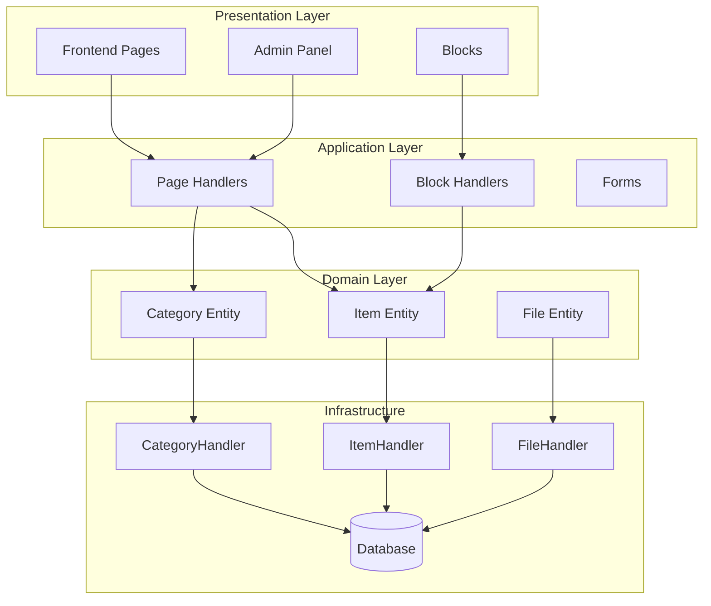
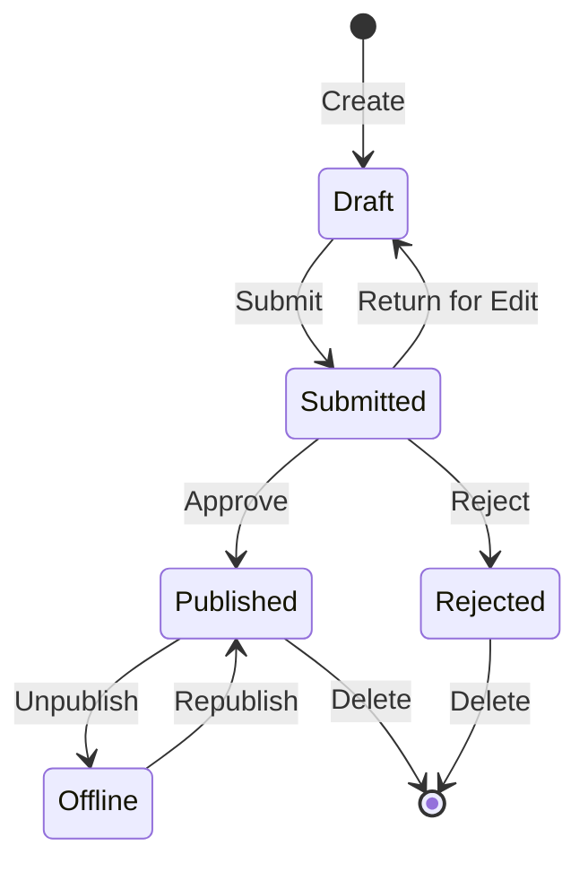

## अवलोकन

यह दस्तावेज़ प्रकाशक मॉड्यूल वास्तुकला, पैटर्न और कार्यान्वयन विवरण का तकनीकी विश्लेषण प्रदान करता है। उत्पादन-गुणवत्ता XOOPS मॉड्यूल कैसे संरचित है, यह समझने के लिए इसे एक संदर्भ के रूप में उपयोग करें।

## वास्तुकला अवलोकन



## निर्देशिका संरचना

```
publisher/
├── admin/
│   ├── index.php           # Admin dashboard
│   ├── item.php            # Article management
│   ├── category.php        # Category management
│   ├── permission.php      # Permissions
│   ├── file.php            # File manager
│   └── menu.php            # Admin menu
├── assets/
│   ├── css/
│   ├── js/
│   └── images/
├── class/
│   ├── Category.php        # Category entity
│   ├── CategoryHandler.php # Category data access
│   ├── Item.php            # Article entity
│   ├── ItemHandler.php     # Article data access
│   ├── File.php            # File attachment
│   ├── FileHandler.php     # File data access
│   ├── Form/               # Form classes
│   ├── Common/             # Utilities
│   └── Helper.php          # Module helper
├── include/
│   ├── common.php          # Initialization
│   ├── functions.php       # Utility functions
│   ├── oninstall.php       # Install hooks
│   ├── onupdate.php        # Update hooks
│   └── search.php          # Search integration
├── language/
├── templates/
├── sql/
└── xoops_version.php
```

## इकाई विश्लेषण

### आइटम (अनुच्छेद) इकाई

```php
class Item extends \XoopsObject
{
    // Fields
    public function initVar(): void
    {
        $this->initVar('itemid', XOBJ_DTYPE_INT, null, false);
        $this->initVar('categoryid', XOBJ_DTYPE_INT, 0, false);
        $this->initVar('title', XOBJ_DTYPE_TXTBOX, '', true);
        $this->initVar('subtitle', XOBJ_DTYPE_TXTBOX, '');
        $this->initVar('summary', XOBJ_DTYPE_TXTAREA, '');
        $this->initVar('body', XOBJ_DTYPE_TXTAREA, '', true);
        $this->initVar('uid', XOBJ_DTYPE_INT, 0);
        $this->initVar('status', XOBJ_DTYPE_INT, 0);
        $this->initVar('datesub', XOBJ_DTYPE_INT, time());
        // ... more fields
    }

    // Business methods
    public function isPublished(): bool
    {
        return $this->getVar('status') == _PUBLISHER_STATUS_PUBLISHED;
    }

    public function canEdit(int $userId): bool
    {
        return $this->getVar('uid') == $userId
            || $this->isAdmin($userId);
    }
}
```

### हैंडलर पैटर्न

```php
class ItemHandler extends \XoopsPersistableObjectHandler
{
    public function __construct(\XoopsDatabase $db)
    {
        parent::__construct(
            $db,
            'publisher_items',
            Item::class,
            'itemid',
            'title'
        );
    }

    public function getPublishedItems(int $limit = 10): array
    {
        $criteria = new \CriteriaCompo();
        $criteria->add(new \Criteria('status', _PUBLISHER_STATUS_PUBLISHED));
        $criteria->setSort('datesub');
        $criteria->setOrder('DESC');
        $criteria->setLimit($limit);

        return $this->getObjects($criteria);
    }
}
```

## अनुमति प्रणाली

### अनुमति प्रकार

| अनुमति | विवरण |
|---|----|
| `publisher_view` | श्रेणी/लेख देखें |
| `publisher_submit` | नए लेख सबमिट करें |
| `publisher_approve` | स्वतः-अनुमोदन प्रस्तुतियाँ |
| `publisher_moderate` | लंबित लेखों की समीक्षा करें |
| `publisher_global` | वैश्विक मॉड्यूल अनुमतियाँ |

### अनुमति जांच

```php
class PermissionHandler
{
    public function isGranted(string $permission, int $categoryId): bool
    {
        $userId = $GLOBALS['xoopsUser']?->uid() ?? 0;
        $groups = $this->getUserGroups($userId);

        return $this->grouppermHandler->checkRight(
            $permission,
            $categoryId,
            $groups,
            $this->helper->getModule()->mid()
        );
    }
}
```

## वर्कफ़्लो स्थितियाँ



## टेम्पलेट संरचना

### फ्रंटएंड टेम्पलेट्स

| टेम्पलेट | उद्देश्य |
|---|----|
| `publisher_index.tpl` | मॉड्यूल होमपेज |
| `publisher_item.tpl` | एकल लेख |
| `publisher_category.tpl` | श्रेणी सूची |
| `publisher_submit.tpl` | सबमिशन फॉर्म |
| `publisher_search.tpl` | खोज परिणाम |

### ब्लॉक टेम्पलेट्स

| टेम्पलेट | उद्देश्य |
|---|----|
| `publisher_block_latest.tpl` | हाल के लेख |
| `publisher_block_spotlight.tpl` | विशेष आलेख |
| `publisher_block_category.tpl` | श्रेणी मेनू |

## प्रयुक्त प्रमुख पैटर्न

1. **हैंडलर पैटर्न** - डेटा एक्सेस इनकैप्सुलेशन
2. **मूल्य वस्तु** - स्थिति स्थिरांक
3. **टेम्पलेट विधि** - फॉर्म जनरेशन
4. **रणनीति** - विभिन्न प्रदर्शन मोड
5. **पर्यवेक्षक** - घटनाओं पर सूचनाएं

## मॉड्यूल विकास के लिए पाठ

1. CRUD के लिए XoopsPersistableObjectHandler का उपयोग करें
2. विस्तृत अनुमतियाँ लागू करें
3. प्रस्तुतीकरण को तर्क से अलग करना
4. प्रश्नों के लिए Criteria का उपयोग करें
5. एकाधिक सामग्री स्थितियों का समर्थन करें
6. XOOPS अधिसूचना प्रणाली के साथ एकीकृत करें

## संबंधित दस्तावेज़ीकरण

- लेख बनाना - लेख प्रबंधन
- प्रबंध-श्रेणियाँ - श्रेणी प्रणाली
- अनुमतियाँ-सेटअप - अनुमति विन्यास
- डेवलपर-गाइड/हुक-एंड-इवेंट - विस्तार बिंदु