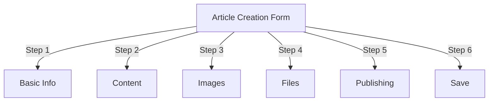
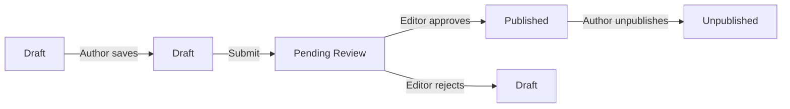
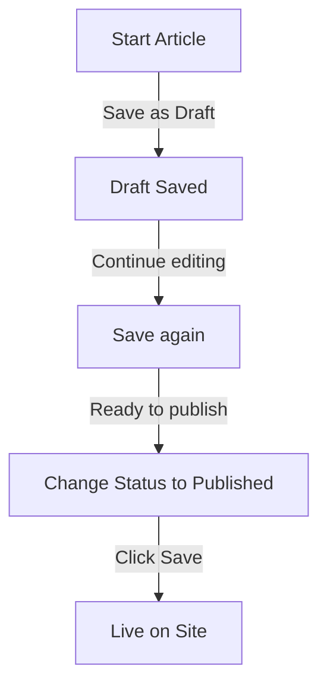

# प्रकाशक में लेख बनाना

> प्रकाशक मॉड्यूल में लेख बनाने, संपादित करने, फ़ॉर्मेट करने और प्रकाशित करने के लिए चरण-दर-चरण मार्गदर्शिका।

---

## लेख प्रबंधन तक पहुंचें

### व्यवस्थापक पैनल नेविगेशन

```
Admin Panel
└── Modules
    └── Publisher
        └── Articles
            ├── Create New
            ├── Edit
            ├── Delete
            └── Publish
```

### सबसे तेज़ पथ

1. **प्रशासक** के रूप में लॉग इन करें
2. एडमिन बार में **मॉड्यूल** पर क्लिक करें
3. **प्रकाशक** खोजें
4. **एडमिन** लिंक पर क्लिक करें
5. बाएं मेनू में **लेख** पर क्लिक करें
6. **लेख जोड़ें** बटन पर क्लिक करें

---

## लेख निर्माण प्रपत्र

### बुनियादी जानकारी

नया लेख बनाते समय निम्नलिखित अनुभाग भरें:



---

## चरण 1: बुनियादी जानकारी

### आवश्यक फ़ील्ड

#### आलेख शीर्षक

```
Field: Title
Type: Text input (required)
Max length: 255 characters
Example: "Top 5 Tips for Better Photography"
```

**दिशानिर्देश:**
- वर्णनात्मक और विशिष्ट
- SEO के लिए कीवर्ड शामिल करें
- सभी से बचें CAPS
- सर्वोत्तम प्रदर्शन के लिए 60 अक्षर से कम रखें

#### श्रेणी चुनें

```
Field: Category
Type: Dropdown (required)
Options: List of created categories
Example: Photography > Tutorials
```

**टिप्स:**
- अभिभावक और उपश्रेणियाँ उपलब्ध हैं
- सर्वाधिक प्रासंगिक श्रेणी चुनें
- प्रति आलेख केवल एक श्रेणी
- बाद में बदला जा सकता है

#### आलेख उपशीर्षक (वैकल्पिक)

```
Field: Subtitle
Type: Text input (optional)
Max length: 255 characters
Example: "Learn photography fundamentals in 5 easy steps"
```

**इसके लिए उपयोग करें:**
- सारांश शीर्षक
- टीज़र टेक्स्ट
- विस्तारित शीर्षक

### लेख विवरण

#### संक्षिप्त विवरण

```
Field: Short Description
Type: Textarea (optional)
Max length: 500 characters
```

**उद्देश्य:**
- आलेख पूर्वावलोकन पाठ
- श्रेणी सूची में प्रदर्शित होता है
- खोज परिणामों में प्रयुक्त
- एसईओ के लिए मेटा विवरण

**उदाहरण:**
```
"Discover essential photography techniques that will transform your photos
from ordinary to extraordinary. This comprehensive guide covers composition,
lighting, and exposure settings."
```

#### पूर्ण सामग्री

```
Field: Article Body
Type: WYSIWYG Editor (required)
Max length: Unlimited
Format: HTML
```

समृद्ध पाठ संपादन के साथ मुख्य लेख सामग्री क्षेत्र।

---

## चरण 2: सामग्री का स्वरूपण

### WYSIWYG संपादक का उपयोग करना

#### पाठ स्वरूपण

```
Bold:           Ctrl+B or click [B] button
Italic:         Ctrl+I or click [I] button
Underline:      Ctrl+U or click [U] button
Strikethrough:  Alt+Shift+D or click [S] button
Subscript:      Ctrl+, (comma)
Superscript:    Ctrl+. (period)
```

#### शीर्षक संरचना

उचित दस्तावेज़ पदानुक्रम बनाएँ:

```html
<h1>Article Title</h1>      <!-- Use once at top -->
<h2>Main Section</h2>        <!-- For major sections -->
<h3>Subsection</h3>          <!-- For subtopics -->
<h4>Sub-subsection</h4>      <!-- For details -->
```

**संपादक में:**
- **फ़ॉर्मेट** ड्रॉपडाउन पर क्लिक करें
- शीर्षक स्तर चुनें (H1-H6)
- अपना शीर्षक टाइप करें

#### सूचियाँ

**अव्यवस्थित सूची (गोलियाँ):**

```markdown
• Point one
• Point two
• Point three
```

संपादक में चरण:
1. [≡] बुलेट सूची बटन पर क्लिक करें
2. प्रत्येक बिंदु टाइप करें
3. अगले आइटम के लिए एंटर दबाएं
4. सूची समाप्त करने के लिए बैकस्पेस को दो बार दबाएँ

**आदेशित सूची (क्रमांकित):**

```markdown
1. First step
2. Second step
3. Third step
```

संपादक में चरण:
1. [1.] क्रमांकित सूची बटन पर क्लिक करें
2. प्रत्येक आइटम टाइप करें
3. अगले के लिए एंटर दबाएं
4. समाप्त करने के लिए बैकस्पेस को दो बार दबाएँ

**नेस्टेड सूचियाँ:**

```markdown
1. Main point
   a. Sub-point
   b. Sub-point
2. Next point
```

कदम:
1. पहली सूची बनाएं
2. इंडेंट करने के लिए टैब दबाएँ
3. नेस्टेड आइटम बनाएं
4. आउटडेंट के लिए Shift+Tab दबाएँ

#### लिंक

**हाइपरलिंक जोड़ें:**

1. लिंक करने के लिए टेक्स्ट का चयन करें
2. **[🔗] लिंक** बटन पर क्लिक करें
3. URL दर्ज करें: `https://example.com`
4. वैकल्पिक: शीर्षक/लक्ष्य जोड़ें
5. **लिंक डालें** पर क्लिक करें

**लिंक हटाएं:**

1. लिंक किए गए टेक्स्ट के अंदर क्लिक करें
2. **[🔗] लिंक हटाएँ** बटन पर क्लिक करें

#### कोड एवं उद्धरण

**ब्लॉककोट:**

```
"This is an important quote from an expert"
- Attribution
```

कदम:
1. उद्धरण पाठ टाइप करें
2. **[❝] ब्लॉककोट** बटन पर क्लिक करें
3. टेक्स्ट को इंडेंट और स्टाइल किया गया है

**कोड ब्लॉक:**

```python
def hello_world():
    print("Hello, World!")
```

कदम:
1. **प्रारूप → कोड** पर क्लिक करें
2. कोड चिपकाएँ
3. भाषा चुनें (वैकल्पिक)
4. कोड सिंटैक्स हाइलाइट के साथ प्रदर्शित होता है

---

## चरण 3: छवियाँ जोड़ना

### विशेष छवि (हीरो छवि)

```
Field: Featured Image / Main Image
Type: Image upload
Format: JPG, PNG, GIF, WebP
Max size: 5 MB
Recommended: 600x400 px
```

**अपलोड करने के लिए:**

1. **छवि अपलोड करें** बटन पर क्लिक करें
2. कंप्यूटर से छवि का चयन करें
3. यदि आवश्यक हो तो काटें/आकार बदलें
4. **इस छवि का उपयोग करें** पर क्लिक करें

**छवि प्लेसमेंट:**
- लेख के शीर्ष पर प्रदर्शित होता है
- श्रेणी सूची में उपयोग किया जाता है
- संग्रह में दिखाया गया है
- सामाजिक साझाकरण के लिए उपयोग किया जाता है

### इनलाइन छवियाँ

आलेख पाठ के भीतर छवियाँ सम्मिलित करें:

1. संपादक में कर्सर को उस स्थान पर रखें जहां छवि जानी चाहिए
2. टूलबार में **[🖼️] छवि** बटन पर क्लिक करें
3. अपलोड विकल्प चुनें:
   - नई छवि अपलोड करें
   - गैलरी से चयन करें
   - छवि URL दर्ज करें
4. कॉन्फ़िगर करें:
   ```
   Image Size:
   - Width: 300-600 px
   - Height: Auto (maintains ratio)
   - Alignment: Left/Center/Right
   ```
5. **छवि सम्मिलित करें** पर क्लिक करें

**छवि के चारों ओर पाठ लपेटें:**

डालने के बाद संपादक में:

```html
<!-- Image floats left, text wraps around -->

```

### छवि गैलरी

मल्टी-इमेज गैलरी बनाएं:1. **गैलरी** बटन पर क्लिक करें (यदि उपलब्ध हो)
2. एकाधिक छवियाँ अपलोड करें:
   - सिंगल क्लिक: एक जोड़ें
   - खींचें और छोड़ें: एकाधिक जोड़ें
3. खींचकर क्रम व्यवस्थित करें
4. प्रत्येक छवि के लिए कैप्शन सेट करें
5. **गैलरी बनाएं** पर क्लिक करें

---

## चरण 4: फ़ाइलें संलग्न करना

### फ़ाइल अनुलग्नक जोड़ें

```
Field: File Attachments
Type: File upload (multiple allowed)
Supported: PDF, DOC, XLS, ZIP, etc.
Max per file: 10 MB
Max per article: 5 files
```

**संलग्न करने के लिए:**

1. **फ़ाइल जोड़ें** बटन पर क्लिक करें
2. कंप्यूटर से फ़ाइल का चयन करें
3. वैकल्पिक: फ़ाइल विवरण जोड़ें
4. **फ़ाइल संलग्न करें** पर क्लिक करें
5. एकाधिक फ़ाइलों के लिए दोहराएँ

**फ़ाइल उदाहरण:**
- पीडीएफ गाइड
- एक्सेल स्प्रेडशीट
- शब्द दस्तावेज़
- ज़िप पुरालेख
- स्रोत कोड

### संलग्न फ़ाइलें प्रबंधित करें

**फ़ाइल संपादित करें:**

1. फ़ाइल नाम पर क्लिक करें
2. विवरण संपादित करें
3. **सहेजें** पर क्लिक करें

**फ़ाइल हटाएँ:**

1. सूची में फ़ाइल ढूंढें
2. **[×] हटाएं** आइकन पर क्लिक करें
3. विलोपन की पुष्टि करें

---

## चरण 5: प्रकाशन और स्थिति

### लेख स्थिति

```
Field: Status
Type: Dropdown
Options:
  - Draft: Not published, only author sees
  - Pending: Waiting for approval
  - Published: Live on site
  - Archived: Old content
  - Unpublished: Was published, now hidden
```

**स्थिति वर्कफ़्लो:**



### प्रकाशन विकल्प

#### तुरंत प्रकाशित करें

```
Status: Published
Start Date: Today (auto-filled)
End Date: (leave blank for no expiration)
```

#### बाद के लिए शेड्यूल

```
Status: Scheduled
Start Date: Future date/time
Example: February 15, 2024 at 9:00 AM
```

लेख निर्दिष्ट समय पर स्वचालित रूप से प्रकाशित होगा.

#### सेट समाप्ति

```
Enable Expiration: Yes
Expiration Date: Future date
Action: Archive/Hide/Delete
Example: April 1, 2024 (article auto-archives)
```

### दृश्यता विकल्प

```yaml
Show Article:
  - Display on front page: Yes/No
  - Show in category: Yes/No
  - Include in search: Yes/No
  - Include in recent articles: Yes/No

Featured Article:
  - Mark as featured: Yes/No
  - Featured section position: (number)
```

---

## चरण 6: एसईओ और मेटाडेटा

### एसईओ सेटिंग्स

```
Field: SEO Settings (Expand section)
```

#### मेटा विवरण

```
Field: Meta Description
Type: Text (160 characters recommended)
Used by: Search engines, social media

Example:
"Learn photography fundamentals in 5 easy steps.
Discover composition, lighting, and exposure techniques."
```

#### मेटा कीवर्ड

```
Field: Meta Keywords
Type: Comma-separated list
Max: 5-10 keywords

Example: Photography, Tutorial, Composition, Lighting, Exposure
```

#### URL स्लग

```
Field: URL Slug (auto-generated from title)
Type: Text
Format: lowercase, hyphens, no spaces

Auto: "top-5-tips-for-better-photography"
Edit: Change before publishing
```

#### ग्राफ़ टैग खोलें

लेख की जानकारी से स्वतः उत्पन्न:
- शीर्षक
- विवरण
- विशेष रुप से प्रदर्शित छवि
- आलेख URL
- प्रकाशन तिथि

फेसबुक, LinkedIn, WhatsApp, आदि द्वारा उपयोग किया जाता है।

---

## चरण 7: टिप्पणियाँ और सहभागिता

### टिप्पणी सेटिंग्स

```yaml
Allow Comments:
  - Enable: Yes/No
  - Default: Inherit from preferences
  - Override: Specific to this article

Moderate Comments:
  - Require approval: Yes/No
  - Default: Inherit from preferences
```

### रेटिंग सेटिंग्स

```yaml
Allow Ratings:
  - Enable: Yes/No
  - Scale: 5 stars (default)
  - Show average: Yes/No
  - Show count: Yes/No
```

---

## चरण 8: उन्नत विकल्प

### लेखक और बायलाइन

```
Field: Author
Type: Dropdown
Default: Current user
Options: All users with author permission

Display:
  - Show author name: Yes/No
  - Show author bio: Yes/No
  - Show author avatar: Yes/No
```

### लॉक संपादित करें

```
Field: Edit Lock
Purpose: Prevent accidental changes

Lock Article:
  - Locked: Yes/No
  - Lock reason: "Final version"
  - Unlock date: (optional)
```

### संशोधन इतिहास

आलेख के स्वतः-सहेजे गए संस्करण:

```
View Revisions:
  - Click "Revision History"
  - Shows all saved versions
  - Compare versions
  - Restore previous version
```

---

## बचत एवं प्रकाशन

### वर्कफ़्लो सहेजें



### लेख सहेजें

**स्वत: सहेजें:**
- हर 60 सेकंड में ट्रिगर
- ड्राफ्ट के रूप में स्वचालित रूप से सहेजता है
- शो "अंतिम बार सहेजा गया: 2 मिनट पहले"

**मैन्युअल सहेजें:**
- संपादन जारी रखने के लिए **सहेजें और जारी रखें** पर क्लिक करें
- प्रकाशित संस्करण देखने के लिए **सहेजें और देखें** पर क्लिक करें
- सहेजने और बंद करने के लिए **सहेजें** पर क्लिक करें

### आलेख प्रकाशित करें

1. सेट **स्थिति**: प्रकाशित
2. **प्रारंभ तिथि** निर्धारित करें: अभी (या भविष्य की तिथि)
3. **सहेजें** या **प्रकाशित करें** पर क्लिक करें
4. पुष्टिकरण संदेश प्रकट होता है
5. लेख लाइव है (या शेड्यूल किया गया है)

---

## मौजूदा लेखों का संपादन

### लेख संपादक तक पहुंचें

1. **एडमिन → प्रकाशक → लेख** पर जाएँ
2. सूची में आलेख ढूंढें
3. **संपादित करें** आइकन/बटन पर क्लिक करें
4. परिवर्तन करें
5. **सहेजें** पर क्लिक करें

### थोक संपादन

एक साथ अनेक लेख संपादित करें:

```
1. Go to Articles list
2. Select articles (checkboxes)
3. Choose "Bulk Edit" from dropdown
4. Change selected field
5. Click "Update All"

Available for:
  - Status
  - Category
  - Featured (Yes/No)
  - Author
```

### आलेख का पूर्वावलोकन करें

प्रकाशन से पहले:

1. **पूर्वावलोकन** बटन पर क्लिक करें
2. वैसा ही देखें जैसा पाठक देखेंगे
3. फ़ॉर्मेटिंग की जाँच करें
4. परीक्षण लिंक
5. समायोजित करने के लिए संपादक के पास लौटें

---

## लेख प्रबंधन

### सभी आलेख देखें

**लेख सूची दृश्य:**

```
Admin → Publisher → Articles

Columns:
  - Title
  - Category
  - Author
  - Status
  - Created date
  - Modified date
  - Actions (Edit, Delete, Preview)

Sorting:
  - By title (A-Z)
  - By date (newest/oldest)
  - By status (Published/Draft)
  - By category
```

### लेख फ़िल्टर करें

```
Filter Options:
  - By category
  - By status
  - By author
  - By date range
  - Search by title

Example: Show all "Draft" articles by "John" in "News" category
```

### लेख हटाएँ

**सॉफ्ट डिलीट (अनुशंसित):**

1. परिवर्तन **स्थिति**: अप्रकाशित
2. **सहेजें** पर क्लिक करें
3. लेख छिपा हुआ है लेकिन हटाया नहीं गया है
4. बाद में बहाल किया जा सकता है

**हार्ड डिलीट:**

1. सूची में लेख का चयन करें
2. **हटाएं** बटन पर क्लिक करें
3. विलोपन की पुष्टि करें
4. अनुच्छेद स्थायी रूप से हटा दिया गया

---

## सामग्री सर्वोत्तम प्रथाएँ

### गुणवत्तापूर्ण लेख लिखना

```
Structure:
  ✓ Compelling title
  ✓ Clear subtitle/description
  ✓ Engaging opening paragraph
  ✓ Logical sections with headers
  ✓ Supporting visuals
  ✓ Conclusion/summary
  ✓ Call-to-action

Length:
  - Blog posts: 500-2000 words
  - News: 300-800 words
  - Guides: 2000-5000 words
  - Minimum: 300 words
```

### एसईओ अनुकूलन

```
Title Optimization:
  ✓ Include primary keyword
  ✓ Keep under 60 characters
  ✓ Put keyword near beginning
  ✓ Be descriptive and specific

Content Optimization:
  ✓ Use headings (H1, H2, H3)
  ✓ Include keyword in heading
  ✓ Use bold for important terms
  ✓ Add descriptive links
  ✓ Include images with alt text

Meta Description:
  ✓ Include primary keyword
  ✓ 155-160 characters
  ✓ Action-oriented
  ✓ Unique per article
```

### फ़ॉर्मेटिंग युक्तियाँ

```
Readability:
  ✓ Short paragraphs (2-4 sentences)
  ✓ Bullet points for lists
  ✓ Subheadings every 300 words
  ✓ Generous whitespace
  ✓ Line breaks between sections

Visual Appeal:
  ✓ Featured image at top
  ✓ Inline images in content
  ✓ Alt text on all images
  ✓ Code blocks for technical
  ✓ Blockquotes for emphasis
```

---

## कीबोर्ड शॉर्टकट

### संपादक शॉर्टकट

```
Bold:               Ctrl+B
Italic:             Ctrl+I
Underline:          Ctrl+U
Link:               Ctrl+K
Save Draft:         Ctrl+S
```

### टेक्स्ट शॉर्टकट

```
-- →  (dash to em dash)
... → … (three dots to ellipsis)
(c) → © (copyright)
(r) → ® (registered)
(tm) → ™ (trademark)
```

---

## सामान्य कार्य

### लेख कॉपी करें

1. खुला लेख
2. **डुप्लिकेट** या **क्लोन** बटन पर क्लिक करें
3. आलेख को ड्राफ्ट के रूप में कॉपी किया गया
4. शीर्षक और सामग्री संपादित करें
5. प्रकाशित करें

### अनुसूची लेख1. लेख बनाएं
2. **प्रारंभ तिथि** निर्धारित करें: भविष्य की तारीख/समय
3. सेट **स्थिति**: प्रकाशित
4. **सहेजें** पर क्लिक करें
5. आलेख स्वचालित रूप से प्रकाशित होता है

### बैच प्रकाशन

1. आलेखों को ड्राफ्ट के रूप में बनाएँ
2. प्रकाशन तिथियां निर्धारित करें
3. लेख निर्धारित समय पर स्वतः प्रकाशित होते हैं
4. "अनुसूचित" दृश्य से मॉनिटर करें

### श्रेणियों के बीच जाएँ

1. लेख संपादित करें
2. **श्रेणी** ड्रॉपडाउन बदलें
3. **सहेजें** पर क्लिक करें
4. आलेख नई श्रेणी में प्रकट होता है

---

## समस्या निवारण

### समस्या: आलेख सहेजा नहीं जा सका

**समाधान:**
```
1. Check form for required fields
2. Verify category is selected
3. Check PHP memory limit
4. Try saving as draft first
5. Clear browser cache
```

### समस्या: छवियाँ प्रदर्शित नहीं हो रही हैं

**समाधान:**
```
1. Verify image upload succeeded
2. Check image file format (JPG, PNG)
3. Verify image path in database
4. Check upload directory permissions
5. Try re-uploading image
```

### समस्या: संपादक टूलबार प्रदर्शित नहीं हो रहा है

**समाधान:**
```
1. Clear browser cache
2. Try different browser
3. Disable browser extensions
4. Check JavaScript console for errors
5. Verify editor plugin installed
```

### समस्या: आलेख प्रकाशित नहीं हो रहा

**समाधान:**
```
1. Verify Status = "Published"
2. Check Start Date is today or earlier
3. Verify permissions allow publishing
4. Check category is published
5. Clear module cache
```

---

## संबंधित मार्गदर्शिकाएँ

- कॉन्फ़िगरेशन गाइड
- श्रेणी प्रबंधन
- अनुमति सेटअप
- कस्टम टेम्पलेट्स

---

## अगले चरण

- अपना पहला लेख बनाएं
- श्रेणियाँ सेट करें
- अनुमतियाँ कॉन्फ़िगर करें
- टेम्पलेट अनुकूलन की समीक्षा करें

---

#प्रकाशक #लेख #सामग्री #निर्माण #स्वरूपण #संपादन #xoops