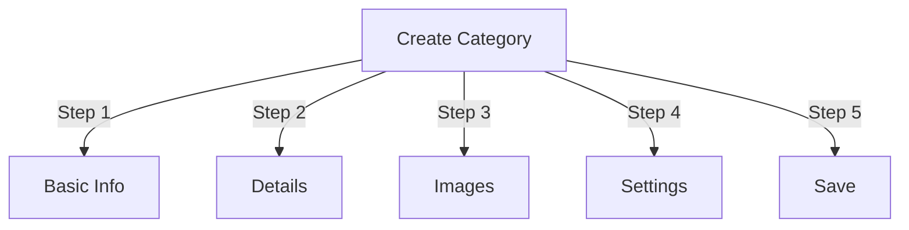

# प्रकाशक में श्रेणियाँ प्रबंधित करना

> प्रकाशक मॉड्यूल में श्रेणियां बनाने, व्यवस्थित करने और प्रबंधित करने के लिए संपूर्ण मार्गदर्शिका।

---

## श्रेणी मूल बातें

### श्रेणियाँ क्या हैं?

श्रेणियाँ लेखों को तार्किक समूहों में व्यवस्थित करती हैं:

```
Example Structure:

  News (Main Category)
    ├── Technology
    ├── Sports
    └── Entertainment

  Tutorials (Main Category)
    ├── Photography
    │   ├── Basics
    │   └── Advanced
    └── Writing
        └── Blogging
```

### अच्छी श्रेणी संरचना के लाभ

```
✓ Better user navigation
✓ Organized content
✓ Improved SEO
✓ Easier content management
✓ Better editorial workflow
```

---

## प्रवेश श्रेणी प्रबंधन

### व्यवस्थापक पैनल नेविगेशन

```
Admin Panel
└── Modules
    └── Publisher
        └── Categories
            ├── Create New
            ├── Edit
            ├── Delete
            ├── Permissions
            └── Organize
```

### त्वरित पहुंच

1. **प्रशासक** के रूप में लॉग इन करें
2. **एडमिन → मॉड्यूल** पर जाएं
3. **प्रकाशक → व्यवस्थापक** पर क्लिक करें
4. बाएँ मेनू में **श्रेणियाँ** पर क्लिक करें

---

## श्रेणियाँ बनाना

### श्रेणी निर्माण प्रपत्र



### चरण 1: बुनियादी जानकारी

#### श्रेणी का नाम

```
Field: Category Name
Type: Text input (required)
Max length: 100 characters
Uniqueness: Should be unique
Example: "Photography"
```

**दिशानिर्देश:**
- लगातार वर्णनात्मक और एकवचन या बहुवचन
- ठीक से पूंजीकृत
- विशेष पात्रों से बचें
- यथोचित संक्षिप्त रखें

#### श्रेणी विवरण

```
Field: Description
Type: Textarea (optional)
Max length: 500 characters
Used in: Category listing pages, category blocks
```

**उद्देश्य:**
- श्रेणी सामग्री समझाता है
- श्रेणी लेखों के ऊपर दिखाई देता है
- उपयोगकर्ताओं को दायरा समझने में मदद करता है
- SEO मेटा विवरण के लिए उपयोग किया जाता है

**उदाहरण:**
```
"Photography tips, tutorials, and inspiration for
all skill levels. From composition basics to advanced
lighting techniques, master your craft."
```

### चरण 2: मूल श्रेणी

#### पदानुक्रम बनाएँ

```
Field: Parent Category
Type: Dropdown
Options: None (root), or existing categories
```

**पदानुक्रम उदाहरण:**

```
Flat Structure:
  News
  Tutorials
  Reviews

Nested Structure:
  News
    Technology
    Business
    Sports
  Tutorials
    Photography
      Basics
      Advanced
    Writing
```

**उपश्रेणी बनाएं:**

1. **मूल श्रेणी** ड्रॉपडाउन पर क्लिक करें
2. अभिभावक का चयन करें (उदाहरण के लिए, "समाचार")
3. श्रेणी का नाम भरें
4. सहेजें
5. नई श्रेणी चाइल्ड के रूप में प्रकट होती है

### चरण 3: श्रेणी छवि

#### श्रेणी छवि अपलोड करें

```
Field: Category Image
Type: Image upload (optional)
Format: JPG, PNG, GIF, WebP
Max size: 5 MB
Recommended: 300x200 px (or your theme size)
```

**अपलोड करने के लिए:**

1. **छवि अपलोड करें** बटन पर क्लिक करें
2. कंप्यूटर से छवि का चयन करें
3. यदि आवश्यक हो तो काटें/आकार बदलें
4. **इस छवि का उपयोग करें** पर क्लिक करें

**कहां उपयोग किया गया:**
- श्रेणी सूची पृष्ठ
- श्रेणी ब्लॉक हेडर
- ब्रेडक्रंब (कुछ थीम)
- सोशल मीडिया शेयरिंग

### चरण 4: श्रेणी सेटिंग्स

#### प्रदर्शन सेटिंग्स

```yaml
Status:
  - Enabled: Yes/No
  - Hidden: Yes/No (hidden from menus, still accessible)

Display Options:
  - Show description: Yes/No
  - Show image: Yes/No
  - Show article count: Yes/No
  - Show subcategories: Yes/No

Layout:
  - Items per page: 10-50
  - Display order: Date/Title/Author
  - Display direction: Ascending/Descending
```

#### श्रेणी अनुमतियाँ

```yaml
Who Can View:
  - Anonymous: Yes/No
  - Registered: Yes/No
  - Specific groups: Configure per group

Who Can Submit:
  - Registered: Yes/No
  - Specific groups: Configure per group
  - Author must have: "submit articles" permission
```

### चरण 5: एसईओ सेटिंग्स

#### मेटा टैग

```
Field: Meta Description
Type: Text (160 characters)
Purpose: Search engine description

Field: Meta Keywords
Type: Comma-separated list
Example: photography, tutorials, tips, techniques
```

#### URL कॉन्फ़िगरेशन

```
Field: URL Slug
Type: Text
Auto-generated from category name
Example: "photography" from "Photography"
Can be customized before saving
```

### श्रेणी सहेजें

1. सभी आवश्यक फ़ील्ड भरें:
   - श्रेणी का नाम ✓
   - विवरण (अनुशंसित)
2. वैकल्पिक: छवि अपलोड करें, SEO सेट करें
3. **श्रेणी सहेजें** पर क्लिक करें
4. पुष्टिकरण संदेश प्रकट होता है
5. श्रेणी अब उपलब्ध है

---

## श्रेणी पदानुक्रम

### नेस्टेड संरचना बनाएं

```
Step-by-step example: Create News → Technology subcategory

1. Go to Categories admin
2. Click "Add Category"
3. Name: "News"
4. Parent: (leave blank - this is root)
5. Save
6. Click "Add Category" again
7. Name: "Technology"
8. Parent: "News" (select from dropdown)
9. Save
```

### पदानुक्रम वृक्ष देखें

```
Categories view shows tree structure:

📁 News
  📄 Technology
  📄 Sports
  📄 Entertainment
📁 Tutorials
  📄 Photography
    📄 Basics
    📄 Advanced
  📄 Writing
```

उपश्रेणियाँ दिखाने/छिपाने के लिए विस्तृत तीरों पर क्लिक करें।

### श्रेणियाँ पुनर्व्यवस्थित करें

#### श्रेणी स्थानांतरित करें

1. श्रेणियाँ सूची पर जाएँ
2. श्रेणी पर **संपादित करें** पर क्लिक करें
3. **मूल श्रेणी** बदलें
4. **सहेजें** पर क्लिक करें
5. श्रेणी को नये स्थान पर ले जाया गया

#### श्रेणियाँ पुनः व्यवस्थित करें

यदि उपलब्ध हो, तो ड्रैग-एंड-ड्रॉप का उपयोग करें:

1. श्रेणियाँ सूची पर जाएँ
2. श्रेणी पर क्लिक करें और खींचें
3. नये पद पर आसीन होना
4. ऑर्डर स्वचालित रूप से सहेजता है

#### श्रेणी हटाएँ

**विकल्प 1: सॉफ्ट डिलीट (छिपाएँ)**

1. श्रेणी संपादित करें
2. सेट **स्थिति**: अक्षम
3. **सहेजें** पर क्लिक करें
4. श्रेणी छिपी हुई है लेकिन हटाई नहीं गई है

**विकल्प 2: हार्ड डिलीट**

1. श्रेणियाँ सूची पर जाएँ
2. श्रेणी पर **हटाएं** पर क्लिक करें
3. लेखों के लिए कार्रवाई चुनें:
   ```
   ☐ Move articles to parent category
   ☐ Move articles to root (News)
   ☐ Delete all articles in category
   ```
4. विलोपन की पुष्टि करें

---

## श्रेणी संचालन

### श्रेणी संपादित करें

1. **एडमिन → प्रकाशक → श्रेणियाँ** पर जाएँ
2. श्रेणी पर **संपादित करें** पर क्लिक करें
3. फ़ील्ड संशोधित करें:
   - नाम
   - विवरण
   - जनक श्रेणी
   - छवि
   - सेटिंग्स
4. **सहेजें** पर क्लिक करें

### श्रेणी अनुमतियाँ संपादित करें

1. श्रेणियों पर जाएँ
2. श्रेणी पर **अनुमतियाँ** पर क्लिक करें (या श्रेणी पर क्लिक करें और फिर अनुमतियाँ पर क्लिक करें)
3. समूहों को कॉन्फ़िगर करें:

```
For each group:
  ☐ View articles in this category
  ☐ Submit articles to this category
  ☐ Edit own articles
  ☐ Edit all articles
  ☐ Approve/Moderate articles
  ☐ Manage category
```

4. **अनुमतियाँ सहेजें** पर क्लिक करें

### श्रेणी छवि सेट करें

**नई छवि अपलोड करें:**

1. श्रेणी संपादित करें
2. **छवि बदलें** पर क्लिक करें
3. छवि अपलोड करें या चुनें
4. काटना/आकार बदलना
5. **छवि का उपयोग करें** पर क्लिक करें
6. **श्रेणी सहेजें** पर क्लिक करें

**छवि हटाएँ:**1. श्रेणी संपादित करें
2. **छवि हटाएँ** पर क्लिक करें (यदि उपलब्ध हो)
3. **श्रेणी सहेजें** पर क्लिक करें

---

## श्रेणी अनुमतियाँ

### अनुमति मैट्रिक्स

```
                 Anonymous  Registered  Editor  Admin
View category        ✓         ✓         ✓       ✓
Submit article       ✗         ✓         ✓       ✓
Edit own article     ✗         ✓         ✓       ✓
Edit all articles    ✗         ✗         ✓       ✓
Moderate articles    ✗         ✗         ✓       ✓
Manage category      ✗         ✗         ✗       ✓
```

### श्रेणी-स्तरीय अनुमतियाँ सेट करें

#### प्रति-श्रेणी अभिगम नियंत्रण

1. **श्रेणियाँ** सूची पर जाएँ
2. एक श्रेणी चुनें
3. **अनुमतियाँ** पर क्लिक करें
4. प्रत्येक समूह के लिए, अनुमतियाँ चुनें:

```
Example: News category
  Anonymous:   View only
  Registered:  Submit articles
  Editors:     Approve articles
  Admins:      Full control
```

5. **सहेजें** पर क्लिक करें

#### फ़ील्ड-स्तरीय अनुमतियाँ

नियंत्रित करें कि उपयोगकर्ता कौन से फ़ॉर्म फ़ील्ड देख/संपादित कर सकते हैं:

```
Example: Limit field visibility for Registered users

Registered users can see/edit:
  ✓ Title
  ✓ Description
  ✓ Content
  ✗ Author (auto-set to current user)
  ✗ Scheduled date (only editors)
  ✗ Featured (only admins)
```

**इसमें कॉन्फ़िगर करें:**
- श्रेणी अनुमतियाँ
- "फ़ील्ड दृश्यता" अनुभाग देखें

---

## श्रेणियों के लिए सर्वोत्तम अभ्यास

### श्रेणी संरचना

```
✓ Keep hierarchy 2-3 levels deep
✗ Don't create too many top-level categories
✗ Don't create categories with one article

✓ Use consistent naming (plural or singular)
✗ Don't use vague names ("Stuff", "Other")

✓ Create categories for articles that exist
✗ Don't create empty categories in advance
```

### नामकरण दिशानिर्देश

```
Good names:
  "Photography"
  "Web Development"
  "Travel Tips"
  "Business News"

Avoid:
  "Articles" (too vague)
  "Content" (redundant)
  "News&Updates" (inconsistent)
  "PHOTOGRAPHY STUFF" (formatting)
```

### संगठन युक्तियाँ

```
By Topic:
  News
    Technology
    Sports
    Entertainment

By Type:
  Tutorials
    Video
    Text
    Interactive

By Audience:
  For Beginners
  For Experts
  Case Studies

Geographic:
  North America
    United States
    Canada
  Europe
```

---

## श्रेणी ब्लॉक

### प्रकाशक श्रेणी ब्लॉक

अपनी साइट पर श्रेणी सूची प्रदर्शित करें:

1. **एडमिन → ब्लॉक** पर जाएं
2. खोजें **प्रकाशक - श्रेणियाँ**
3. **संपादित करें** पर क्लिक करें
4. कॉन्फ़िगर करें:

```
Block Title: "News Categories"
Show subcategories: Yes/No
Show article count: Yes/No
Height: (pixels or auto)
```

5. **सहेजें** पर क्लिक करें

### श्रेणी आलेख ब्लॉक

विशिष्ट श्रेणी से नवीनतम लेख दिखाएँ:

1. **एडमिन → ब्लॉक** पर जाएं
2. खोजें **प्रकाशक - श्रेणी लेख**
3. **संपादित करें** पर क्लिक करें
4. चुनें:

```
Category: News (or specific category)
Number of articles: 5
Show images: Yes/No
Show description: Yes/No
```

5. **सहेजें** पर क्लिक करें

---

## श्रेणी विश्लेषण

### श्रेणी सांख्यिकी देखें

श्रेणियाँ व्यवस्थापक से:

```
Each category shows:
  - Total articles: 45
  - Published: 42
  - Draft: 2
  - Pending approval: 1
  - Total views: 5,234
  - Latest article: 2 hours ago
```

### श्रेणी ट्रैफ़िक देखें

यदि विश्लेषण सक्षम है:

1. श्रेणी नाम पर क्लिक करें
2. **सांख्यिकी** टैब पर क्लिक करें
3. देखें:
   - पृष्ठ दृश्य
   - लोकप्रिय लेख
   - यातायात रुझान
   - खोज शब्दों का प्रयोग किया गया

---

## श्रेणी टेम्पलेट्स

### श्रेणी प्रदर्शन को अनुकूलित करें

यदि कस्टम टेम्प्लेट का उपयोग किया जा रहा है, तो प्रत्येक श्रेणी ओवरराइड हो सकती है:

```
publisher_category.tpl
  ├── Category header
  ├── Category description
  ├── Category image
  ├── Article listing
  └── Pagination
```

**अनुकूलित करने के लिए:**

1. टेम्प्लेट फ़ाइल कॉपी करें
2. HTML/CSS संशोधित करें
3. व्यवस्थापक में श्रेणी असाइन करें
4. श्रेणी कस्टम टेम्पलेट का उपयोग करती है

---

## सामान्य कार्य

### समाचार पदानुक्रम बनाएँ

```
Admin → Publisher → Categories
1. Create "News" (parent)
2. Create "Technology" (parent: News)
3. Create "Sports" (parent: News)
4. Create "Entertainment" (parent: News)
```

### लेखों को श्रेणियों के बीच ले जाएँ

1. **लेख** व्यवस्थापक पर जाएँ
2. लेख चुनें (चेकबॉक्स)
3. बल्क एक्शन ड्रॉपडाउन से **"श्रेणी बदलें"** चुनें
4. नई श्रेणी चुनें
5. **सभी अपडेट करें** पर क्लिक करें

### बिना हटाए श्रेणी छुपाएं

1. श्रेणी संपादित करें
2. सेट **स्थिति**: अक्षम/छिपा हुआ
3. सहेजें
4. श्रेणी मेनू में नहीं दिखाई गई (अभी भी URL के माध्यम से पहुंच योग्य)

### ड्राफ्ट के लिए श्रेणी बनाएं

```
Best Practice:

Create "In Review" category
  ├── Purpose: Articles awaiting approval
  ├── Permissions: Hidden from public
  ├── Only admins/editors can see
  ├── Move articles here until approved
  └── Move to "News" when published
```

---

## आयात/निर्यात श्रेणियाँ

### निर्यात श्रेणियाँ

यदि उपलब्ध हो:

1. **श्रेणियाँ** व्यवस्थापक पर जाएँ
2. **निर्यात** पर क्लिक करें
3. प्रारूप चुनें: CSV/JSON/XML
4. फ़ाइल डाउनलोड करें
5. बैकअप सहेजा गया

### आयात श्रेणियाँ

यदि उपलब्ध हो:

1. श्रेणियों के साथ फ़ाइल तैयार करें
2. **श्रेणियाँ** व्यवस्थापक पर जाएँ
3. **आयात** पर क्लिक करें
4. फ़ाइल अपलोड करें
5. अद्यतन रणनीति चुनें:
   - केवल नया बनाएं
   - मौजूदा अद्यतन करें
   - सभी को बदलें
6. **आयात** पर क्लिक करें

---

## समस्या निवारण श्रेणियाँ

### समस्या: उपश्रेणियाँ प्रदर्शित नहीं हो रही हैं

**समाधान:**
```
1. Verify parent category status is "Enabled"
2. Check permissions allow viewing
3. Verify subcategories have status "Enabled"
4. Clear cache: Admin → Tools → Clear Cache
5. Check theme shows subcategories
```

### समस्या: श्रेणी हटाई नहीं जा सकती

**समाधान:**
```
1. Category must have no articles
2. Move or delete articles first:
   Admin → Articles
   Select articles in category
   Change category to another
3. Then delete empty category
4. Or choose "move articles" option when deleting
```

### समस्या: श्रेणी छवि प्रदर्शित नहीं हो रही है

**समाधान:**
```
1. Verify image uploaded successfully
2. Check image file format (JPG, PNG)
3. Verify upload directory permissions
4. Check theme displays category images
5. Try re-uploading image
6. Clear browser cache
```

### समस्या: अनुमतियाँ प्रभावी नहीं हो रही हैं

**समाधान:**
```
1. Check group permissions in Category
2. Check global Publisher permissions
3. Check user belongs to configured group
4. Clear session cache
5. Log out and log back in
6. Check permission modules installed
```

---

## श्रेणी सर्वोत्तम अभ्यास चेकलिस्ट

श्रेणियाँ तैनात करने से पहले:

- [ ] पदानुक्रम 2-3 स्तर गहरा है
- [ ] प्रत्येक श्रेणी में 5+ लेख हैं
- [ ] श्रेणी के नाम सुसंगत हैं
- [ ] अनुमतियाँ उपयुक्त हैं
- [ ] श्रेणी छवियों को अनुकूलित किया गया है
- [ ] विवरण पूर्ण हैं
- [ ] एसईओ मेटाडेटा भरा गया
- [ ] URL अनुकूल हैं
- [ ] श्रेणियों का फ्रंट-एंड पर परीक्षण किया गया
- [ ] दस्तावेज़ीकरण अद्यतन किया गया

---

## संबंधित मार्गदर्शिकाएँ

- लेख निर्माण
- अनुमति प्रबंधन
- मॉड्यूल कॉन्फ़िगरेशन
- इंस्टालेशन गाइड

---

## अगले चरण

- श्रेणियों में लेख बनाएँ
- अनुमतियाँ कॉन्फ़िगर करें
- कस्टम टेम्पलेट्स के साथ अनुकूलित करें

---#प्रकाशक #श्रेणियाँ #संगठन #पदानुक्रम #प्रबंधन #xoops