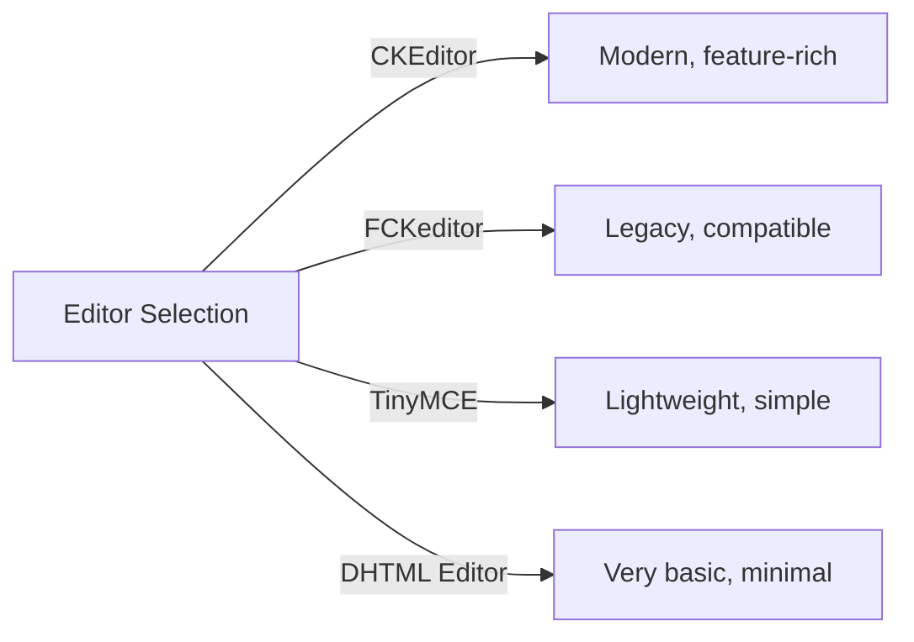
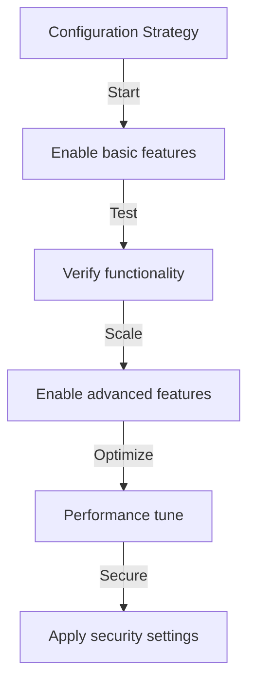

# प्रकाशक मूल विन्यास

> अपने XOOPS इंस्टॉलेशन के लिए प्रकाशक मॉड्यूल सेटिंग्स, प्राथमिकताएं और सामान्य विकल्प कॉन्फ़िगर करें।

---

## कॉन्फ़िगरेशन तक पहुँचना

### व्यवस्थापक पैनल नेविगेशन

```
XOOPS Admin Panel
└── Modules
    └── Publisher
        ├── Preferences
        ├── Settings
        └── Configuration
```

1. **प्रशासक** के रूप में लॉग इन करें
2. **एडमिन पैनल → मॉड्यूल** पर जाएं
3. **प्रकाशक** मॉड्यूल ढूंढें
4. **वरीयताएँ** या **एडमिन** लिंक पर क्लिक करें

---

## सामान्य सेटिंग्स

### एक्सेस कॉन्फ़िगरेशन

```
Admin Panel → Modules → Publisher
```

इन विकल्पों के लिए **गियर आइकन** या **सेटिंग्स** पर क्लिक करें:

#### प्रदर्शन विकल्प

| सेटिंग | विकल्प | डिफ़ॉल्ट | विवरण |
|--|---|--|---|
| **प्रति पृष्ठ आइटम** | 5-50 | 10 | सूचियों में दिखाए गए लेख |
| **ब्रेडक्रंब दिखाएँ** | हाँ/नहीं | हाँ | नेविगेशन ट्रेल डिस्प्ले |
| **पेजिंग का प्रयोग करें** | हाँ/नहीं | हाँ | लंबी सूचियाँ पृष्ठांकित करें |
| **तिथि दिखाएँ** | हाँ/नहीं | हाँ | आलेख दिनांक प्रदर्शित करें |
| **श्रेणी दिखाएँ** | हाँ/नहीं | हाँ | आलेख श्रेणी दिखाएँ |
| **लेखक दिखाएँ** | हाँ/नहीं | हाँ | लेख लेखक दिखाएँ |
| **दृश्य दिखाएं** | हाँ/नहीं | हाँ | लेख देखे जाने की संख्या दिखाएँ |

**उदाहरण विन्यास:**

```yaml
Items Per Page: 15
Show Breadcrumb: Yes
Use Paging: Yes
Show Date: Yes
Show Category: Yes
Show Author: Yes
Show Views: Yes
```

#### लेखक विकल्प

| सेटिंग | डिफ़ॉल्ट | विवरण |
|--|---|----|
| **लेखक का नाम दिखाएँ** | हाँ | वास्तविक नाम या उपयोगकर्ता नाम प्रदर्शित करें |
| **उपयोगकर्ता नाम का प्रयोग करें** | नहीं | नाम के स्थान पर उपयोक्तानाम दिखाएँ |
| **लेखक का ईमेल दिखाएँ** | नहीं | लेखक संपर्क ईमेल प्रदर्शित करें |
| **लेखक अवतार दिखाएँ** | हाँ | उपयोगकर्ता अवतार प्रदर्शित करें |

---

## संपादक विन्यास

### WYSIWYG संपादक चुनें

प्रकाशक अनेक संपादकों का समर्थन करता है:

#### उपलब्ध संपादक



### सीकेएडिटर (अनुशंसित)

**इसके लिए सर्वोत्तम:** अधिकांश उपयोगकर्ता, आधुनिक ब्राउज़र, पूर्ण सुविधाएँ

1. **वरीयताएँ** पर जाएँ
2. सेट **संपादक**: CKEditor
3. विकल्प कॉन्फ़िगर करें:

```
Editor: CKEditor 4.x
Toolbar: Full
Height: 400px
Width: 100%
Remove plugins: []
Add plugins: [mathjax, codesnippet]
```

### एफसीकेडिटर

**इसके लिए सर्वोत्तम:** अनुकूलता, पुराने सिस्टम

```
Editor: FCKeditor
Toolbar: Default
Custom config: (optional)
```

### TinyMCE

**इसके लिए सर्वोत्तम:** न्यूनतम पदचिह्न, बुनियादी संपादन

```
Editor: TinyMCE
Plugins: [paste, table, link, image]
Toolbar: minimal
```

---

## फ़ाइल और अपलोड सेटिंग्स

### अपलोड निर्देशिकाएँ कॉन्फ़िगर करें

```
Admin → Publisher → Preferences → Upload Settings
```

#### फ़ाइल प्रकार सेटिंग्स

```yaml
Allowed File Types:
  Images:
    - jpg
    - jpeg
    - gif
    - png
    - webp
  Documents:
    - pdf
    - doc
    - docx
    - xls
    - xlsx
    - ppt
    - pptx
  Archives:
    - zip
    - rar
    - 7z
  Media:
    - mp3
    - mp4
    - webm
    - mov
```

#### फ़ाइल आकार सीमाएँ

| फ़ाइल प्रकार | अधिकतम आकार | नोट्स |
|----|-------|-------|
| **छवियां** | 5 एमबी | प्रति छवि फ़ाइल |
| **दस्तावेज़** | 10 एमबी | पीडीएफ, कार्यालय फ़ाइलें |
| **मीडिया** | 50 एमबी | वीडियो/ऑडियो फ़ाइलें |
| **सभी फ़ाइलें** | 100 एमबी | प्रति अपलोड कुल |

**विन्यास:**

```
Max Image Upload Size: 5 MB
Max Document Upload Size: 10 MB
Max Media Upload Size: 50 MB
Total Upload Size: 100 MB
Max Files per Article: 5
```

### छवि का आकार बदलना

स्थिरता के लिए प्रकाशक छवियों का स्वतः आकार बदलता है:

```yaml
Thumbnail Size:
  Width: 150
  Height: 150
  Mode: Crop/Resize

Category Image Size:
  Width: 300
  Height: 200
  Mode: Resize

Article Featured Image:
  Width: 600
  Height: 400
  Mode: Resize
```

---

## टिप्पणी एवं इंटरैक्शन सेटिंग्स

### टिप्पणियाँ कॉन्फ़िगरेशन

```
Preferences → Comments Section
```

#### टिप्पणी विकल्प

```yaml
Allow Comments:
  - Enabled: Yes/No
  - Default: Yes
  - Per-article override: Yes

Comment Moderation:
  - Moderate comments: Yes/No
  - Moderate guest comments only: Yes/No
  - Spam filter: Enabled
  - Max comments per day: (unlimited)

Comment Display:
  - Display format: Threaded/Flat
  - Comments per page: 10
  - Date format: Full date/Time ago
  - Show comment count: Yes/No
```

### रेटिंग कॉन्फ़िगरेशन

```yaml
Allow Ratings:
  - Enabled: Yes/No
  - Default: Yes
  - Per-article override: Yes

Rating Options:
  - Rating scale: 5 stars (default)
  - Allow user to rate own: No
  - Show average rating: Yes
  - Show rating count: Yes
```

---

## एसईओ और URL सेटिंग्स

### खोज इंजन अनुकूलन

```
Preferences → SEO Settings
```

#### URL कॉन्फ़िगरेशन

```yaml
SEO URLs:
  - Enabled: No (set to Yes for SEO URLs)
  - URL rewriting: None/Apache mod_rewrite/IIS rewrite

URL Format:
  - Category: /category/news
  - Article: /article/welcome-to-site
  - Archive: /archive/2024/01

Meta Description:
  - Auto-generate: Yes
  - Max length: 160 characters

Meta Keywords:
  - Auto-generate: Yes
  - From: Article tags, title
```

### एसईओ URL सक्षम करें (उन्नत)

**आवश्यकताएँ:**
- अपाचे `mod_rewrite` सक्षम के साथ
- `.htaccess` समर्थन सक्षम

**कॉन्फ़िगरेशन चरण:**

1. **वरीयताएँ → SEO सेटिंग्स** पर जाएँ
2. **एसईओ URL** सेट करें: हाँ
3. **URL पुनर्लेखन** सेट करें: अपाचे mod_rewrite
4. सत्यापित करें कि `.htaccess` फ़ाइल प्रकाशक फ़ोल्डर में मौजूद है

**.htaccess कॉन्फ़िगरेशन:**

```apache
<IfModule mod_rewrite.c>
    RewriteEngine On
    RewriteBase /modules/publisher/

    # Category rewrites
    RewriteRule ^category/([0-9]+)-(.*)\.html$ index.php?op=showcategory&categoryid=$1 [L,QSA]

    # Article rewrites
    RewriteRule ^article/([0-9]+)-(.*)\.html$ index.php?op=showitem&itemid=$1 [L,QSA]

    # Archive rewrites
    RewriteRule ^archive/([0-9]+)/([0-9]+)/$ index.php?op=archive&year=$1&month=$2 [L,QSA]
</IfModule>
```

---

## कैश और प्रदर्शन

### कैशिंग कॉन्फ़िगरेशन

```
Preferences → Cache Settings
```

```yaml
Enable Caching:
  - Enabled: Yes
  - Cache type: File (or Memcache)

Cache Lifetime:
  - Category lists: 3600 seconds (1 hour)
  - Article lists: 1800 seconds (30 minutes)
  - Single article: 7200 seconds (2 hours)
  - Recent articles block: 900 seconds (15 minutes)

Cache Clear:
  - Manual clear: Available in admin
  - Auto-clear on article save: Yes
  - Clear on category change: Yes
```

### कैश साफ़ करें

**मैनुअल कैश साफ़ करें:**

1. **एडमिन → प्रकाशक → टूल्स** पर जाएँ
2. **कैश साफ़ करें** पर क्लिक करें
3. साफ़ करने के लिए कैश प्रकार चुनें:
   - [ ] श्रेणी कैश
   - [ ] आलेख कैश
   - [ ] कैश को ब्लॉक करें
   - [ ] सभी कैश
4. **चयनित साफ़ करें** पर क्लिक करें

**कमांड लाइन:**

```bash
# Clear all Publisher cache
php /path/to/xoops/admin/cache_manage.php publisher

# Or directly delete cache files
rm -rf /path/to/xoops/var/cache/publisher/*
```

---

## अधिसूचना एवं कार्यप्रवाह

### ईमेल सूचनाएं

```
Preferences → Notifications
```

```yaml
Notify Admin on New Article:
  - Enabled: Yes
  - Recipient: Admin email
  - Include summary: Yes

Notify Moderators:
  - Enabled: Yes
  - On new submission: Yes
  - On pending articles: Yes

Notify Author:
  - On approval: Yes
  - On rejection: Yes
  - On comment: No (optional)
```

### सबमिशन वर्कफ़्लो

```yaml
Require Approval:
  - Enabled: Yes
  - Editor approval: Yes
  - Admin approval: No

Draft Save:
  - Auto-save interval: 60 seconds
  - Save local versions: Yes
  - Revision history: Last 5 versions
```

---

## सामग्री सेटिंग्स

### प्रकाशन डिफ़ॉल्ट

```
Preferences → Content Settings
```

```yaml
Default Article Status:
  - Draft/Published: Draft
  - Featured by default: No
  - Auto-publish time: None

Default Visibility:
  - Public/Private: Public
  - Show on front page: Yes
  - Show in categories: Yes

Scheduled Publishing:
  - Enabled: Yes
  - Allow per-article: Yes

Content Expiration:
  - Enabled: No
  - Auto-archive old: No
  - Archive after days: (unlimited)
```### WYSIWYG सामग्री विकल्प

```yaml
Allow HTML:
  - In articles: Yes
  - In comments: No

Allow Embedded Media:
  - Videos (iframe): Yes
  - Images: Yes
  - Plugins: No

Content Filtering:
  - Strip tags: No
  - XSS filter: Yes (recommended)
```

---

## खोज इंजन सेटिंग्स

### खोज एकीकरण कॉन्फ़िगर करें

```
Preferences → Search Settings
```

```yaml
Enable Article Indexing:
  - Include in site search: Yes
  - Index type: Full text/Title only

Search Options:
  - Search in titles: Yes
  - Search in content: Yes
  - Search in comments: Yes

Meta Tags:
  - Auto generate: Yes
  - OG tags (social): Yes
  - Twitter cards: Yes
```

---

## उन्नत सेटिंग्स

### डिबग मोड (केवल विकास)

```
Preferences → Advanced
```

```yaml
Debug Mode:
  - Enabled: No (only for development!)

Development Features:
  - Show SQL queries: No
  - Log errors: Yes
  - Error email: admin@example.com
```

### डेटाबेस अनुकूलन

```
Admin → Tools → Optimize Database
```

```bash
# Manual optimization
mysql> OPTIMIZE TABLE publisher_items;
mysql> OPTIMIZE TABLE publisher_categories;
mysql> OPTIMIZE TABLE publisher_comments;
```

---

## मॉड्यूल अनुकूलन

### थीम टेम्पलेट

```
Preferences → Display → Templates
```

टेम्प्लेट सेट चुनें:
- डिफ़ॉल्ट
- क्लासिक
- आधुनिक
- अंधेरा
- कस्टम

प्रत्येक टेम्पलेट नियंत्रित करता है:
- लेख लेआउट
- श्रेणी सूची
- पुरालेख प्रदर्शन
- टिप्पणी प्रदर्शन

---

## कॉन्फ़िगरेशन युक्तियाँ

### सर्वोत्तम प्रथाएँ



1. **सरल शुरुआत करें** - पहले मुख्य सुविधाओं को सक्षम करें
2. **प्रत्येक परिवर्तन का परीक्षण करें** - आगे बढ़ने से पहले सत्यापित करें
3. **कैशिंग सक्षम करें** - प्रदर्शन में सुधार करता है
4. **पहले बैकअप** - बड़े बदलावों से पहले सेटिंग्स निर्यात करें
5. **मॉनिटर लॉग** - त्रुटि लॉग की नियमित रूप से जांच करें

### प्रदर्शन अनुकूलन

```yaml
For Better Performance:
  - Enable caching: Yes
  - Cache lifetime: 3600 seconds
  - Limit items per page: 10-15
  - Compress images: Yes
  - Minify CSS/JS: Yes (if available)
```

### सुरक्षा सख्त करना

```yaml
For Better Security:
  - Moderate comments: Yes
  - Disable HTML in comments: Yes
  - XSS filtering: Yes
  - File type whitelist: Strict
  - Max upload size: Reasonable limit
```

---

## निर्यात/आयात सेटिंग्स

### बैकअप कॉन्फ़िगरेशन

```
Admin → Tools → Export Settings
```

**वर्तमान कॉन्फ़िगरेशन का बैकअप लेने के लिए:**

1. **कॉन्फ़िगरेशन निर्यात करें** पर क्लिक करें
2. डाउनलोड की गई `.cfg` फ़ाइल सहेजें
3. सुरक्षित स्थान पर भंडारण करें

**पुनर्स्थापित करने के लिए:**

1. **कॉन्फ़िगरेशन आयात करें** पर क्लिक करें
2. `.cfg` फ़ाइल चुनें
3. **पुनर्स्थापित करें** पर क्लिक करें

---

## संबंधित कॉन्फ़िगरेशन मार्गदर्शिकाएँ

- श्रेणी प्रबंधन
- लेख निर्माण
- अनुमति विन्यास
- इंस्टालेशन गाइड

---

## समस्या निवारण कॉन्फ़िगरेशन

### सेटिंग्स सेव नहीं होंगी

**समाधान:**
1. `/var/config/` पर निर्देशिका अनुमतियाँ जाँचें
2. PHP लेखन पहुंच सत्यापित करें
3. समस्याओं के लिए PHP त्रुटि लॉग की जाँच करें
4. ब्राउज़र कैश साफ़ करें और पुनः प्रयास करें

### संपादक उपस्थित नहीं हो रहे हैं

**समाधान:**
1. सत्यापित करें कि संपादक प्लगइन स्थापित है
2. XOOPS संपादक कॉन्फ़िगरेशन जांचें
3. विभिन्न संपादक विकल्प आज़माएँ
4. JavaScript त्रुटियों के लिए ब्राउज़र कंसोल की जाँच करें

### प्रदर्शन संबंधी मुद्दे

**समाधान:**
1. कैशिंग सक्षम करें
2. प्रति पृष्ठ आइटम कम करें
3. छवियों को संपीड़ित करें
4. डेटाबेस अनुकूलन की जाँच करें
5. धीमी क्वेरी लॉग की समीक्षा करें

---

## अगले चरण

- समूह अनुमतियाँ कॉन्फ़िगर करें
- अपना पहला लेख बनाएं
- श्रेणियाँ सेट करें
- कस्टम टेम्पलेट्स की समीक्षा करें

---

#प्रकाशक #कॉन्फ़िगरेशन #प्राथमिकताएं #सेटिंग्स #xoops