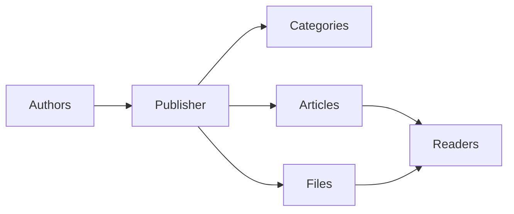
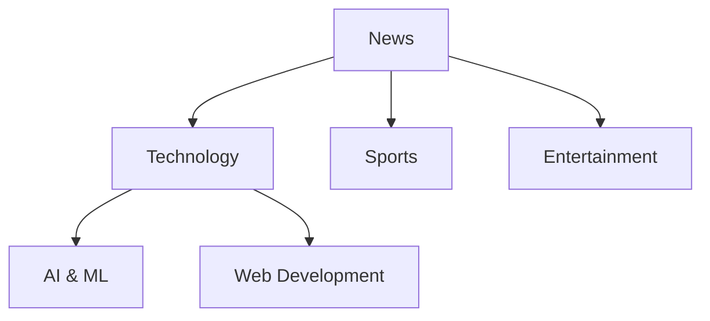
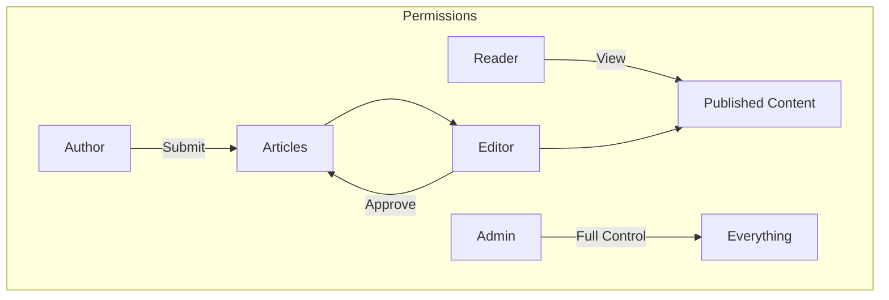
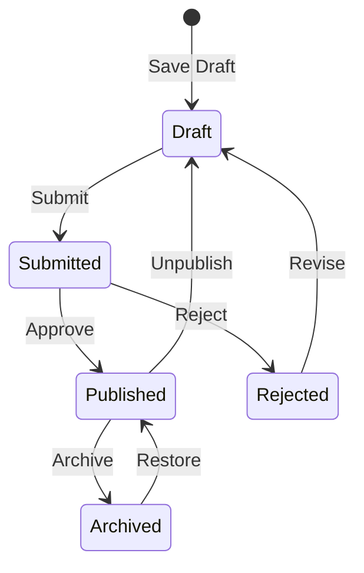

# प्रकाशक के साथ शुरुआत करना

> प्रकाशक समाचार/ब्लॉग मॉड्यूल को स्थापित करने और उपयोग करने के लिए चरण-दर-चरण मार्गदर्शिका।

---

## प्रकाशक क्या है?

प्रकाशक XOOPS के लिए प्रमुख सामग्री प्रबंधन मॉड्यूल है, जिसे इसके लिए डिज़ाइन किया गया है:

- **समाचार साइटें** - श्रेणियों के साथ लेख प्रकाशित करें
- **ब्लॉग** - व्यक्तिगत या बहु-लेखक ब्लॉगिंग``
- **दस्तावेज़ीकरण** - संगठित ज्ञान आधार
- **सामग्री पोर्टल** - मिश्रित मीडिया सामग्री



---

## त्वरित सेटअप

### चरण 1: प्रकाशक स्थापित करें

1. [GitHub](https://github.com/XoopsModules25x/publisher) से डाउनलोड करें
2. `modules/publisher/` पर अपलोड करें
3. एडमिन → मॉड्यूल → इंस्टॉल पर जाएं

### चरण 2: श्रेणियाँ बनाएँ



1. व्यवस्थापक → प्रकाशक → श्रेणियाँ
2. "श्रेणी जोड़ें" पर क्लिक करें
3. भरें:
   - **नाम**: श्रेणी का नाम
   - **विवरण**: इस श्रेणी में क्या शामिल है
   - **छवि**: वैकल्पिक श्रेणी छवि
4. अनुमतियाँ सेट करें (कौन सबमिट/देख सकता है)
5. सहेजें

### चरण 3: सेटिंग्स कॉन्फ़िगर करें

1. व्यवस्थापक → प्रकाशक → प्राथमिकताएँ
2. कॉन्फ़िगर करने के लिए मुख्य सेटिंग्स:

| सेटिंग | अनुशंसित | विवरण |
|--|----|---|
| प्रति पृष्ठ आइटम | 10-20 | सूचकांक पर लेख |
| संपादक | TinyMCE/CKEditor | रिच टेक्स्ट संपादक |
| रेटिंग की अनुमति दें | हाँ | पाठकों की प्रतिक्रिया |
| टिप्पणियों की अनुमति दें | हाँ | चर्चाएँ |
| स्वत: अनुमोदन | नहीं | संपादकीय नियंत्रण |

### चरण 4: अपना पहला लेख बनाएं

1. मुख्य मेनू → प्रकाशक → आलेख सबमिट करें
2. फॉर्म भरें:
   - **शीर्षक**: लेख शीर्षक
   - **श्रेणी**: यह कहां से संबंधित है
   - **सारांश**: संक्षिप्त विवरण
   - **मुख्य**: संपूर्ण लेख सामग्री
3. वैकल्पिक तत्व जोड़ें:
   - विशेष रुप से प्रदर्शित छवि
   - फ़ाइल अनुलग्नक
   - एसईओ सेटिंग्स
4. समीक्षा या प्रकाशन के लिए सबमिट करें

---

## उपयोगकर्ता भूमिकाएँ



### पाठक
- प्रकाशित लेख देखें
- रेट करें और टिप्पणी करें
- सामग्री खोजें

### लेखक
- नए लेख सबमिट करें
- स्वयं के लेख संपादित करें
- फ़ाइलें संलग्न करें

### संपादक
- सबमिशन स्वीकृत/अस्वीकार करें
- किसी भी लेख को संपादित करें
- श्रेणियां प्रबंधित करें

### प्रशासक
- पूर्ण मॉड्यूल नियंत्रण
- सेटिंग्स कॉन्फ़िगर करें
- अनुमतियाँ प्रबंधित करें

---

## लेख लिखना

### लेख संपादक

```
┌─────────────────────────────────────────────────────┐
│ Title: [Your Article Title                        ] │
├─────────────────────────────────────────────────────┤
│ Category: [Select Category          ▼]              │
├─────────────────────────────────────────────────────┤
│ Summary:                                            │
│ ┌─────────────────────────────────────────────────┐ │
│ │ Brief description shown in listings...          │ │
│ └─────────────────────────────────────────────────┘ │
├─────────────────────────────────────────────────────┤
│ Body:                                               │
│ ┌─────────────────────────────────────────────────┐ │
│ │ [B] [I] [U] [Link] [Image] [Code]               │ │
│ ├─────────────────────────────────────────────────┤ │
│ │                                                  │ │
│ │ Full article content goes here...               │ │
│ │                                                  │ │
│ └─────────────────────────────────────────────────┘ │
├─────────────────────────────────────────────────────┤
│ [Submit] [Preview] [Save Draft]                     │
└─────────────────────────────────────────────────────┘
```

### सर्वोत्तम प्रथाएँ

1. **सम्मोहक शीर्षक** - स्पष्ट, आकर्षक शीर्षक
2. **अच्छे सारांश** - पाठकों को क्लिक करने के लिए प्रेरित करें
3. **संरचित सामग्री** - शीर्षकों, सूचियों, छवियों का उपयोग करें
4. **उचित वर्गीकरण** - पाठकों को सामग्री ढूंढने में सहायता करें
5. **एसईओ अनुकूलन** - शीर्षक और सामग्री में कीवर्ड

---

## सामग्री का प्रबंधन करना

### आलेख स्थिति प्रवाह



### स्थिति विवरण

| स्थिति | विवरण |
|-------|----|
| ड्राफ्ट | कार्य प्रगति पर है |
| प्रस्तुत | समीक्षा की प्रतीक्षा में |
| प्रकाशित | साइट पर लाइव |
| समाप्त | पिछली समाप्ति तिथि |
| अस्वीकृत | संशोधन की आवश्यकता है |
| संग्रहीत | लिस्टिंग से हटा दिया गया |

---

## नेविगेशन

### प्रकाशक तक पहुँचना

- **मुख्य मेनू** → प्रकाशक
- **सीधा URL**: `yoursite.com/modules/publisher/`

### मुख्य पृष्ठ

| पेज | URL | उद्देश्य |
|------|-----|------|
| सूचकांक | `/modules/publisher/` | लेख सूची |
| श्रेणी | `/modules/publisher/category.php?id=X` | श्रेणी लेख |
| लेख | `/modules/publisher/item.php?itemid=X` | एकल लेख |
| सबमिट करें | `/modules/publisher/submit.php` | नया लेख |
| खोजें | `/modules/publisher/search.php` | लेख खोजें |

---

## ब्लॉक

प्रकाशक आपकी साइट के लिए कई ब्लॉक प्रदान करता है:

### हाल के लेख
नवीनतम प्रकाशित लेख प्रदर्शित करता है

### श्रेणी मेनू
श्रेणी के अनुसार नेविगेशन

### लोकप्रिय लेख
सर्वाधिक देखी गई सामग्री

### यादृच्छिक लेख
यादृच्छिक सामग्री प्रदर्शित करें

### स्पॉटलाइट
विशेष आलेख

---

## संबंधित दस्तावेज़ीकरण

- लेख बनाना और संपादित करना
- श्रेणियाँ प्रबंधित करना
- विस्तारक प्रकाशक

---

#xoops #प्रकाशक #उपयोगकर्ता-मार्गदर्शिका #प्रारंभ करना #सीएमएस