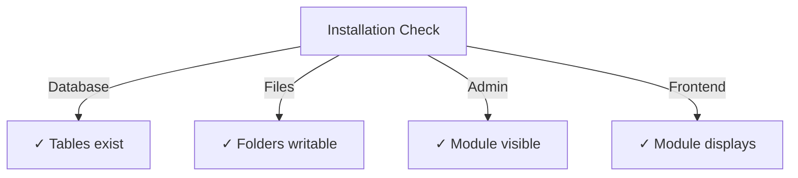

# प्रकाशक स्थापना गाइड

>XOOPS सीएमएस के लिए प्रकाशक मॉड्यूल को स्थापित और कॉन्फ़िगर करने के लिए पूर्ण निर्देश।

---

## सिस्टम आवश्यकताएँ

### न्यूनतम आवश्यकताएँ

| आवश्यकता | संस्करण | नोट्स |
|---|------|-------|
| XOOPS | 2.5.10+ | कोर सीएमएस प्लेटफार्म |
| PHP | 7.1+ | PHP 8.x अनुशंसित |
| MySQL | 5.7+ | डेटाबेस सर्वर |
| वेब सर्वर | अपाचे/Nginx | पुनर्लेखन समर्थन के साथ |

### PHP एक्सटेंशन

```
- PDO (PHP Data Objects)
- pdo_mysql or mysqli
- mb_string (multibyte strings)
- curl (for external content)
- json
- gd (image processing)
```

### डिस्क स्थान

- **मॉड्यूल फ़ाइलें**: ~5 एमबी
- **कैश निर्देशिका**: 50+ एमबी अनुशंसित
- **अपलोड निर्देशिका**: सामग्री के लिए आवश्यकतानुसार

---

## प्री-इंस्टॉलेशन चेकलिस्ट

प्रकाशक स्थापित करने से पहले, सत्यापित करें:

- [ ] XOOPS कोर स्थापित है और चल रहा है
- [ ] व्यवस्थापक खाते में मॉड्यूल प्रबंधन अनुमतियाँ हैं
- [ ] डेटाबेस बैकअप बनाया गया
- [ ] फ़ाइल अनुमतियाँ `/modules/` निर्देशिका तक लिखने की अनुमति देती हैं
- [ ] PHP मेमोरी सीमा कम से कम 128 एमबी है
- [ ] फ़ाइल अपलोड आकार सीमा उपयुक्त है (न्यूनतम 10 एमबी)

---

## स्थापना चरण

### चरण 1: प्रकाशक डाउनलोड करें

#### विकल्प ए: GitHub से (अनुशंसित)

```bash
# Navigate to modules directory
cd /path/to/xoops/htdocs/modules/

# Clone the repository
git clone https://github.com/XoopsModules25x/publisher.git

# Verify download
ls -la publisher/
```

#### विकल्प बी: मैन्युअल डाउनलोड

1. [GitHub प्रकाशक विज्ञप्ति](https://github.com/XoopsModules25x/publisher/releases) पर जाएँ
2. नवीनतम `.zip` फ़ाइल डाउनलोड करें
3. `modules/publisher/` पर निकालें

### चरण 2: फ़ाइल अनुमतियाँ सेट करें

```bash
# Set proper ownership
chown -R www-data:www-data /path/to/xoops/htdocs/modules/publisher

# Set directory permissions (755)
find publisher -type d -exec chmod 755 {} \;

# Set file permissions (644)
find publisher -type f -exec chmod 644 {} \;

# Make scripts executable
chmod 755 publisher/admin/index.php
chmod 755 publisher/index.php
```

### चरण 3: XOOPS एडमिन के माध्यम से इंस्टॉल करें

1. व्यवस्थापक के रूप में **XOOPS एडमिन पैनल** में लॉग इन करें
2. **सिस्टम → मॉड्यूल** पर नेविगेट करें
3. **मॉड्यूल इंस्टॉल करें** पर क्लिक करें
4. सूची में **प्रकाशक** ढूंढें
5. **इंस्टॉल** बटन पर क्लिक करें
6. इंस्टॉलेशन पूरा होने तक प्रतीक्षा करें (बनाई गई डेटाबेस तालिकाएँ दिखाता है)

```
Installation Progress:
✓ Tables created
✓ Configuration initialized
✓ Permissions set
✓ Cache cleared
Installation Complete!
```

---

## प्रारंभिक सेटअप

### चरण 1: प्रकाशक व्यवस्थापक तक पहुंचें

1. **एडमिन पैनल → मॉड्यूल** पर जाएं
2. **प्रकाशक** मॉड्यूल खोजें
3. **एडमिन** लिंक पर क्लिक करें
4. अब आप प्रकाशक प्रशासन में हैं

### चरण 2: मॉड्यूल प्राथमिकताएँ कॉन्फ़िगर करें

1. बाएँ मेनू में **वरीयताएँ** पर क्लिक करें
2. बुनियादी सेटिंग्स कॉन्फ़िगर करें:

```
General Settings:
- Editor: Select your WYSIWYG editor
- Items per page: 10
- Show breadcrumb: Yes
- Allow comments: Yes
- Allow ratings: Yes

SEO Settings:
- SEO URLs: No (enable later if needed)
- URL rewriting: None

Upload Settings:
- Max upload size: 5 MB
- Allowed file types: jpg, png, gif, pdf, doc, docx
```

3. **सेटिंग्स सहेजें** पर क्लिक करें

### चरण 3: पहली श्रेणी बनाएं

1. बाएँ मेनू में **श्रेणियाँ** पर क्लिक करें
2. **श्रेणी जोड़ें** पर क्लिक करें
3. फॉर्म भरें:

```
Category Name: News
Description: Latest news and updates
Image: (optional) Upload category image
Parent Category: (leave blank for top-level)
Status: Enabled
```

4. **श्रेणी सहेजें** पर क्लिक करें

### चरण 4: स्थापना सत्यापित करें

इन संकेतकों की जाँच करें:



#### डेटाबेस जांच

```bash
mysql -u xoops_user -p xoops_database
mysql> SHOW TABLES LIKE 'publisher%';

# Should show tables:
# - publisher_categories
# - publisher_items
# - publisher_comments
# - publisher_files
```

#### फ्रंट-एंड चेक

1. अपने XOOPS होमपेज पर जाएँ
2. **प्रकाशक** या **समाचार** ब्लॉक खोजें
3. हाल के लेख प्रदर्शित करने चाहिए

---

## स्थापना के बाद विन्यास

### संपादक चयन

प्रकाशक एकाधिक WYSIWYG संपादकों का समर्थन करता है:

| संपादक | पेशेवरों | विपक्ष |
|------|------|------|
| एफसीकेडिटर | सुविधा संपन्न | पुराना, बड़ा |
| सीकेएडिटर | आधुनिक मानक | कॉन्फ़िगरेशन जटिलता |
| TinyMCE | हल्का वजन | सीमित सुविधाएँ |
| DHTML संपादक | बुनियादी | बहुत ही बुनियादी |

**संपादक बदलने के लिए:**

1. **वरीयताएँ** पर जाएँ
2. **संपादक** सेटिंग तक स्क्रॉल करें
3. ड्रॉपडाउन से चयन करें
4. सहेजें और परीक्षण करें

### अपलोड निर्देशिका सेटअप

```bash
# Create upload directories
mkdir -p /path/to/xoops/uploads/publisher/
mkdir -p /path/to/xoops/uploads/publisher/categories/
mkdir -p /path/to/xoops/uploads/publisher/images/
mkdir -p /path/to/xoops/uploads/publisher/files/

# Set permissions
chmod 755 /path/to/xoops/uploads/publisher/
chmod 755 /path/to/xoops/uploads/publisher/*
```

### छवि आकार कॉन्फ़िगर करें

प्राथमिकताओं में, थंबनेल आकार सेट करें:

```
Category image size: 300 x 200 px
Article image size: 600 x 400 px
Thumbnail size: 150 x 100 px
```

---

## इंस्टालेशन के बाद के चरण

### 1. समूह अनुमतियाँ सेट करें

1. एडमिन मेनू में **अनुमतियाँ** पर जाएँ
2. समूहों के लिए पहुंच कॉन्फ़िगर करें:
   - अज्ञात: केवल देखें
   - पंजीकृत उपयोगकर्ता: लेख सबमिट करें
   - संपादक: लेखों को स्वीकृत/संपादित करें
   - व्यवस्थापक: पूर्ण पहुँच

### 2. मॉड्यूल दृश्यता कॉन्फ़िगर करें

1. XOOPS एडमिन में **ब्लॉक** पर जाएं
2. प्रकाशक ब्लॉक खोजें:
   - प्रकाशक - नवीनतम लेख
   - प्रकाशक - श्रेणियाँ
   - प्रकाशक - पुरालेख
3. प्रति पृष्ठ ब्लॉक दृश्यता कॉन्फ़िगर करें

### 3. परीक्षण सामग्री आयात करें (वैकल्पिक)

परीक्षण के लिए, नमूना लेख आयात करें:1. **प्रकाशक व्यवस्थापक → आयात** पर जाएँ
2. **नमूना सामग्री** चुनें
3. **आयात** पर क्लिक करें

### 4. एसईओ URL सक्षम करें (वैकल्पिक)

खोज-अनुकूल URL के लिए:

1. **वरीयताएँ** पर जाएँ
2. **एसईओ URL** सेट करें: हाँ
3. **.htaccess** पुनर्लेखन सक्षम करें
4. सत्यापित करें कि `.htaccess` फ़ाइल प्रकाशक फ़ोल्डर में मौजूद है

```apache
# .htaccess example
<IfModule mod_rewrite.c>
    RewriteEngine On
    RewriteBase /modules/publisher/
    RewriteRule ^category/([0-9]+)-(.*)\.html$ index.php?op=showcategory&categoryid=$1 [L]
    RewriteRule ^article/([0-9]+)-(.*)\.html$ index.php?op=showitem&itemid=$1 [L]
</IfModule>
```

---

## समस्या निवारण स्थापना

### समस्या: मॉड्यूल व्यवस्थापक में प्रकट नहीं होता है

**समाधान:**
```bash
# Check file permissions
ls -la /path/to/xoops/modules/publisher/

# Check xoops_version.php exists
ls /path/to/xoops/modules/publisher/xoops_version.php

# Verify PHP syntax
php -l /path/to/xoops/modules/publisher/xoops_version.php
```

### समस्या: डेटाबेस तालिकाएँ नहीं बनाई गईं

**समाधान:**
1. जांचें कि MySQL उपयोगकर्ता के पास CREATE TABLE विशेषाधिकार है
2. डेटाबेस त्रुटि लॉग की जाँच करें:
   ```bash
   mysql> SHOW WARNINGS;
   ```
3. मैन्युअल रूप से SQL आयात करें:
   ```bash
   mysql -u user -p database < modules/publisher/sql/mysql.sql
   ```

### समस्या: फ़ाइल अपलोड विफल

**समाधान:**
```bash
# Check directory exists and is writable
stat /path/to/xoops/uploads/publisher/

# Fix permissions
chmod 777 /path/to/xoops/uploads/publisher/

# Verify PHP settings
php -i | grep upload_max_filesize
```

### समस्या: "पेज नहीं मिला" त्रुटियाँ

**समाधान:**
1. जांचें कि `.htaccess` फ़ाइल मौजूद है
2. सत्यापित करें कि Apache `mod_rewrite` सक्षम है:
   ```bash
   a2enmod rewrite
   systemctl restart apache2
   ```
3. अपाचे कॉन्फ़िगरेशन में `AllowOverride All` जांचें

---

## पिछले संस्करणों से अपग्रेड करें

### प्रकाशक 1.x से 2.x तक

1. **बैकअप वर्तमान स्थापना:**
   ```bash
   cp -r modules/publisher/ modules/publisher-backup/
   mysqldump -u user -p database > publisher-backup.sql
   ```

2. **प्रकाशक 2.x डाउनलोड करें**

3. **फ़ाइलों को अधिलेखित करें:**
   ```bash
   rm -rf modules/publisher/
   unzip publisher-2.0.zip -d modules/
   ```

4. **अद्यतन चलाएँ:**
   - **एडमिन → प्रकाशक → अपडेट** पर जाएं
   - **डेटाबेस अपडेट करें** पर क्लिक करें
   - पूरा होने की प्रतीक्षा करें

5. **सत्यापित करें:**
   - सभी लेखों का प्रदर्शन सही ढंग से जांचें
   - सत्यापित करें कि अनुमतियाँ बरकरार हैं
   - फ़ाइल अपलोड का परीक्षण करें

---

## सुरक्षा संबंधी विचार

### फ़ाइल अनुमतियाँ

```
- Core files: 644 (readable by web server)
- Directories: 755 (browseable by web server)
- Upload directories: 755 or 777
- Config files: 600 (not readable by web)
```

### संवेदनशील फ़ाइलों तक सीधी पहुंच अक्षम करें

अपलोड निर्देशिकाओं में `.htaccess` बनाएं:

```apache
<FilesMatch "\.(php|phtml|php3|php4|php5|phtml)$">
    Deny from all
</FilesMatch>
```

### डेटाबेस सुरक्षा

```bash
# Use strong password
ALTER USER 'publisher_user'@'localhost' IDENTIFIED BY 'strong_password_here';

# Grant minimal permissions
GRANT SELECT, INSERT, UPDATE, DELETE ON publisher_db.* TO 'publisher_user'@'localhost';
FLUSH PRIVILEGES;
```

---

## सत्यापन चेकलिस्ट

स्थापना के बाद, सत्यापित करें:

- [ ] मॉड्यूल व्यवस्थापक मॉड्यूल सूची में दिखाई देता है
- [ ] प्रकाशक व्यवस्थापक अनुभाग तक पहुंच सकते हैं
- [ ] श्रेणियां बना सकते हैं
- [ ] लेख बना सकते हैं
- [ ] लेख फ्रंट-एंड पर प्रदर्शित होते हैं
- [ ] फ़ाइल अपलोड कार्य
- [ ] छवियाँ सही ढंग से प्रदर्शित होती हैं
- [ ] अनुमतियाँ सही ढंग से लागू की गई हैं
- [ ] डेटाबेस तालिकाएँ बनाई गईं
- [ ] कैश निर्देशिका लिखने योग्य है

---

## अगले चरण

सफल स्थापना के बाद:

1. बुनियादी कॉन्फ़िगरेशन गाइड पढ़ें
2. अपना पहला लेख बनाएं
3. समूह अनुमतियाँ सेट करें
4. श्रेणी प्रबंधन की समीक्षा करें

---

## समर्थन एवं संसाधन

- **GitHub मुद्दे**: [प्रकाशक मुद्दे](https://github.com/XoopsModules25x/publisher/issues)
- **XOOPS फोरम**: [सामुदायिक सहायता](https://www.xoops.org/modules/newbb/)
- **GitHub विकी**: [इंस्टॉलेशन सहायता](https://github.com/XoopsModules25x/publisher/wiki)

---

#प्रकाशक #इंस्टॉलेशन #सेटअप #xoops #मॉड्यूल #कॉन्फ़िगरेशन