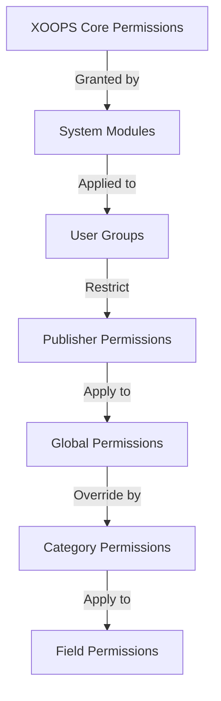

# प्रकाशक अनुमतियाँ सेटअप

> समूह अनुमतियों को कॉन्फ़िगर करने, पहुंच नियंत्रण और प्रकाशक में उपयोगकर्ता पहुंच को प्रबंधित करने के लिए संपूर्ण मार्गदर्शिका।

---

## अनुमति मूल बातें

### अनुमतियाँ क्या हैं?

अनुमतियाँ नियंत्रित करती हैं कि विभिन्न उपयोगकर्ता समूह प्रकाशक में क्या कर सकते हैं:

```
Who can:
  - View articles
  - Submit articles
  - Edit articles
  - Approve articles
  - Manage categories
  - Configure settings
```

### अनुमति स्तर

```
Anonymous
  └── View published articles only

Registered Users
  ├── View articles
  ├── Submit articles (pending approval)
  └── Edit own articles

Editors/Moderators
  ├── All registered permissions
  ├── Approve articles
  ├── Edit all articles
  └── Manage some categories

Administrators
  └── Full access to everything
```

---

## प्रवेश अनुमति प्रबंधन

### अनुमतियों पर नेविगेट करें

```
Admin Panel
└── Modules
    └── Publisher
        ├── Permissions
        ├── Category Permissions
        └── Group Management
```

### त्वरित पहुंच

1. **प्रशासक** के रूप में लॉग इन करें
2. **एडमिन → मॉड्यूल** पर जाएं
3. **प्रकाशक → व्यवस्थापक** पर क्लिक करें
4. बाएँ मेनू में **अनुमतियाँ** पर क्लिक करें

---

## वैश्विक अनुमतियाँ

### मॉड्यूल-स्तरीय अनुमतियाँ

प्रकाशक मॉड्यूल और सुविधाओं तक पहुंच नियंत्रित करें:

```
Permissions configuration view:
┌─────────────────────────────────────┐
│ Permission             │ Anon │ Reg │ Editor │ Admin │
├────────────────────────┼──────┼─────┼────────┼───────┤
│ View articles          │  ✓   │  ✓  │   ✓    │  ✓   │
│ Submit articles        │  ✗   │  ✓  │   ✓    │  ✓   │
│ Edit own articles      │  ✗   │  ✓  │   ✓    │  ✓   │
│ Edit all articles      │  ✗   │  ✗  │   ✓    │  ✓   │
│ Approve articles       │  ✗   │  ✗  │   ✓    │  ✓   │
│ Manage categories      │  ✗   │  ✗  │   ✗    │  ✓   │
│ Access admin panel     │  ✗   │  ✗  │   ✓    │  ✓   │
└─────────────────────────────────────┘
```

### अनुमति विवरण

| अनुमति | उपयोगकर्ता | प्रभाव |
|--|-------|--------|
| **लेख देखें** | सभी समूह | फ्रंट-एंड पर प्रकाशित लेख देख सकते हैं |
| **लेख सबमिट करें** | पंजीकृत+ | नए लेख बना सकते हैं (अनुमोदन लंबित) |
| **स्वयं के लेख संपादित करें** | पंजीकृत+ | अपने स्वयं के लेखों को संपादित/हटा सकते हैं |
| **सभी लेख संपादित करें** | संपादक+ | किसी भी उपयोगकर्ता के लेख को संपादित कर सकते हैं |
| **स्वयं के लेख हटाएं** | पंजीकृत+ | अपने स्वयं के अप्रकाशित लेखों को हटा सकते हैं |
| **सभी लेख हटाएं** | संपादक+ | किसी भी लेख को हटा सकते हैं |
| **अनुमोदन आलेख** | संपादक+ | लंबित लेख प्रकाशित कर सकते हैं |
| **श्रेणियां प्रबंधित करें** | व्यवस्थापक | श्रेणियां बनाएं, संपादित करें, हटाएं |
| **व्यवस्थापक पहुंच** | संपादक+ | व्यवस्थापक इंटरफ़ेस तक पहुंचें |

---

## वैश्विक अनुमतियाँ कॉन्फ़िगर करें

### चरण 1: अनुमति सेटिंग्स तक पहुंचें

1. **एडमिन → मॉड्यूल** पर जाएं
2. **प्रकाशक** खोजें
3. **अनुमतियाँ** पर क्लिक करें (या एडमिन लिंक फिर अनुमतियाँ)
4. आप अनुमति मैट्रिक्स देखें

### चरण 2: समूह अनुमतियाँ सेट करें

प्रत्येक समूह के लिए, कॉन्फ़िगर करें कि वे क्या कर सकते हैं:

#### अज्ञात उपयोगकर्ता

```yaml
Anonymous Group Permissions:
  View articles: ✓ YES
  Submit articles: ✗ NO
  Edit articles: ✗ NO
  Delete articles: ✗ NO
  Approve articles: ✗ NO
  Manage categories: ✗ NO
  Admin access: ✗ NO

Result: Anonymous users can only view published content
```

#### पंजीकृत उपयोगकर्ता

```yaml
Registered Group Permissions:
  View articles: ✓ YES
  Submit articles: ✓ YES (with approval required)
  Edit own articles: ✓ YES
  Edit all articles: ✗ NO
  Delete own articles: ✓ YES (drafts only)
  Delete all articles: ✗ NO
  Approve articles: ✗ NO
  Manage categories: ✗ NO
  Admin access: ✗ NO

Result: Registered users can contribute content after approval
```

#### संपादक समूह

```yaml
Editors Group Permissions:
  View articles: ✓ YES
  Submit articles: ✓ YES
  Edit own articles: ✓ YES
  Edit all articles: ✓ YES
  Delete own articles: ✓ YES
  Delete all articles: ✓ YES
  Approve articles: ✓ YES
  Manage categories: ✓ LIMITED
  Admin access: ✓ YES
  Configure settings: ✗ NO

Result: Editors manage content but not settings
```

#### प्रशासक

```yaml
Admins Group Permissions:
  ✓ FULL ACCESS to all features

  - All editor permissions
  - Manage all categories
  - Configure all settings
  - Manage permissions
  - Install/uninstall
```

### चरण 3: अनुमतियाँ सहेजें

1. प्रत्येक समूह की अनुमतियाँ कॉन्फ़िगर करें
2. अनुमत कार्यों के लिए बॉक्स चेक करें
3. अस्वीकृत कार्यों के लिए बॉक्स अनचेक करें
4. **अनुमतियाँ सहेजें** पर क्लिक करें
5. पुष्टिकरण संदेश प्रकट होता है

---

## श्रेणी-स्तरीय अनुमतियाँ

### श्रेणी पहुंच सेट करें

नियंत्रित करें कि विशिष्ट श्रेणियों को कौन देख/सबमिट कर सकता है:

```
Admin → Publisher → Categories
→ Select category → Permissions
```

### श्रेणी अनुमति मैट्रिक्स

```
                 Anonymous  Registered  Editor  Admin
View category        ✓         ✓         ✓       ✓
Submit to category   ✗         ✓         ✓       ✓
Edit own in category ✗         ✓         ✓       ✓
Edit all in category ✗         ✗         ✓       ✓
Approve in category  ✗         ✗         ✓       ✓
Manage category      ✗         ✗         ✗       ✓
```

### श्रेणी अनुमतियाँ कॉन्फ़िगर करें

1. **श्रेणियाँ** व्यवस्थापक पर जाएँ
2. श्रेणी खोजें
3. **अनुमतियाँ** बटन पर क्लिक करें
4. प्रत्येक समूह के लिए, चुनें:
   - [ ] इस श्रेणी को देखें
   - [ ] लेख सबमिट करें
   - [ ] स्वयं के लेख संपादित करें
   - [ ] सभी लेख संपादित करें
   - [ ] लेखों को मंजूरी दें
   - [ ] श्रेणी प्रबंधित करें
5. **सहेजें** पर क्लिक करें

### श्रेणी अनुमति उदाहरण

#### सार्वजनिक समाचार श्रेणी

```
Anonymous: View only
Registered: View + Submit (pending approval)
Editors: Approve + Edit
Admins: Full control
```

#### आंतरिक अद्यतन श्रेणी

```
Anonymous: No access
Registered: View only
Editors: Submit + Approve
Admins: Full control
```

#### अतिथि ब्लॉग श्रेणी

```
Anonymous: View only
Registered: Submit (pending approval)
Editors: Approve
Admins: Full control
```

---

## फ़ील्ड-स्तरीय अनुमतियाँ

### नियंत्रण प्रपत्र फ़ील्ड दृश्यता

यह प्रतिबंधित करें कि उपयोगकर्ता किस फॉर्म फ़ील्ड को देख/संपादित कर सकते हैं:

```
Admin → Publisher → Permissions → Fields
```

### फ़ील्ड विकल्प

```yaml
Visible Fields for Registered Users:
  ✓ Title
  ✓ Description
  ✓ Content (body)
  ✓ Featured image
  ✓ Category
  ✓ Tags
  ✗ Author (auto-set)
  ✗ Publication date (editors only)
  ✗ Scheduled date (editors only)
  ✗ Featured flag (editors only)
  ✗ Permissions (admins only)
```

### उदाहरण

#### पंजीकृत के लिए सीमित सबमिशन

पंजीकृत उपयोगकर्ताओं को कम विकल्प दिखाई देते हैं:

```
Available fields:
  - Title ✓
  - Description ✓
  - Content ✓
  - Featured image ✓
  - Category ✓

Hidden fields:
  - Author (auto-current user)
  - Publication date (editors decide)
  - Scheduled date (admins only)
  - Featured status (editors choose)
```

#### संपादकों के लिए पूर्ण प्रपत्र

संपादक सभी विकल्प देखते हैं:

```
Available fields:
  - All basic fields
  - All metadata
  - Author selection ✓
  - Publication date/time ✓
  - Scheduled date ✓
  - Featured status ✓
  - Expiration date ✓
  - Permissions ✓
```

---

## उपयोगकर्ता समूह कॉन्फ़िगरेशन

### कस्टम ग्रुप बनाएं

1. **एडमिन → उपयोगकर्ता → समूह** पर जाएं
2. **समूह बनाएं** पर क्लिक करें
3. समूह विवरण दर्ज करें:

```
Group Name: "Community Bloggers"
Group Description: "Users who contribute blog content"
Type: Regular group
```

4. **समूह सहेजें** पर क्लिक करें
5. प्रकाशक अनुमतियों पर वापस जाएँ
6. नए समूह के लिए अनुमतियाँ सेट करें

### समूह उदाहरण

```
Suggested Groups for Publisher:

Group: Contributors
  - Regular members who submit articles
  - Can edit own articles
  - Cannot approve articles

Group: Reviewers
  - Can see submitted articles
  - Can approve/reject articles
  - Cannot delete others' articles

Group: Editors
  - Can edit any article
  - Can approve articles
  - Can moderate comments
  - Can manage some categories

Group: Publishers
  - Can edit any article
  - Can publish directly (no approval)
  - Can manage all categories
  - Can configure settings
```

---

## अनुमति पदानुक्रम

### अनुमति प्रवाह



### अनुमति विरासत

```
Base: Global module permissions
  ↓
Category: Overrides for specific categories
  ↓
Field: Further restricts available fields
  ↓
User: Has permission if ALL levels allow
```

**उदाहरण:**

```
User wants to edit article:
1. User group must have "edit articles" permission (global)
2. Category must allow editing (category level)
3. Field restrictions must allow (if applicable)
4. User must be author OR editor (for own vs all)

If ANY level denies → Permission denied
```

---

## अनुमोदन वर्कफ़्लो अनुमतियाँ

### सबमिशन अनुमोदन कॉन्फ़िगर करेंनियंत्रित करें कि लेखों को अनुमोदन की आवश्यकता है या नहीं:

```
Admin → Publisher → Preferences → Workflow
```

#### अनुमोदन विकल्प

```yaml
Submission Workflow:
  Require Approval: Yes

  For Registered Users:
    - New articles: Draft (pending approval)
    - Editors must approve
    - User can edit while pending
    - After approval: User can still edit

  For Editors:
    - New articles: Publish directly (optional)
    - Skip approval queue
    - Or always require approval
```

#### प्रति समूह कॉन्फ़िगर करें

1. प्राथमिकताएँ पर जाएँ
2. "सबमिशन वर्कफ़्लो" ढूंढें
3. प्रत्येक समूह के लिए, सेट करें:

```
Group: Registered Users
  Require approval: ✓ YES
  Default status: Draft
  Can modify while pending: ✓ YES

Group: Editors
  Require approval: ✗ NO
  Default status: Published
  Can modify published: ✓ YES
```

4. **सहेजें** पर क्लिक करें

---

## मध्यम लेख

### लंबित लेखों को मंजूरी दें

"स्वीकृत लेख" अनुमति वाले उपयोगकर्ताओं के लिए:

1. **एडमिन → प्रकाशक → लेख** पर जाएँ
2. **स्थिति** के आधार पर फ़िल्टर करें: लंबित
3. समीक्षा के लिए लेख पर क्लिक करें
4. सामग्री की गुणवत्ता की जाँच करें
5. सेट **स्थिति**: प्रकाशित
6. वैकल्पिक: संपादकीय नोट्स जोड़ें
7. **सहेजें** पर क्लिक करें

### लेखों को अस्वीकार करें

यदि लेख मानकों को पूरा नहीं करता है:

1. खुला लेख
2. **स्थिति** सेट करें: ड्राफ्ट
3. अस्वीकृति का कारण जोड़ें (टिप्पणी या ईमेल में)
4. **सहेजें** पर क्लिक करें
5. अस्वीकृति की व्याख्या करते हुए लेखक को संदेश भेजें

### मध्यम टिप्पणियाँ

यदि टिप्पणियाँ मॉडरेट की जा रही हैं:

1. **एडमिन → प्रकाशक → टिप्पणियाँ** पर जाएँ
2. **स्थिति** के आधार पर फ़िल्टर करें: लंबित
3. समीक्षा टिप्पणी
4. विकल्प:
   - स्वीकृत करें: **अनुमोदन** पर क्लिक करें
   - अस्वीकार करें: **हटाएं** पर क्लिक करें
   - संपादित करें: **संपादित करें** पर क्लिक करें, ठीक करें, सहेजें
5. **सहेजें** पर क्लिक करें

---

## उपयोगकर्ता पहुंच प्रबंधित करें

### उपयोगकर्ता समूह देखें

देखें कि कौन से उपयोगकर्ता समूह से संबंधित हैं:

```
Admin → Users → User Groups

For each user:
  - Primary group (one)
  - Secondary groups (multiple)

Permissions apply from all groups (union)
```

### उपयोगकर्ता को समूह में जोड़ें

1. **एडमिन → उपयोगकर्ता** पर जाएं
2. उपयोगकर्ता खोजें
3. **संपादित करें** पर क्लिक करें
4. **समूह** के अंतर्गत, जोड़े जाने वाले समूहों की जाँच करें
5. **सहेजें** पर क्लिक करें

### उपयोगकर्ता अनुमतियाँ बदलें

व्यक्तिगत उपयोगकर्ताओं के लिए (यदि समर्थित हो):

1. यूजर एडमिन पर जाएं
2. उपयोगकर्ता खोजें
3. **संपादित करें** पर क्लिक करें
4. व्यक्तिगत अनुमतियों को ओवरराइड करने के लिए देखें
5. आवश्यकतानुसार कॉन्फ़िगर करें
6. **सहेजें** पर क्लिक करें

---

## सामान्य अनुमति परिदृश्य

### परिदृश्य 1: ब्लॉग खोलें

किसी को भी सबमिट करने की अनुमति दें:

```
Anonymous: View
Registered: Submit, edit own, delete own
Editors: Approve, edit all, delete all
Admins: Full control

Result: Open community blog
```

### परिदृश्य 2: संचालित समाचार साइट

सख्त अनुमोदन प्रक्रिया:

```
Anonymous: View only
Registered: Cannot submit
Editors: Submit, approve others
Admins: Full control

Result: Only approved professionals publish
```

### परिदृश्य 3: स्टाफ़ ब्लॉग

कर्मचारी योगदान दे सकते हैं:

```
Create group: "Staff"
Anonymous: View
Registered: View only (non-staff)
Staff: Submit, edit own, publish directly
Admins: Full control

Result: Staff-authored blog
```

### परिदृश्य 4: विभिन्न संपादकों के साथ बहु-श्रेणी

विभिन्न श्रेणियों के लिए अलग-अलग संपादक:

```
News category:
  Editors group A: Full control

Reviews category:
  Editors group B: Full control

Tutorials category:
  Editors group C: Full control

Result: Decentralized editorial control
```

---

## अनुमति परीक्षण

### अनुमतियाँ सत्यापित करें कार्य

1. प्रत्येक समूह में परीक्षण उपयोगकर्ता बनाएँ
2. प्रत्येक परीक्षण उपयोगकर्ता के रूप में लॉग इन करें
3. प्रयास करें:
   - लेख देखें
   - लेख सबमिट करें (यदि अनुमति हो तो ड्राफ्ट बनाना चाहिए)
   - लेख संपादित करें (स्वयं और अन्य)
   - लेख हटाएँ
   - एडमिन पैनल तक पहुंचें
   - प्रवेश श्रेणियाँ

4. सत्यापित करें कि परिणाम अपेक्षित अनुमतियों से मेल खाते हैं

### सामान्य परीक्षण मामले

```
Test Case 1: Anonymous user
  [ ] Can view published articles: ✓
  [ ] Cannot submit articles: ✓
  [ ] Cannot access admin: ✓

Test Case 2: Registered user
  [ ] Can submit articles: ✓
  [ ] Articles go to Draft: ✓
  [ ] Can edit own article: ✓
  [ ] Cannot edit others: ✓
  [ ] Cannot access admin: ✓

Test Case 3: Editor
  [ ] Can approve articles: ✓
  [ ] Can edit any article: ✓
  [ ] Can access admin: ✓
  [ ] Cannot delete all: ✓ (or ✓ if allowed)

Test Case 4: Admin
  [ ] Can do everything: ✓
```

---

## समस्या निवारण अनुमतियाँ

### समस्या: उपयोगकर्ता लेख प्रस्तुत नहीं कर सकता

**जांचें:**
```
1. User group has "submit articles" permission
   Admin → Publisher → Permissions

2. User belongs to allowed group
   Admin → Users → Edit user → Groups

3. Category allows submission from user's group
   Admin → Publisher → Categories → Permissions

4. User is registered (not anonymous)
```

**समाधान:**
```bash
1. Verify registered user group has submission permission
2. Add user to appropriate group
3. Check category permissions
4. Clear user session cache
```

### समस्या: संपादक लेखों को स्वीकृत नहीं कर सकता

**जांचें:**
```
1. Editor group has "approve articles" permission
2. Articles exist with "Pending" status
3. Editor is in correct group
4. Category allows approval from editor's group
```

**समाधान:**
```bash
1. Go to Permissions, check "approve articles" is checked for editor group
2. Create test article, set to Draft
3. Try to approve as editor
4. Check error messages in system log
```

### समस्या: लेख देख सकते हैं लेकिन श्रेणी तक नहीं पहुंच सकते

**जांचें:**
```
1. Category is not disabled/hidden
2. Category permissions allow viewing
3. User's group is permitted to view category
4. Category is published
```

**समाधान:**
```bash
1. Go to Categories, check category status is "Enabled"
2. Check category permissions are set
3. Add user's group to category view permission
```

### समस्या: अनुमतियाँ बदल गईं लेकिन प्रभावी नहीं हो रही हैं

**समाधान:**
```bash
1. Clear cache: Admin → Tools → Clear Cache
2. Clear session: Logout and login again
3. Check system log for errors
4. Verify permissions actually saved
5. Try different browser/incognito window
```

---

## अनुमति बैकअप और निर्यात

### निर्यात अनुमतियाँ

कुछ सिस्टम निर्यात की अनुमति देते हैं:

1. **एडमिन → प्रकाशक → टूल्स** पर जाएँ
2. **निर्यात अनुमतियाँ** पर क्लिक करें
3. `.xml` या `.json` फ़ाइल सहेजें
4. बैकअप के रूप में रखें

### आयात अनुमतियाँ

बैकअप से पुनर्स्थापित करें:

1. **एडमिन → प्रकाशक → टूल्स** पर जाएँ
2. **आयात अनुमतियाँ** पर क्लिक करें
3. बैकअप फ़ाइल का चयन करें
4. परिवर्तनों की समीक्षा करें
5. **आयात** पर क्लिक करें

---

## सर्वोत्तम प्रथाएँ

### अनुमति कॉन्फ़िगरेशन चेकलिस्ट

- [ ] उपयोगकर्ता समूहों पर निर्णय लें
- [ ] समूहों को स्पष्ट नाम निर्दिष्ट करें
- [ ] प्रत्येक समूह के लिए आधार अनुमतियाँ सेट करें
- [ ] प्रत्येक अनुमति स्तर का परीक्षण करें
- [ ] दस्तावेज़ अनुमति संरचना
- [ ] अनुमोदन वर्कफ़्लो बनाएँ
- [ ] संपादकों को संयम पर प्रशिक्षित करें
- [ ] अनुमति उपयोग की निगरानी करें
- [ ] अनुमतियों की त्रैमासिक समीक्षा करें
- [ ] बैकअप अनुमति सेटिंग्स

### सुरक्षा सर्वोत्तम प्रथाएँ

```
✓ Principle of Least Privilege
  - Grant minimum necessary permissions

✓ Role-Based Access
  - Use groups for roles (editor, moderator, etc)

✓ Audit Permissions
  - Review who has what access

✓ Separate Duties
  - Submitter, approver, publisher are different

✓ Regular Review
  - Check permissions quarterly
  - Remove access when users leave
  - Update for new requirements
```

---

## संबंधित मार्गदर्शिकाएँ- लेख बनाना
- श्रेणियाँ प्रबंधित करना
- बुनियादी विन्यास
- स्थापना

---

## अगले चरण

- अपने वर्कफ़्लो के लिए अनुमतियाँ सेट करें
- उचित अनुमतियों के साथ लेख बनाएं
- अनुमतियों के साथ श्रेणियाँ कॉन्फ़िगर करें
- लेख निर्माण पर उपयोगकर्ताओं को प्रशिक्षित करें

---

#प्रकाशक #अनुमतियाँ #समूह #पहुँच-नियंत्रण #सुरक्षा #संयम #xoops