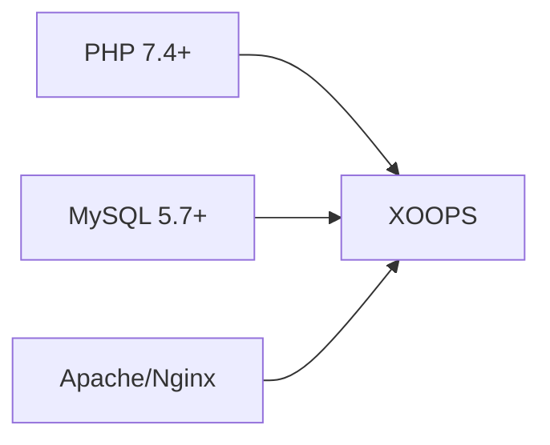
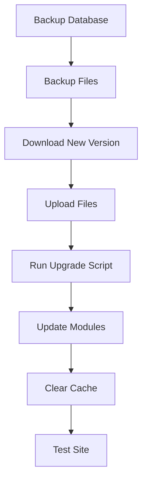

> XOOPS इंस्टॉल करने के बारे में सामान्य प्रश्न और उत्तर।

---

## पूर्व-स्थापना

### प्रश्न: न्यूनतम सर्वर आवश्यकताएँ क्या हैं?

**ए:** XOOPS 2.5.x की आवश्यकता है:
- PHP 7.4 या उच्चतर (PHP 8.x अनुशंसित)
- MySQL 5.7+ या MariaDB 10.3+
- mod_rewrite या Nginx के साथ अपाचे
- कम से कम 64एमबी PHP मेमोरी सीमा (128एमबी+ अनुशंसित)



### प्रश्न: क्या मैं साझा होस्टिंग पर XOOPS इंस्टॉल कर सकता हूं?

**ए:** हां, XOOPS अधिकांश साझा होस्टिंग पर अच्छा काम करता है जो आवश्यकताओं को पूरा करता है। जांचें कि आपका होस्ट प्रदान करता है:
- आवश्यक एक्सटेंशन के साथ PHP (mysqli, gd, कर्ल, json, mbstring)
- MySQL डेटाबेस एक्सेस
- फ़ाइल अपलोड क्षमता
- .htaccess समर्थन (अपाचे के लिए)

### प्रश्न: कौन से PHP एक्सटेंशन आवश्यक हैं?

**ए:** आवश्यक एक्सटेंशन:
- `mysqli` - डेटाबेस कनेक्टिविटी
- `gd` - छवि प्रसंस्करण
- `json` - JSON हैंडलिंग
- `mbstring` - मल्टीबाइट स्ट्रिंग समर्थन

अनुशंसित:
- `curl` - बाहरी API कॉल
- `zip` - मॉड्यूल स्थापना
- `intl` - अंतर्राष्ट्रीयकरण

---

## स्थापना प्रक्रिया

### प्रश्न: इंस्टॉलेशन विज़ार्ड एक खाली पृष्ठ दिखाता है

**ए:** यह आमतौर पर एक PHP त्रुटि है। प्रयास करें:

1. त्रुटि प्रदर्शन को अस्थायी रूप से सक्षम करें:
```php
// Add to htdocs/install/index.php at the top
error_reporting(E_ALL);
ini_set('display_errors', 1);
```

2. PHP त्रुटि लॉग की जाँच करें
3. PHP संस्करण संगतता सत्यापित करें
4. सुनिश्चित करें कि सभी आवश्यक एक्सटेंशन लोड हो गए हैं

### प्रश्न: मुझे "mainfile.php पर नहीं लिख सकता" मिलता है

**ए:** इंस्टॉलेशन से पहले लिखने की अनुमति सेट करें:

```bash
chmod 666 mainfile.php
# After installation, secure it:
chmod 444 mainfile.php
```

### प्रश्न: डेटाबेस तालिकाएँ नहीं बनाई जा रही हैं

**ए:** जांचें:

1. MySQL उपयोगकर्ता के पास CREATE TABLE विशेषाधिकार हैं:
```sql
GRANT ALL PRIVILEGES ON xoopsdb.* TO 'xoopsuser'@'localhost';
FLUSH PRIVILEGES;
```

2. डेटाबेस मौजूद है:
```sql
CREATE DATABASE xoopsdb CHARACTER SET utf8mb4 COLLATE utf8mb4_unicode_ci;
```

3. विज़ार्ड में क्रेडेंशियल डेटाबेस सेटिंग्स से मेल खाते हैं

### प्रश्न: इंस्टालेशन पूरा हो गया है लेकिन साइट त्रुटियाँ दिखा रही है

**ए:** सामान्य पोस्ट-इंस्टॉलेशन सुधार:

1. इंस्टॉल निर्देशिका को हटाएं या उसका नाम बदलें:
```bash
mv htdocs/install htdocs/install.bak
```

2. उचित अनुमतियाँ सेट करें:
```bash
chmod -R 755 htdocs/
chmod -R 777 xoops_data/
chmod 444 mainfile.php
```

3. कैश साफ़ करें:
```bash
rm -rf xoops_data/caches/smarty_cache/*
rm -rf xoops_data/caches/smarty_compile/*
```

---

## विन्यास

### प्रश्न: कॉन्फ़िगरेशन फ़ाइल कहां है?

**ए:** मुख्य कॉन्फ़िगरेशन XOOPS रूट में `mainfile.php` में है। मुख्य सेटिंग्स:

```php
define('XOOPS_ROOT_PATH', '/path/to/htdocs');
define('XOOPS_VAR_PATH', '/path/to/xoops_data');
define('XOOPS_URL', 'https://yoursite.com');
define('XOOPS_DB_HOST', 'localhost');
define('XOOPS_DB_USER', 'username');
define('XOOPS_DB_PASS', 'password');
define('XOOPS_DB_NAME', 'database');
define('XOOPS_DB_PREFIX', 'xoops');
```

### प्रश्न: मैं साइट URL कैसे बदलूं?

**ए:** संपादित करें `mainfile.php`:

```php
define('XOOPS_URL', 'https://newdomain.com');
```

फिर कैश साफ़ करें और डेटाबेस में किसी भी हार्डकोडेड URL को अपडेट करें।

### प्रश्न: मैं XOOPS को किसी भिन्न निर्देशिका में कैसे ले जाऊं?

**ए:**

1. फ़ाइलों को नए स्थान पर ले जाएँ
2. `mainfile.php` में पथ अपडेट करें:
```php
define('XOOPS_ROOT_PATH', '/new/path/to/htdocs');
define('XOOPS_VAR_PATH', '/new/path/to/xoops_data');
```
3. यदि आवश्यक हो तो डेटाबेस को अद्यतन करें
4. सभी कैश साफ़ करें

---

## उन्नयन

### प्रश्न: मैं XOOPS को कैसे अपग्रेड करूं?

**ए:**



1. **हर चीज़ का बैकअप लें** (डेटाबेस + फ़ाइलें)
2. नया XOOPS संस्करण डाउनलोड करें
3. फ़ाइलें अपलोड करें (`mainfile.php` को अधिलेखित न करें)
4. यदि प्रदान किया गया है तो `htdocs/upgrade/` चलाएँ
5. व्यवस्थापक पैनल के माध्यम से मॉड्यूल अपडेट करें
6. सभी कैश साफ़ करें
7. अच्छी तरह से परीक्षण करें

### प्रश्न: क्या मैं अपग्रेड करते समय संस्करण छोड़ सकता हूँ?

**ए:** आम तौर पर नहीं। यह सुनिश्चित करने के लिए कि डेटाबेस माइग्रेशन सही ढंग से चले, प्रमुख संस्करणों के माध्यम से क्रमिक रूप से अपग्रेड करें। विशिष्ट मार्गदर्शन के लिए रिलीज़ नोट्स देखें।

### प्रश्न: अपग्रेड के बाद मेरे मॉड्यूल ने काम करना बंद कर दिया

**ए:**

1. नए XOOPS संस्करण के साथ मॉड्यूल संगतता की जाँच करें
2. मॉड्यूल को नवीनतम संस्करण में अपडेट करें
3. टेम्प्लेट पुनर्जीवित करें: एडमिन → सिस्टम → रखरखाव → टेम्प्लेट
4. सभी कैश साफ़ करें
5. विशिष्ट त्रुटियों के लिए PHP त्रुटि लॉग की जाँच करें

---

## समस्या निवारण

### प्रश्न: मैं एडमिन पासवर्ड भूल गया हूं

**ए:** डेटाबेस के माध्यम से रीसेट करें:

```sql
-- Generate new password hash
UPDATE xoops_users
SET pass = MD5('newpassword')
WHERE uname = 'admin';
```

या यदि ईमेल कॉन्फ़िगर है तो पासवर्ड रीसेट सुविधा का उपयोग करें।

### प्रश्न: इंस्टालेशन के बाद साइट बहुत धीमी है

**ए:**

1. एडमिन → सिस्टम → प्राथमिकता में कैशिंग सक्षम करें
2. डेटाबेस का अनुकूलन करें:
```sql
OPTIMIZE TABLE xoops_session;
OPTIMIZE TABLE xoops_online;
```
3. डिबग मोड में धीमी क्वेरी की जाँच करें
4. PHP OpCache सक्षम करें

### प्रश्न: छवियाँ/CSS लोड नहीं हो रहा है

**ए:**1. फ़ाइल अनुमतियाँ जाँचें (फ़ाइलों के लिए 644, निर्देशिकाओं के लिए 755)
2. सत्यापित करें कि `XOOPS_URL` `mainfile.php` में सही है
3. पुनर्लेखन विवादों के लिए .htaccess की जाँच करें
4. 404 त्रुटियों के लिए ब्राउज़र कंसोल का निरीक्षण करें

---

## संबंधित दस्तावेज़ीकरण

- इंस्टालेशन गाइड
- बुनियादी विन्यास
- मौत की सफेद स्क्रीन

---

#xoops #faq #इंस्टॉलेशन #समस्या निवारण