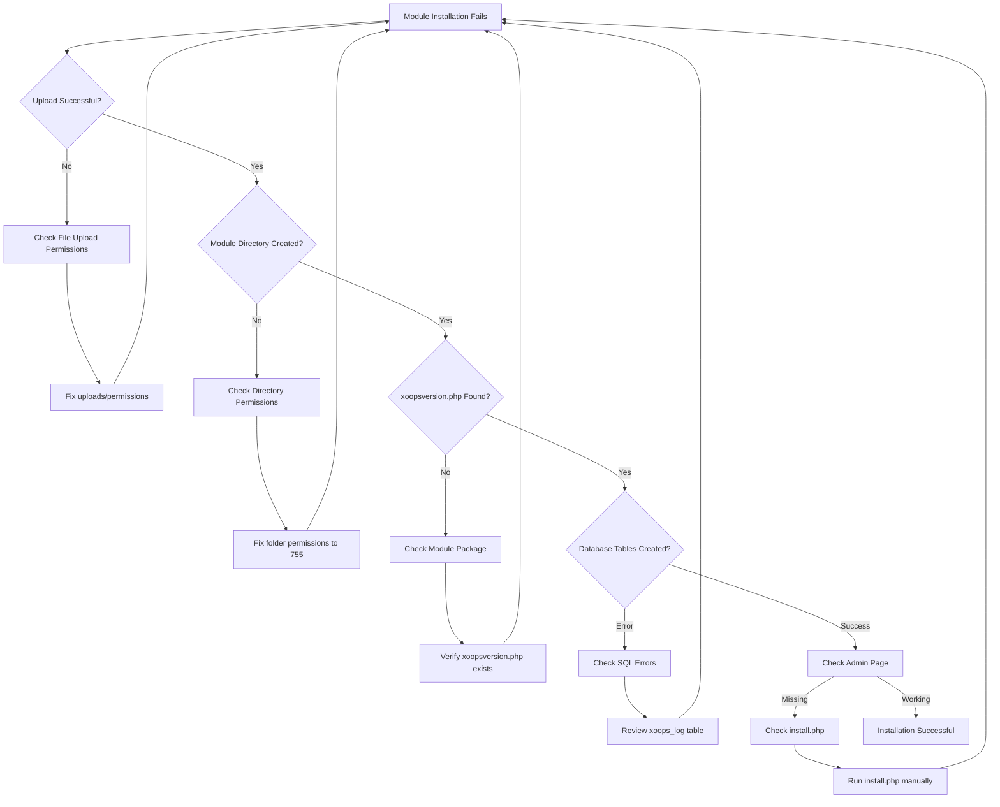
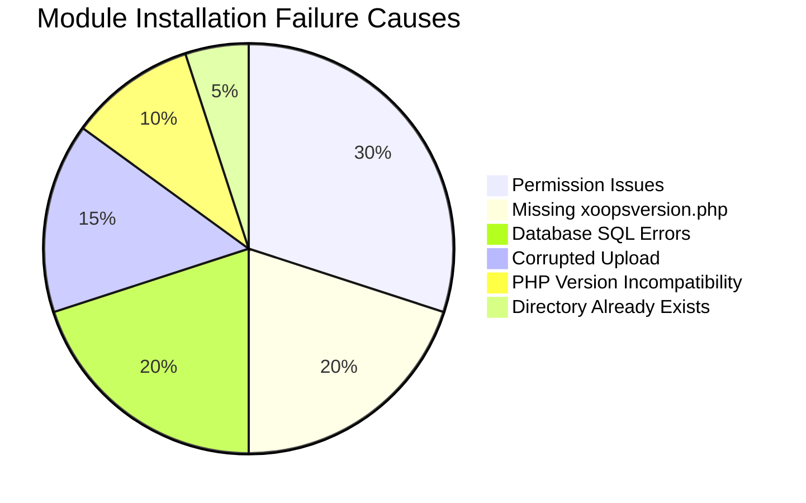

> XOOPS में मॉड्यूल स्थापना समस्याओं को हल करने के लिए सामान्य मुद्दे और समाधान।

---

## डायग्नोस्टिक फ़्लोचार्ट



---

## सामान्य कारण एवं समाधान



---

## 1. फ़ाइल अपलोड की अनुमति अस्वीकृत

**लक्षण:**
- "अनुमति अस्वीकृत" के साथ अपलोड विफल हो जाता है
- मॉड्यूल फ़ोल्डर नहीं बनाया गया
- मॉड्यूल निर्देशिका में नहीं लिखा जा सकता

**त्रुटि संदेश:**
```
Warning: move_uploaded_file(): Unable to move file
Permission denied (13)
```

**समाधान:**

```bash
# Check current permissions
ls -ld /path/to/xoops/modules
ls -ld /path/to/xoops/uploads

# Fix module directory permissions
chmod 755 /path/to/xoops/modules

# Fix temporary upload directory
chmod 777 /path/to/xoops/uploads
chmod 777 /tmp  # if needed

# Fix ownership (if running as different user)
chown -R www-data:www-data /path/to/xoops/modules
chown -R www-data:www-data /path/to/xoops/uploads
```

---

## 2. xoopsversion.php गुम है

**लक्षण:**
- मॉड्यूल सूची में दिखाई देता है लेकिन सक्रिय नहीं होगा
- इंस्टालेशन शुरू होता है फिर बंद हो जाता है
- कोई व्यवस्थापक पृष्ठ नहीं बनाया गया

**xoops_log में त्रुटि:**
```
Module xoopsversion.php not found
```

**समाधान:**

मॉड्यूल पैकेज संरचना सत्यापित करें:

```bash
# Extract and check module contents
unzip module.zip
ls -la mymodule/

# Must contain:
# - xoopsversion.php
# - language/
# - sql/
# - admin/ (optional but recommended)
```

**मान्य xoopsversion.php संरचना:**

```php
<?php
$modversion['name'] = 'My Module';
$modversion['version'] = '1.0.0';
$modversion['description'] = 'Module description';
$modversion['author'] = 'Author Name';
$modversion['author_mail'] = 'author@example.com';
$modversion['author_website_url'] = 'https://example.com';
$modversion['credits'] = 'Credits';
$modversion['license'] = 'GPL 2.0 or later';
$modversion['official'] = 0;
$modversion['image'] = 'images/icon.png';
$modversion['dirname'] = basename(__DIR__);
$modversion['modpath'] = __DIR__;

// Core module info
$modversion['hasMain'] = 1;
$modversion['hasAdmin'] = 1;
$modversion['hasSearch'] = 0;
$modversion['hasNotification'] = 0;

// Database tables
$modversion['sqlfile']['mysql'] = 'sql/mysql.sql';
$modversion['tables'] = ['table_name'];
```

---

## 3. डेटाबेस SQL निष्पादन त्रुटियाँ

**लक्षण:**
- अपलोड सफल लेकिन डेटाबेस तालिकाएँ नहीं बनीं
- एडमिन पेज लोड नहीं होगा
- "तालिका मौजूद नहीं है" त्रुटियाँ

**त्रुटि संदेश:**
```
SQL Error: Table 'xoops_module_table' already exists
Syntax error in SQL statement
```

**समाधान:**

### SQL फ़ाइल सिंटैक्स की जाँच करें

```bash
# View the SQL file
cat modules/mymodule/sql/mysql.sql

# Check for syntax issues
# Verify:
# - All CREATE TABLE statements end with ;
# - Proper backticks for identifiers
# - Valid field types (INT, VARCHAR, TEXT, etc.)
```

**सही SQL प्रारूप:**

```sql
CREATE TABLE `xoops_module_table` (
  `id` INT(11) NOT NULL AUTO_INCREMENT,
  `name` VARCHAR(255) NOT NULL,
  `description` TEXT,
  `created` INT(11) NOT NULL,
  `updated` INT(11) NOT NULL,
  PRIMARY KEY (`id`)
) ENGINE=InnoDB DEFAULT CHARSET=utf8mb4;
```

### मैन्युअल रूप से SQL निष्पादित करें

```php
<?php
// Create file: modules/mymodule/test_sql.php
require_once '../../mainfile.php';

$sql_file = __DIR__ . '/sql/mysql.sql';
$sql_content = file_get_contents($sql_file);

// Split statements
$statements = array_filter(array_map('trim', explode(';', $sql_content)));

foreach ($statements as $statement) {
    if (empty($statement)) continue;

    try {
        $GLOBALS['xoopsDB']->query($statement);
        echo "✓ Executed: " . substr($statement, 0, 50) . "...<br>";
    } catch (Exception $e) {
        echo "✗ Error: " . $e->getMessage() . "<br>";
        echo "Statement: " . substr($statement, 0, 100) . "...<br>";
    }
}
?>
```

---

## 4. दूषित मॉड्यूल अपलोड

**लक्षण:**
- फ़ाइलें आंशिक रूप से अपलोड की गईं
- रैंडम .php फ़ाइलें गायब हैं
- इंस्टॉल के बाद मॉड्यूल अस्थिर हो जाता है

**समाधान:**

```bash
# Re-upload fresh copy
rm -rf /path/to/xoops/modules/mymodule

# Verify checksum if provided
md5sum -c mymodule.md5

# Verify archive integrity before extract
unzip -t mymodule.zip

# Extract to temp, verify, then move
unzip -d /tmp mymodule.zip
find /tmp/mymodule -name "*.php" | wc -l
# Should show expected number of files
```

---

## 5. PHP संस्करण असंगति

**लक्षण:**
- इंस्टालेशन तुरंत विफल हो जाता है
- xoopsversion.php में पार्स त्रुटियाँ
- "अप्रत्याशित टोकन" त्रुटियाँ

**त्रुटि संदेश:**
```
Parse error: syntax error, unexpected 'fn' (T_FN)
```

**समाधान:**

```bash
# Check XOOPS supported PHP version
grep -r "php_require" /path/to/xoops/

# Check module requirements
grep -i "php\|version" modules/mymodule/xoopsversion.php

# Check PHP version on server
php --version
```

**परीक्षण मॉड्यूल संगतता:**

```php
<?php
// Create modules/mymodule/check_compat.php
$required_php = '7.4.0';
$current_php = PHP_VERSION;

echo "Required PHP: $required_php<br>";
echo "Current PHP: $current_php<br>";

if (version_compare(PHP_VERSION, $required_php, '<')) {
    echo "✗ PHP version too old<br>";
} else {
    echo "✓ PHP version compatible<br>";
}

// Check required extensions
$required_ext = ['mysqli', 'json', 'mb_string'];
foreach ($required_ext as $ext) {
    echo extension_loaded($ext) ? "✓" : "✗";
    echo " $ext<br>";
}
?>
```

---

## 6. मॉड्यूल निर्देशिका पहले से मौजूद है

**लक्षण:**
- मॉड्यूल निर्देशिका मौजूद होने पर इंस्टॉलेशन विफल हो जाता है
- मॉड्यूल को पुनः स्थापित या अद्यतन नहीं किया जा सकता
- "निर्देशिका मौजूद है" त्रुटि

**त्रुटि संदेश:**
```
The specified directory already exists
```

**समाधान:**

```bash
# Backup existing module
cp -r modules/mymodule modules/mymodule.backup

# Remove old installation completely
rm -rf modules/mymodule

# Clear any cache related to module
rm -rf xoops_data/caches/*

# Now retry installation through admin panel
```

---

## 7. एडमिन पेज जनरेशन विफल

**लक्षण:**
- मॉड्यूल स्थापित है लेकिन व्यवस्थापक पृष्ठ गायब है
- एडमिन पैनल मॉड्यूल नहीं दिखाता है
- मॉड्यूल सेटिंग्स तक नहीं पहुंच सकता

**समाधान:**

```php
<?php
// Create modules/mymodule/admin/index.php
<?php
/**
 * Module Administration Index
 */

include_once XOOPS_ROOT_PATH . '/kernel/module.php';

if (!is_object($xoopsModule) || !is_object($xoopsUser) || !$xoopsUser->isAdmin($xoopsModule->mid())) {
    exit("Access Denied");
}

// Include admin header
xoops_cp_header();

// Add admin content
echo "<h1>Module Administration</h1>";
echo "<p>Welcome to module administration</p>";

// Include admin footer
xoops_cp_footer();
?>
```

---

## 8. भाषा फ़ाइलें गुम

**लक्षण:**
- मॉड्यूल टेक्स्ट के बजाय वेरिएबल नामों के साथ प्रदर्शित होता है
- एडमिन पेज "[LANG_CONSTANT]" स्टाइल टेक्स्ट दिखाते हैं
- इंस्टालेशन पूरा हो गया लेकिन इंटरफ़ेस टूटा हुआ

**समाधान:**

```bash
# Verify language file structure
ls -la modules/mymodule/language/

# Should contain:
# english/ (at minimum)
#   admin.php
#   index.php
#   modinfo.php
```

**भाषा फ़ाइल बनाएँ:**

```php
<?php
// modules/mymodule/language/english/index.php
<?php
define('_AM_MYMODULE_INSTALLED', 'Module installed successfully');
define('_AM_MYMODULE_UPDATED', 'Module updated successfully');
define('_AM_MYMODULE_ERROR', 'An error occurred');
?>
```

---

## इंस्टालेशन चेकलिस्ट

```mermaid
graph TD
    A[Installation Checklist] --> B["1. Verify Module Structure"]
    A --> C["2. Check Permissions"]
    A --> D["3. Test SQL File"]
    A --> E["4. Verify xoopsversion.php"]
    A --> F["5. Check Language Files"]
    A --> G["6. Test Installation"]
    A --> H["7. Verify in Admin"]

    B --> B1["✓ Contains xoopsversion.php"]
    B --> B2["✓ SQL files present"]
    B --> B3["✓ Language files present"]

    C --> C1["✓ modules/ is 755"]
    C --> C2["✓ uploads/ is 777"]
    C --> C3["✓ Web server can write"]

    D --> D1["✓ SQL syntax valid"]
    D --> D2["✓ No duplicate tables"]

    E --> E1["✓ Valid PHP syntax"]
    E --> E2["✓ Required fields present"]

    F --> F1["✓ english/ folder exists"]
    F --> F2["✓ .php files present"]

    G --> G1["✓ Uploads successfully"]
    G --> G2["✓ Database creates"]

    H --> H1["✓ Visible in module list"]
    H --> H2["✓ Admin page accessible"]
```



---

## डिबग स्क्रिप्ट

`modules/mymodule/debug_install.php` बनाएं:

```php
<?php
/**
 * Module Installation Debugger
 * Delete after troubleshooting!
 */

require_once '../../mainfile.php';

echo "<h1>Module Installation Debug</h1>";

// 1. Check file structure
echo "<h2>1. File Structure</h2>";
$required_files = [
    'xoopsversion.php',
    'language/english/modinfo.php',
    'language/english/index.php',
    'language/english/admin.php'
];

foreach ($required_files as $file) {
    $path = __DIR__ . '/' . $file;
    echo file_exists($path) ? "✓" : "✗";
    echo " $file<br>";
}

// 2. Check xoopsversion.php
echo "<h2>2. xoopsversion.php Content</h2>";
$version_file = __DIR__ . '/xoopsversion.php';
if (file_exists($version_file)) {
    $modversion = [];
    include $version_file;
    echo "<pre>";
    echo "Name: " . ($modversion['name'] ?? 'NOT SET') . "\n";
    echo "Version: " . ($modversion['version'] ?? 'NOT SET') . "\n";
    echo "Dirname: " . ($modversion['dirname'] ?? 'NOT SET') . "\n";
    echo "Has SQL: " . (isset($modversion['sqlfile']) ? "YES" : "NO") . "\n";
    echo "Has Tables: " . (isset($modversion['tables']) ? count($modversion['tables']) : 0) . "\n";
    echo "</pre>";
}

// 3. Check SQL file
echo "<h2>3. SQL File</h2>";
$sql_file = __DIR__ . '/sql/mysql.sql';
if (file_exists($sql_file)) {
    $content = file_get_contents($sql_file);
    $tables = substr_count($content, 'CREATE TABLE');
    echo "✓ SQL file exists<br>";
    echo "✓ Contains $tables CREATE TABLE statements<br>";
    echo "<pre>" . htmlspecialchars(substr($content, 0, 300)) . "...</pre>";
} else {
    echo "✗ SQL file not found<br>";
}

// 4. Check language files
echo "<h2>4. Language Files</h2>";
$lang_files = [
    'language/english/modinfo.php',
    'language/english/index.php',
    'language/english/admin.php'
];

foreach ($lang_files as $file) {
    $path = __DIR__ . '/' . $file;
    if (file_exists($path)) {
        $size = filesize($path);
        echo "✓ $file ($size bytes)<br>";
    } else {
        echo "✗ $file MISSING<br>";
    }
}

// 5. Check permissions
echo "<h2>5. Directory Permissions</h2>";
echo "Module dir: " . substr(sprintf('%o', fileperms(__DIR__)), -4) . "<br>";

// 6. Test database connection
echo "<h2>6. Database Connection</h2>";
if (is_object($GLOBALS['xoopsDB'])) {
    echo "✓ Database connected<br>";

    // Try to create test table
    $test_sql = "CREATE TEMPORARY TABLE test_install (id INT PRIMARY KEY)";
    if ($GLOBALS['xoopsDB']->query($test_sql)) {
        echo "✓ Can create tables<br>";
    } else {
        echo "✗ Cannot create tables: " . $GLOBALS['xoopsDB']->error . "<br>";
    }
} else {
    echo "✗ Database not connected<br>";
}

echo "<p><strong>Delete this file after testing!</strong></p>";
?>
```

---

## रोकथाम एवं सर्वोत्तम प्रथाएँ

1. नए मॉड्यूल स्थापित करने से पहले **हमेशा बैकअप** लें
2. उत्पादन में लगाने से पहले **स्थानीय स्तर पर परीक्षण** करें
3. अपलोड करने से पहले **मॉड्यूल संरचना सत्यापित करें**
4. अपलोड के तुरंत बाद **अनुमतियां जांचें**
5. **स्थापना त्रुटियों के लिए xoops_log तालिका** की समीक्षा करें
6. कार्यशील मॉड्यूल संस्करणों का **बैकअप रखें**

---

## संबंधित दस्तावेज़ीकरण

- डिबग मोड सक्षम करें
- मॉड्यूल अक्सर पूछे जाने वाले प्रश्न
- मॉड्यूल संरचना
- डेटाबेस कनेक्शन त्रुटियाँ

---

#xoops #समस्या निवारण #मॉड्यूल #इंस्टॉलेशन #डीबगिंग