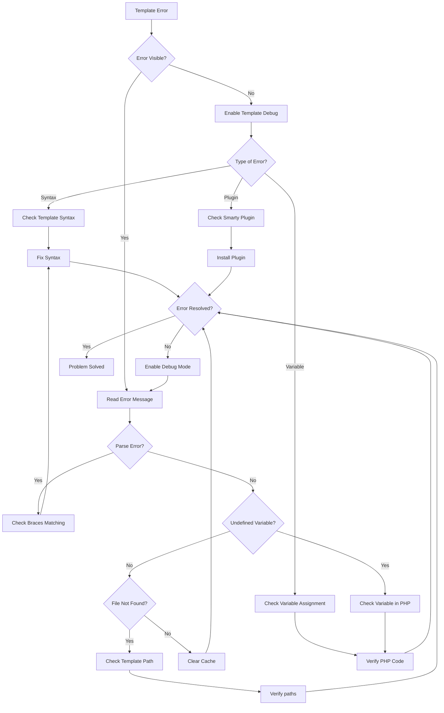
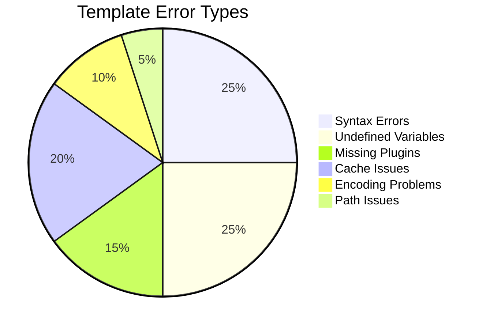

# टेम्पलेट त्रुटियाँ (Smarty डिबगिंग)

> XOOPS थीम और मॉड्यूल के लिए सामान्य Smarty टेम्पलेट मुद्दे और डिबगिंग तकनीकें।

---

## डायग्नोस्टिक फ़्लोचार्ट



---

## सामान्य Smarty टेम्पलेट त्रुटियाँ



---

## 1. सिंटेक्स त्रुटियाँ

**लक्षण:**
- "Smarty सिंटैक्स त्रुटि" संदेश
- टेम्प्लेट संकलित नहीं होंगे
- कोई आउटपुट वाला खाली पृष्ठ

**त्रुटि संदेश:**
```
Syntax error: unrecognized tag 'myfunction'
Unexpected "}" near end of template
```

### सामान्य सिंटैक्स मुद्दे

**गुम समापन टैग:**
```smarty
{* WRONG *}
{if $user}
User: {$user.name}
{* Missing {/if} *}

{* CORRECT *}
{if $user}
User: {$user.name}
{/if}
```

**गलत वैरिएबल सिंटैक्स:**
```smarty
{* WRONG *}
{$user->name}          {* Use . not -> *}
{$array[key]}          {* Use quoted keys *}
{$func()}              {* Can't call functions directly *}

{* CORRECT *}
{$user.name}
{$array.key}
{$array['key']}
{$user|@function}      {* Use modifiers instead *}
```

**बेमेल उद्धरण:**
```smarty
{* WRONG *}
{if $name == 'John}     {* Mismatched quotes *}
{assign var="user' value="John"}

{* CORRECT *}
{if $name == 'John'}
{assign var="user" value="John"}
```

**समाधान:**

```smarty
{* Always balance braces *}
{if condition}
  ...
{elseif condition}
  ...
{else}
  ...
{/if}

{* Verify tag format *}
{foreach $items as $item}
  ...
{/foreach}

{* Check all variables are defined *}
{if isset($variable)}
  {$variable}
{/if}
```

---

## 2. अपरिभाषित परिवर्तनीय त्रुटियाँ

**लक्षण:**
- "अपरिभाषित चर" चेतावनियाँ
- वेरिएबल खाली के रूप में प्रदर्शित होता है
- त्रुटि लॉग में PHP नोटिस

**त्रुटि संदेश:**
```
Notice: Undefined variable: myvar
Smarty notice: variable "$user" not available
```

**डीबग स्क्रिप्ट:**

```php
<?php
// In your template file or PHP code
// Create modules/yourmodule/debug_template.php

require_once '../../mainfile.php';

// Get template engine
$tpl = new XoopsTpl();

// Check what variables are assigned
echo "<h1>Template Variables</h1>";
echo "<pre>";
print_r($tpl->get_template_vars());
echo "</pre>";

// Or dump Smarty object
echo "<h1>Smarty Debug</h1>";
echo "<pre>";
$tpl->debug_vars();
echo "</pre>";
?>
```

**PHP में ठीक करें:**

```php
<?php
// Ensure variables are assigned before rendering
$xoopsTpl = new XoopsTpl();

// WRONG - variable not assigned
$xoopsTpl->display('file:templates/page.html');

// CORRECT - assign variables first
$user = [
    'name' => 'John',
    'email' => 'john@example.com'
];
$xoopsTpl->assign('user', $user);
$xoopsTpl->display('file:templates/page.html');
?>
```

**टेम्पलेट में ठीक करें:**

```smarty
{* Check if variable exists before using *}
{if isset($user)}
    <p>User: {$user.name}</p>
{else}
    <p>No user data</p>
{/if}

{* Use default values *}
<p>Name: {$user.name|default:"No name"}</p>

{* Check array key exists *}
{if isset($array.key)}
    {$array.key}
{/if}
```

---

## 3. गुम या गलत संशोधक

**लक्षण:**
- डेटा सही ढंग से फ़ॉर्मेट नहीं होता
- टेक्स्ट HTML के रूप में प्रदर्शित होता है
- ग़लत केस/एन्कोडिंग

**त्रुटि संदेश:**
```
Warning: undefined modifier 'stripslashes'
```

**सामान्य संशोधक:**

```smarty
{* String operations *}
{$text|upper}                    {* Uppercase *}
{$text|lower}                    {* Lowercase *}
{$text|capitalize}               {* First letter capital *}
{$text|truncate:20:"..."}        {* Truncate to 20 chars *}
{$text|strip_tags}               {* Remove HTML tags *}

{* HTML/Formatting *}
{$html|escape}                   {* HTML escape *}
{$html|escape:'html'}
{$url|escape:'url'}              {* URL escape *}
{$text|nl2br}                    {* Newlines to <br> *}

{* Arrays *}
{$array|@count}                  {* Array count *}
{$array|@implode:', '}           {* Join array *}

{* Default values *}
{$var|default:"No value"}

{* Date formatting *}
{$date|date_format:"%Y-%m-%d"}   {* Format date *}

{* Math operations *}
{$number|math:'+':10}            {* Math operations *}
```

**कस्टम संशोधक पंजीकृत करें:**

```php
<?php
// Register in your module
$xoopsTpl = new XoopsTpl();
$xoopsTpl->register_modifier('mymodifier', 'my_modifier_function');

function my_modifier_function($string) {
    return strtoupper($string);
}
?>
```

---

## 4. कैश की समस्या

**लक्षण:**
- टेम्प्लेट परिवर्तन दिखाई नहीं देते
- पुराना कंटेंट अभी भी दिखता है
- बासी शामिल या संसाधन

**समाधान:**

```bash
# Clear Smarty cache directories
rm -rf /path/to/xoops/xoops_data/caches/smarty_cache/*
rm -rf /path/to/xoops/xoops_data/caches/smarty_compile/*

# Clear specific module cache
rm -rf /path/to/xoops/xoops_data/caches/smarty_cache/modules/*
```

**कोड में कैश साफ़ करें:**

```php
<?php
// Clear all Smarty caches
$xoopsTpl = new XoopsTpl();
$xoopsTpl->clear_cache();
$xoopsTpl->clear_compiled_tpl();

// Clear specific template cache
$xoopsTpl->clear_cache('file:templates/page.html');

// Clear all cached files
require_once XOOPS_ROOT_PATH . '/class/xoopsfile.php';
$dh = opendir(XOOPS_CACHE_PATH . '/smarty_cache');
while (($file = readdir($dh)) !== false) {
    if (is_file(XOOPS_CACHE_PATH . '/smarty_cache/' . $file)) {
        unlink(XOOPS_CACHE_PATH . '/smarty_cache/' . $file);
    }
}
closedir($dh);
?>
```

---

## 5. प्लगइन में त्रुटियाँ नहीं मिलीं

**लक्षण:**
- "अज्ञात संशोधक" या "अज्ञात प्लगइन"
- कस्टम फ़ंक्शन काम नहीं करते
- प्लगइन्स के साथ संकलन त्रुटियाँ

**त्रुटि संदेश:**
```
Fatal error: Call to undefined function smarty_modifier_custom
Unknown modifier 'myfunction'
```

**कस्टम प्लगइन बनाएं:**

```php
<?php
// Create: modules/yourmodule/plugins/modifier.custom.php

/**
 * Smarty {$var|custom} modifier plugin
 */
function smarty_modifier_custom($string, $param = '') {
    // Your custom code
    return strtoupper($string) . $param;
}
?>
```

**रजिस्टर प्लगइन:**

```php
<?php
// In your module's init code
$xoopsTpl = new XoopsTpl();

// Add plugin directory to Smarty
$xoopsTpl->addPluginDir(
    XOOPS_ROOT_PATH . '/modules/yourmodule/plugins'
);

// Or manually register
$xoopsTpl->register_modifier(
    'custom',
    'smarty_modifier_custom'
);
?>
```

**प्लगइन प्रकार:**

```php
<?php
// Modifier plugin: modifier.name.php
function smarty_modifier_name($string) {
    return $string;
}

// Block plugin: block.name.php
function smarty_block_name($params, $content, &$smarty, &$repeat) {
    if (!isset($smarty->security_settings['IF_FUNCS'])) {
        $smarty->security_settings['IF_FUNCS'] = [];
    }
    return $content;
}

// Function plugin: function.name.php
function smarty_function_name($params, &$smarty) {
    return 'output';
}

// Filter plugin: filter.name.php
function smarty_filter_name($code, &$smarty) {
    return $code;
}
?>
```

---

## 6. टेम्प्लेट मुद्दों को शामिल/विस्तारित करता है

**लक्षण:**
- शामिल टेम्पलेट लोड नहीं होते
- मूल टेम्पलेट नहीं मिला
- CSS/जेएस लोड नहीं हो रहा है

**त्रुटि संदेश:**
```
Template file 'file:path/to/template.html' not found
Can't find template file 'header.html'
```

**सही सिंटैक्स शामिल करें:**

```smarty
{* Include template *}
{include file="file:templates/header.html"}

{* Include with variables *}
{include file="file:templates/header.html" title="My Page"}

{* Template inheritance *}
{extends file="file:templates/base.html"}

{* Named blocks *}
{block name="content"}
    Page content here
{/block}

{* Static resources *}
<link rel="stylesheet" href="{$xoops_url}/themes/{$xoops_theme}/style.css">
<script src="{$xoops_url}/modules/{$xoops_module_dir}/js/script.js"></script>
```

**टेम्पलेट पथ जांचें:**

```bash
# Verify template file exists
ls -la /path/to/xoops/themes/mytheme/templates/
ls -la /path/to/xoops/modules/mymodule/templates/

# Check permissions
stat /path/to/xoops/themes/mytheme/templates/header.html
```

---

## 7. वेरिएबल ऐरे/ऑब्जेक्ट एक्सेस

**लक्षण:**
- सरणी मानों तक नहीं पहुंच सकता
- वस्तु गुण प्रदर्शित नहीं होते
- जटिल चर विफल हो जाते हैं

**त्रुटि संदेश:**
```
Undefined variable: user.profile.name
```

**सही सिंटैक्स:**

```smarty
{* Array access *}
{$array.key}                     {* Use . for keys *}
{$array['key']}
{$array.0}                       {* Numeric indexes *}
{$array.$variable_key}           {* Dynamic keys *}

{* Nested arrays *}
{$user.profile.name}
{$data.items.0.title}

{* Object properties *}
{$object.property}
{$object.method|escape}          {* Method calls *}

{* Safe access with isset *}
{if isset($array.key)}
    {$array.key}
{/if}

{* Check length *}
{if count($array) > 0}
    Items found
{/if}
```

---

## 8. कैरेक्टर एन्कोडिंग मुद्दे

**लक्षण:**
- टेम्प्लेट में विकृत पाठ
- विशेष वर्ण ग़लत ढंग से प्रदर्शित होते हैं
- यूटीएफ-8 अक्षर टूटे हुए

**समाधान:**

**टेम्पलेट फ़ाइल एन्कोडिंग:**

```smarty
{* Set charset in meta tag *}
<meta charset="UTF-8">

{* Or in HTML head *}
<meta http-equiv="Content-Type" content="text/html; charset=utf-8">

{* Proper PHP declaration *}
header('Content-Type: text/html; charset=utf-8');
```

**PHP कोड:**

```php
<?php
// Set output encoding
header('Content-Type: text/html; charset=utf-8');

// Ensure database uses UTF-8
$conn = new mysqli('localhost', 'user', 'pass', 'db');
$conn->set_charset('utf8mb4');

// Or in SQL
SET NAMES utf8mb4;
SET CHARACTER SET utf8mb4;

// Assign data properly
$text = mb_convert_encoding($text, 'UTF-8', 'UTF-8');
$xoopsTpl->assign('text', $text);
?>
```

---

## डिबग मोड कॉन्फ़िगरेशन

**टेम्पलेट डिबगिंग सक्षम करें:**

```php
<?php
// In mainfile.php
define('XOOPS_DEBUG_LEVEL', 2);

// In Smarty configuration
$xoopsTpl->debugging = true;
$xoopsTpl->debug_tpl = SMARTY_DIR . 'debug.tpl';

// Or in module
$tpl = new XoopsTpl();
$tpl->debugging = true;
?>
```

**डीबग कंसोल आउटपुट:**

```php
<?php
// Create modules/yourmodule/debug_smarty.php

require_once '../../mainfile.php';
require_once XOOPS_ROOT_PATH . '/class/smarty/Smarty.class.php';

$smarty = new Smarty();
$smarty->debugging = true;

// Check compiled template
$compiled_dir = $smarty->getCompileDir();
echo "<h1>Compiled Templates</h1>";
$files = glob($compiled_dir . '/*.php');
foreach ($files as $file) {
    echo "<p>" . basename($file) . "</p>";
}

// View compiled code
echo "<h1>Compiled Code</h1>";
echo "<pre>";
$latest = max(array_map('filemtime', $files));
foreach ($files as $file) {
    if (filemtime($file) == $latest) {
        echo htmlspecialchars(file_get_contents($file));
        break;
    }
}
echo "</pre>";
?>
```

---

## टेम्पलेट सत्यापन चेकलिस्ट

```mermaid
graph TD
    A[Template Validation] --> B["1. Syntax Check"]
    A --> C["2. Variable Verification"]
    A --> D["3. Plugin Check"]
    A --> E["4. File Paths"]
    A --> F["5. Encoding"]
    A --> G["6. Cache"]

    B --> B1["✓ All braces matched"]
    B --> B2["✓ All tags closed"]
    B --> B3["✓ Proper syntax"]

    C --> C1["✓ Variables assigned"]
    C --> C2["✓ Correct property access"]
    C --> C3["✓ Default values set"]

    D --> D1["✓ Modifiers available"]
    D --> D2["✓ Plugins registered"]
    D --> D3["✓ Custom functions work"]

    E --> E1["✓ Relative paths correct"]
    E --> E2["✓ Files exist"]
    E --> E3["✓ Permissions correct"]

    F --> F1["✓ UTF-8 declared"]
    F --> F2["✓ HTML charset set"]
    F --> F3["✓ Database UTF-8"]

    G --> G1["✓ Cache cleared"]
    G --> G2["✓ Compiled fresh"]
```



---

## रोकथाम एवं सर्वोत्तम प्रथाएँ

1. विकास के दौरान **डिबगिंग सक्षम करें**
2. तैनात करने से पहले **टेम्प्लेट मान्य करें**
3. परिवर्तन के बाद **कैश साफ़ करें**
4. टेम्प्लेट परिवर्तनों को ट्रैक करने के लिए **git** का उपयोग करें
5. एन्कोडिंग समस्याओं के लिए **एकाधिक ब्राउज़र में परीक्षण करें**
6. **दस्तावेज़ कस्टम प्लगइन्स** और संशोधक
7. एकरूपता के लिए **टेम्पलेट इनहेरिटेंस का उपयोग करें**

---

## संबंधित दस्तावेज़ीकरण

- Smarty डिबगिंग गाइड
- Smarty टेम्प्लेटिंग
- डिबग मोड सक्षम करें
- थीम अक्सर पूछे जाने वाले प्रश्न

---

#xoops #समस्या निवारण #टेम्पलेट्स #Smarty #डीबगिंग