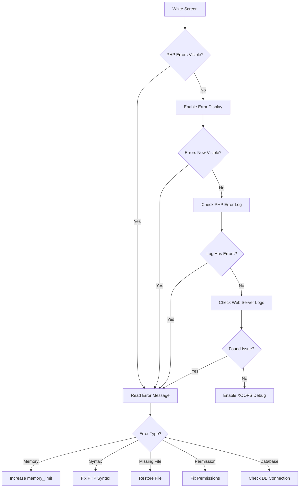
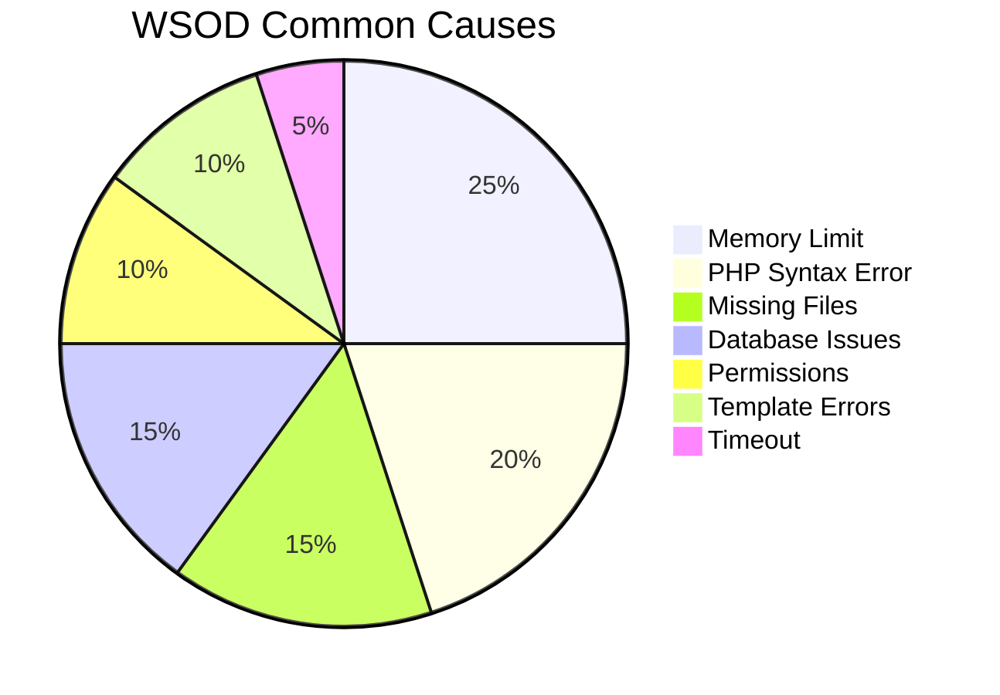
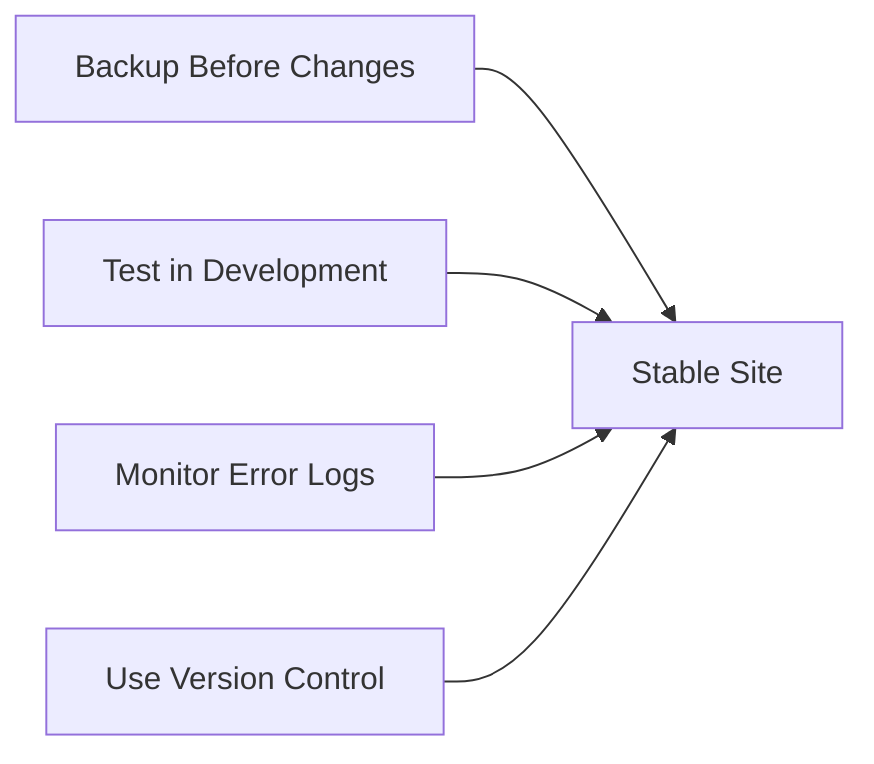

> XOOPS में खाली सफेद पन्नों का निदान और समाधान कैसे करें।

---

## डायग्नोस्टिक फ़्लोचार्ट



---

## त्वरित निदान

### चरण 1: PHP त्रुटि प्रदर्शन सक्षम करें

`mainfile.php` में अस्थायी रूप से जोड़ें:

```php
<?php
// Add at the very top, after <?php
error_reporting(E_ALL);
ini_set('display_errors', '1');
ini_set('display_startup_errors', '1');
```

### चरण 2: PHP त्रुटि लॉग की जाँच करें

```bash
# Common log locations
tail -100 /var/log/php/error.log
tail -100 /var/log/apache2/error.log
tail -100 /var/log/nginx/error.log

# Or check PHP info for log location
php -i | grep error_log
```

### चरण 3: XOOPS डीबग सक्षम करें

```php
// In mainfile.php
define('XOOPS_DEBUG_LEVEL', 2);
```

---

## सामान्य कारण एवं समाधान



### 1. स्मृति सीमा पार हो गई

**लक्षण:**
- बड़े ऑपरेशनों पर खाली पेज
- छोटे डेटा के लिए काम करता है, बड़े डेटा के लिए विफल रहता है

**त्रुटि:**
```
Fatal error: Allowed memory size of 134217728 bytes exhausted
```

**समाधान:**

```php
// In mainfile.php
ini_set('memory_limit', '256M');

// Or in .htaccess
php_value memory_limit 256M

// Or in php.ini
memory_limit = 256M
```

### 2. PHP सिंटैक्स त्रुटि

**लक्षण:**
- WSOD PHP फ़ाइल को संपादित करने के बाद
- विशिष्ट पेज विफल रहता है, अन्य काम करते हैं

**त्रुटि:**
```
Parse error: syntax error, unexpected '}' in /path/file.php on line 123
```

**समाधान:**

```bash
# Check file for syntax errors
php -l /path/to/file.php

# Check all PHP files in module
find modules/mymodule -name "*.php" -exec php -l {} \;
```

### 3. आवश्यक फ़ाइल गुम होना

**लक्षण:**
- WSOD अपलोड/माइग्रेशन के बाद
- यादृच्छिक पृष्ठ विफल हो जाते हैं

**त्रुटि:**
```
Fatal error: require_once(): Failed opening required 'class/Helper.php'
```

**समाधान:**

```bash
# Re-upload missing files
# Compare against fresh installation
diff -r /path/to/xoops /path/to/fresh-xoops

# Check file permissions
ls -la class/
```

### 4. डेटाबेस कनेक्शन विफल

**लक्षण:**
- सभी पेज WSOD दिखाते हैं
- स्टेटिक फ़ाइलें (चित्र, CSS) काम करती हैं

**त्रुटि:**
```
Warning: mysqli_connect(): Access denied for user
```

**समाधान:**

```php
// Verify credentials in mainfile.php
define('XOOPS_DB_HOST', 'localhost');
define('XOOPS_DB_USER', 'your_user');
define('XOOPS_DB_PASS', 'your_password');
define('XOOPS_DB_NAME', 'your_database');

// Test connection manually
<?php
$conn = new mysqli('localhost', 'user', 'pass', 'database');
if ($conn->connect_error) {
    die("Connection failed: " . $conn->connect_error);
}
echo "Connected successfully";
```

### 5. अनुमति मुद्दे

**लक्षण:**
- WSOD फ़ाइलें लिखते समय
- कैश/संकलन त्रुटियाँ

**समाधान:**

```bash
# Fix directory permissions
chmod -R 755 htdocs/
chmod -R 777 xoops_data/
chmod -R 777 uploads/

# Fix ownership
chown -R www-data:www-data /path/to/xoops
```

### 6. Smarty टेम्पलेट त्रुटि

**लक्षण:**
- WSOD विशिष्ट पृष्ठों पर
- कैश साफ़ करने के बाद काम करता है

**समाधान:**

```bash
# Clear Smarty cache
rm -rf xoops_data/caches/smarty_cache/*
rm -rf xoops_data/caches/smarty_compile/*

# Check template syntax
```

### 7. अधिकतम निष्पादन समय

**लक्षण:**
- WSOD ~30 सेकंड के बाद
- लंबे ऑपरेशन विफल हो जाते हैं

**त्रुटि:**
```
Fatal error: Maximum execution time of 30 seconds exceeded
```

**समाधान:**

```php
// In mainfile.php
set_time_limit(300);

// Or in .htaccess
php_value max_execution_time 300
```

---

## डिबग स्क्रिप्ट

XOOPS रूट में `debug.php` बनाएं:

```php
<?php
/**
 * XOOPS Debug Script
 * Delete after troubleshooting!
 */

error_reporting(E_ALL);
ini_set('display_errors', '1');

echo "<h1>XOOPS Debug</h1>";

// Check PHP version
echo "<h2>PHP Version</h2>";
echo "PHP " . PHP_VERSION . "<br>";

// Check required extensions
echo "<h2>Required Extensions</h2>";
$required = ['mysqli', 'gd', 'curl', 'json', 'mbstring'];
foreach ($required as $ext) {
    $status = extension_loaded($ext) ? '✓' : '✗';
    echo "$status $ext<br>";
}

// Check file permissions
echo "<h2>Directory Permissions</h2>";
$dirs = [
    'xoops_data' => 'xoops_data',
    'uploads' => 'uploads',
    'cache' => 'xoops_data/caches'
];
foreach ($dirs as $name => $path) {
    $writable = is_writable($path) ? '✓ Writable' : '✗ Not writable';
    echo "$name: $writable<br>";
}

// Test database connection
echo "<h2>Database Connection</h2>";
if (file_exists('mainfile.php')) {
    // Extract credentials (simple regex, not production safe)
    $mainfile = file_get_contents('mainfile.php');
    preg_match("/XOOPS_DB_HOST.*'(.+?)'/", $mainfile, $host);
    preg_match("/XOOPS_DB_USER.*'(.+?)'/", $mainfile, $user);
    preg_match("/XOOPS_DB_PASS.*'(.+?)'/", $mainfile, $pass);
    preg_match("/XOOPS_DB_NAME.*'(.+?)'/", $mainfile, $name);

    if (!empty($host[1])) {
        $conn = @new mysqli($host[1], $user[1], $pass[1], $name[1]);
        if ($conn->connect_error) {
            echo "✗ Connection failed: " . $conn->connect_error;
        } else {
            echo "✓ Connected to database";
            $conn->close();
        }
    }
} else {
    echo "mainfile.php not found";
}

// Memory info
echo "<h2>Memory</h2>";
echo "Memory Limit: " . ini_get('memory_limit') . "<br>";
echo "Current Usage: " . round(memory_get_usage() / 1024 / 1024, 2) . " MB<br>";

// Check error log location
echo "<h2>Error Log</h2>";
echo "Location: " . ini_get('error_log');
```

---

## रोकथाम



1. परिवर्तन करने से पहले **हमेशा बैकअप** लें
2. **तैनाती से पहले स्थानीय स्तर पर परीक्षण** करें
3. **त्रुटि लॉग की नियमित रूप से निगरानी करें**
4. परिवर्तनों पर नज़र रखने के लिए **git** का उपयोग करें
5. **समर्थित संस्करणों में PHP को अद्यतन रखें**

---

## संबंधित दस्तावेज़ीकरण

- डेटाबेस कनेक्शन त्रुटियाँ
- अनुमति अस्वीकृत त्रुटियाँ
- डिबग मोड सक्षम करें

---

#xoops #समस्या निवारण #wsod #डीबगिंग #त्रुटियाँ