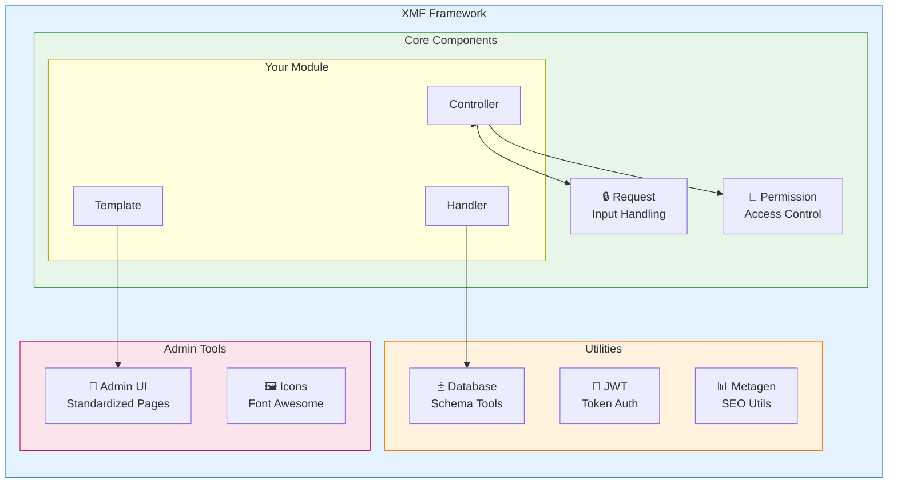
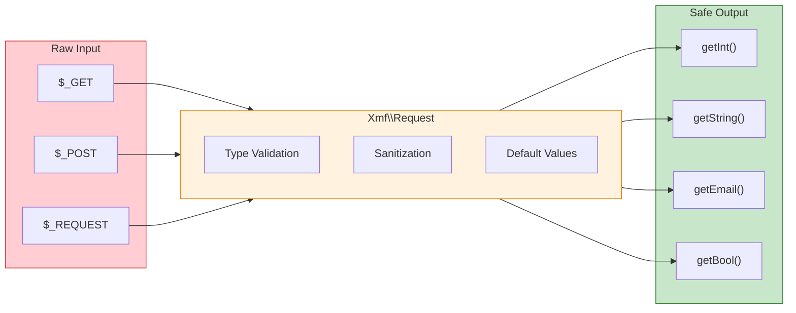

<span class="version-badge version-25x">2.5.x ✅</span> <span class="version-badge version-40x">4.0.x ✅</span>

:::टिप[द ब्रिज टू मॉडर्न XOOPS]
XMF **XOOPS 2.5.x और XOOPS 4.0.x** दोनों में काम करता है। XOOPS 4.0 की तैयारी करते समय आज अपने मॉड्यूल को आधुनिक बनाने का यह अनुशंसित तरीका है। XMF पीएसआर-4 ऑटोलोडिंग, नेमस्पेस और सहायक प्रदान करता है जो संक्रमण को सुचारू बनाता है।
:::

**XOOPS मॉड्यूल फ्रेमवर्क (XMF)** एक शक्तिशाली लाइब्रेरी है जिसे XOOPS मॉड्यूल विकास को सरल और मानकीकृत करने के लिए डिज़ाइन किया गया है। XMF नेमस्पेस, ऑटोलोडिंग और सहायक वर्गों का एक व्यापक सेट सहित आधुनिक PHP अभ्यास प्रदान करता है जो बॉयलरप्लेट कोड को कम करता है और रखरखाव में सुधार करता है।

## XMF क्या है?

XMF कक्षाओं और उपयोगिताओं का एक संग्रह है जो प्रदान करता है:

- **आधुनिक PHP समर्थन** - PSR-4 ऑटोलोडिंग के साथ पूर्ण नेमस्पेस समर्थन
- **अनुरोध प्रबंधन** - सुरक्षित इनपुट सत्यापन और स्वच्छता
- **मॉड्यूल हेल्पर्स** - मॉड्यूल कॉन्फ़िगरेशन और ऑब्जेक्ट तक सरलीकृत पहुंच
- **अनुमति प्रणाली** - उपयोग में आसान अनुमति प्रबंधन
- **डेटाबेस उपयोगिताएँ** - स्कीमा माइग्रेशन और टेबल प्रबंधन उपकरण
- **JWT समर्थन** - JSON सुरक्षित प्रमाणीकरण के लिए वेब टोकन कार्यान्वयन
- **मेटाडेटा जनरेशन** - एसईओ और सामग्री निष्कर्षण उपयोगिताएँ
- **एडमिन इंटरफ़ेस** - मानकीकृत मॉड्यूल प्रशासन पृष्ठ

### XMF घटक अवलोकन



## मुख्य विशेषताएं

### नेमस्पेस और ऑटोलोडिंग

सभी XMF वर्ग `Xmf` नेमस्पेस में रहते हैं। संदर्भित होने पर कक्षाएं स्वचालित रूप से लोड हो जाती हैं - किसी मैनुअल की आवश्यकता नहीं होती है।

```php
use Xmf\Request;
use Xmf\Module\Helper;

// Classes load automatically when used
$input = Request::getString('input', '');
$helper = Helper::getHelper('mymodule');
```

### सुरक्षित अनुरोध प्रबंधन

[अनुरोध वर्ग](../05-XMF-Framework/Basics/XMF-Request.md) अंतर्निहित स्वच्छता के साथ HTTP अनुरोध डेटा तक प्रकार-सुरक्षित पहुंच प्रदान करता है:



```php
use Xmf\Request;

$id = Request::getInt('id', 0);
$name = Request::getString('name', '');
$email = Request::getEmail('email', '');
```

### मॉड्यूल हेल्पर सिस्टम

[मॉड्यूल हेल्पर](../05-XMF-Framework/Basics/XMF-Module-Helper.md) मॉड्यूल-संबंधित कार्यक्षमता तक सुविधाजनक पहुंच प्रदान करता है:

```php
$helper = \Xmf\Module\Helper::getHelper('mymodule');

// Access module configuration
$configValue = $helper->getConfig('setting_name', 'default');

// Get module object
$module = $helper->getModule();

// Access handlers
$handler = $helper->getHandler('items');
```

### अनुमति प्रबंधन

[अनुमति-सहायक](../05-XMF-Framework/Recipes/Permission-Helper.md) XOOPS अनुमति प्रबंधन को सरल बनाता है:

```php
$permHelper = new \Xmf\Module\Helper\Permission();

// Check user permission
if ($permHelper->checkPermission('view', $itemId)) {
    // User has permission
}
```

## दस्तावेज़ीकरण संरचना

### मूल बातें

- [XMF के साथ शुरुआत करना](../05-XMF-Framework/Basics/Getting-Started-with-XMF.md) - स्थापना और बुनियादी उपयोग
- [XMF-अनुरोध](../05-XMF-Framework/Basics/XMF-Request.md) - अनुरोध प्रबंधन और इनपुट सत्यापन
- [XMF-मॉड्यूल-हेल्पर](../05-XMF-Framework/Basics/XMF-Module-Helper.md) - मॉड्यूल सहायक वर्ग का उपयोग

### रेसिपी

- [अनुमति-सहायक](../05-XMF-Framework/Recipes/Permission-Helper.md) - अनुमतियों के साथ कार्य करना
- [मॉड्यूल-एडमिन-पेज](../05-XMF-Framework/Recipes/Module-Admin-Pages.md) - मानकीकृत एडमिन इंटरफेस बनाना

### संदर्भ

- [JWT](../05-XMF-Framework/Reference/JWT.md) - JSON वेब टोकन कार्यान्वयन
- [डेटाबेस](../05-XMF-Framework/Reference/Database.md) - डेटाबेस उपयोगिताएँ और स्कीमा प्रबंधन
- [मेटाजेन](Reference/Metagen.md) - मेटाडेटा और एसईओ उपयोगिताएँ

## आवश्यकताएँ

- XOOPS 2.5.8 या बाद का संस्करण
- PHP 7.2 या बाद का संस्करण (PHP 8.x अनुशंसित)

## स्थापना

XMF XOOPS 2.5.8 और बाद के संस्करणों के साथ शामिल है। पुराने संस्करणों या मैन्युअल स्थापना के लिए:

1. XOOPS रिपोजिटरी से XMF पैकेज डाउनलोड करें
2. अपनी XOOPS `/class/xmf/` निर्देशिका में निकालें
3. ऑटोलोडर क्लास लोडिंग को स्वचालित रूप से संभाल लेगा

## त्वरित प्रारंभ उदाहरण

सामान्य XMF उपयोग पैटर्न दिखाने वाला एक पूरा उदाहरण यहां दिया गया है:

```php
<?php
use Xmf\Request;
use Xmf\Module\Helper;
use Xmf\Module\Helper\Permission;

// Get module helper
$helper = Helper::getHelper('mymodule');

// Get configuration values
$itemsPerPage = $helper->getConfig('items_per_page', 10);

// Handle request input
$op = Request::getCmd('op', 'list');
$id = Request::getInt('id', 0);

// Check permissions
$permHelper = new Permission();
if (!$permHelper->checkPermission('view', $id)) {
    redirect_header('index.php', 3, 'Access denied');
}

// Process based on operation
switch ($op) {
    case 'view':
        $handler = $helper->getHandler('items');
        $item = $handler->get($id);
        // ... display item
        break;
    case 'list':
    default:
        // ... list items
        break;
}
```

## संसाधन

- [XMF GitHub रिपॉजिटरी](https://github.com/XOOPS/XMF)
- [XOOPS प्रोजेक्ट वेबसाइट](@000021@@)

---

#xmf #xoops #framework #php #मॉड्यूल-विकास