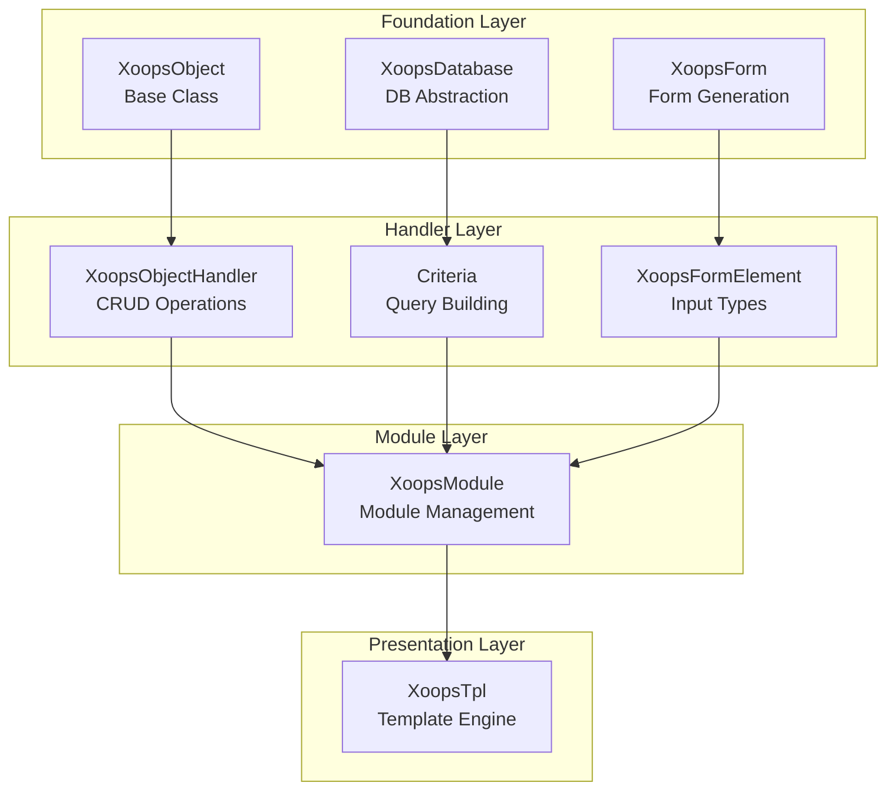
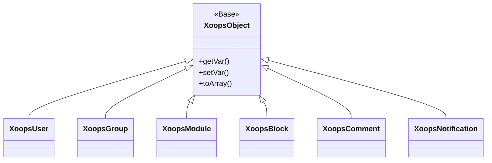
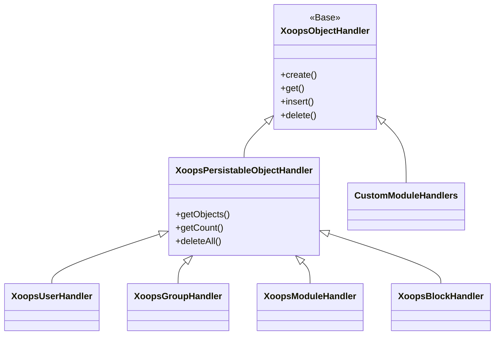
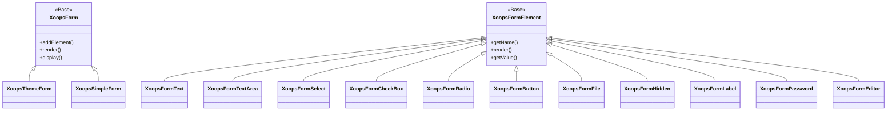

Dobro došli u sveobuhvatnu referentnu dokumentaciju XOOPS API. Ovaj odjeljak pruža detaljnu dokumentaciju za sve osnovne classes, metode i sustave koji čine XOOPS sustav upravljanja sadržajem.

## Pregled

XOOPS API organiziran je u nekoliko glavnih podsustava, od kojih je svaki odgovoran za određeni aspekt CMS funkcionalnosti. Razumijevanje ovih API-ja bitno je za razvoj modules, themes i proširenja za XOOPS.

## API Sekcije

### Osnovne klase

Temelj classes na kojem se grade sve ostale komponente XOOPS.

| Dokumentacija | Opis |
|--------------|-------------|
| XoopsObject | Baza class za sve podatkovne objekte u XOOPS |
| XoopsObjectHandler | Uzorak rukovatelja za operacije CRUD |

### Sloj baze podataka

Pomoćni programi za apstrakciju baze podataka i izradu upita.

| Dokumentacija | Opis |
|--------------|-------------|
| XoopsBaza podataka | Sloj apstrakcije baze podataka |
| Sustav kriterija | Kriteriji i uvjeti upita |
| QueryBuilder | Moderna tečna izrada upita |

### Sustav obrazaca

HTML Generiranje obrazaca i provjera valjanosti.

| Dokumentacija | Opis |
|--------------|-------------|
| XoopsForm | Spremnik obrazaca i renderiranje |
| Elementi obrasca | Sve dostupne vrste elemenata obrasca |

### Klase kernela

Osnovne komponente i usluge sustava.

| Dokumentacija | Opis |
|--------------|-------------|
| Klase jezgre | Sustav kernel i osnovne komponente |

### Sustav modula

Upravljanje i životni ciklus modula.

| Dokumentacija | Opis |
|--------------|-------------|
| Sustav modula | Učitavanje modula, instalacija i upravljanje |

### Sustav predložaka

Integracija predloška Smarty.

| Dokumentacija | Opis |
|--------------|-------------|
| Sustav predložaka | Smarty integracija i upravljanje predlošcima |

### Korisnički sustav

Upravljanje korisnicima i provjera autentičnosti.

| Dokumentacija | Opis |
|--------------|-------------|
| Korisnički sustav | Korisnički računi, grupe i dopuštenja |

## Pregled arhitekture



## Hijerarhija klasa

### Model objekta



### Model rukovatelja



### Model obrasca



## Dizajn uzorci

XOOPS API implementira nekoliko dobro poznatih obrazaca dizajna:

### Singleton uzorak
Koristi se za globalne usluge kao što su veze s bazom podataka i instance spremnika.

```php
$db = XoopsDatabase::getInstance();
$container = XoopsContainer::getInstance();
```

### Tvornički uzorak
Rukovatelji objektima dosljedno stvaraju objekte domene.

```php
$handler = xoops_getHandler('user');
$user = $handler->create();
```

### Složeni uzorak
Obrasci sadrže više elemenata obrasca; kriteriji mogu sadržavati ugniježđene kriterije.

```php
$criteria = new CriteriaCompo();
$criteria->add(new Criteria('status', 1));
$criteria->add(new CriteriaCompo(...)); // Nested
```

### Uzorak promatrača
Sustav događaja dopušta labavu vezu između modules.

```php
$dispatcher->addListener('module.news.article_published', $callback);
```

## Primjeri za brzi početak

### Stvaranje i spremanje objekta

```php
// Get the handler
$handler = xoops_getHandler('user');

// Create a new object
$user = $handler->create();
$user->setVar('uname', 'newuser');
$user->setVar('email', 'user@example.com');

// Save to database
$handler->insert($user);
```

### Upiti s kriterijima

```php
// Build criteria
$criteria = new CriteriaCompo();
$criteria->add(new Criteria('level', 0, '>'));
$criteria->setSort('uname');
$criteria->setOrder('ASC');
$criteria->setLimit(10);

// Get objects
$handler = xoops_getHandler('user');
$users = $handler->getObjects($criteria);
```

### Stvaranje obrasca

```php
$form = new XoopsThemeForm('User Profile', 'userform', 'save.php', 'post', true);
$form->addElement(new XoopsFormText('Username', 'uname', 50, 255, $user->getVar('uname')));
$form->addElement(new XoopsFormTextArea('Bio', 'bio', $user->getVar('bio')));
$form->addElement(new XoopsFormButton('', 'submit', _SUBMIT, 'submit'));
echo $form->render();
```

## API konvencije

### Konvencije imenovanja| Upišite | Konvencija | Primjer |
|------|-----------|---------|
| Nastava | PascalCase | `XoopsUser`, `CriteriaCompo` |
| Metode | devina kutija | `getVar()`, `setVar()` |
| Svojstva | camelCase (zaštićeno) | `$_vars`, `$_handler` |
| Konstante | GORNJA_SLOVNA_ZMIJA | `XOBJ_DTYPE_INT` |
| Tablice baze podataka | slučaj_zmije | `users`, `groups_users_link` |

### Vrste podataka

XOOPS definira standardne tipove podataka za varijable objekta:

| Konstanta | Upišite | Opis |
|----------|------|-------------|
| `XOBJ_DTYPE_TXTBOX` | Niz | Unos teksta (očišćeno) |
| `XOBJ_DTYPE_TXTAREA` | Niz | Tekstualni sadržaj |
| `XOBJ_DTYPE_INT` | Cijeli broj | Numeričke vrijednosti |
| `XOBJ_DTYPE_URL` | Niz | URL provjera valjanosti |
| `XOBJ_DTYPE_EMAIL` | Niz | Provjera valjanosti e-pošte |
| `XOBJ_DTYPE_ARRAY` | Niz | Serializirani nizovi |
| `XOBJ_DTYPE_OTHER` | Mješoviti | Prilagođeno rukovanje |
| `XOBJ_DTYPE_SOURCE` | Niz | Izvorni kod (minimalna dezinfekcija) |
| `XOBJ_DTYPE_STIME` | Cijeli broj | Kratka vremenska oznaka |
| `XOBJ_DTYPE_MTIME` | Cijeli broj | Srednja vremenska oznaka |
| `XOBJ_DTYPE_LTIME` | Cijeli broj | Duga vremenska oznaka |

## Metode provjere autentičnosti

API podržava višestruke metode provjere autentičnosti:

### API Autentifikacija ključa
```
X-API-Key: your-api-key
```

### Token nositelja OAuth
```
Authorization: Bearer your-oauth-token
```

### Autentifikacija temeljena na sesiji
Koristi postojeću XOOPS sesiju kada je prijavljen.

## REST API Krajnje točke

Kada je REST API omogućen:

| Krajnja točka | Metoda | Opis |
|----------|--------|-------------|
| `/api.php/rest/users` | DOBITI | Popis korisnika |
| `/api.php/rest/users/{id}` | DOBITI | Dohvati korisnika prema ID-u |
| `/api.php/rest/users` | OBJAVI | Stvori korisnika |
| `/api.php/rest/users/{id}` | STAVITI | Ažuriraj korisnika |
| `/api.php/rest/users/{id}` | IZBRIŠI | Izbriši korisnika |
| `/api.php/rest/modules` | DOBITI | Popis modules |

## Povezana dokumentacija

- Vodič za razvoj modula
- Vodič za razvoj teme
- Konfiguracija sustava
- Najbolje sigurnosne prakse

## Povijest verzija

| Verzija | Promjene |
|---------|---------|
| 2.5.11 | Trenutno stabilno izdanje |
| 2.5.10 | Dodana podrška za GraphQL API |
| 2.5.9 | Poboljšani sustav kriterija |
| 2.5.8 | PSR-4 podrška za automatsko učitavanje |

---

*Ova dokumentacija dio je XOOPS baze znanja. Za najnovija ažuriranja posjetite [XOOPS GitHub repozitorij](https://github.com/XOOPS).*
