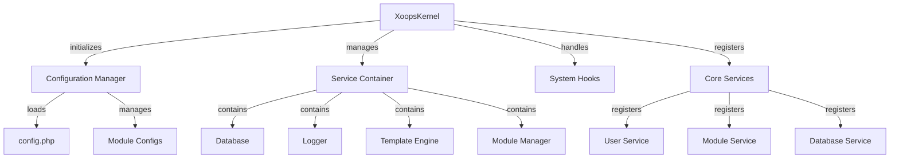

Kernel XOOPS pruža temeljni okvir za pokretanje sustava, upravljanje konfiguracijama, rukovanje sistemskim događajima i pružanje osnovnih uslužnih programa. Ovi classes čine okosnicu aplikacije XOOPS.

## Arhitektura sustava



## XoopsKernel klasa

Glavni kernel class koji inicijalizira i upravlja sustavom XOOPS.

### Pregled razreda

```php
namespace Xoops;

class XoopsKernel
{
    private static ?XoopsKernel $instance = null;
    protected ServiceContainer $services;
    protected ConfigurationManager $config;
    protected array $modules = [];
    protected bool $isLoaded = false;
}
```

### Konstruktor

```php
private function __construct()
```

Privatni konstruktor nameće pojedinačni uzorak.

### getInstance

Dohvaća singleton instancu kernel.

```php
public static function getInstance(): XoopsKernel
```

**Povratak:** `XoopsKernel` - pojedinačni primjerak kernel

**Primjer:**
```php
$kernel = XoopsKernel::getInstance();
```

### Proces pokretanja

Proces pokretanja kernel slijedi ove korake:

1. **Inicijalizacija** - Postavite rukovatelje greškama, definirajte konstante
2. **Konfiguracija** - Učitajte konfiguracijske datoteke
3. **Registracija usluge** - Registrirajte osnovne usluge
4. **Detekcija modula** - Skenirajte i identificirajte aktivni modules
5. **Inicijalizacija baze podataka** - Povežite se s bazom podataka
6. **Čišćenje** - Pripremite se za obradu zahtjeva

```php
public function boot(): void
```

**Primjer:**
```php
$kernel = XoopsKernel::getInstance();
$kernel->boot();
```

### Metode spremnika usluge

#### registerService

Registrira uslugu u spremniku usluge.

```php
public function registerService(
    string $name,
    callable|object $definition
): void
```

**Parametri:**

| Parametar | Upišite | Opis |
|-----------|------|-------------|
| `$name` | niz | Identifikator usluge |
| `$definition` | pozivni\|objekt | Servisna tvornica ili instanca |

**Primjer:**
```php
$kernel->registerService('custom.handler', function($c) {
    return new CustomHandler();
});
```

#### getService

Dohvaća registriranu uslugu.

```php
public function getService(string $name): mixed
```

**Parametri:**

| Parametar | Upišite | Opis |
|-----------|------|-------------|
| `$name` | niz | Identifikator usluge |

**Povrat:** `mixed` - Tražena usluga

**Primjer:**
```php
$database = $kernel->getService('database');
$logger = $kernel->getService('logger');
```

#### hasService

Provjerava je li usluga registrirana.

```php
public function hasService(string $name): bool
```

**Primjer:**
```php
if ($kernel->hasService('cache')) {
    $cache = $kernel->getService('cache');
}
```

## Upravitelj konfiguracije

Upravlja konfiguracijom aplikacije i postavkama modula.

### Pregled razreda

```php
namespace Xoops\Core;

class ConfigurationManager
{
    protected array $config = [];
    protected array $defaults = [];
    protected string $configPath;
}
```

### Metode

#### opterećenje

Učitava konfiguraciju iz datoteke ili polja.

```php
public function load(string|array $source): void
```

**Parametri:**

| Parametar | Upišite | Opis |
|-----------|------|-------------|
| `$source` | niz\|niz | Staza konfiguracijske datoteke ili polje |

**Primjer:**
```php
$config = $kernel->getService('config');
$config->load(XOOPS_ROOT_PATH . '/include/config.php');
$config->load(['sitename' => 'My Site', 'admin_email' => 'admin@example.com']);
```

#### dobiti

Dohvaća vrijednost konfiguracije.

```php
public function get(string $key, mixed $default = null): mixed
```

**Parametri:**

| Parametar | Upišite | Opis |
|-----------|------|-------------|
| `$key` | niz | Konfiguracijski ključ (zapis s točkama) |
| `$default` | mješoviti | Zadana vrijednost ako nije pronađena |

**Povratak:** `mixed` - vrijednost konfiguracije

**Primjer:**
```php
$siteName = $config->get('sitename');
$adminEmail = $config->get('admin.email', 'admin@example.com');
```

#### set

Postavlja vrijednost konfiguracije.

```php
public function set(string $key, mixed $value): void
```

**Parametri:**

| Parametar | Upišite | Opis |
|-----------|------|-------------|
| `$key` | niz | Konfiguracijski ključ |
| `$value` | mješoviti | Vrijednost konfiguracije |

**Primjer:**
```php
$config->set('sitename', 'New Site Name');
$config->set('features.cache_enabled', true);
```

#### getModuleConfig

Dobiva konfiguraciju za određeni modul.

```php
public function getModuleConfig(
    string $moduleName
): array
```

**Parametri:**

| Parametar | Upišite | Opis |
|-----------|------|-------------|
| `$moduleName` | niz | Naziv direktorija modula |

**Povrat:** `array` - Niz konfiguracije modula**Primjer:**
```php
$publisherConfig = $config->getModuleConfig('publisher');
```

## Kuke sustava

Sistemske kuke omogućuju modules i dodacima da izvrše kod u određenim točkama u životnom ciklusu aplikacije.

### HookManager klasa

```php
namespace Xoops\Core;

class HookManager
{
    protected array $hooks = [];
    protected array $listeners = [];
}
```

### Metode

#### addHook

Registrira točku kuke.

```php
public function addHook(string $name): void
```

**Parametri:**

| Parametar | Upišite | Opis |
|-----------|------|-------------|
| `$name` | niz | Identifikator kuke |

**Primjer:**
```php
$hooks = $kernel->getService('hooks');
$hooks->addHook('system.startup');
$hooks->addHook('user.login');
$hooks->addHook('module.install');
```

#### slušaj

Pričvršćuje slušalicu na udicu.

```php
public function listen(
    string $hookName,
    callable $callback,
    int $priority = 10
): void
```

**Parametri:**

| Parametar | Upišite | Opis |
|-----------|------|-------------|
| `$hookName` | niz | Identifikator kuke |
| `$callback` | pozivati ​​| Funkcija za izvršavanje |
| `$priority` | int | Prioritet izvršenja (prvo se pokreću viši) |

**Primjer:**
```php
$hooks->listen('user.login', function($user) {
    error_log('User ' . $user->uname . ' logged in');
}, 10);

$hooks->listen('module.install', function($module) {
    // Custom module installation logic
    echo "Installing " . $module->getName();
}, 5);
```

#### okidač

Izvršava sve slušatelje za kuku.

```php
public function trigger(
    string $hookName,
    mixed $arguments = null
): array
```

**Parametri:**

| Parametar | Upišite | Opis |
|-----------|------|-------------|
| `$hookName` | niz | Identifikator kuke |
| `$arguments` | mješoviti | Podaci za prosljeđivanje slušateljima |

**Povratak:** `array` - Rezultati svih slušatelja

**Primjer:**
```php
$results = $hooks->trigger('system.startup');
$results = $hooks->trigger('user.created', $newUser);
```

## Pregled osnovnih usluga

kernel registrira nekoliko osnovnih usluga tijekom pokretanja:

| Usluga | Razred | Svrha |
|---------|-------|---------|
| `database` | XoopsBaza podataka | Sloj apstrakcije baze podataka |
| `config` | Upravitelj konfiguracije | Upravljanje konfiguracijom |
| `logger` | Sjekač | Zapisivanje aplikacije |
| `template` | XoopsTpl | Motor predložaka |
| `user` | Upravitelj korisnika | Usluga upravljanja korisnicima |
| `module` | Upravitelj modula | Upravljanje modulom |
| `cache` | CacheManager | Sloj predmemoriranja |
| `hooks` | HookManager | Priključnice za događaje sustava |

## Kompletan primjer upotrebe

```php
<?php
/**
 * Custom module boot process utilizing kernel
 */

// Get kernel instance
$kernel = XoopsKernel::getInstance();

// Boot the system
$kernel->boot();

// Get services
$config = $kernel->getService('config');
$database = $kernel->getService('database');
$logger = $kernel->getService('logger');
$hooks = $kernel->getService('hooks');

// Access configuration
$siteName = $config->get('sitename');
$adminEmail = $config->get('admin.email');

// Register module-specific hooks
$hooks->listen('user.login', function($user) {
    // Log user login
    $logger->info('User login: ' . $user->uname);

    // Track in database
    $database->query(
        'INSERT INTO ' . $database->prefix('event_log') .
        ' (type, user_id, message, timestamp) VALUES (?, ?, ?, ?)',
        ['login', $user->uid(), 'User login', time()]
    );
});

$hooks->listen('module.install', function($module) {
    $logger->info('Module installed: ' . $module->getName());
});

// Trigger hooks
$hooks->trigger('system.startup');

// Use database service
$result = $database->query(
    'SELECT * FROM ' . $database->prefix('users') .
    ' LIMIT 10'
);

while ($row = $database->fetchArray($result)) {
    echo "User: " . htmlspecialchars($row['uname']) . "\n";
}

// Register custom service
$kernel->registerService('custom.repository', function($c) {
    return new CustomRepository($c->getService('database'));
});

// Later access custom service
$repo = $kernel->getService('custom.repository');
```

## Jezgrene konstante

kernel definira nekoliko važnih konstanti tijekom pokretanja sustava:

```php
// System paths
define('XOOPS_ROOT_PATH', '/var/www/xoops');
define('XOOPS_HTDOCS_PATH', XOOPS_ROOT_PATH . '/htdocs');
define('XOOPS_MODULES_PATH', XOOPS_ROOT_PATH . '/htdocs/modules');
define('XOOPS_THEMES_PATH', XOOPS_ROOT_PATH . '/htdocs/themes');

// Web paths
define('XOOPS_URL', 'http://example.com');
define('XOOPS_HTDOCS_URL', XOOPS_URL . '/htdocs');

// Database
define('XOOPS_DB_PREFIX', 'xoops_');
```

## Rješavanje grešaka

kernel postavlja rukovatelje greškama tijekom pokretanja:

```php
// Set custom error handler
set_error_handler(function($errno, $errstr, $errfile, $errline) {
    $kernel->getService('logger')->error(
        "Error: $errstr in $errfile:$errline"
    );
});

// Set exception handler
set_exception_handler(function($exception) {
    $kernel->getService('logger')->critical(
        "Exception: " . $exception->getMessage()
    );
});
```

## Najbolji primjeri iz prakse

1. **Jedno pokretanje** - Pozovite `boot()` samo jednom tijekom pokretanja aplikacije
2. **Koristite spremnik usluga** - Registrirajte i dohvatite usluge putem kernel
3. **Handle Hooks Early** - Registrirajte slušatelje hooka prije nego ih pokrenete
4. **Zapis važnih događaja** - Koristite uslugu zapisivača za otklanjanje pogrešaka
5. **Konfiguracija predmemorije** - Učitajte konfiguraciju jednom i ponovno upotrijebite
6. **Rješavanje grešaka** - Uvijek postavite rukovatelje greškama prije obrade zahtjeva

## Povezana dokumentacija

- ../Module/Module-System - Sustav modula i životni ciklus
- ../Template/Template-System - Integracija mehanizma za predloške
- ../User/User-System - Autentikacija i upravljanje korisnicima
- ../Database/XoopsDatabase - Sloj baze podataka

---

*Pogledajte također: [XOOPS izvor kernela](https://github.com/XOOPS/XoopsCore27/tree/master/htdocs/class)*
