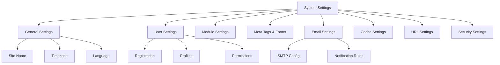

# XOOPS Postavke sustava

Ovaj vodič pokriva kompletne postavke sustava dostupne na ploči XOOPS admin, organizirane po kategorijama.

## Arhitektura postavki sustava



## Pristup postavkama sustava

### Lokacija

**administratorska ploča > Sustav > Postavke**

Ili izravno navigirajte:

```
http://your-domain.com/xoops/admin/index.php?fct=preferences
```

### Zahtjevi za dopuštenje

- Samo administrators (webmasteri) mogu pristupiti postavkama sustava
- Promjene utječu na cijelu stranicu
- Većina promjena stupa na snagu odmah

## Opće postavke

Temeljna konfiguracija za vašu instalaciju XOOPS.

### Osnovne informacije

```
Site Name: [Your Site Name]
Default Description: [Brief description of your site]
Site Slogan: [Catchy slogan]
Admin Email: admin@your-domain.com
Webmaster Name: Administrator Name
Webmaster Email: admin@your-domain.com
```

### Postavke izgleda

```
Default Theme: [Select theme]
Default Language: English (or preferred language)
Items Per Page: 15 (typically 10-25)
Words in Snippet: 25 (for search results)
Theme Upload Permission: Disabled (security)
```

### Regionalne postavke

```
Default Timezone: [Your timezone]
Date Format: %Y-%m-%d (YYYY-MM-DD format)
Time Format: %H:%M:%S (HH:MM:SS format)
Daylight Saving Time: [Auto/Manual/None]
```

**Tablica formata vremenske zone:**

| Regija | Vremenska zona | UTC pomak |
|---|---|---|
| Istočni SAD | Amerika/New_York | -5 / -4 |
| Središnji SAD | Amerika/Chicago | -6 / -5 |
| Američka planina | Amerika/Denver | -7 / -6 |
| SAD Pacifik | Amerika/Los_Angeles | -8 / -7 |
| UK/London | Europa/London | 0 / +1 |
| Francuska/Njemačka | Europa/Pariz | +1 / +2 |
| Japan | Azija/Tokio | +9 |
| Kina | Azija/Šangaj | +8 |
| Australija/Sydney | Australija/Sydney | +10 / +11 |

### Konfiguracija pretraživanja

```
Enable Search: Yes
Search Admin Pages: Yes/No
Search Archives: Yes
Default Search Type: All / Pages only
Words Excluded from Search: [Comma-separated list]
```

**Uobičajene isključene riječi:** the, a, an, and, or, but, in, on, at, by, to, from

## Korisničke postavke

Kontrolirajte ponašanje korisničkog računa i proces registracije.

### Registracija korisnika

```
Allow User Registration: Yes/No
Registration Type:
  ☐ Auto-activate (Instant access)
  ☐ Admin approval (Admin must approve)
  ☐ Email verification (User must verify email)

Notification to Users: Yes/No
User Email Verification: Required/Optional
```

### Nova korisnička konfiguracija

```
Auto-login New Users: Yes/No
Assign Default User Group: Yes
Default User Group: [Select group]
Create User Avatar: Yes/No
Initial User Avatar: [Select default]
```

### Postavke korisničkog profila

```
Allow User Profiles: Yes
Show Member List: Yes
Show User Statistics: Yes
Show Last Online Time: Yes
Allow User Avatar: Yes
Avatar Max File Size: 100KB
Avatar Dimensions: 100x100 pixels
```

### Postavke korisničke e-pošte

```
Allow Users to Hide Email: Yes
Show Email on Profile: Yes
Notification Email Interval: Immediately/Daily/Weekly/Never
```

### Praćenje aktivnosti korisnika

```
Track User Activity: Yes
Log User Logins: Yes
Log Failed Logins: Yes
Track IP Address: Yes
Clear Activity Logs Older Than: 90 days
```

### Ograničenja računa

```
Allow Duplicate Email: No
Minimum Username Length: 3 characters
Maximum Username Length: 15 characters
Minimum Password Length: 6 characters
Require Special Characters: Yes
Require Numbers: Yes
Password Expiration: 90 days (or Never)
Accounts Inactive Days to Delete: 365 days
```

## Postavke modula

Konfigurirajte ponašanje pojedinačnog modula.

### Zajedničke opcije modula

Za svaki instalirani modul možete postaviti:

```
Module Status: Active/Inactive
Display in Menu: Yes/No
Module Weight: [1-999] (higher = lower in display)
Homepage Default: This module shows when visiting /
Admin Access: [Allowed user groups]
User Access: [Allowed user groups]
```

### Postavke modula sustava

```
Show Homepage as: Portal / Module / Static Page
Default Homepage Module: [Select module]
Show Footer Menu: Yes
Footer Color: [Color selector]
Show System Stats: Yes
Show Memory Usage: Yes
```

### Konfiguracija po modulu

Svaki modul može imati postavke specifične za modul:

**Primjer - modul stranice:**
```
Enable Comments: Yes/No
Moderate Comments: Yes/No
Comments Per Page: 10
Enable Ratings: Yes
Allow Anonymous Ratings: Yes
```

**Primjer - korisnički modul:**
```
Avatar Upload Folder: ./uploads/
Maximum Upload Size: 100KB
Allow File Upload: Yes
Allowed File Types: jpg, gif, png
```

Pristupite postavkama specifičnim za modul:
- **Administrator > moduli > [Naziv modula] > Postavke**

## Meta oznake i SEO postavke

Konfigurirajte meta oznake za optimizaciju tražilice.

### Globalne meta oznake

```
Meta Keywords: xoops, cms, content management system
Meta Description: A powerful content management system for building dynamic websites
Meta Author: Your Name
Meta Copyright: Copyright 2025, Your Company
Meta Robots: index, follow
Meta Revisit: 30 days
```

### Najbolje prakse za meta oznake

| Oznaka | Svrha | Preporuka |
|---|---|---|
| Ključne riječi | Pojmovi za pretraživanje | 5-10 relevantnih ključnih riječi, odvojenih zarezima |
| Opis | Popis pretraživanja | 150-160 znakova |
| Autor | Kreator stranice | Vaše ime ili tvrtka |
| Autorska prava | Pravni | Vaša obavijest o autorskim pravima |
| Roboti | Upute za indeksiranje | indeksirati, pratiti (dopustiti indeksiranje) |

### Postavke podnožja

```
Show Footer: Yes
Footer Color: Dark/Light
Footer Background: [Color code]
Footer Text: [HTML allowed]
Additional Footer Links: [URL and text pairs]
```

**Uzorak podnožja HTML:**
```html
<p>Copyright &copy; 2025 Your Company. All rights reserved.</p>
<p><a href="/privacy">Privacy Policy</a> | <a href="/terms">Terms of Use</a></p>
```

### Društvene meta oznake (otvoreni grafikon)

```
Enable Open Graph: Yes
Facebook App ID: [App ID]
Twitter Card Type: summary / summary_large_image / player
Default Share Image: [Image URL]
```

## Postavke e-pošte

Konfigurirajte isporuku e-pošte i sustav obavijesti.

### Način dostave e-pošte

```
Use SMTP: Yes/No

If SMTP:
  SMTP Host: smtp.gmail.com
  SMTP Port: 587 (TLS) or 465 (SSL)
  SMTP Security: TLS / SSL / None
  SMTP Username: [email@example.com]
  SMTP Password: [password]
  SMTP Authentication: Yes/No
  SMTP Timeout: 10 seconds

If PHP mail():
  Sendmail Path: /usr/sbin/sendmail -t -i
```

### Konfiguracija e-pošte

```
From Address: noreply@your-domain.com
From Name: Your Site Name
Reply-To Address: support@your-domain.com
BCC Admin Emails: Yes/No
```

### Postavke obavijesti

```
Send Welcome Email: Yes/No
Welcome Email Subject: Welcome to [Site Name]
Welcome Email Body: [Custom message]

Send Password Reset Email: Yes/No
Include Random Password: Yes/No
Token Expiration: 24 hours
```

### Obavijesti administratora

```
Notify Admin on Registration: Yes
Notify Admin on Comments: Yes
Notify Admin on Submissions: Yes
Notify Admin on Errors: Yes
```

### Obavijesti korisnika

```
Notify User on Registration: Yes
Notify User on Comments: Yes
Notify User on Private Messages: Yes
Allow Users to Disable Notifications: Yes
Default Notification Frequency: Immediately
```

### predlošci e-pošte

Prilagodite e-poruke s obavijestima na ploči admin:

**Put:** Sustav > predlošci e-pošte

Dostupan templates:
- Registracija korisnika
- Ponovno postavljanje lozinke
- Obavijest o komentaru
- Privatna poruka
- Upozorenja sustava
- E-pošta specifična za modul

## Postavke predmemorijeOptimizirajte performanse kroz predmemoriju.

### Konfiguracija predmemorije

```
Enable Caching: Yes/No
Cache Type:
  ☐ File Cache
  ☐ APCu (Alternative PHP Cache)
  ☐ Memcache (Distributed caching)
  ☐ Redis (Advanced caching)

Cache Lifetime: 3600 seconds (1 hour)
```

### Opcije predmemorije prema vrsti

**predmemorija datoteke:**
```
Cache Directory: /var/www/html/xoops/cache/
Clear Interval: Daily
Maximum Cache Files: 1000
```

**APCu predmemorija:**
```
Memory Allocation: 128MB
Fragmentation Level: Low
```

**Memcache/Redis:**
```
Server Host: localhost
Server Port: 11211 (Memcache) / 6379 (Redis)
Persistent Connection: Yes
```

### Što se pohranjuje u predmemoriju

```
Cache Module Lists: Yes
Cache Configuration Data: Yes
Cache Template Data: Yes
Cache User Session Data: Yes
Cache Search Results: Yes
Cache Database Queries: Yes
Cache RSS Feeds: Yes
Cache Images: Yes
```

## URL Postavke

Konfigurirajte prepisivanje i formatiranje URL.

### Prijateljske postavke URL

```
Enable Friendly URLs: Yes/No
Friendly URL Type:
  ☐ Path Info: /page/about
  ☐ Query String: /index.php?p=about

Trailing Slash: Include / Omit
URL Case: Lower case / Case sensitive
```

### URL Prepišite pravila

```
.htaccess Rules: [Display current]
Nginx Rules: [Display current if Nginx]
IIS Rules: [Display current if IIS]
```

## Sigurnosne postavke

Kontrolirajte sigurnosnu konfiguraciju.

### Sigurnost lozinke

```
Password Policy:
  ☐ Require uppercase letters
  ☐ Require lowercase letters
  ☐ Require numbers
  ☐ Require special characters

Minimum Password Length: 8 characters
Password Expiration: 90 days
Password History: Remember last 5 passwords
Force Password Change: On next login
```

### Sigurnost prijave

```
Lock Account After Failed Attempts: 5 attempts
Lock Duration: 15 minutes
Log All Login Attempts: Yes
Log Failed Logins: Yes
Admin Login Alert: Send email on admin login
Two-Factor Authentication: Disabled/Enabled
```

### Sigurnost prijenosa datoteka

```
Allow File Uploads: Yes/No
Maximum File Size: 128MB
Allowed File Types: jpg, gif, png, pdf, zip, doc, docx
Scan Uploads for Malware: Yes (if available)
Quarantine Suspicious Files: Yes
```

### Sigurnost sesije

```
Session Management: Database/Files
Session Timeout: 1800 seconds (30 min)
Session Cookie Lifetime: 0 (until browser closes)
Secure Cookie: Yes (HTTPS only)
HTTP Only Cookie: Yes (prevent JavaScript access)
```

### CORS postavke

```
Allow Cross-Origin Requests: No
Allowed Origins: [List domains]
Allow Credentials: No
Allowed Methods: GET, POST
```

## Napredne postavke

Dodatne mogućnosti konfiguracije za napredne korisnike.

### Način otklanjanja pogrešaka

```
Debug Mode: Disabled/Enabled
Log Level: Error / Warning / Info / Debug
Debug Log File: /var/log/xoops_debug.log
Display Errors: Disabled (production)
```

### Podešavanje performansi

```
Optimize Database Queries: Yes
Use Query Cache: Yes
Compress Output: Yes
Minify CSS/JavaScript: Yes
Lazy Load Images: Yes
```

### Postavke sadržaja

```
Allow HTML in Posts: Yes/No
Allowed HTML Tags: [Configure]
Strip Harmful Code: Yes
Allow Embed: Yes/No
Content Moderation: Automatic/Manual
Spam Detection: Yes
```

## Postavke Izvoz/Uvoz

### Postavke sigurnosne kopije

Izvoz trenutnih postavki:

**administratorska ploča > Sustav > Alati > Postavke izvoza**

```bash
# Settings exported as JSON file
# Download and store securely
```

### Vrati postavke

Uvoz prethodno izvezenih postavki:

**administratorska ploča > Sustav > Alati > Postavke uvoza**

```bash
# Upload JSON file
# Verify changes before confirming
```

## Hijerarhija konfiguracije

Hijerarhija postavki XOOPS (odozgo prema dolje - prva pobjeda u utakmici):

```
1. mainfile.php (Constants)
2. Module-specific config
3. Admin System Settings
4. Theme configuration
5. User preferences (for user-specific settings)
```

## Skripta sigurnosne kopije postavki

Napravite sigurnosnu kopiju trenutnih postavki:

```php
<?php
// Backup script: /var/www/html/xoops/backup-settings.php
require_once __DIR__ . '/mainfile.php';

$config_handler = xoops_getHandler('config');
$configs = $config_handler->getConfigs();

$backup = [
    'exported_date' => date('Y-m-d H:i:s'),
    'xoops_version' => XOOPS_VERSION,
    'php_version' => PHP_VERSION,
    'settings' => []
];

foreach ($configs as $config) {
    $backup['settings'][$config->getVar('conf_name')] = [
        'value' => $config->getVar('conf_value'),
        'description' => $config->getVar('conf_desc'),
        'type' => $config->getVar('conf_type'),
    ];
}

// Save to JSON file
file_put_contents(
    '/backups/xoops_settings_' . date('YmdHis') . '.json',
    json_encode($backup, JSON_PRETTY_PRINT)
);

echo "Settings backed up successfully!";
?>
```

## Uobičajene promjene postavki

### Promjena naziva stranice

1. Administrator > Sustav > Postavke > Opće postavke
2. Izmijenite "Naziv stranice"
3. Kliknite "Spremi"

### Omogući/onemogući registraciju

1. Administrator > Sustav > Postavke > Korisničke postavke
2. Uključite "Dopusti registraciju korisnika"
3. Odaberite vrstu registracije
4. Kliknite "Spremi"

### Promjena zadane teme

1. Administrator > Sustav > Postavke > Opće postavke
2. Odaberite "Zadana tema"
3. Kliknite "Spremi"
4. Očistite cache kako bi promjene stupile na snagu

### Ažurirajte e-poštu za kontakt

1. Administrator > Sustav > Postavke > Opće postavke
2. Izmijenite "E-poštu administratora"
3. Izmijenite "E-poštu webmastera"
4. Kliknite "Spremi"

## Popis za provjeru

Nakon konfiguriranja postavki sustava provjerite:

- [ ] Naziv stranice se prikazuje ispravno
- [ ] Vremenska zona pokazuje točno vrijeme
- [ ] Obavijesti putem e-pošte ispravno se šalju
- [ ] Registracija korisnika radi kako je konfigurirano
- [ ] Početna stranica prikazuje odabrane zadane postavke
- [ ] Funkcija pretraživanja radi
- [ ] predmemorija poboljšava vrijeme učitavanja stranice
- [ ] Prijateljski URL-ovi rade (ako su omogućeni)
- [ ] Meta oznake pojavljuju se u izvoru stranice
- [ ] Primljene obavijesti administratora
- [ ] Sigurnosne postavke na snazi

## Postavke za rješavanje problema

### Postavke se ne spremaju

**Rješenje:**
```bash
# Check file permissions on config directory
chmod 755 /var/www/html/xoops/var/

# Verify database writable
# Try saving again in admin panel
```

### Promjene ne stupaju na snagu

**Rješenje:**
```bash
# Clear cache
rm -rf /var/www/html/xoops/cache/*
rm -rf /var/www/html/xoops/templates_c/*

# If still not working, restart web server
systemctl restart apache2
```

### E-pošta se ne šalje

**Rješenje:**
1. Provjerite SMTP vjerodajnice u postavkama e-pošte
2. Testirajte pomoću gumba "Pošalji probnu e-poštu".
3. Provjerite zapisnike grešaka
4. Pokušajte koristiti PHP mail() umjesto SMTP-a

## Sljedeći koraci

Nakon konfiguracije postavki sustava:

1. Konfigurirajte sigurnosne postavke
2. Optimizirajte performanse
3. Istražite značajke ploče admin
4. Postavite upravljanje korisnicima

---

**Oznake:** #sustavne-postavke #konfiguracija #preference #admin-panel

**Povezani članci:**
- ../../06-Publisher-Module/User-Guide/Basic-Configuration
- Sigurnosna konfiguracija
- Optimizacija performansi
- ../First-Steps/Admin-Panel-Overview
