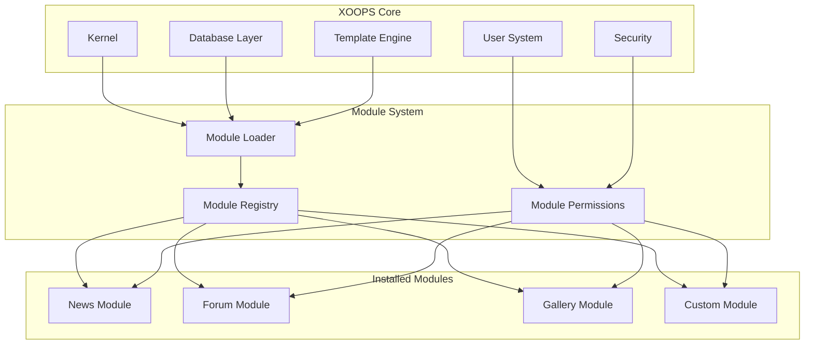
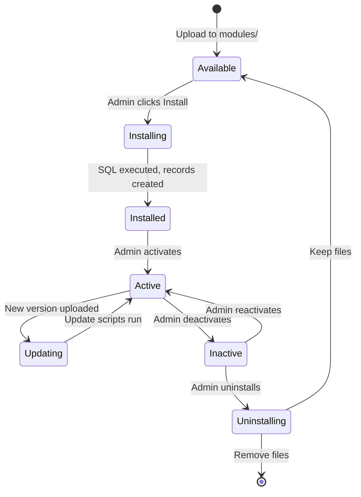

# ADR-001: Modularna arhitektura

> Zapis o arhitektonskim odlukama za temeljnu filozofiju modularnog dizajna XOOPS.

---

## Status

**Prihvaćeno** - Temeljna odluka od početka XOOPS

---

## Kontekst

XOOPS (eXtensible Object-Oriented Portal System) trebao je arhitekturu koja bi:

1. Dopustite programerima trećih strana da prošire funkcionalnost
2. Omogućite stranicu administrators za prilagodbu bez kodiranja
3. Podržavajte neovisni razvoj i ažuriranja
4. Omogućite izolaciju između različitih značajki
5. Skala od jednostavnih blogova do složenih portala

CMS krajolik ranih 2000-ih nudio je monolitne sustave koje je bilo teško prilagoditi i proširiti.

---

## Dijagram odluke



---

## Odluka

Implementirat ćemo **modularnu arhitekturu** gdje:

### 1. Jezgra pruža infrastrukturu
- Apstrakcija baze podataka
- Autentikacija korisnika i dopuštenja
- Prikaz predloška (Smarty)
- Sigurnosni alati
- Generiranje obrazaca
- Zajedničke komunalije

### 2. moduli su samostalni
Svaki modul:
- Ima vlastitu strukturu imenika
- Sadrži vlastiti classes, templates, SQL
- Definira vlastitu konfiguraciju
- Može se samostalno instalirati/deinstalirati
- Ima praćenje verzija

### 3. Standardna struktura modula
```
modules/modulename/
├── admin/                  # Admin interface
│   ├── index.php
│   └── menu.php
├── class/                  # PHP classes
├── include/                # Include files
├── language/               # Translations
├── sql/                    # Database schema
├── templates/              # Smarty templates
├── blocks/                 # Block definitions
├── xoops_version.php       # Module manifest
├── index.php               # Entry point
└── header.php              # Module bootstrap
```

### 4. Manifest modula (xoops_version.php)
```php
<?php
$modversion['name']        = 'Module Name';
$modversion['version']     = '1.0.0';
$modversion['description'] = 'Module description';
$modversion['dirname']     = basename(__DIR__);
$modversion['hasMain']     = 1;
$modversion['hasAdmin']    = 1;
$modversion['sqlfile']['mysql'] = 'sql/mysql.sql';
$modversion['tables']      = ['modulename_table1'];
$modversion['templates']   = [...];
$modversion['config']      = [...];
$modversion['blocks']      = [...];
```

### 5. Komunikacija modula
- Kroz osnovne API-je (rukovatelji, događaji)
- Odnosi baze podataka
- Prednapregnute kuke
- Zajedničke usluge

---

## Životni ciklus modula



---

## Posljedice

### Pozitivno

1. **Proširljivost**: Tisuće modules koje je stvorila zajednica
2. **Nezavisnost**: moduli se mogu razvijati zasebno
3. **Fleksibilnost**: web stranice mogu kombinirati i spajati značajke
4. **Pogodnost održavanja**: ažuriranja ne utječu na druge modules
5. **Tržište**: Pojavio se ekosustav modula
6. **Krivulja učenja**: Programeri uče jedan obrazac

### Negativno

1. **Opšte**: Svaki modul ima trošak pokretanja
2. **Dupliciranje**: Uobičajeni kod može se ponavljati
3. **Integracija**: značajke više modula zahtijevaju pažljiv dizajn
4. **Određivanje verzija**: Potrebno je upravljanje kompatibilnošću modula
5. **Odstupanje u kvaliteti**: Kvaliteta modula treće strane varira

### Neutralno

1. **baza podataka**: Svaki modul upravlja vlastitim tablicama
2. **predlošci**: tema mora sadržavati razne modules
3. **Ažuriranja**: Core i modules ažuriraju se neovisno

---

## Razmotrene alternative

### 1. Monolitna arhitektura
**Odbijeno** - Prestrogo, teško za prilagođavanje

### 2. Arhitektura dodataka (WordPress stil)
**Djelomično usvojeno** - Blokovi i predučitavanja pružaju zakačke nalik dodacima unutar modules

### 3. Komponentna arhitektura (Joomla stil)
**Odbijeno** - Složenije, manje prilagođeno programerima

### 4. Mikrousluge
**Nije primjenjivo** - Previše složeno za eru zajedničkog hostinga

---

## Povezane odluke

- ADR-002: Objektno orijentirani pristup bazi podataka
- ADR-003: Smarty predložak
- ADR-005: Sustav dozvola

---

## Reference

- XOOPS Povijest projekta
- PHP Uzorci arhitekture aplikacija
- CMS usporedne studije (2001.-2005.)

---

#xoops #arhitektura #adr #modules #dizajn-odluka
