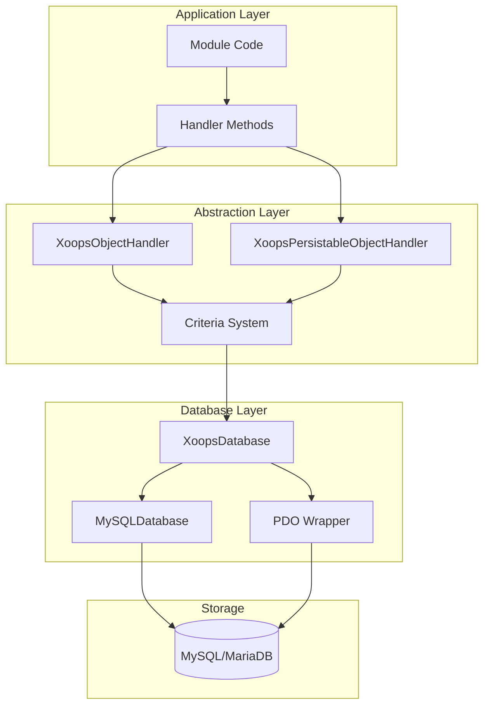
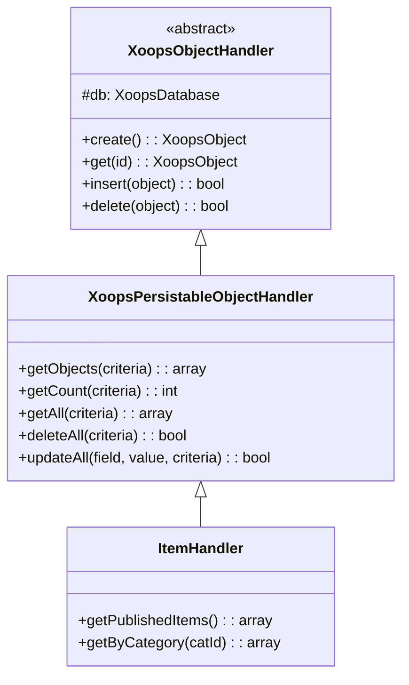
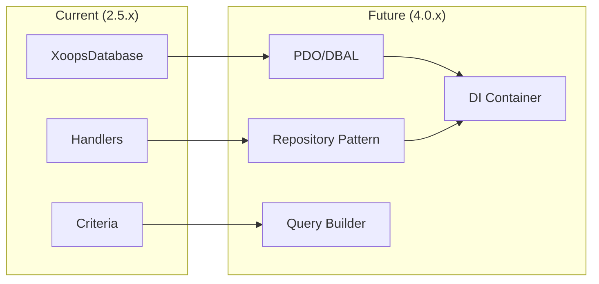

# ADR-002: Apstrakcija baze podataka

> Zapis odluke o arhitekturi za XOOPS model pristupa objektno orijentiranoj bazi podataka.

---

## Status

**Prihvaćeno** - Osnovni uzorak od XOOPS 2.0

---

## Kontekst

XOOPS trebala je strategija interakcije baze podataka koja bi:

1. Apstrahirajte SQL sintaksu specifičnu za bazu podataka
2. Osigurajte dosljedne CRUD operacije u svim modules
3. Omogućite automatsku obradu podataka i izbjegavanje
4. Podržite buduće promjene pogona baze podataka
5. Pojednostavite uobičajene operacije za programere

Alternative su bile:
- Neobrađeni SQL u cijeloj bazi koda
- Potpuni ORM (doktrina, elokventno)
- Prilagođena lagana apstrakcija

---

## Dijagram odluke



---

## Odluka

Implementirat ćemo **Uzorak rukovatelja** sa:

### 1. XoopsObject - Spremnik podataka

Svaki podatkovni entitet proširuje XoopsObject:

```php
class Item extends XoopsObject
{
    public function __construct()
    {
        $this->initVar('id', XOBJ_DTYPE_INT, null, false);
        $this->initVar('title', XOBJ_DTYPE_TXTBOX, '', true, 255);
        $this->initVar('content', XOBJ_DTYPE_TXTAREA, '', false);
        $this->initVar('status', XOBJ_DTYPE_INT, 0, false);
    }
}
```

### 2. Handler - Operations Manager

Svaki objekt ima odgovarajući rukovatelj:

```php
class ItemHandler extends XoopsPersistableObjectHandler
{
    public function __construct($db)
    {
        parent::__construct($db, 'mymodule_items', Item::class, 'id', 'title');
    }

    // CRUD methods inherited:
    // - create(), get(), insert(), delete()
    // - getObjects(), getCount(), getAll()
}
```

### 3. Kriteriji - Query Builder

Uvjeti za objektno orijentirani upit:

```php
$criteria = new CriteriaCompo();
$criteria->add(new Criteria('status', 1));
$criteria->add(new Criteria('created', time() - 86400, '>='));
$criteria->setSort('created');
$criteria->setOrder('DESC');
$criteria->setLimit(10);

$items = $handler->getObjects($criteria);
```

---

## Konstante tipa podataka

```php
// Variable types with automatic sanitization
XOBJ_DTYPE_INT       // Integer
XOBJ_DTYPE_TXTBOX    // Single-line text (escaped)
XOBJ_DTYPE_TXTAREA   // Multi-line text (escaped)
XOBJ_DTYPE_EMAIL     // Email validation
XOBJ_DTYPE_URL       // URL validation
XOBJ_DTYPE_ARRAY     // Serialized array
XOBJ_DTYPE_OTHER     // No processing
XOBJ_DTYPE_FLOAT     // Floating point
```

---

## Nasljeđivanje rukovatelja



---

## Posljedice

### Pozitivno

1. **Dosljednost**: Svi modules koriste iste uzorke
2. **Sigurnost**: Automatsko bježanje sprječava ubrizgavanje SQL
3. **Jednostavnost**: Uobičajene operacije zahtijevaju minimalan kod
4. **Pogodnost održavanja**: Promjene na sloju baze podataka ne utječu na modules
5. **Provjerljivost**: Rukovatelji se mogu ismijavati radi testiranja

### Negativno

1. **Performanse**: Dodatni troškovi apstrakcije
2. **Složenost**: Krivulja učenja za nove programere
3. **Ograničenja**: Za složene upite možda će trebati neobrađeni SQL
4. **N+1 problem**: Nema ugrađenog brzog učitavanja

### Ublažavanja

- **Performanse**: Predmemorirajte objekte kojima se često pristupa
- **Složeni upiti**: dopustite sirovi SQL kada je potrebno
- **N+1**: Koristite getAll() s odgovarajućim kriterijima

---

## Evolucija na XOOPS 4.0



XOOPS 4.0 planovi:
- Doktrina DBAL za apstrakciju baze podataka
- Rukovatelji koji zamjenjuju uzorak spremišta
- Alat za izradu složenih upita
- Potpuna integracija spremnika PSR-11

---

## Primjeri koda

### Osnovni CRUD

```php
$helper = Helper::getInstance();
$handler = $helper->getHandler('Item');

// Create
$item = $handler->create();
$item->setVar('title', 'New Item');
$handler->insert($item);

// Read
$item = $handler->get($id);
$title = $item->getVar('title');

// Update
$item->setVar('title', 'Updated Title');
$handler->insert($item);

// Delete
$handler->delete($item);
```

### Složeni upit

```php
$criteria = new CriteriaCompo();
$criteria->add(new Criteria('status', 'published'));
$criteria->add(new Criteria('category_id', '(1,2,3)', 'IN'));
$criteria->add(new Criteria('created', strtotime('-30 days'), '>='));
$criteria->setSort('views');
$criteria->setOrder('DESC');
$criteria->setLimit(10);
$criteria->setStart(0);

$items = $handler->getObjects($criteria);
$total = $handler->getCount($criteria);
```

---

## Povezane odluke

- ADR-001: Modularna arhitektura
- ADR-003: Smarty mehanizam predložaka

---

## Reference

- Martin Fowler - Obrasci arhitekture poslovnih aplikacija
- Koncepti dizajna vođeni domenom
- Active Record vs Data Mapper obrasci

---

#xoops #architecture #adr #database #handler #design-decision
