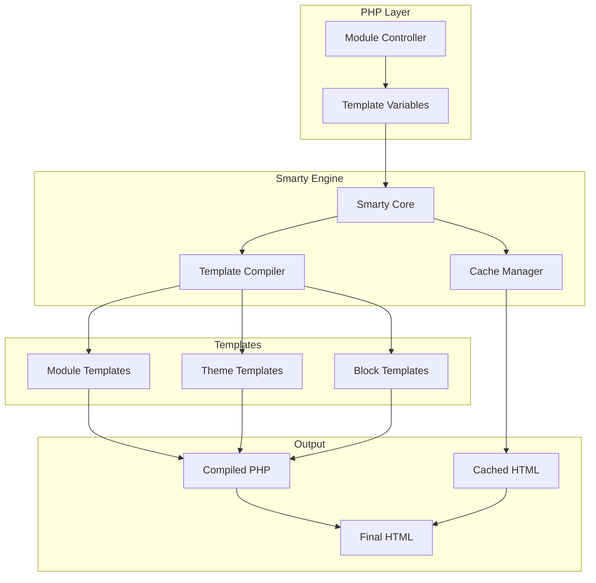
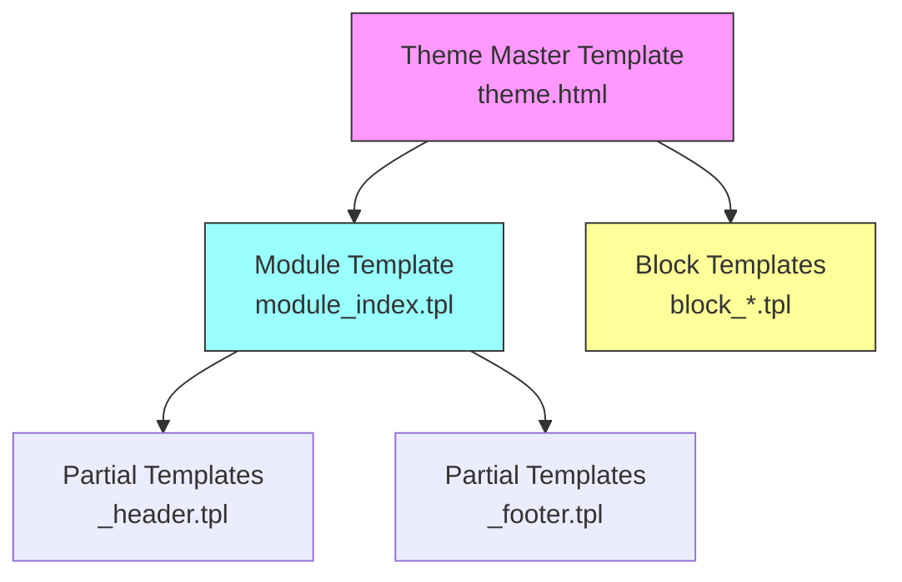
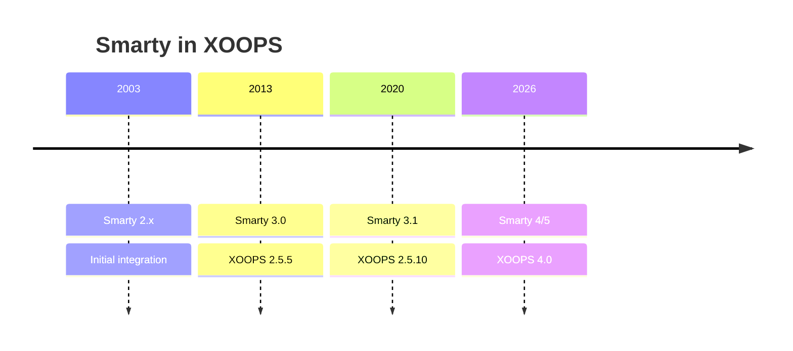

# ADR-003: predložak (Smarty)

> Zapis odluke o arhitekturi za XOOPS usvajanje mehanizma predložaka Smarty.

---

## Status

**Prihvaćeno** - Temeljna odluka od XOOPS 2.0

**Razvija se** - planirana migracija na Smarty 4/5 za XOOPS 4.0

---

## Kontekst

XOOPS trebao je rješenje za izradu predložaka koje bi:

1. Odvojite prezentaciju od poslovne logike
2. Dopustite dizajnerima tema da rade bez znanja PHP
3. Podržava nasljeđivanje predložaka i includes
4. Omogućite predmemoriranje za performanse
5. Omogućite korisnički prilagodljiv templates
6. Podržite internacionalizaciju

---

## Dijagram odluke



---

## Odluka

Koristit ćemo **Smarty** kao pokretač predložaka jer:

### 1. Razdvajanje koncerna

```php
// PHP (Controller) - Business logic
$items = $itemHandler->getPublishedItems();
$xoopsTpl->assign('items', $items);

// Smarty (View) - Presentation
// templates/items.tpl
```

```smarty
{* Smarty template - No PHP logic *}
<{foreach item=item from=$items}>
    <article>
        <h2><{$item.title}></h2>
        <p><{$item.summary}></p>
    </article>
<{/foreach}>
```

### 2. XOOPS Razdjelnici

XOOPS koristi `<{` i `}>` umjesto standardnog `{` `}`:

```smarty
{* Standard Smarty *}
{$variable}

{* XOOPS Smarty - Avoids JavaScript conflicts *}
<{$variable}>
```

### 3. Hijerarhija predloška



### 4. Pohranjivanje predložaka

- **baza podataka**: prilagođeni templates pohranjen za mogućnost vraćanja
- **Datotečni sustav**: Izvorni templates u direktorijima modula
- **predmemorija**: Prevedeno templates za performanse

---

## Smarty Konfiguracija

```php
// XOOPS Smarty initialization
$xoopsTpl = new XoopsTpl();

// Custom delimiters
$xoopsTpl->left_delim = '<{';
$xoopsTpl->right_delim = '}>';

// Caching
$xoopsTpl->caching = XOOPS_TEMPLATE_CACHE;
$xoopsTpl->cache_lifetime = 3600;

// Security
$xoopsTpl->security_policy = new Smarty_Security($xoopsTpl);
$xoopsTpl->security_policy->php_functions = [];
$xoopsTpl->security_policy->php_modifiers = ['escape', 'count'];
```

---

## Korištene značajke predloška

### Varijable

```smarty
{* Simple variable *}
<{$title}>

{* Object property *}
<{$item.title}>

{* With modifier *}
<{$content|truncate:200:'...'}>

{* Escaped output *}
<{$userInput|escape:'html'}>
```

### Kontrolne strukture

```smarty
{* Conditional *}
<{if $isAdmin}>
    <a href="admin.php">Admin</a>
<{elseif $isUser}>
    <a href="profile.php">Profile</a>
<{else}>
    <a href="login.php">Login</a>
<{/if}>

{* Loop *}
<{foreach item=item from=$items name=itemloop}>
    <{$smarty.foreach.itemloop.index}>: <{$item.title}>
<{/foreach}>
```

### Uključuje

```smarty
{* Include another template *}
<{include file="db:mymodule_header.tpl"}>

{* Include with variables *}
<{include file="db:mymodule_item.tpl" item=$currentItem}>

{* Include from theme *}
<{include file="file:$theme_path/partials/sidebar.tpl"}>
```

---

## Posljedice

### Pozitivno

1. **Prilagođeno dizajneru**: sintaksa slična HTML
2. **Caching**: Ugrađeno predmemoriranje predložaka
3. **Sigurnost**: izolacija koda PHP
4. **Fleksibilnost**: Modifikatori, funkcije, dodaci
5. **Prilagodba**: Korisnici mogu mijenjati templates
6. **Zajednica**: Veliki ekosustav Smarty

### Negativno

1. **Krivulja učenja**: sintaksa specifična za Smarty
2. **Opšte**: potreban je korak kompilacije
3. **Uklanjanje pogrešaka**: Pogreške u predlošku mogu biti zagonetne
4. **Problemi s verzijom**: prijelomne promjene između verzija

### Ublažavanja

- **Učenje**: Sveobuhvatna dokumentacija
- **Performanse**: Agresivno predmemoriranje
- **Debugging**: Debug konzola, brisanje poruka o pogreškama
- **Verzije**: sloj kompatibilnosti u XOOPS

---

## Povijest verzija



---

## Migracija: Smarty 3 do 4/5

### Prijelomne promjene

```smarty
{* Smarty 3 - Deprecated *}
<{php}>echo date('Y');<{/php}>

{* Smarty 4+ - Use modifiers or assign from PHP *}
<{$current_year}>

{* Smarty 3 - {section} deprecated *}
<{section name=i loop=$items}>
    <{$items[i].title}>
<{/section}>

{* Smarty 4+ - Use {foreach} *}
<{foreach $items as $item}>
    <{$item.title}>
<{/foreach}>
```

### Sloj kompatibilnosti

XOOPS pruža sloj kompatibilnosti za glatke prijelaze:

```php
// XoopsTpl extends Smarty with compatibility methods
class XoopsTpl extends Smarty
{
    public function assign($tpl_var, $value = null)
    {
        // Handles both Smarty 3 and 4 syntax
        return parent::assign($tpl_var, $value);
    }
}
```

---

## Razmotrene alternative

### 1. Grančica
**Prednosti**: Moderan, Symfony ekosustav
**Protiv**: Drugačija sintaksa, napor migracije
**Odluka**: Moguća buduća opcija za XOOPS 3.x

### 2. Blade (Laravel)
**Prednosti**: čista sintaksa, popularan
**Protiv**: Specifično za Laravel
**Odluka**: Nije prikladno za samostalnu upotrebu

### 3. Izvorni PHP predlošci
**Prednosti**: Nema krivulje učenja, brzo
**Protiv**: Sigurnosni rizici, nema odvajanja
**Odluka**: Odbijeno zbog mogućnosti održavanja

---

## Povezane odluke

- ADR-001: Modularna arhitektura
- ADR-002: Apstrakcija baze podataka

---

## Reference

- Smarty Dokumentacija: https://www.smarty.net/docs/en/
- Vodič za sustav predložaka XOOPS
- MVC uzorak u web aplikacijama

---#xoops #arhitektura #adr #smarty #templates #dizajn-odluka
