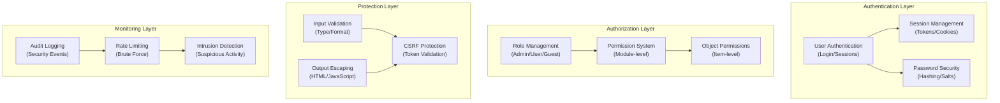

# ADR-004: Arhitektura sigurnosnog sustava

> Sveobuhvatna sigurnosna arhitektura za XOOPS CMS koja štiti od modernih prijetnji.

---

## Status

**Prihvaćeno** - temeljni sigurnosni sloj od XOOPS 2.5

---

## Kontekst

### Izjava problema

XOOPS treba robustan sigurnosni sustav koji:

1. **Štiti od uobičajenih web ranjivosti** (OWASP Top 10)
2. **Pruža detaljnu kontrolu dopuštenja** preko modules
3. **Omogućuje sigurnu autentifikaciju korisnika** s modernim standardima
4. **Sprečava povrede podataka** i neovlašteni pristup
5. **Podržava kontrolu pristupa na više razina** (admin, moderator, korisnik, gost)
6. **Besprijekorno se integrira sa svim modules**

### Trenutačne prijetnje

Moderni web napadi include:

- **SQL Injection** - Zlonamjerni SQL u korisničkom unosu
- **XSS (Cross-Site Scripting)** - Umetnut JavaScript u stranice
- **CSRF (Cross-Site Request Forgery)** - Neovlašteno podnošenje obrazaca
- **Authentication bypass** - Slabo rukovanje sesijom/lozinkom
- **Autorizacijsko zaobilaženje** - Eskalacija privilegija
- **Izloženost podataka** - Osjetljivi podaci u URL-ovima, zapisnicima ili caches

### XOOPS Sigurnosni zahtjevi

1. Provjera autentičnosti korisnika i upravljanje sesijom
2. Kontrola pristupa temeljena na ulogama (RBAC)
3. Sustav dozvola za modules i objekte
4. Provjera valjanosti ulaza i izbjegavanje izlaza
5. Zaštita od uobičajenih napada
6. Revizijsko bilježenje sigurnosnih događaja
7. Sigurno rukovanje lozinkama
8. CSRF zaštita tokena

---

## Odluka

### Osnovna sigurnosna arhitektura



---

## Sigurnosne komponente

### 1. Sustav provjere autentičnosti

**Proces prijave korisnika:**

```php
<?php
// 1. Validate credentials
$user = $userHandler->findByLogin($username);
if (!$user || !password_verify($password, $user->getVar('pass'))) {
    throw new AuthenticationException('Invalid credentials');
}

// 2. Check if account is active
if (!$user->getVar('uactive')) {
    throw new AuthenticationException('Account inactive');
}

// 3. Create secure session
session_regenerate_id(true);
$_SESSION['uid'] = $user->getVar('uid');
$_SESSION['token'] = bin2hex(random_bytes(32));
$_SESSION['created'] = time();

// 4. Log the login
$this->auditLog('USER_LOGIN', $user->getVar('uid'));
```

**Sigurnost lozinke:**

```php
<?php
// Use password_hash (not MD5 or SHA1)
$hashed = password_hash($password, PASSWORD_BCRYPT, [
    'cost' => 12, // High cost = slow brute force
]);

// Verify password
if (!password_verify($inputPassword, $hashed)) {
    throw new Exception('Invalid password');
}

// Rehash if algorithm or cost changed
if (password_needs_rehash($hashed, PASSWORD_BCRYPT, ['cost' => 12])) {
    $newHash = password_hash($password, PASSWORD_BCRYPT, ['cost' => 12]);
    $user->setVar('pass', $newHash);
    $userHandler->insert($user);
}
```

### 2. Upravljanje sesijom

**Sigurno rukovanje sesijom:**

```php
<?php
// Session configuration
ini_set('session.cookie_httponly', true);  // No JS access
ini_set('session.cookie_secure', true);     // HTTPS only
ini_set('session.cookie_samesite', 'Strict'); // CSRF protection
ini_set('session.gc_maxlifetime', 3600);   // 1 hour timeout
ini_set('session.sid_length', 64);         // 64-char session ID

// Validate session
function validateSession() {
    // Check timeout
    if (time() - $_SESSION['created'] > 3600) {
        session_destroy();
        throw new SessionExpiredException();
    }

    // Validate user agent (prevent session hijacking)
    if ($_SESSION['user_agent'] !== $_SERVER['HTTP_USER_AGENT']) {
        throw new SessionInvalidException();
    }

    // Validate IP (optional, can be too strict)
    if (!in_array($_SERVER['REMOTE_ADDR'], $_SESSION['ips'])) {
        $_SESSION['ips'][] = $_SERVER['REMOTE_ADDR'];
    }
}
```

### 3. Autorizacija (RBAC)

**Kontrola pristupa temeljena na ulogama:**

```php
<?php
class XoopsUser {
    public function hasPermission(string $permissionName): bool
    {
        // Get user groups
        $groups = $this->getGroups();

        // Check if any group has permission
        foreach ($groups as $groupId) {
            if ($this->checkGroupPermission($groupId, $permissionName)) {
                return true;
            }
        }

        return false;
    }

    /**
     * User groups and their permissions
     * Admin: Full access
     * Moderator: Content management
     * User: Create own content
     * Guest: Read-only access
     */
    private function checkGroupPermission(int $groupId, string $permission): bool
    {
        $permissions = [
            1 => ['admin_access'],                 // Admin group
            2 => ['moderate_content', 'edit_own'], // Moderator group
            3 => ['create_content', 'edit_own'],   // User group
            4 => [],                               // Guest group (no permissions)
        ];

        return in_array($permission, $permissions[$groupId] ?? []);
    }
}
```

### 4. Validacija unosa

**Spriječite SQL pogreške ubrizgavanja i tipa:**

```php
<?php
// Always use prepared statements
$sql = 'SELECT * FROM users WHERE id = ?';
$result = $db->query($sql, [$userId]); // ✅ Safe

// Input validation
function validateUserInput(array $data): array
{
    return [
        'email' => filter_var($data['email'] ?? '', FILTER_VALIDATE_EMAIL),
        'age' => filter_var($data['age'] ?? 0, FILTER_VALIDATE_INT),
        'website' => filter_var($data['website'] ?? '', FILTER_VALIDATE_URL),
        'title' => substr(trim($data['title'] ?? ''), 0, 255),
    ];
}

// XOOPS Safe Input class
$safe = \Xmf\Request::getHtmlRequest('var_name', '');
$int = \Xmf\Request::getInt('page', 1);
```

### 5. Bježanje izlaza

**Spriječite XSS napade:**

```php
<?php
// In PHP templates
echo htmlspecialchars($userInput, ENT_QUOTES, 'UTF-8');

// In Smarty templates (automatic escaping)
<{$user_input}>  {* Escaped by default *}
<{$html|escape:false}>  {* Only when needed *}

// JavaScript context
<script>
var message = "<{$userMessage|escape:'javascript'}>";
</script>

// URL context
<a href="<{$url|escape:'url'}>">Link</a>
```

### 6. CSRF Zaštita

**Sprečavanje krivotvorenja zahtjeva na više web stranica:**

```php
<?php
// Generate CSRF token
session_start();
if (empty($_SESSION['csrf_token'])) {
    $_SESSION['csrf_token'] = bin2hex(random_bytes(32));
}

// In forms
<form method="POST">
    <input type="hidden" name="csrf_token" value="<{$csrf_token}>">
    <button type="submit">Submit</button>
</form>

// Validate token
if ($_SERVER['REQUEST_METHOD'] === 'POST') {
    if (hash_equals($_SESSION['csrf_token'], $_POST['csrf_token'] ?? '')) {
        // Process form
    } else {
        throw new InvalidTokenException('CSRF token invalid');
    }
}
```

---

## Posljedice

### Pozitivni učinci

1. **Sveobuhvatna zaštita** - Pokriva glavne ranjivosti classes
2. **Slojevita sigurnost** - Višestruki slojevi obrane
3. **Fleksibilni RBAC** - precizna kontrola dopuštenja
4. **Audit Trail** - Pratite sigurnosne događaje
5. **Industrijski standard** - Usklađuje se s preporukama OWASP-a
6. **Integracija modula** - jednostavno za modules korištenje sigurnosnih API-ja

### Negativni učinci

1. **Složenost** - potrebno je više koda i konfiguracije
2. **Performanse** - Raspršivanje i provjera valjanosti povećavaju troškove
3. **Korisničko iskustvo** - Sigurnost je ponekad nezgodna
4. **Održavanje** - Zahtijeva stalna sigurnosna ažuriranja
5. **Potrebna obuka** - Programeri moraju slijediti praksu

### Rizici i ublažavanja

| Rizik | Ozbiljnost | Ublažavanje |
|------|----------|-----------|
| Programer ignorira sigurnost | Visoko | Pregled koda, sigurnosna obuka |
| Otkrivene nove ranjivosti | Srednje | Redovite sigurnosne revizije, ažuriranja |
| Utjecaj na izvedbu | Niska | Optimizirajte vruće staze, predmemoriranje |
| Pretjerano složene dozvole | Srednje | Jasna dokumentacija, primjeri |

---

## Najbolje sigurnosne prakse### Za programere modula

```php
<?php
// ✅ DO: Use prepared statements
$result = $db->prepare('SELECT * FROM table WHERE id = ?')->execute([$id]);

// ❌ DON'T: Concatenate queries
$result = $db->query("SELECT * FROM table WHERE id = $id");

// ✅ DO: Escape output
echo htmlspecialchars($user_input, ENT_QUOTES, 'UTF-8');

// ❌ DON'T: Output raw user data
echo $user_input;

// ✅ DO: Check permissions
if (!$user->hasPermission('edit_content')) {
    throw new PermissionException();
}

// ❌ DON'T: Trust user roles directly
if ($_POST['is_admin']) {
    // Make user admin - SECURITY HOLE!
}

// ✅ DO: Validate input types
$page = (int)$_GET['page'];

// ❌ DON'T: Use untrusted values directly
$sql .= " LIMIT " . $_GET['limit'];
```

---

## Razmotrene alternative

### OAuth/OpenID povezivanje

**Zašto nije odabrano u početku:** Presloženo za okruženje dijeljenog hostinga, ali dobro za buduću integraciju s vanjskim sustavima autentifikacije.

### Autentikacija u dva faktora (2FA)

**Status:** Prihvaćeno kao proširenje, a ne temeljni zahtjev, pogledajte ADR-006

### Kolačići sesije samo za HTTP

**Status:** Implementirano - sprječava JavaScript pristup podacima sesije

---

## Povezane odluke

- ADR-001: Modularna arhitektura - moduli implementiraju sigurnost
- ADR-005: Sustav dopuštenja modula
- ADR-006: Autentikacija s dva faktora (u budućnosti)

---

## Reference

### Sigurnosni standardi

- [OWASP Top 10](https://owasp.org/www-project-top-ten/)
- [NIST Cybersecurity Framework](https://www.nist.gov/cyberframework)
- [CWE Top 25](https://cwe.mitre.org/top25/)

### PHP Sigurnost

- [PHP Sigurnosni priručnik](https://www.php.net/manual/en/security.php)
- [password_hash() dokumentacija](https://www.php.net/manual/en/function.password-hash.php)
- [Sigurnost sesije](https://www.php.net/manual/en/session.security.php)

### Alati

- [OWASP ZAP](https://www.zaproxy.org/) - Sigurnosno testiranje
- [Snyk](https://snyk.io/) - Skeniranje ranjivosti
- [SonarQube](https://www.sonarqube.org/) - Kvaliteta koda

---

## Kontrolni popis implementacije

- [ ] Sustav provjere autentičnosti korisnika
- [ ] Upravljanje sesijom
- [ ] Raspršivanje zaporke (bcrypt)
- [ ] Kontrola pristupa temeljena na ulogama
- [ ] dozvole modula
- [ ] Okvir za provjeru valjanosti unosa
- [ ] Izlaz (PHP + Smarty)
- [ ] CSRF zaštita tokena
- [ ] Zapisivanje sigurnosne revizije
- [ ] Ograničenje brzine
- [ ] Sigurnosna zaglavlja

---

## Povijest verzija

| Verzija | Datum | Promjene |
|---------|------|---------|
| 1.0.0 | 2024-01-28 | Inicijalni dokument |

---

#xoops #adr #sigurnost #arhitektura #autentifikacija #autorizacija #rbac
