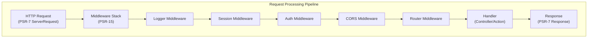

# ADR-005: PSR-15 Uzorak međuvera za XOOPS 4.0

> Usvojite rukovatelje zahtjevima HTTP poslužitelja PSR-15 (srednji softver) za poboljšani cjevovod obrade zahtjeva.

:::oprez[XOOPS 4.0 Prijedlog — Nije dostupno u 2.5.x]
Ovaj ADR opisuje **predloženu arhitekturu za XOOPS 4.0**. PSR-15 srednji softver **nije dostupan u XOOPS 2.5.x**. Trenutačni 2.5.x modules koristi obrazac Page Controller sa `mainfile.php` bootstrapom. Pogledajte XOOPS Arhitektura za trenutni životni ciklus zahtjeva.
:::

---

## Status

**Predloženo** - U tijeku je procjena za izdanje XOOPS 4.0

---

## Kontekst

### Trenutačni pristup

XOOPS 2.5 koristi monolitni pristup rukovanja zahtjevima:

```php
// Current: Sequential processing
require_once 'mainfile.php';
// → Kernel initialization
// → User authentication
// → Module loading
// → Page rendering

// All in one flow, mixed concerns
```

### Problemi s trenutnim pristupom

1. **Mješoviti problemi** - Autentifikacija, evidentiranje, usmjeravanje sve je isprepleteno
2. **Teško za testiranje** - Teško za jedinično testiranje pojedinačnih koraka obrade zahtjeva
3. **Teško proširiti** - moduli se mogu spojiti samo putem predučitavanja/događaja
4. **Loše razdvajanje** - logika obrade zahtjeva razbacana po bazi koda
5. **Nije moguće sastaviti** - Ne može se jednostavno ulančati ili promijeniti redoslijed koraka obrade

### Što je PSR-15 Middleware?

PSR-15 definira standardno sučelje za HTTP međuware:

```php
<?php
interface RequestHandlerInterface {
    public function handle(ServerRequestInterface $request): ResponseInterface;
}

interface MiddlewareInterface {
    public function process(
        ServerRequestInterface $request,
        RequestHandlerInterface $handler
    ): ResponseInterface;
}
```

**Middleware lanac:**

```
Request
  ↓
[Logger] → logs request
  ↓
[Auth] → validates user session
  ↓
[CORS] → checks cross-origin
  ↓
[Router] → dispatches to handler
  ↓
[Handler] → generates response
  ↓
Response
```

---

## Odluka

### Usvojite PSR-15 Middleware stog za XOOPS 4.0

Implementirajte cjevovod za obradu zahtjeva temeljen na međusoftveru prema standardu PSR-15.

### Pregled arhitekture



### Osnovne komponente srednjeg softvera

#### 1. Međuslojni program aplikacije (jezgreni sloj)

```php
<?php
declare(strict_types=1);

namespace XoopsCore;

use Psr\Http\Message\ResponseInterface;
use Psr\Http\Message\ServerRequestInterface;
use Psr\Http\Server\MiddlewareInterface;
use Psr\Http\Server\RequestHandlerInterface;

class SessionMiddleware implements MiddlewareInterface
{
    public function process(
        ServerRequestInterface $request,
        RequestHandlerInterface $handler
    ): ResponseInterface {
        // 1. Retrieve session (or start new)
        $sessionId = $request->getCookieParams()['PHPSESSID'] ?? null;
        $session = $this->sessionManager->load($sessionId);

        // 2. Attach session to request
        $request = $request->withAttribute('session', $session);

        // 3. Pass to next middleware
        $response = $handler->handle($request);

        // 4. Set session cookie if needed
        if ($session->isModified()) {
            $response = $response->withAddedHeader(
                'Set-Cookie',
                'PHPSESSID=' . $session->getId() . '; HttpOnly; SameSite=Strict'
            );
        }

        return $response;
    }
}
```

#### 2. Srednji softver za provjeru autentičnosti

```php
<?php
class AuthMiddleware implements MiddlewareInterface
{
    public function process(
        ServerRequestInterface $request,
        RequestHandlerInterface $handler
    ): ResponseInterface {
        // Get session from previous middleware
        $session = $request->getAttribute('session');

        // Authenticate user from session
        $user = $this->authenticate($session);

        // Attach user to request
        $request = $request->withAttribute('user', $user);

        return $handler->handle($request);
    }

    private function authenticate(?Session $session): User
    {
        if ($session && $session->has('uid')) {
            return $this->userRepository->findById($session->get('uid'));
        }

        return new AnonymousUser();
    }
}
```

#### 3. Međuprogram za autorizaciju

```php
<?php
class AuthorizationMiddleware implements MiddlewareInterface
{
    public function __construct(private AuthorizationChecker $checker)
    {
    }

    public function process(
        ServerRequestInterface $request,
        RequestHandlerInterface $handler
    ): ResponseInterface {
        $user = $request->getAttribute('user');
        $route = $request->getAttribute('route');

        // Check if user has permission for this route
        if (!$this->checker->isGranted($user, $route)) {
            return new JsonResponse(
                ['error' => 'Unauthorized'],
                403
            );
        }

        return $handler->handle($request);
    }
}
```

#### 4. modul Middleware

```php
<?php
// Modules can provide their own middleware
class PublisherAccessMiddleware implements MiddlewareInterface
{
    public function process(
        ServerRequestInterface $request,
        RequestHandlerInterface $handler
    ): ResponseInterface {
        $user = $request->getAttribute('user');

        // Module-specific access control
        if (!$user->hasPermission('publisher_view')) {
            return new HtmlResponse('Access denied', 403);
        }

        return $handler->handle($request);
    }
}
```

### Primjer implementacije

```php
<?php
// bootstrap.php - Application setup

use Psr\Http\Message\ServerRequestInterface;
use Psr\Http\Server\RequestHandlerInterface;
use Xoops\Core\Middleware\{
    LoggerMiddleware,
    SessionMiddleware,
    AuthMiddleware,
    CorsMiddleware,
    ErrorHandlingMiddleware
};

// Create middleware pipeline
$middlewareStack = [
    // 1. Error handling (outermost)
    new ErrorHandlingMiddleware(),

    // 2. Logging
    new LoggerMiddleware($logger),

    // 3. CORS handling
    new CorsMiddleware($corsConfig),

    // 4. Session management
    new SessionMiddleware($sessionManager),

    // 5. Authentication
    new AuthMiddleware($userRepository),

    // 6. Authorization
    new AuthorizationMiddleware($authChecker),

    // 7. Routing and dispatching
    new RoutingMiddleware($router),

    // 8. Module middleware (dynamic)
    ...$this->loadModuleMiddleware(),
];

// Process request through middleware stack
$request = ServerRequestFactory::fromGlobals();
$dispatcher = new MiddlewareDispatcher($middlewareStack);
$response = $dispatcher->dispatch($request);

// Send response
http_response_code($response->getStatusCode());
foreach ($response->getHeaders() as $name => $values) {
    foreach ($values as $value) {
        header("$name: $value", false);
    }
}
echo $response->getBody();
```

### Integracija modula

moduli mogu pružiti međuprogram:

```php
<?php
// Publisher module - xoops_version.php

$modversion['middleware'] = [
    'PublisherAccessMiddleware' => true,      // Auto-load
    'PublisherLogMiddleware' => true,
];

// Or custom:
$modversion['middleware_factory'] = function() {
    return [
        new PublisherCacheMiddleware(),
        new PublisherPermissionMiddleware(),
    ];
};
```

---

## Posljedice

### Pozitivni učinci

1. **Razdvajanje briga** - Svaki srednji softver nosi jednu odgovornost
2. **Provjerljivost** - Jednostavno jedinično testiranje pojedinačnih komponenti međuprograma
3. **Sastavljivost** - Middleware se može miješati i mijenjati redoslijed
4. **U skladu sa standardima** - koristi standarde PSR-15 i PSR-7
5. **Proširivost** - moduli mogu jednostavno dodati prilagođeni međuprogram
6. **Uklanjanje pogrešaka** - Očisti tok zahtjeva kroz cjevovod
7. **Performanse** - Može optimizirati određene međuslojne slojeve
8. **Interoperabilnost** - Može koristiti PSR-15 posredni softver treće strane

### Negativni učinci

1. **Krivulja učenja** - Programeri moraju razumjeti PSR-15
2. **Performance Overhead** - Više poziva funkcija u cjevovodu
3. **Složenost** - Više pokretnih dijelova nego monolitni pristup
4. **Migracijski napor** - Zahtijeva refaktoriranje postojećeg koda
5. **Ovisnosti** - Zahtijeva PSR-7 HTTP knjižnicu

### Rizici i ublažavanja

| Rizik | Ozbiljnost | Ublažavanje |
|------|----------|-----------|
| Složeni međuprogramski lanci | Srednje | Jasna dokumentacija, primjeri |
| Degradacija performansi | Srednje | Benchmark, optimizirajte vruće staze |
| Zlouporaba programera | Srednje | Pregled koda, vodič za najbolju praksu |
| Promjene koje prekidaju migraciju | Visoko | Razdoblje amortizacije, pomagači |
| Problemi s naručivanjem međuprograma | Srednje | Očisti grafikon ovisnosti |---

## Plan provedbe

### Faza 1: Temelj (Q2 2026)

- [ ] Implementirajte PSR-7 omotač HTTP poruke
- [ ] Stvorite MiddlewareDispatcher
- [ ] Implementacija jezgre međuprograma (sesija, autentifikacija)
- [ ] Ažurirajte kernel za korištenje međuprograma

### Faza 2: Integracija (Q3 2026)

- [ ] Migracija postojeće funkcionalnosti na međuprogram
- [ ] Dodavanje podrške za međuprogram modula
- [ ] Stvorite uslužne programe za testiranje međuopreme
- [ ] Napišite iscrpnu dokumentaciju

### Faza 3: Migracija (Q4 2026.)

- [ ] Osigurajte sloj kompatibilnosti za stari kod
- [ ] Pomoć modules u ažuriranju na novi međuware
- [ ] Optimizacija performansi
- [ ] Sigurnosna revizija

### Faza 4: Izdanje (Q1 2027)

- [ ] XOOPS izdanje 4.0 s međuprogramom
- [ ] Zastarjeli stari sustav predopterećenja/kuke
- [ ] Povratne informacije i ažuriranja zajednice

---

## Kriteriji uspjeha

- [ ] Sve osnovne funkcije migrirane su u međuprogram
- [ ] 90%+ test pokrivenosti za middleware
- [ ] Dokumentacija s primjerima
- [ ] Performanse unutar 10% od prethodne verzije
- [ ] moduli uspješno koriste novi međuprogramski sustav
- [ ] Stopa usvajanja u zajednici >80%

---

## Najbolje prakse međuprograma

### Učini

- Održavajte fokus međuprograma (jedna odgovornost)
- Koristite nepromjenjivost (kreirajte novi zahtjev/odgovor)
- Graciozno rješavajte pogreške
- Ovisnosti dokumenata
- Dodajte tipske savjete
- Napišite testove za međuware
- Koristite standardna PSR-15 sučelja

### Nemoj

- Nemojte mijenjati zajedničke objekte zahtjeva/odgovora
- Ne pristupajte izravno globalima
- Ne stvarajte ovisnosti o redoslijedu međuprograma
- Ne hvatajte sve iznimke
- Ne miješajte poslovnu logiku s međuprogramom
- Ne tjerajte međuware da učini previše

---

## Primjeri

### Custom Middleware

```php
<?php
// Example: Rate limiting middleware

use Psr\Http\Message\ResponseInterface;
use Psr\Http\Message\ServerRequestInterface;
use Psr\Http\Server\MiddlewareInterface;
use Psr\Http\Server\RequestHandlerInterface;

class RateLimitMiddleware implements MiddlewareInterface
{
    public function __construct(
        private RateLimiter $limiter,
        private int $limit = 100,
        private int $window = 3600
    ) {
    }

    public function process(
        ServerRequestInterface $request,
        RequestHandlerInterface $handler
    ): ResponseInterface {
        $user = $request->getAttribute('user');
        $identifier = $user->getId() ?? $request->getClientIp();

        // Check rate limit
        $remaining = $this->limiter->check($identifier, $this->limit, $this->window);

        if ($remaining < 0) {
            return new JsonResponse(
                ['error' => 'Rate limit exceeded'],
                429
            );
        }

        // Add rate limit headers
        $response = $handler->handle($request);
        return $response
            ->withAddedHeader('X-RateLimit-Limit', (string)$this->limit)
            ->withAddedHeader('X-RateLimit-Remaining', (string)$remaining);
    }
}
```

---

## Povezane odluke

- ADR-001: Modularna arhitektura - temelj
- ADR-004: Sigurnosni sustav - Koristi međuprogram za autentifikaciju
- ADR-006: Auth-Factor Auth - Može biti međuprogram

---

## Reference

### PSR standardi

- [PSR-7: HTTP sučelje poruka](https://www.php-fig.org/psr/psr-7/)
- [PSR-15: Rukovatelji zahtjevima HTTP poslužitelja](https://www.php-fig.org/psr/psr-15/)

### Middleware okviri

- [Slim Framework](https://www.slimframework.com/) - Primjeri međuprograma
- [Zend Expressive](https://docs.zendframework.com/zend-expressive/) - okvir PSR-15
- [Guzzle](https://docs.guzzlephp.org/) - Međusklopovni softver HTTP klijenta

### Alati

- [RelayPHP](https://relayphp.com/) - Biblioteka međuopreme
- [PSR-15 Middleware](https://github.com/middlewares) - Zbirka međuprograma

---

## Povijest verzija

| Verzija | Datum | Promjene |
|---------|------|---------|
| 1.0.0 | 2024-01-28 | Početni prijedlog |

---

#xoops #adr #psr-15 #middleware #architecture #psr-7
