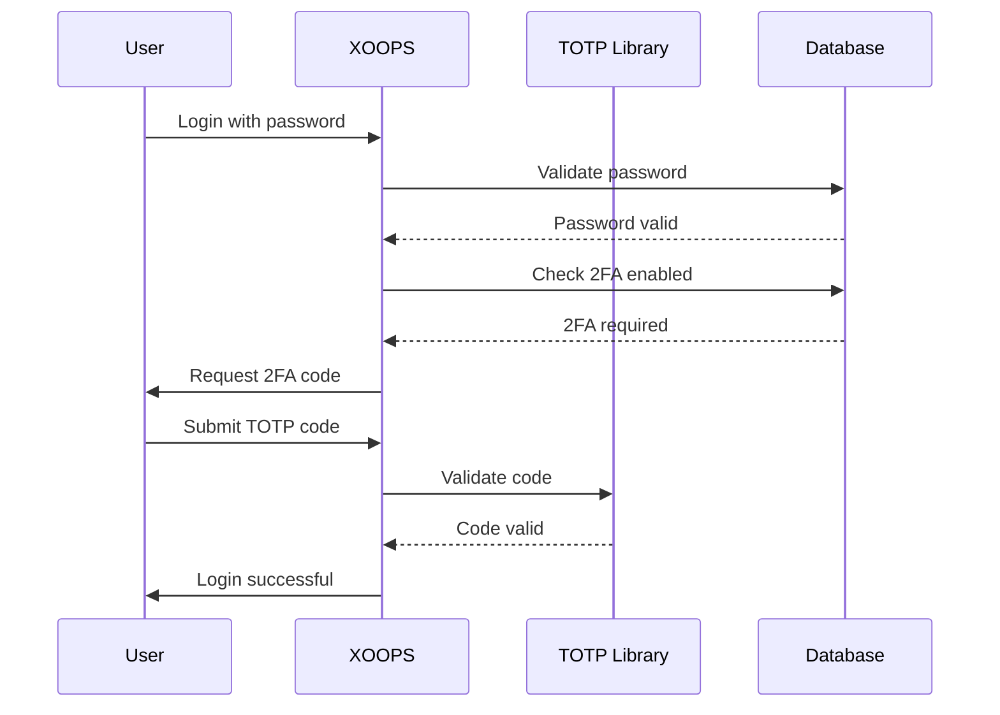

## Status

Predloženi

## Kontekst

XOOPS treba poboljšanu sigurnost za provjeru autentičnosti korisnika. Dvofaktorska autentifikacija (2FA) pruža dodatni sloj sigurnosti osim lozinki, štiteći račune čak i ako su lozinke ugrožene.

Ključna razmatranja:
- Povratna kompatibilnost s postojećom autentifikacijom
- Podrška za više 2FA metoda
- Korisničko iskustvo tijekom postavljanja i prijave
- Mehanizmi za oporavak izgubljenih uređaja
- Integracija s postojećim sustavom dozvola

## Odluka

Implementirat ćemo TOTP (Time-based One-Time Password) kao primarnu 2FA metodu s podrškom za pričuvne kodove.

### Pristup implementacije



### Shema baze podataka

```sql
CREATE TABLE `{PREFIX}_users_2fa` (
    `user_id` INT(11) NOT NULL,
    `secret` VARCHAR(32) NOT NULL,
    `enabled` TINYINT(1) DEFAULT 0,
    `backup_codes` TEXT,
    `last_used` INT(11),
    `created` INT(11) NOT NULL,
    PRIMARY KEY (`user_id`),
    FOREIGN KEY (`user_id`) REFERENCES `{PREFIX}_users`(`uid`)
);
```

### Servisno sučelje

```php
interface TwoFactorAuthInterface
{
    public function enable(int $userId): TwoFactorSetup;
    public function disable(int $userId): void;
    public function verify(int $userId, string $code): bool;
    public function generateBackupCodes(int $userId): array;
    public function isEnabled(int $userId): bool;
}
```

### Integracija međuprograma

```php
class TwoFactorMiddleware implements MiddlewareInterface
{
    public function process(
        ServerRequestInterface $request,
        RequestHandlerInterface $handler
    ): ResponseInterface {
        $session = $request->getAttribute('session');

        if ($session->has('pending_2fa_user_id')) {
            // User needs to complete 2FA
            if ($this->isVerificationRequest($request)) {
                return $handler->handle($request);
            }
            return new RedirectResponse('/2fa/verify');
        }

        return $handler->handle($request);
    }
}
```

## Posljedice

### Pozitivno

- Značajno poboljšana sigurnost računa
- TOTP kompatibilnost s industrijskim standardima (Google Authenticator, Authy itd.)
- Pričuvni kodovi sprječavaju zaključavanje računa
- Izborno po korisniku - ne prisiljava usvajanje
- PSR-15 međuware omogućuje čistu integraciju

### Negativno

- Dodatni korak prijave utječe na korisničko iskustvo
- Korisnici moraju upravljati aplikacijama za autentifikaciju
- Izgubljeni uređaji zahtijevaju proces oporavka
- Dodatna pohrana baze podataka i upita
- Zahtijeva ovisnost o kriptografskoj knjižnici

### Migracijski put

1. Dodajte tablicu baze podataka za 2FA podatke
2. Implementirajte TOTP uslugu s ovisnošću o knjižnici
3. Dodajte međuprogram u lanac provjere autentičnosti
4. Stvorite korisničko sučelje za postavljanje i provjeru
5. Administratorska opcija da zahtijeva 2FA za određene grupe

## Razmotrene alternative

### OTP temeljen na SMS-u

Odbijeno zbog:
- Ranjivosti zamjene SIM kartice
- Trošak SMS pristupnika
- Složenost provjere telefonskog broja
- Briga o privatnosti

### Hardverski sigurnosni ključevi (WebAuthn)

Odgođeno za budući ADR:
- Složenija izvedba
- Povijesno ograničena podrška preglednika
- Veći korisnički trošak
- Može se dodati uz TOTP kasnije

### OTP temeljen na e-pošti

Odbijeno zbog:
- Kompromitiranje računa e-pošte poništava svrhu
- Kašnjenja isporuke utječu na korisnički doživljaj
- Problemi s filterom neželjene pošte

## Reference

- [RFC 6238 - TOTP](https://tools.ietf.org/html/rfc6238)
- [Format ključa Google autentifikatora](https://github.com/google/google-authenticator/wiki/Key-Uri-Format)
- ../../02-Core-Concepts/Security/Security-Best-Practices - Sigurnosne smjernice
- ../../02-Core-Concepts/Users-Permissions/Authentication - Dokumentacija sustava autentifikacije
