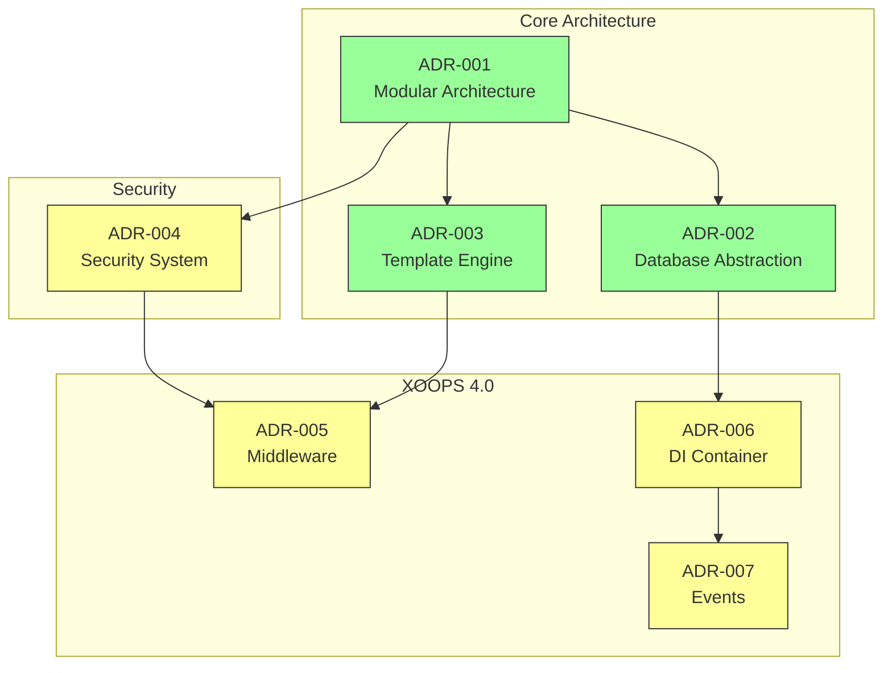
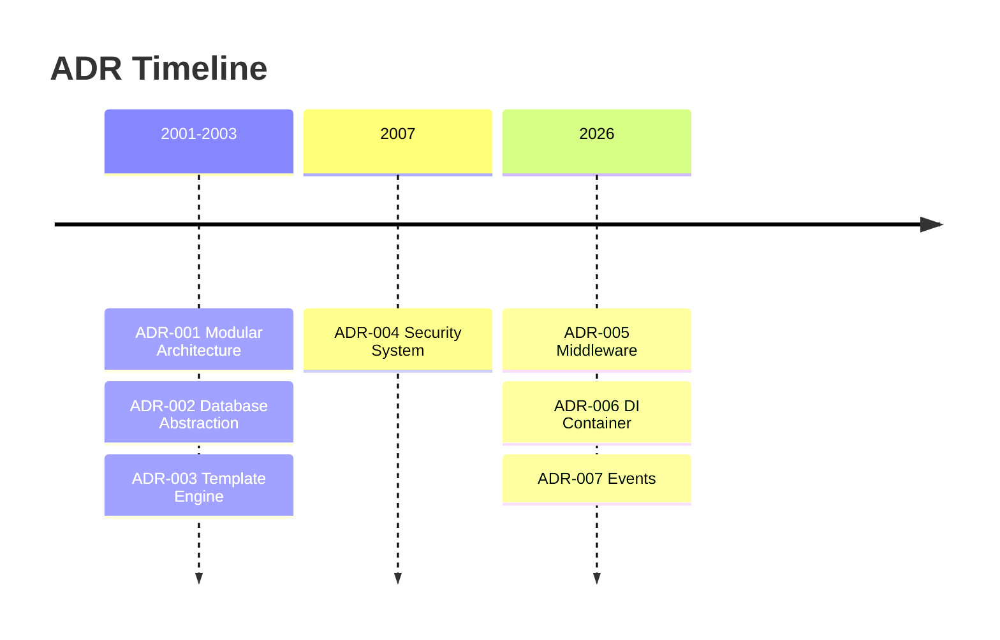

# 📋 Architecture Decision Records Index

> Sveobuhvatni indeks arhitektonskih odluka koje su oblikovale XOOPS CMS.

---

## Što su neželjene reakcije?

Zapisi o arhitektonskim odlukama (ADR-ovi) dokumentiraju značajne arhitektonske odluke donesene tijekom razvoja XOOPS. Oni bilježe kontekst, odluku i posljedice svakog izbora, pružajući vrijedan povijesni kontekst za održavatelje i suradnike.

---

## Legenda statusa ADR-a

| Status | Značenje |
|--------|---------|
| **Predloženo** | U tijeku je rasprava, još nije prihvaćen |
| **Prihvaćeno** | Odluka je donesena |
| **Zastarjelo** | Više se ne preporučuje |
| **Zamijenjeno** | Zamijenjen drugim ADR |

---

## Trenutačne nuspojave

### Temeljne odluke

| ADR | Naslov | Status | Utjecaj |
|-----|-------|--------|--------|
| ADR-001 | Modularna arhitektura | Prihvaćeno | Jezgra |
| ADR-002 | Objektno orijentirani pristup bazi podataka | Prihvaćeno | Jezgra |
| ADR-003 | Smarty predložak | Prihvaćeno | Jezgra |

### Planirane nuspojave (XOOPS 4.0)

| ADR | Naslov | Status | Utjecaj |
|-----|-------|--------|--------|
| ADR-004 | Dizajn sigurnosnog sustava | Predloženi | Sigurnost |
| ADR-005 | PSR-15 Middleware | Predloženi | Arhitektura |
| ADR-006 | Spremnik za ubrizgavanje ovisnosti | Predloženi | Arhitektura |
| ADR-007 | Redizajn sustava događaja | Predloženi | Arhitektura |

---

## ADR odnosi



---

## Vremenska traka



---

## Stvaranje novih ADR-ova

Prilikom predlaganja novog arhitektonskog rješenja:

1. Kopirajte predložak ADR-a
2. Ispunite sve odjeljke
3. Pošaljite kao zahtjev za povlačenje
4. Raspravite u GitHub problemima
5. Ažuriraj status nakon odluke

### Struktura ADR predloška

```markdown
# ADR-XXX: Title

## Status
Proposed | Accepted | Deprecated | Superseded

## Context
What is the issue motivating this decision?

## Decision
What is the change that we're proposing?

## Consequences
What becomes easier or harder as a result?

## Alternatives Considered
What other options were evaluated?
```

---

## 🔗 Povezana dokumentacija

- Temeljni koncepti
- Smjernice za doprinos
- XOOPS 4.0 Plan puta

---

#xoops #adr #architecture #index #decisions
