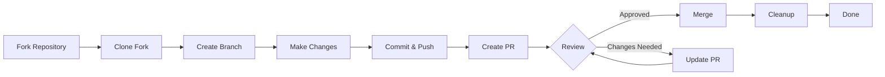

> Ovaj vodič vas vodi kroz cijeli proces doprinosa XOOPS, od početnog postavljanja do spojenog zahtjeva za povlačenje.

---

## Preduvjeti

Prije nego počnete doprinositi, provjerite imate li:

- **Git** instaliran i konfiguriran
- **GitHub račun** (besplatno)
- **PHP 7.4+** za razvoj XOOPS
- **Skladatelj** za upravljanje ovisnostima
- Osnovno poznavanje Git radnih procesa
- Poznavanje Kodeksa ponašanja

---

## Korak 1: Račvanje spremišta

### Na GitHub web sučelju

1. Idite do repozitorija (npr. `XOOPS/XoopsCore27`)
2. Kliknite gumb **Vilica** u gornjem desnom kutu
3. Odaberite mjesto za račvanje (vaš osobni račun)
4. Pričekajte da se vilica završi

### Zašto vilica?

- Dobivate vlastitu kopiju na kojoj radite
- Održavatelji ne moraju upravljati mnogim podružnicama
- Imate potpunu kontrolu nad svojom vilicom
- Zahtjevi za povlačenje referenciraju vašu račvu i uzvodni repo

---

## Korak 2: Lokalno klonirajte svoju vilicu

```bash
# Clone your fork (replace YOUR_USERNAME)
git clone https://github.com/YOUR_USERNAME/XoopsCore27.git
cd XoopsCore27

# Add upstream remote to track original repository
git remote add upstream https://github.com/XOOPS/XoopsCore27.git

# Verify remotes are set correctly
git remote -v
# origin    https://github.com/YOUR_USERNAME/XoopsCore27.git (fetch)
# origin    https://github.com/YOUR_USERNAME/XoopsCore27.git (push)
# upstream  https://github.com/XOOPS/XoopsCore27.git (fetch)
# upstream  https://github.com/XOOPS/XoopsCore27.git (nofetch)
```

---

## Korak 3: Postavite razvojno okruženje

### Ovisnosti instalacije

```bash
# Install Composer dependencies
composer install

# Install development dependencies
composer install --dev

# For module development
cd modules/mymodule
composer install
```

### Konfigurirajte Git

```bash
# Set your Git identity
git config user.name "Your Name"
git config user.email "your.email@example.com"

# Optional: Set global Git config
git config --global user.name "Your Name"
git config --global user.email "your.email@example.com"
```

### Pokreni testove

```bash
# Make sure tests pass in clean state
./vendor/bin/phpunit

# Run specific test suite
./vendor/bin/phpunit --testsuite unit
```

---

## Korak 4: Stvorite granu značajki

### Konvencija o imenovanju grana

Slijedite ovaj uzorak: `<type>/<description>`

**Vrste:**
- `feature/` - Nova značajka
- `fix/` - Ispravak bugova
- `docs/` - Samo dokumentacija
- `refactor/` - Refaktoriranje koda
- `test/` - Testni dodaci
- `chore/` - Održavanje, alati

**Primjeri:**
```bash
# Feature branch
git checkout -b feature/add-two-factor-auth

# Bug fix branch
git checkout -b fix/prevent-xss-in-forms

# Documentation branch
git checkout -b docs/update-api-guide

# Always branch from upstream/main (or develop)
git checkout -b feature/my-feature upstream/main
```

### Održavajte podružnicu ažurnom

```bash
# Before you start work, sync with upstream
git fetch upstream
git merge upstream/main

# Later, if upstream has changed
git fetch upstream
git rebase upstream/main
```

---

## Korak 5: Unesite svoje promjene

### Razvojne prakse

1. **Napišite kod** prema standardima PHP
2. **Pišite testove** za nove funkcije
3. **Po potrebi ažurirajte dokumentaciju**
4. **Pokrenite linters** i programe za oblikovanje koda

### Provjere kvalitete koda

```bash
# Run all tests
./vendor/bin/phpunit

# Run with coverage
./vendor/bin/phpunit --coverage-html coverage/

# Run PHP CS Fixer
./vendor/bin/php-cs-fixer fix --dry-run

# Run PHPStan static analysis
./vendor/bin/phpstan analyse class/ src/
```

### Učinite dobre promjene

```bash
# Check what you changed
git status
git diff

# Stage specific files
git add class/MyClass.php
git add tests/MyClassTest.php

# Or stage all changes
git add .

# Commit with descriptive message
git commit -m "feat(auth): add two-factor authentication support"
```

---

## Korak 6: Održavajte podružnicu sinkroniziranom

Dok radite na vašoj značajci, glavna grana može napredovati:

```bash
# Fetch latest changes from upstream
git fetch upstream

# Option A: Rebase (preferred for clean history)
git rebase upstream/main

# Option B: Merge (simpler but adds merge commits)
git merge upstream/main

# If conflicts occur, resolve them then:
git add .
git rebase --continue  # or git merge --continue
```

---

## Korak 7: Gurnite do svoje vilice

```bash
# Push your branch to your fork
git push origin feature/my-feature

# On subsequent pushes
git push

# If you rebased, you might need force push (use carefully!)
git push --force-with-lease origin feature/my-feature
```

---

## Korak 8: Kreirajte zahtjev za povlačenjem

### Na GitHub web sučelju

1. Idite na svoju račvu na GitHubu
2. Vidjet ćete obavijest za stvaranje PR-a iz vaše podružnice
3. Kliknite **"Usporedi i povuci zahtjev"**
4. Ili ručno kliknite **"Novi zahtjev za povlačenjem"** i odaberite svoju granu

### PR naslov i opis

**Format naslova:**
```
<type>(<scope>): <subject>
```

Primjeri:
```
feat(auth): add two-factor authentication
fix(forms): prevent XSS in text input
docs: update installation guide
refactor(core): improve performance
```

**predložak opisa:**

```markdown
## Description
Brief explanation of what this PR does.

## Changes
- Changed X from A to B
- Added feature Y
- Fixed bug Z

## Type of Change
- [ ] New feature (adds new functionality)
- [ ] Bug fix (fixes an issue)
- [ ] Breaking change (API/behavior change)
- [ ] Documentation update

## Testing
- [ ] Added tests for new functionality
- [ ] All existing tests pass
- [ ] Manual testing performed

## Screenshots (if applicable)
Include before/after screenshots for UI changes.

## Related Issues
Closes #123
Related to #456

## Checklist
- [ ] Code follows style guidelines
- [ ] Self-reviewed own code
- [ ] Commented complex code
- [ ] Updated documentation
- [ ] No new warnings generated
- [ ] Tests pass locally
```

### Kontrolni popis za pregled PR-a

Prije podnošenja osigurajte:

- [ ] Kod slijedi standarde PHP
- [ ] Testovi su included i prolaze
- [ ] Ažurirana dokumentacija (ako je potrebno)
- [ ] Nema sukoba spajanja
- [ ] Poruke predaje su jasne
- [ ] Povezana pitanja su navedena
- [ ] PR opis je detaljan
- [ ] Nema koda za otklanjanje pogrešaka ili zapisa konzole

---

## Korak 9: odgovorite na povratne informacije

### Tijekom pregleda koda

1. **Pažljivo pročitajte komentare** - Razumite povratne informacije
2. **Postavljajte pitanja** - Ako je nejasno, tražite pojašnjenje
3. **Razgovarajte o alternativama** - S poštovanjem raspravljajte o pristupima
4. **Napravite tražene promjene** - Ažurirajte svoju granu
5. **Force-push ažurirana predaja** - Ako se prepisuje povijest

```bash
# Make changes
git add .
git commit --amend  # Modify last commit
git push --force-with-lease origin feature/my-feature

# Or add new commits
git commit -m "Address feedback on PR review"
git push origin feature/my-feature
```

### Očekujte ponavljanje

- Većina PR-a zahtijeva više krugova pregleda
- Budite strpljivi i konstruktivni
- Gledajte na povratne informacije kao na priliku za učenje
- Održavatelji mogu predložiti refaktore

---## Korak 10: Spajanje i čišćenje

### Nakon odobrenja

Nakon što održavatelji odobre i spoje:

1. **GitHub automatsko spajanje** ili spajanje klikova održavatelja
2. **Vaša podružnica je izbrisana** (obično automatski)
3. **Promjene su u toku**

### Lokalno čišćenje

```bash
# Switch to main branch
git checkout main

# Update main with merged changes
git fetch upstream
git merge upstream/main

# Delete local feature branch
git branch -d feature/my-feature

# Delete from your fork (if not auto-deleted)
git push origin --delete feature/my-feature
```

---

## Dijagram tijeka rada



---

## Uobičajeni scenariji

### Sinkronizacija prije pokretanja

```bash
# Always start fresh
git fetch upstream
git checkout -b feature/new-thing upstream/main
```

### Dodavanje više obveza

```bash
# Just push again
git add .
git commit -m "feat: additional changes"
git push origin feature/new-thing
```

### Ispravljanje grešaka

```bash
# Last commit has wrong message
git commit --amend -m "Correct message"
git push --force-with-lease

# Revert to previous state (careful!)
git reset --soft HEAD~1  # Keep changes
git reset --hard HEAD~1  # Discard changes
```

### Rukovanje sukobima spajanja

```bash
# Rebase and resolve conflicts
git fetch upstream
git rebase upstream/main

# Edit conflicted files to resolve
# Then continue
git add .
git rebase --continue
git push --force-with-lease
```

---

## Najbolji primjeri iz prakse

### Učini

- Držite podružnice usredotočene na pojedinačne probleme
- Napravite male, logične obveze
- Napišite opisne poruke predaje
- Često ažurirajte svoju granu
- Testirajte prije guranja
- Izmjene dokumenata
- Budite osjetljivi na povratne informacije

### Nemoj

- Radite izravno na glavnoj/master grani
- Pomiješajte nepovezane promjene u jedan PR
- Potvrdite generirane datoteke ili node_modules
- Force push nakon što je PR javan (koristite --force-with-lease)
- Zanemarite povratne informacije o pregledu koda
- Stvaranje velikih PR-ova (razbijanje na manje)
- Prijem osjetljivih podataka (ključevi API, lozinke)

---

## Savjeti za uspjeh

### Komunicirajte

- Postavljajte pitanja u izdanjima prije početka rada
- Zatražite upute za složene promjene
- Razgovarajte o pristupu u opisu PR-a
- Odmah odgovorite na povratne informacije

### Slijedite standarde

- Pregledajte standarde PHP
- Provjerite smjernice za prijavu problema
- Pročitajte Pregled doprinosa
- Slijedite smjernice zahtjeva za povlačenjem

### Naučite bazu kodova

- Pročitajte postojeće uzorke koda
- Proučite slične implementacije
- Razumjeti arhitekturu
- Provjerite temeljne koncepte

---

## Povezana dokumentacija

- Kodeks ponašanja
- Smjernice zahtjeva za povlačenje
- Prijava problema
- PHP Standardi kodiranja
- Pregled doprinosa

---

#xoops #git #github #contributing #workflow #pull-request
